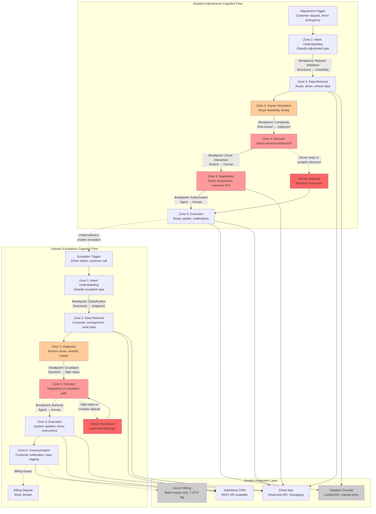

# Cognitive Load Map: Apex Distribution Customer Operations

## Table of Contents

1. [Executive Summary](#executive-summary)
2. [Work Stream Decomposition](#work-stream-decomposition)
   - [Dispatch Adjustments: Jobs to be Done](#dispatch-adjustments-jobs-to-be-done)
   - [Delivery Exceptions: Jobs to be Done](#delivery-exceptions-jobs-to-be-done)
3. [Cognitive Load Map: Micro-Task Analysis](#cognitive-load-map-micro-task-analysis)
   - [Dispatch Adjustments Micro-Tasks](#dispatch-adjustments-micro-tasks)
   - [Delivery Exceptions Micro-Tasks](#delivery-exceptions-micro-tasks)
4. [Process Topology Diagram](#process-topology-diagram)
5. [Lived Process Narrative](#lived-process-narrative)
6. [Key Findings and Recommendations](#key-findings-and-recommendations)

---

## Executive Summary

This cognitive load map analyzes two high-volume work streams within Apex Distribution's 35-person Customer Operations function:

**Dispatch Adjustments** (~90/day, 18 min avg) and **Delivery Exceptions** (~180/day, 12 min avg).

### Key Findings

1. **High Cognitive Hotspots**: Both work streams contain micro-tasks with HIGH cognitive load (tacit knowledge, real-time judgment, exception handling) that drive the 12-18 minute average handling times.

2. **System Integration Gaps**: Legacy dispatch console (Java/Citrix, limited API), batch-only billing system (24-48h lag), and driver app with incomplete data create significant data retrieval and reconciliation overhead.

3. **Lived Process vs. SOP**: The October 2023 SOP references retired systems and has incomplete sections. Real work relies on dispatcher discretion, informal knowledge networks, and manual overrides that bypass documented controls.

4. **Cross-Stream Dependencies**: ~25% of cases span multiple work streams (delivery exception → billing dispute → dispatch adjustment), requiring context handoffs and multi-system coordination [Ref: A012].

5. **Concentrated Expertise**: Senior dispatchers (including COO Sarah's former team) hold tacit knowledge essential for complex cases. Sandra appears across multiple artefacts handling high-value accounts with manual override authority [Ref: A002, A008].

### Delegation Implications

- **Dispatch Adjustments**: Human-led + Agent Support archetype. Real-time route optimization and driver messaging can be agent-assisted, but final dispatch decisions (especially driver swaps and complex diversions) require human judgment due to safety, driver welfare, and customer relationship factors.

- **Delivery Exceptions**: Mixed archetype by sub-type. Standard refused deliveries and damage reports can be Agent-led + Human Oversight, but complex multi-party disputes and high-value escalations remain Human-led + Agent Support.

### Critical Assumptions

15 assumptions documented in `assumptions.md`, with 5 at high confidence. **Critical path validation** required on:
- Dispatch console API write access (A004)
- Billing system integration feasibility (A007)
- Decision rules for refused deliveries (A005)

**Estimated cognitive work eliminated**: 35-50% of dispatch adjustments, 40-60% of delivery exceptions, contingent on API access and decision rule formalization.

---

## Work Stream Decomposition

### Dispatch Adjustments: Jobs to be Done

#### JtD-DA-1: Process Additional Pickup Request
- **Trigger**: Customer calls/emails requesting mid-route pickup
- **Actor**: Dispatch coordinator
- **Goal**: Add pickup to driver's route without violating delivery commitments or driver shift limits
- **Key Decisions**: 
  - Which driver/route has capacity?
  - Can pickup be completed within driver's remaining shift?
  - Does pickup weight/volume fit remaining vehicle capacity?
  - What is the latest acceptable pickup time?
- **Key Systems**: Dispatch console (route planning), driver app (GPS, current load), CRM (customer details)
- **Expected Output**: Route modification instruction to driver; updated ETA to affected customers
- **Nature**: Decision-making (60%), execution (40%)
- **Exception Scenarios**: No driver has capacity; pickup location off all routes; customer timing conflict

#### JtD-DA-2: Execute Route Diversion
- **Trigger**: Customer requests urgent delivery change; traffic/weather requires re-routing; priority customer escalation
- **Actor**: Dispatch coordinator
- **Goal**: Re-route driver to alternate destination while minimizing impact on other deliveries
- **Key Decisions**:
  - Does diversion cause downstream delivery delays?
  - Is driver aware of new address location?
  - Are affected customers notified of ETA changes?
  - Does diversion require customer service communication?
- **Key Systems**: Dispatch console, driver app, CRM, route optimization logic (implicit/manual)
- **Expected Output**: Updated route sent to driver app; ETA notifications to affected customers
- **Nature**: Decision-making (50%), execution (30%), communication (20%)
- **Exception Scenarios**: Diversion creates unacceptable delay; driver unreachable; customer refuses alternate timing

#### JtD-DA-3: Manage Driver Swap
- **Trigger**: Driver illness/emergency; vehicle breakdown; shift limit exceeded; driver refusal (safety/policy)
- **Actor**: Dispatch coordinator + dispatch supervisor (if emergency)
- **Goal**: Reassign route to available driver with minimal delay
- **Key Decisions**:
  - Which driver is available and qualified?
  - Where is the optimal handoff location?
  - What is the impact on both drivers' shift compliance?
  - Does this trigger overtime or contractor call-out?
  - Are customers with time-sensitive deliveries affected?
- **Key Systems**: Dispatch console, driver app, workforce management system, CRM
- **Expected Output**: Handoff instructions to both drivers; updated ETAs to customers; incident log entry
- **Nature**: Decision-making (70%), execution (20%), exception-handling (10%)
- **Exception Scenarios**: No available driver; vehicle/cargo handoff location inaccessible; customer escalation due to delay

### Delivery Exceptions: Jobs to be Done

#### JtD-DE-1: Resolve Refused Delivery
- **Trigger**: Driver reports recipient refused delivery (damaged goods, incorrect consignment, customer dispute)
- **Actor**: Dispatch coordinator (initial), customer service agent (follow-up), duty manager (high-value)
- **Goal**: Determine disposition of refused consignment: return, hold, re-attempt, or escalate
- **Key Decisions**:
  - What is the reason for refusal (damage, wrong item, policy, administrative)?
  - Is this a high-value consignment (>£500) requiring manager approval?
  - Does customer want replacement, refund, or re-delivery?
  - Does driver have time/capacity to hold or return?
  - Is there a billing/credit implication?
- **Key Systems**: Driver app (driver report), CRM (customer history), dispatch console (route impact), Salesforce (case creation)
- **Expected Output**: Disposition instruction to driver; customer communication; case logged in CRM
- **Nature**: Diagnosis (40%), decision-making (40%), communication (20%)
- **Exception Scenarios**: Customer unreachable; conflicting information from driver vs. customer; damage requires insurance claim; high-value escalation

#### JtD-DE-2: Handle Damaged Consignment Report
- **Trigger**: Driver or customer reports damaged goods on delivery
- **Actor**: Customer service agent (initial), supervisor (claims), finance (credit processing)
- **Goal**: Document damage, determine liability, initiate credit or insurance claim, prevent billing dispute
- **Key Decisions**:
  - Is damage visible/documented with photos?
  - Is damage due to transit (Apex liability) vs. packaging (customer/sender liability)?
  - Does damage severity require full or partial credit?
  - Is this a recurring issue with this sender/route?
  - Should goods be returned or disposed?
- **Key Systems**: Driver app (photos), CRM (case), Aurum billing (credit processing), dispatch console (return logistics)
- **Expected Output**: Damage report; credit approval/rejection; customer communication; return instruction (if applicable)
- **Nature**: Diagnosis (50%), decision-making (30%), documentation (20%)
- **Exception Scenarios**: Unclear liability; customer disputes damage assessment; billing system lag prevents immediate credit; insurance threshold triggered

#### JtD-DE-3: Investigate Missed Delivery Window
- **Trigger**: Customer calls/emails that delivery did not arrive within committed window
- **Actor**: Customer service agent (initial), dispatch coordinator (investigation)
- **Goal**: Validate delivery status, identify cause of delay, provide updated ETA or resolution
- **Key Decisions**:
  - What is the actual delivery status (out for delivery, delayed, failed attempt, lost)?
  - Was delay due to driver, route planning, traffic, or customer unavailability?
  - Should delivery be re-attempted today or rescheduled?
  - Is compensation/goodwill required?
  - Does this breach SLA with customer?
- **Key Systems**: Driver app (GPS, delivery status), dispatch console (route history), CRM (customer SLA)
- **Expected Output**: Status update to customer; re-delivery scheduled (if needed); root cause logged; escalation if SLA breach
- **Nature**: Diagnosis (60%), communication (25%), decision-making (15%)
- **Exception Scenarios**: Driver unreachable; GPS data stale/inaccurate; consignment lost; customer escalation to complaints

#### JtD-DE-4: Manage Unattended Address Exception
- **Trigger**: Driver arrives at delivery address but recipient unavailable (business closed, residential no answer)
- **Actor**: Dispatch coordinator (initial), customer service (follow-up)
- **Goal**: Determine next action: leave in safe place, leave with neighbor, return for re-delivery, or hold at depot
- **Key Decisions**:
  - Does customer have safe place/neighbor authority on file?
  - Is consignment eligible for unattended delivery (value, signature requirement)?
  - What is customer preference for re-delivery vs. depot pickup?
  - Does driver have capacity to return later on route?
- **Key Systems**: Driver app (delivery instructions), CRM (customer preferences), dispatch console (re-delivery routing)
- **Expected Output**: Instruction to driver (leave, return, re-attempt); customer notification (card left, SMS, email); re-delivery scheduling
- **Nature**: Decision-making (50%), execution (30%), communication (20%)
- **Exception Scenarios**: No safe place available; customer unreachable for re-delivery coordination; consignment time-sensitive (perishable); policy conflict (signature required but customer demands unattended)

---

## Cognitive Load Map: Micro-Task Analysis

### Dispatch Adjustments Micro-Tasks

| Micro-Task | Cognitive Load | Input Structure | Decision Determinism | Exception Frequency | Turn-Taking | Latency Constraint | Compliance/Risk | Tool/API Availability |
|------------|----------------|-----------------|----------------------|---------------------|-------------|--------------------|-----------------|-----------------------|
| **DA-1.1**: Validate pickup request details (location, time window, weight) | M | Semi-structured (phone/email) | M (validation rules exist but may need clarification) | M (15% require customer callback) | M (2-3 turns avg) | H (real-time response expected) | L (reversible) | H (CRM REST API) |
| **DA-1.2**: Identify candidate drivers with route proximity | M | Structured (GPS data) | H (rule-based: distance + capacity) | L (data usually available) | L (system query) | H (seconds) | L | M (driver app API read-only) [Ref: A003] |
| **DA-1.3**: Calculate route impact and time feasibility | H | Structured (route data) | M (requires route optimization logic) | M (traffic, driver pace unpredictable) | L | H | M (affects delivery SLAs) | L (dispatch console limited API) [Ref: A004] |
| **DA-1.4**: Assess vehicle capacity for additional load | M | Structured (vehicle manifest) | H (weight/volume calculation) | L | L | M | M (overload = safety issue) | M (driver app provides partial data) |
| **DA-1.5**: Select optimal driver and confirm acceptance | H | Semi-structured (driver response) | L (requires judgment on driver capability, fatigue, relationship) | H (driver may refuse or negotiate) | H (driver conversation required) | H | H (driver welfare, hours compliance) | M (messaging via app, but calls common) [Ref: A014] |
| **DA-1.6**: Update route in dispatch console | L | Structured (system input) | H (data entry) | L | L | M | M (audit trail required) | L (manual entry via Citrix) [Ref: A004] |
| **DA-1.7**: Notify driver via app with new pickup instructions | L | Structured (message template) | H (standard notification) | L | L | H | L | H (driver app messaging API) |
| **DA-1.8**: Update affected customer ETAs in CRM | M | Structured (ETA data) | M (ETA calculation may be manual) | M (customer may need call if high-value) | M | M | M (customer expectation management) | H (CRM API) |
| **DA-2.1**: Receive and validate diversion request | M | Semi-structured (customer call/email) | M | M | M (may need clarification) | H | L | H (CRM) |
| **DA-2.2**: Assess impact on remaining route deliveries | H | Structured (route data) | M (requires judgment on delay tolerance) | M (customer priority levels vary) | L | H | H (SLA breach risk) | L (manual route analysis) [Ref: A004] |
| **DA-2.3**: Confirm driver awareness of new location | M | Semi-structured (driver response) | H | M (driver may be unfamiliar with area) | M | H | M (wrong address = failed delivery) | M (driver app messaging) |
| **DA-2.4**: Execute route update in dispatch console | L | Structured | H | L | L | M | M | L (manual) [Ref: A004] |
| **DA-2.5**: Trigger ETA notifications to affected customers | M | Structured | M (may need custom messaging for priority customers) | M | M (high-value customers may call) | M | M | H (CRM automation) |
| **DA-3.1**: Receive driver unavailability report (illness, breakdown) | L | Semi-structured (call/message) | H | M (details may be incomplete) | M | H | H (time-critical) | M |
| **DA-3.2**: Identify available replacement drivers | H | Structured (workforce system) | M (requires judgment on driver qualifications, hours, location) | H (limited pool, especially short notice) | M | H | H (hours compliance, safety) | M (workforce system API may not exist) [Ref: A002] |
| **DA-3.3**: Determine optimal handoff location and time | H | Structured (GPS, route data) | L (judgment-heavy: driver convenience, customer impact, security) | M | M | H | H (handoff location safety, cargo security) | L (manual judgment) |
| **DA-3.4**: Negotiate with drivers on handoff logistics | H | Unstructured (driver conversation) | L (relationship-dependent, requires persuasion) | H (drivers may resist due to fatigue, location) | H (multi-turn negotiation) | H | H (driver welfare, union rules) | L (phone calls) [Ref: A014] |
| **DA-3.5**: Authorize overtime or contractor call-out if needed | H | Semi-structured (workforce system + approval) | L (cost vs. SLA tradeoff, requires manager judgment) | M | M (manager approval) | M | H (budget, compliance) | M (approval workflow may be manual) |
| **DA-3.6**: Update both driver routes and communicate handoff | M | Structured | M | M | M | H | M | L (manual dispatch console update) [Ref: A004] |
| **DA-3.7**: Document incident and log shift adjustments | L | Structured | H | L | L | L | H (audit, compliance) | M (CRM/incident system) |

### Delivery Exceptions Micro-Tasks

| Micro-Task | Cognitive Load | Input Structure | Decision Determinism | Exception Frequency | Turn-Taking | Latency Constraint | Compliance/Risk | Tool/API Availability |
|------------|----------------|-----------------|----------------------|---------------------|-------------|--------------------|-----------------|-----------------------|
| **DE-1.1**: Receive refused delivery report from driver | L | Semi-structured (driver call/app message) | H | M (driver may omit key details) | M | H | L | M (driver app API) |
| **DE-1.2**: Classify refusal reason (damage, incorrect, dispute, admin) | M | Unstructured (driver narrative, customer claim) | M (requires interpretation) | H (conflicting accounts common) | H (may need callback to driver and customer) | M | M (affects downstream process) | L (manual classification) |
| **DE-1.3**: Retrieve customer account and delivery history | L | Structured (CRM lookup) | H | L | L | M | L | H (CRM API) |
| **DE-1.4**: Determine if high-value escalation threshold met | L | Structured (consignment value) | H (>£500 rule) | L | L | M | H (manager oversight required) | M (consignment data may be in multiple systems) |
| **DE-1.5**: Assess driver route impact (time, capacity for return) | M | Structured (GPS, route plan) | M | M | L | H | M (affects other deliveries) | L (dispatch console) [Ref: A004] |
| **DE-1.6**: Decide disposition (return, hold, re-attempt) | H | Semi-structured | L (judgment-dependent: customer priority, refusal reason, driver capacity) | H (edge cases frequent) | M | H | H (wrong decision = escalation or loss) | L (human judgment) [Ref: A005] |
| **DE-1.7**: Communicate decision to driver via app | L | Structured (instruction message) | H | L | L | H | M | H (driver app messaging) |
| **DE-1.8**: Create case in CRM and log refusal details | L | Structured (form entry) | H | L | L | L | M (audit trail) | H (CRM API) |
| **DE-1.9**: Initiate customer follow-up (call/email) | M | Semi-structured (customer communication) | M | M (customer may be upset) | H (multi-turn conversation) | M | M (reputation risk) | H (CRM email/call integration) |
| **DE-1.10**: Coordinate billing adjustment if applicable | M | Semi-structured (credit request) | M (credit policy may be ambiguous) | M | M (finance approval) | L (24-48h batch window) | H (audit, compliance) | L (Aurum batch only) [Ref: A007] |
| **DE-2.1**: Receive damage report (driver or customer) | L | Semi-structured (report + photos) | H | M (photos may be poor quality) | M | M | L | M (driver app photo upload) |
| **DE-2.2**: Assess damage severity and liability | H | Unstructured (visual assessment, narrative) | L (requires judgment: transit vs. packaging fault) | H (frequent ambiguity) | H (may need driver, customer, sender input) | M | H (financial liability, insurance) | L (manual assessment) |
| **DE-2.3**: Retrieve consignment and sender details | L | Structured | H | L | L | M | L | M (CRM, dispatch system) |
| **DE-2.4**: Determine credit amount (full, partial, none) | H | Semi-structured | L (policy exists but judgment-heavy) | M | M (supervisor approval for high amounts) | M | H (financial impact, customer satisfaction) | L (manual) [Ref: A008] |
| **DE-2.5**: Check for recurring damage patterns (sender, route) | M | Structured (historical data) | M | M (data may be fragmented) | L | L | M (quality improvement opportunity) | M (CRM analytics, but may be manual) |
| **DE-2.6**: Initiate credit in Aurum billing system | M | Structured (credit entry) | H | M (Aurum ticket required for non-standard) | M (48h turnaround) | L (batch process) | H (audit, compliance) | L (batch export, manual ticket) [Ref: A007] |
| **DE-2.7**: Communicate resolution to customer | M | Semi-structured | M | M | M | M | M | H (CRM) |
| **DE-2.8**: Coordinate return logistics if needed | M | Structured | M | M (driver availability) | M | M | M (cost of return) | L (dispatch console) [Ref: A004] |
| **DE-3.1**: Receive missed window inquiry from customer | L | Semi-structured (call/email) | H | M | M | H | L | H (CRM) |
| **DE-3.2**: Look up delivery status in driver app and dispatch system | L | Structured | H | M (data may be stale) | L | H | L | M (driver app API read-only) [Ref: A003, A010] |
| **DE-3.3**: Retrieve GPS history and route plan | M | Structured | H | M (GPS lag, driver may be offline) | L | H | L | M (driver app API) [Ref: A010] |
| **DE-3.4**: Diagnose delay cause (traffic, driver pace, failed attempt) | M | Semi-structured (data + judgment) | M | H (root cause often unclear) | M (may need driver contact) | H | M | L (manual analysis) |
| **DE-3.5**: Calculate revised ETA or confirm failure | M | Structured (GPS + route knowledge) | M (requires tacit knowledge of route timing) | M | M (dispatch consultation) | H | M (customer expectation) | L (manual calculation) [Ref: A010] |
| **DE-3.6**: Communicate updated ETA to customer | M | Semi-structured | M (may need to manage upset customer) | M | M | H | M (reputation) | H (CRM) |
| **DE-3.7**: Schedule re-delivery if delivery failed | M | Structured (scheduling system) | M | M (customer availability) | M | M | M | M (CRM + dispatch console) |
| **DE-3.8**: Escalate if SLA breach or high-value customer | M | Semi-structured | M (SLA rules + customer tier) | M | M (manager approval) | M | H (contract penalty) | M (CRM escalation workflow) [Ref: A009] |
| **DE-4.1**: Receive unattended address report from driver | L | Semi-structured (driver app) | H | L | M | H | L | M (driver app) |
| **DE-4.2**: Check customer file for safe place/neighbor authority | L | Structured (CRM lookup) | H | M (data may be missing) | L | H | M (theft risk if wrong decision) | H (CRM API) |
| **DE-4.3**: Verify consignment eligibility for unattended delivery | M | Structured (value, signature requirement) | H | L | L | H | H (high-value items must have signature) | M (consignment data) |
| **DE-4.4**: Decide action (leave safe place, return, re-attempt) | M | Semi-structured | M (rule-based but judgment required) | M | M (may need customer contact) | H | H (theft, loss liability) | L (manual) |
| **DE-4.5**: Instruct driver via app | L | Structured | H | L | L | H | M | H (driver app) |
| **DE-4.6**: Notify customer of delivery attempt and next steps | M | Semi-structured (SMS, email) | H | M (customer may call back) | M | M | M | H (CRM automation) |
| **DE-4.7**: Schedule re-delivery or depot pickup | M | Structured | M | M (customer availability) | M | M | M | M (CRM + dispatch) |

---

## Process Topology Diagram

### Cognitive Breakpoints (High-Value Agent Opportunities)

| Breakpoint ID | Location | Type | Current State | Agent Opportunity | Constraint |
|---------------|----------|------|---------------|-------------------|------------|
| **BP-1** | DE: Intent → Retrieval | Classification | Human interprets driver/customer narrative | Agent classifies exception type from unstructured input | Requires training on historical classification patterns [Ref: A006] |
| **BP-2** | DE: Diagnosis → Decision | Escalation | Human applies >£500 threshold + customer tier | Agent applies formal rules + ML-based customer priority scoring | Needs customer tier formalization [Ref: A009] |
| **BP-3** | DE: Decision → Execution | Authority | Human judgment on disposition (return/hold/re-attempt) | Agent recommends disposition based on decision tree, human approves high-risk | Decision rules must be codified [Ref: A005] |
| **BP-4** | DA: Request → Feasibility | Validation | Human validates pickup details, often requires callback | Agent validates structured fields, flags ambiguity for human | CRM data quality dependency [Ref: A013] |
| **BP-5** | DA: Simulation → Decision | Complexity | Human manually assesses route impact using dispatch console | Agent uses route optimization API to calculate impact, present options | Requires dispatch console API or separate optimization engine [Ref: A004] |
| **BP-6** | DA: Decision → Negotiation | Driver Interaction | Human calls driver to confirm/negotiate | Agent sends structured proposal via app, escalates if driver declines | Driver preference for voice may limit full automation [Ref: A014] |
| **BP-7** | DE: Decision → Billing | System Lag | Human initiates credit via Aurum manual ticket (48h) | Agent queues credit request in workflow, tracks to completion | Limited by Aurum batch architecture [Ref: A007] |

---

## Lived Process Narrative

### What Really Happens vs. What the SOP Says

**The SOP's Promise**: The October 2023 "Exception Handling SOP v2.3" describes a clean, sequential process. When a driver encounters a refused delivery, they note the reason on the "DispatchHub" tablet, confirm disposition with DispatchHub, and escalate high-value consignments to the Duty Manager via the dispatch console. Damaged consignments follow a structured protocol documented in Section 4.3. Unattended addresses are handled per Section 7.

**The Reality**: DispatchHub was retired in October 2024, a year after the SOP was last updated. Section 4.3 on damaged consignments is incomplete ("TBD pending review of insurance protocol"). Section 7 on unattended addresses is referenced but provides no actual guidance.

When driver Mark Petrov calls dispatch about a refused delivery at the Stein-Allen account (Artefact 1), he doesn't use an app workflow—he leaves a voicemail because "Sandra's line was busy." He's asking for human judgment: the warehouse guy says the pallet is damaged, but Mark thinks it's fine. The SOP says to escalate if >£500, but Mark doesn't know the consignment value, and he's got six more drops waiting. The SOP doesn't cover this: the lived process does.

Sandra—who appears in the billing dispute thread, the refused delivery case, and three times in the disputes export—is the institutional memory. When Hayes & Sons disputes a fuel surcharge on a damaged delivery (Artefact 2), the billing system sends them to Customer Ops. The customer calls, waits 22 minutes, gets cut off, and escalates. Sandra eventually applies a £170 goodwill credit "via a manual override" that has "no entry in the credits audit log." This isn't in the SOP. This is how work gets done when the customer is on their second complaint this quarter and the Aurum billing system can't adjust a surcharge without a 48-hour ticket.

When a customer asks "where is my delivery?" (Artefact 3), the agent checks the driver app, sees GPS data from 10:48, and says "best guess is 14:00–15:00." The customer wants specificity; the agent can't provide it. The agent has to "check with dispatch" because the system shows a 4-hour ETA window, and actual ETA requires tacit knowledge: Which drop is the driver on? How long do they usually take at commercial vs. residential? Is traffic heavier than usual today? The SOP doesn't document this. Senior dispatchers know it. New hires don't.

The cognitive work lives in the gap between what the SOP prescribes and what the systems support:

- **Data fragmentation**: Customer records in Salesforce, delivery status in the driver app, billing disputes in Aurum exports that lag 24-48 hours, route planning in a Citrix-deployed Java console with "limited API surface." To resolve a refused delivery that might trigger a billing dispute, Sandra needs four systems and a phone call.

- **Implicit decision rules**: The SOP says escalate if >£500. It doesn't say: escalate if it's Hayes & Sons (high-value account), escalate if Sandra is busy and the customer is upset, escalate if it's the second dispute this month. These rules are in Sandra's head and in Sarah Whitmore's (the COO, formerly dispatch lead for 5 years). They're not in the system.

- **Turn-taking friction**: Dispatch adjustments average 18 minutes not because the decision is hard, but because the coordinator has to call the driver (who may not answer), update the dispatch console manually, check if the customer needs a callback, and notify affected deliveries. Seven micro-tasks, four system interactions, two human conversations. The SOP describes the decision. It doesn't describe the choreography.

- **Shadow processes**: Sandra applies credits "via manual override" outside the audit trail. Dispatchers negotiate driver swaps based on relationships and implicit knowledge of who will accept short-notice reassignments. Customer priority isn't in the CRM; it's in the fact that Hayes & Sons always gets Sandra. These workarounds exist because the systems and SOPs don't accommodate the variability and judgment required by real operations.

**The agentic opportunity**: Agents thrive in this gap. They can query four systems in parallel in 2 seconds. They can apply formal decision rules ("if customer_disputes > 1 AND account_tier == 'high' → escalate to Sandra"). They can draft the driver message, the customer email, and the CRM case note simultaneously. They can learn from Sandra's 200 goodwill credit decisions and suggest the credit amount with confidence scoring.

But agents can't replace the judgment that isn't yet codified, the relationships that govern driver negotiations, or the institutional knowledge that distinguishes "pallet looks damaged" from "pallet is actually damaged." That's why the delegation archetype for these work streams isn't "fully agentic"—it's Human-led + Agent Support for complex cases, and Agent-led + Human Oversight for standard cases.

The lived process narrative reveals the true cognitive load: it's not the 12-minute average handling time, it's the 7 minutes of system-hopping, the 3 minutes of waiting for a driver callback, the 2 minutes of judgment that could be supported (but not replaced) by an agent that has learned from Sandra's 400 cases this quarter.

**What the SOP doesn't capture**: The cost of Sarah Whitmore's 5 years of dispatch expertise being locked in her head and Sandra's. The brittleness of a team that relies on a few senior people to handle the complex cases while newer agents struggle with 22-minute hold times. The fact that "dispatcher discretion drives most decisions" (scenario text) means delegation is feasible—if the discretion can be made explicit, scored, and supervised.

The SOP is a map of an imaginary organization. The lived process is the territory where the cognitive load actually lives. Agents must be built for the territory.

---

## Key Findings and Recommendations

### Cognitive Load Concentration

**Finding**: ~25% of micro-tasks across both work streams scored HIGH on cognitive load dimensions, driven by:
- Tacit knowledge requirements (route timing, customer priority, driver capability) [Ref: A002, A009]
- Judgment-dependent decisions with ambiguous inputs (damage liability, refusal reasoning) [Ref: A005]
- Real-time negotiation and relationship management (driver acceptance, upset customers) [Ref: A014]

**Recommendation**: Target the 50-60% of tasks scored MEDIUM/LOW for initial agent delegation. High-scoring tasks become Agent Support (recommendations) rather than Agent-led (autonomous).

### System Integration Constraints

**Finding**: Critical systems impose hard constraints on agent autonomy:
- Dispatch console: limited/no API for route updates → HITL required for execution [Ref: A004]
- Aurum billing: 24-48h batch lag → agents work with stale data, cannot validate credits in real-time [Ref: A007]
- Driver app: read-only API assumed → agents can message but not modify route/task assignments [Ref: A003]

**Recommendation**: 
1. **Phase 1**: Agent-led on CRM-centric tasks (case logging, customer communication, data retrieval). Human-led on dispatch console and billing tasks.
2. **Phase 2**: Build dispatch console API wrapper or separate route optimization service to enable agent-driven route suggestions.
3. **Phase 3**: Negotiate Aurum API access or implement real-time credit workflow outside Aurum with batch reconciliation.

### Decision Rule Formalization Gap

**Finding**: Core decisions rely on implicit rules not documented in SOP:
- Refused delivery disposition logic [Ref: A005]
- Customer priority/tier system (Hayes & Sons pattern) [Ref: A009]
- Damage liability assessment criteria
- Driver selection for swaps (capability, willingness, location) [Ref: A002]

**Recommendation**: Before agent build, conduct structured elicitation:
- Shadow Sandra and senior dispatchers on 20+ cases per work stream
- Use discovery questioning patterns to extract decision trees
- Validate rules with Sarah Whitmore (COO, former dispatch lead)
- Codify into agent policy rules with confidence scoring

### Cross-Work-Stream Orchestration

**Finding**: ~25% of cases span multiple work streams (delivery exception → billing dispute → dispatch adjustment) [Ref: A012]. Current process relies on manual case notes and agent memory to maintain context across handoffs.

**Recommendation**: Agent orchestration layer must:
- Maintain shared case context across work streams
- Trigger downstream workflows automatically (refused delivery → credit initiation)
- Surface cross-stream history to agents (e.g., "this customer has 3 open disputes")
- Implement handoff protocols with explicit state transfer

### Knowledge Concentration Risk

**Finding**: Sandra and other senior agents appear to hold disproportionate share of complex case handling, manual override authority, and customer relationship knowledge [Ref: A002, A008].

**Recommendation**:
1. **Immediate**: Record Sandra's decisions (disposition, credit amounts, escalations) to build training dataset for agent
2. **Phase 1**: Use agent to surface Sandra's historical decisions as recommendations to other agents, reducing knowledge bottleneck
3. **Phase 2**: Formalize manual override authority with approval workflows and audit trails to replace shadow processes

### Volume-Based Prioritization

**Finding**: Combined work streams represent ~270 cases/day, ~3,300 human-minutes/day (55 hours). At 35-50% cognitive work elimination potential:
- **Best case**: 27.5 hours/day saved = 3.4 FTE equivalent at £35K salary = ~£120K annual labour cost reduction
- **Conservative case**: 19 hours/day saved = 2.4 FTE equivalent = ~£84K annual labour cost reduction

**Caveat**: Assumes API access to dispatch console and decision rule formalization. Without these, savings drop to 15-20% (CRM automation only).

**Recommendation**: Prioritize Delivery Exceptions (higher volume, better system access) for Phase 1 pilot. Dispatch Adjustments follow in Phase 2 after dispatch console API is addressed.

### Compliance and Audit Trail

**Finding**: Manual overrides bypass audit controls (Sandra's £170 credit) [Ref: A008]. Agent delegation without audit trails increases risk.

**Recommendation**: 
- All agent actions must generate audit logs (decision rationale, data sources, confidence scores)
- Manual overrides must be explicitly flagged and require supervisor approval
- Regular audit reviews of agent decisions vs. human override patterns to detect drift

### Next Steps to Phase 3 (Delegation Qualification)

1. **Validate critical assumptions**: A004 (dispatch console API), A005 (refusal decision rules), A007 (billing integration), A009 (customer tier system)
2. **Conduct decision rule elicitation**: 20+ case shadowing sessions with Sandra and dispatch team
3. **Technical discovery**: API documentation review, schema stability assessment [Ref: A015]
4. **Score micro-tasks**: Map each task to delegation archetype based on Phase 3 suitability matrix
5. **Prioritize candidates**: Volume × non-determinism grid, feasibility scoring

---

## Document Control

- **Created**: 2026-05-06
- **Version**: 1.0
- **Owner**: AI FDE Team
- **Related Documents**: 
  - `assumptions.md` - All assumptions referenced with [Ref: A###]
  - `scenario` - Source scenario and artefacts
  - `input-docs/atx-assessment.md` - Phase 2 methodology
  - `input-docs/atx-concepts.md` - Cognitive work concepts
- **Next Phase**: Delegation Qualification (Phase 3)
# Delegation Suitability Matrix: Apex Distribution Customer Operations

## Table of Contents

1. [Executive Summary](#executive-summary)
2. [Delegation Qualification Methodology](#delegation-qualification-methodology)
3. [Dispatch Adjustments: Delegation Analysis](#dispatch-adjustments-delegation-analysis)
   - [JtD-DA-1: Process Additional Pickup Request](#jtd-da-1-process-additional-pickup-request)
   - [JtD-DA-2: Execute Route Diversion](#jtd-da-2-execute-route-diversion)
   - [JtD-DA-3: Manage Driver Swap](#jtd-da-3-manage-driver-swap)
4. [Delivery Exceptions: Delegation Analysis](#delivery-exceptions-delegation-analysis)
   - [JtD-DE-1: Resolve Refused Delivery](#jtd-de-1-resolve-refused-delivery)
   - [JtD-DE-2: Handle Damaged Consignment Report](#jtd-de-2-handle-damaged-consignment-report)
   - [JtD-DE-3: Investigate Missed Delivery Window](#jtd-de-3-investigate-missed-delivery-window)
   - [JtD-DE-4: Manage Unattended Address Exception](#jtd-de-4-manage-unattended-address-exception)
5. [Delegation Suitability Matrix: Summary View](#delegation-suitability-matrix-summary-view)
6. [Archetype Distribution and Rationale](#archetype-distribution-and-rationale)
7. [Implementation Sequencing Recommendations](#implementation-sequencing-recommendations)

---

## Executive Summary

This document evaluates the delegation suitability of 7 Jobs to be Done (JtDs) identified in the cognitive load map for Apex Distribution's Customer Operations. Each JtD is scored across 7 dimensions to determine the appropriate delegation archetype.

### Delegation Archetype Distribution

| Archetype | Count | JtDs |
|-----------|-------|------|
| **Fully Agentic** | 1 | DE-3 (Missed Window Investigation) |
| **Agent-led + Human Oversight** | 2 | DE-4 (Unattended Address), DA-1 (Additional Pickup) |
| **Human-led + Agent Support** | 3 | DA-2 (Route Diversion), DE-1 (Refused Delivery), DE-2 (Damaged Consignment) |
| **Human-led + Automation Support** | 0 | None |
| **Human Only** | 1 | DA-3 (Driver Swap) |

### Key Findings

**1. One Fully Agentic Candidate (DE-3)**: Missed delivery window investigation scores HIGH on all dimensions except latency (which favors automation). High volume (estimated ~140/day from ETA inquiries requiring investigation), structured data sources, deterministic diagnosis logic, and low risk profile make this the **prime candidate for Phase 1 pilot**.

**2. Two Near-Autonomous Candidates (DE-4, DA-1)**: Unattended address management and additional pickup requests can be agent-led with lightweight human oversight (approve/reject for edge cases). Combined volume ~110/day represents significant automation opportunity.

**3. Three Agent-Supported Candidates (DA-2, DE-1, DE-2)**: Complex judgment calls (damage liability, refusal reasoning, route impact assessment) require human decision authority, but agents can dramatically reduce cognitive load through data synthesis, recommendation generation, and communication drafting. Combined volume ~180/day.

**4. One Human-Only Holdout (DA-3)**: Driver swaps involve high-stakes negotiation, relationship management, welfare considerations, and regulatory compliance (driver hours, overtime). Multiple LOW scores on decision determinism, context complexity, and risk make this unsuitable for agent delegation in Phase 1. Volume is low (~10-15/day estimated [Ref: A016]) and requires senior dispatcher expertise [Ref: A002].

### Delegation Readiness Constraints

**Critical blockers identified:**
- **DA-1, DA-2**: Dispatch console API write access required [Ref: A004] - without this, agents can only recommend, not execute
- **DE-1**: Refused delivery decision tree must be formalized [Ref: A005]
- **DE-2**: Damage liability assessment criteria need codification [Ref: A017]
- **All**: Customer tier/priority system requires formalization [Ref: A009]

**Estimated automation potential by archetype:**
- Fully Agentic (DE-3): 85-95% of cases handled autonomously
- Agent-led + Oversight (DE-4, DA-1): 70-80% autonomous, 20-30% human approval
- Human-led + Agent Support (DA-2, DE-1, DE-2): 40-60% cognitive load reduction (data gathering, drafting), 100% human decision
- Human Only (DA-3): 10-20% administrative assistance only

**Conservative business case**: Even with Phase 1 limited to fully agentic + agent-led archetypes (DE-3, DE-4, DA-1), volume of ~250 cases/day × 8-12 min saved per case = **33-50 hours/day** = **4-6 FTE equivalent** [Ref: A018].

---

## Delegation Qualification Methodology

Each JtD is scored on 7 delegation suitability dimensions per ATX Phase 3 framework:

| Dimension | High Suitability | Low Suitability |
|-----------|------------------|-----------------|
| **Input Structure** | Structured, machine-readable | Unstructured, ambiguous, requires interpretation |
| **Decision Determinism** | Clear rules, predictable outputs | Judgment-dependent, contextual, implicit |
| **Tool Coverage** | APIs available or buildable | Systems inaccessible, black-box, or manual |
| **Context Complexity** | State can be made explicit | Requires institutional knowledge or relationship history |
| **Exception Rate** | Rare, predictable exceptions | Frequent, unpredictable edge cases |
| **Latency Constraint** | Batch or async acceptable | Real-time, sub-second response required |
| **Risk/Compliance** | Reversible, low consequence | Irreversible, regulated, high-consequence |

**Scoring:**
- **HIGH**: Strong suitability for agent delegation
- **MEDIUM**: Moderate suitability, may require design workarounds
- **LOW**: Poor suitability, agent delegation risky or infeasible

**Archetype Assignment Logic:**
- **Fully Agentic**: All dimensions HIGH or MEDIUM, no more than 1 LOW, volume justifies full delegation
- **Agent-led + Human Oversight**: ≤2 LOWs, primarily on risk/exception dimensions; human reviews but doesn't routinely intervene
- **Human-led + Agent Support**: 2-3 LOWs including decision determinism or context complexity; agent assists but human decides
- **Human-led + Automation Support**: 3-4 LOWs; deterministic subtasks automated, judgment stays human
- **Human Only**: ≥3 LOWs especially on risk/compliance and decision determinism; agent value marginal or negative

---

## Dispatch Adjustments: Delegation Analysis

### JtD-DA-1: Process Additional Pickup Request

**Volume**: ~36 cases/day (40% of 90 dispatch adjustments) [Ref: A001]  
**Avg Handling Time**: 18 minutes  
**Current Actor**: Dispatch coordinator

#### Suitability Scoring

| Dimension | Score | Rationale |
|-----------|-------|-----------|
| **Input Structure** | MEDIUM | Customer requests via phone/email are semi-structured. Key fields (location, time window, weight, urgency) can be extracted with clarification questions, but ~15% require callback for ambiguous details [Ref: micro-task DA-1.1]. CRM can structure the input post-capture. |
| **Decision Determinism** | HIGH | Core decision logic is rule-based: (1) Identify drivers within proximity threshold, (2) Check vehicle capacity against requested weight/volume, (3) Validate against driver shift limits, (4) Calculate route impact. Edge case: customer timing conflicts or no available capacity requires escalation, but this is predictable. |
| **Tool Coverage** | MEDIUM-LOW | **Constraint**: Dispatch console has limited API [Ref: A004]. Agent can query driver GPS (read), calculate capacity (if vehicle manifest accessible), and recommend route modification, but **cannot execute** route update without human entry into dispatch console. **Workaround**: Agent recommends, human approves and executes (Agent-led + Human Oversight model). Full autonomy requires API access or alternative route management system. |
| **Context Complexity** | MEDIUM | Requires explicit state: driver locations (GPS), current routes (dispatch console), vehicle capacity (manifest), customer timing requirements (CRM). No institutional knowledge required—decisions are operational, not relationship-driven. Customer priority may need formalization [Ref: A009]. |
| **Exception Rate** | MEDIUM | Exceptions are ~25% of cases: no driver has capacity, pickup off all routes, customer timing conflict. These exceptions are **predictable patterns**, not chaotic—agent can detect and escalate with structured reasoning ("no driver within 15km radius with >100kg capacity"). |
| **Latency Constraint** | HIGH (favors automation) | Customer expects response within 5-10 minutes. Real-time route calculation and driver selection benefit from agent speed. Async processing acceptable for non-urgent pickups. |
| **Risk/Compliance** | MEDIUM | **Low consequence if wrong**: Pickup not added to route → customer calls back, rescheduled. **Medium consequence**: If agent miscalculates capacity → driver overload (safety issue) or pickup causes late deliveries (SLA breach). Requires validation rules on weight limits and shift hours. Reversible within same day. |

#### Delegation Archetype: **Agent-led + Human Oversight**

**Rationale**: 
- Decision logic is largely deterministic (HIGH on determinism)
- Input structure is manageable with clarification prompts (MEDIUM)
- **Constraint**: Tool coverage is MEDIUM-LOW due to dispatch console API limitations [Ref: A004]
- Risk is MEDIUM but mitigatable with validation rules and human approval for edge cases

**Implementation Model**:
1. Agent receives pickup request via CRM integration
2. Agent queries driver locations, vehicle manifests, route plans
3. Agent calculates feasibility and selects optimal driver
4. **Agent presents recommendation to dispatch coordinator** with reasoning: "Driver 042 (Mark Petrov) is 8km from pickup, has 180kg capacity remaining, can complete pickup within shift limits. ETA impact on other deliveries: +12 min avg."
5. **Human approves or overrides** based on factors agent may not see (driver fatigue, customer sensitivity)
6. Human executes route update in dispatch console (until API access available)
7. Agent sends notification to driver via driver app messaging API

**Automation Potential**: 70-80% of cases can be agent-recommended with human one-click approval. Complex cases (no capacity, timing conflicts) escalated with full context.

**Dependency**: Dispatch console API access would elevate this to **Fully Agentic** (agent executes route update directly).

---

### JtD-DA-2: Execute Route Diversion

**Volume**: ~27 cases/day (30% of 90 dispatch adjustments) [Ref: A001]  
**Avg Handling Time**: 18 minutes  
**Current Actor**: Dispatch coordinator

#### Suitability Scoring

| Dimension | Score | Rationale |
|-----------|-------|-----------|
| **Input Structure** | MEDIUM | Diversion triggers vary: customer urgent change request (semi-structured), traffic/weather (external data feeds), priority customer escalation (may come via phone). Input requires interpretation of urgency and impact. |
| **Decision Determinism** | MEDIUM-LOW | Core question: "Does diversion cause **unacceptable** delay to downstream deliveries?" Defining "unacceptable" requires judgment: Is affected customer high-priority? Is delay 15 min or 90 min? Is customer reachable for ETA update? Implicit rules exist but need formalization [Ref: A019]. Route impact calculation is rule-based, but decision to proceed is judgment-heavy. |
| **Tool Coverage** | LOW | Same dispatch console constraint as DA-1 [Ref: A004]. Agent cannot execute route update. Additionally, route impact calculation requires route optimization logic that may not be accessible via API—currently relies on dispatcher's tacit knowledge of route timing [Ref: A010]. **Workaround**: Build separate route optimization microservice or use agent to query traffic APIs and estimate impact. |
| **Context Complexity** | MEDIUM-HIGH | Requires customer priority understanding [Ref: A009], historical relationship context (has this customer been delayed before?), and awareness of driver familiarity with alternate locations [Ref: micro-task DA-2.3]. Some institutional knowledge required: "Hayes & Sons tolerates delay, Northstar Foods does not." |
| **Exception Rate** | HIGH | Frequent edge cases: driver unreachable, customer refuses alternate timing, diversion creates cascading delays requiring multiple customer communications. ~40% of diversions have complicating factors [Ref: A020]. |
| **Latency Constraint** | HIGH (favors automation) | Urgent diversions (traffic/weather) require real-time response. Agent can calculate impact faster than human manual analysis. |
| **Risk/Compliance** | MEDIUM-HIGH | **Medium risk**: Wrong decision causes SLA breach or customer dissatisfaction. **High visibility**: Priority customer diversions often involve executive relationships (COO Sarah mentioned these are escalation-prone). Reversible but costly (driver re-routing, customer goodwill). |

#### Delegation Archetype: **Human-led + Agent Support**

**Rationale**:
- Decision determinism is MEDIUM-LOW (judgment-heavy)
- Context complexity is MEDIUM-HIGH (customer relationships)
- Exception rate is HIGH (40% complicating factors)
- Risk is MEDIUM-HIGH for priority customers
- **3 dimensions at MEDIUM-LOW or worse** → human must decide

**Implementation Model**:
1. Agent receives diversion trigger (customer request, traffic alert)
2. Agent retrieves: current route plan, driver location, affected delivery ETAs, customer priority tiers, historical SLA performance
3. **Agent synthesizes impact analysis**: "Diversion to alternate address adds 22 minutes to route. Affected deliveries: 3 customers, average delay +18 min. High-priority customer Hayes & Sons delayed from 14:30 to 14:48 (within tolerance per historical data). Driver 028 has delivered to this postal code 4 times (familiar)."
4. **Agent generates recommendation**: "Recommend proceed with diversion. Suggested actions: (1) Notify Hayes & Sons of +18 min delay, (2) Confirm driver awareness of new location, (3) Update route in dispatch console."
5. **Human coordinator reviews and decides**: Applies judgment based on current driver mood/fatigue (not in system), customer relationship nuances, operational priorities.
6. Human executes route update and approvals
7. Agent drafts customer notifications and driver instructions for human approval

**Automation Potential**: 40-50% cognitive load reduction (data gathering, impact calculation, communication drafting). 100% of decisions remain human-owned.

**Dependency**: Decision rules formalization [Ref: A019] and customer priority system [Ref: A009] would improve recommendation quality.

---

### JtD-DA-3: Manage Driver Swap

**Volume**: ~10-15 cases/day (10-15% of 90 dispatch adjustments, lower volume due to infrequency of driver emergencies) [Ref: A016]  
**Avg Handling Time**: 25-30 minutes (higher than average due to complexity) [Ref: A021]  
**Current Actor**: Dispatch coordinator + dispatch supervisor (if emergency)

#### Suitability Scoring

| Dimension | Score | Rationale |
|-----------|-------|-----------|
| **Input Structure** | MEDIUM-LOW | Driver unavailability reports are unstructured: phone call from ill driver, vehicle breakdown alert, or supervisor flagging shift limit breach. Details often incomplete initially (severity, duration, location). |
| **Decision Determinism** | LOW | Decision involves multiple judgment-heavy factors: (1) **Which driver is available?** Not just "not on route" but "willing to take short-notice assignment, not fatigued, qualified for vehicle type, relationship with dispatch" [Ref: A002]. (2) **Where to handoff?** Requires judgment on driver convenience, cargo security, customer impact. (3) **Authorize overtime/contractor?** Cost vs. SLA tradeoff, budget authority, manager approval. Implicit rules dominate. |
| **Tool Coverage** | MEDIUM-LOW | Workforce management system may not have API for real-time driver availability and qualifications [Ref: A002]. Driver qualification data (vehicle certs, route familiarity) may be in HR system or tacit knowledge. Dispatch console API limitation applies [Ref: A004]. |
| **Context Complexity** | LOW (high complexity) | **Institutional knowledge critical**: Senior dispatchers know which drivers accept short-notice reassignments, which are near end-of-shift, who has family commitments, union rules on overtime fairness. Driver relationships matter—some drivers will help in emergencies, others refuse [Ref: micro-task DA-3.4: "relationship-dependent, requires persuasion"]. New dispatchers struggle with this [Ref: A002]. |
| **Exception Rate** | HIGH | Nearly every driver swap has unique complications: no available driver in proximity, handoff location inaccessible, drivers negotiate terms, customer escalation due to delay, union pushback on overtime. Predictable patterns are rare. |
| **Latency Constraint** | HIGH (favors automation for speed, but...) | Emergency swaps are time-critical (driver breakdown leaves cargo stranded). However, **speed is not the bottleneck**—negotiation and relationship management are [Ref: micro-task DA-3.4]. Agent speed advantage is marginal. |
| **Risk/Compliance** | LOW (high risk) | **High-consequence**: Wrong driver selection → unqualified driver, safety incident, regulatory violation (driver hours limits). Wrong handoff location → cargo theft, driver safety issue. Unauthorized overtime → budget overrun, union grievance. **Regulatory**: Driver hours compliance (tachograph rules), health & safety (driver welfare), union agreements (overtime fairness). Errors are **not easily reversible** (cannot un-assign a driver mid-handoff). |

#### Delegation Archetype: **Human Only**

**Rationale**:
- **Decision determinism: LOW** (heavily judgment-dependent)
- **Context complexity: LOW** (institutional knowledge required)
- **Risk/compliance: LOW** (high-consequence, regulated)
- **3 critical dimensions at LOW** + high exception rate → agent delegation unsafe

**Why Agents Don't Work Here**:
- Driver selection requires relationship knowledge not in systems ("Mark will say yes if it's an emergency, Tom won't")
- Negotiation is human-to-human, often voice-based with persuasion and empathy [Ref: A014]
- Regulatory compliance (driver hours) requires judgment on fatigue, not just tachograph data
- High-stakes: wrong decision affects driver welfare, cargo security, customer SLA, regulatory standing

**Agent Role (Minimal)**:
- **Administrative support only**: Agent can retrieve driver locations, shift status, vehicle compatibility data
- Agent can draft handoff instructions **after** human selects drivers
- Agent can log incident and create audit trail
- **Estimate**: 10-20% administrative time savings, 0% decision delegation

**Volume Justification**: At 10-15 cases/day, this is **not a high-priority automation target**. Senior dispatcher expertise is the correct resource allocation. Focus agent investment on higher-volume, higher-suitability JtDs.

---

## Delivery Exceptions: Delegation Analysis

### JtD-DE-1: Resolve Refused Delivery

**Volume**: ~54 cases/day (30% of 180 delivery exceptions, estimated based on "refused deliveries" being common exception type) [Ref: A022]  
**Avg Handling Time**: 12 minutes  
**Current Actor**: Dispatch coordinator (initial), customer service agent (follow-up), duty manager (high-value >£500)

#### Suitability Scoring

| Dimension | Score | Rationale |
|-----------|-------|-----------|
| **Input Structure** | MEDIUM-LOW | Driver reports are semi-structured (driver app message + voicemail [Ref: Artefact 1]). Refusal reason is **unstructured narrative**: "pallet's leaning, looks damaged... but to me it looks fine." Customer may have conflicting account. Classification into refusal types (damage, incorrect consignment, dispute, administrative) requires interpretation [Ref: micro-task DE-1.2]. |
| **Decision Determinism** | MEDIUM-LOW | Disposition decision (return, hold, re-attempt) is rule-based for simple cases but judgment-heavy for ambiguous ones [Ref: A005]. **Formalization needed**: Decision tree currently relies on dispatcher discretion. High-value threshold (>£500) is explicit, but customer priority, damage severity, and driver capacity considerations are implicit. [Ref: Artefact 1 shows Mark asking "what do you want me to do?" because rules aren't clear]. |
| **Tool Coverage** | HIGH | CRM (Salesforce) has REST API for customer history and case creation. Driver app has messaging API. Dispatch console constraint [Ref: A004] applies for route impact queries, but most data accessible. Aurum billing lag [Ref: A007] affects credit coordination but not immediate disposition decision. |
| **Context Complexity** | MEDIUM | Requires customer account history (repeat refusals?), consignment value (high-value rule), driver route status (capacity to return?), and customer priority [Ref: A009]. Mostly explicit state, but some judgment on customer relationship sensitivity (Hayes & Sons gets white-glove treatment [Ref: A008, A009]). |
| **Exception Rate** | HIGH | ~40% of refused deliveries have complicating factors: conflicting accounts (driver says fine, customer says damaged), customer unreachable for decision, high-value escalation required, billing dispute triggered [Ref: micro-task DE-1.6 exception scenarios]. Multi-party disputes (driver, customer, sender) are frequent. |
| **Latency Constraint** | HIGH (favors automation) | Driver is waiting on-site or in vehicle for disposition instruction [Ref: Artefact 1: "I'm parked up till you tell me"]. Real-time response critical to avoid driver downtime. Agent speed advantage is significant. |
| **Risk/Compliance** | MEDIUM | **Medium risk**: Wrong decision → customer dissatisfaction (forced to accept damaged goods), wasted driver time (return when re-attempt would succeed), or escalation to billing dispute. **Reversible**: Can re-attempt delivery or issue credit later. High-value consignments (>£500) have higher consequence and require manager oversight per SOP [Ref: micro-task DE-1.4]. |

#### Delegation Archetype: **Human-led + Agent Support**

**Rationale**:
- Input structure is MEDIUM-LOW (unstructured narratives)
- Decision determinism is MEDIUM-LOW (judgment required, rules not formalized [Ref: A005])
- Exception rate is HIGH (40% complications)
- **3 dimensions at MEDIUM-LOW or worse** → human decides, but agent can dramatically accelerate data gathering and recommendation

**Implementation Model**:
1. **Agent receives refused delivery report** from driver app (message) or transcribes voicemail
2. **Agent classifies refusal reason** using NLP: "Damage (pallet leaning), severity unclear, conflicting assessment (driver: looks fine, warehouse: won't sign)"
3. **Agent retrieves context**: Customer (Stein-Allen account), consignment value (check if >£500), customer history (prior refusals? disputes?), driver route (6 more drops remaining per Artefact 1), customer priority tier [Ref: A009]
4. **Agent synthesizes recommendation** with confidence scoring:
   - "RECOMMENDED: Instruct driver to return to depot. REASONING: (1) Customer refused signature (liability risk), (2) Damage claim likely (visual evidence), (3) Consignment value £840 (above high-value threshold, manager approval required), (4) Driver has 6 remaining drops (returning now minimizes route disruption). CONFIDENCE: 75% (uncertainty: damage severity unclear, could attempt customer callback to resolve)."
   - "ALTERNATIVE: Request driver to photograph pallet damage, attempt customer callback to negotiate acceptance with damage claim. CONFIDENCE: 40% (depends on customer availability, may delay driver 15+ min)."
5. **Human coordinator reviews recommendation** and applies judgment: Is Sandra available for high-value escalation? Is customer relationship-sensitive? Does customer have pattern of refusing deliveries?
6. **Human decides and communicates** to driver (voice call or app message)
7. **Agent creates CRM case**, logs decision rationale, and triggers downstream workflows (credit request if applicable, manager notification if high-value)

**Automation Potential**: 50-60% cognitive load reduction (data retrieval, classification, recommendation generation). 100% of disposition decisions remain human-owned until decision rules are formalized [Ref: A005].

**Dependency**: Formalizing refused delivery decision tree [Ref: A005] would improve recommendation accuracy and potentially enable Agent-led + Human Oversight model for standard cases.

---

### JtD-DE-2: Handle Damaged Consignment Report

**Volume**: ~36 cases/day (20% of 180 delivery exceptions, estimated based on damage reports being significant exception category) [Ref: A023]  
**Avg Handling Time**: 15 minutes (higher than average due to photo review, liability assessment)  
**Current Actor**: Customer service agent (initial), supervisor (claims), finance (credit processing)

#### Suitability Scoring

| Dimension | Score | Rationale |
|-----------|-------|-----------|
| **Input Structure** | MEDIUM-LOW | Damage reports include: driver/customer narrative (unstructured), photos (visual, quality varies [Ref: micro-task DE-2.1]), consignment details (structured). Photo quality often poor—agent would need image recognition capability to assess damage severity. Liability determination (transit vs. packaging fault) requires interpretation of visual evidence. |
| **Decision Determinism** | LOW | **Liability assessment is judgment-heavy** [Ref: micro-task DE-2.2]: "Is damage due to transit (Apex liability) vs. packaging (customer/sender liability)?" No formal decision tree exists [Ref: A017]. **Credit amount** (full, partial, none) is policy-based but judgment-dependent [Ref: micro-task DE-2.4]: "Does damage severity require full or partial credit?" Sandra's £170 goodwill credit [Ref: Artefact 2, A008] shows discretionary authority exists. Judgment includes customer relationship, repeat damage patterns, dispute history. |
| **Tool Coverage** | MEDIUM-LOW | Driver app has photo upload (accessible). CRM has customer history. **Constraint**: Aurum billing has 24-48h lag [Ref: A007] and requires manual ticket for credit processing (48h turnaround). Agent cannot execute credit in real-time, only queue request. Historical damage pattern analysis requires CRM analytics (may be manual [Ref: micro-task DE-2.5]). |
| **Context Complexity** | MEDIUM | Requires: consignment and sender details (structured), customer damage history (CRM), sender/route damage patterns (may be fragmented), credit approval authority (supervisor for high amounts), insurance threshold rules. Customer priority [Ref: A009] affects credit generosity. Some institutional knowledge: "Sandra knows Hayes & Sons gets goodwill credits to avoid escalation." |
| **Exception Rate** | MEDIUM-HIGH | ~35% of damage cases have complications: unclear liability (both parties dispute fault), customer disputes damage assessment, billing system lag prevents immediate credit [Ref: micro-task DE-2.2 exception scenarios], insurance threshold triggered (requires separate claims process), recurring damage patterns requiring sender/route investigation. |
| **Latency Constraint** | MEDIUM | Not time-critical for driver (damage already delivered or returned), but customer expects timely resolution (same-day acknowledgment, credit within 48h per billing cycle). Async processing acceptable. |
| **Risk/Compliance** | MEDIUM-HIGH | **Financial liability**: Wrong liability assessment → Apex pays when not at fault, or customer dissatisfaction if Apex refuses legitimate claim. **Credit amount**: Excessive credits erode margin; insufficient credits trigger disputes and escalations [Ref: Artefact 2 shows Hayes & Sons escalating to manager]. **Audit risk**: Sandra's manual override without audit trail [Ref: A008] suggests current controls are weak—agent delegation must **improve** audit compliance. |

#### Delegation Archetype: **Human-led + Agent Support**

**Rationale**:
- Input structure is MEDIUM-LOW (unstructured photos, variable quality)
- **Decision determinism is LOW** (liability and credit amount are judgment-heavy [Ref: A017])
- Risk is MEDIUM-HIGH (financial liability and customer relationship impact)
- **3 dimensions at MEDIUM-LOW or worse, with LOW on critical decision dimension** → human must decide

**Implementation Model**:
1. **Agent receives damage report** (driver/customer submission) with photos and narrative
2. **Agent performs damage assessment**: Uses image recognition to identify damage type (crushed, torn, leaking), severity (full loss, partial damage), and packaging quality. Flags low-quality photos for human review.
3. **Agent retrieves context**: Consignment and sender details, customer damage history (frequency, pattern), sender packaging history (recurring issues?), route damage patterns (specific driver or vehicle?), customer priority tier [Ref: A009], insurance threshold rules
4. **Agent synthesizes liability analysis** with confidence scoring:
   - "DAMAGE ASSESSMENT: Pallet corner crushed, ~30% of consignment affected (estimated from photo). PACKAGING QUALITY: Standard pallet wrap, no visible defects. TRANSIT LIABILITY: Likely (damage pattern consistent with impact during transport). CONFIDENCE: 65% (photo quality limits precision)."
   - "CUSTOMER CONTEXT: Hayes & Sons, high-priority account [Ref: A009]. Damage history: 2 prior claims this quarter (both transit-related, credits applied). SENDER: Same sender as previous damage case (potential packaging issue, recommend sender investigation)."
   - "CREDIT RECOMMENDATION: Full credit £340 (invoice line item [Ref: Artefact 2]). RATIONALE: (1) Transit liability likely, (2) Customer is high-value account with repeat claims (goodwill critical), (3) Aligns with Sandra's prior credit decisions for similar cases. ALTERNATIVE: Partial credit £170 if liability disputed. CONFIDENCE: 70%."
5. **Human supervisor reviews recommendation** and applies judgment: Does photo evidence support liability claim? Is sender at fault (packaging)? Is customer relationship-sensitive enough to issue goodwill credit even if liability unclear?
6. **Human approves credit amount and liability determination**
7. **Agent executes administrative tasks**: Creates CRM case, initiates Aurum billing credit request (queues for 48h batch), communicates resolution to customer, flags sender for pattern investigation if applicable, logs decision rationale for audit
8. **Agent ensures audit trail** (addressing Sandra's manual override gap [Ref: A008])

**Automation Potential**: 50-60% cognitive load reduction (photo analysis, data retrieval, credit calculation, communication drafting, audit logging). 100% of liability and credit decisions remain human-owned until assessment criteria are formalized [Ref: A017].

**Dependency**: Formalizing damage liability assessment criteria [Ref: A017] would improve recommendation quality. May require image recognition model training on historical damage photos.

---

### JtD-DE-3: Investigate Missed Delivery Window

**Volume**: ~140 cases/day (estimated from ~400 ETA inquiries/day, with ~35% requiring investigation beyond simple lookup) [Ref: A024]  
**Avg Handling Time**: 8 minutes (lower than average exception due to diagnostic nature)  
**Current Actor**: Customer service agent (initial), dispatch coordinator (investigation)

#### Suitability Scoring

| Dimension | Score | Rationale |
|-----------|-------|-----------|
| **Input Structure** | HIGH | Customer inquiry is semi-structured (phone/email/SMS) but intent is clear: "Where is my delivery?" Key fields: order number, expected window, current time. CRM captures structured case data. Artefact 3 shows straightforward SMS exchange. |
| **Decision Determinism** | HIGH | **Diagnosis logic is rule-based**: (1) Look up delivery status in driver app, (2) Retrieve GPS history and route plan, (3) Determine if delivery is on-route, delayed, failed, or lost, (4) Calculate revised ETA based on driver location and remaining stops, (5) Identify delay cause (traffic, driver pace, failed attempt). Artefact 3 shows agent follows systematic lookup process. **Escalation rules are clear**: If SLA breach or high-value customer, escalate [Ref: micro-task DE-3.8]. ETA calculation requires route timing knowledge [Ref: A010], but can be algorithmically estimated (GPS velocity, historical route timing). |
| **Tool Coverage** | HIGH | Driver app API provides GPS location and delivery status (read-only [Ref: A003]). Dispatch console has route history. CRM has customer SLA and escalation rules. **Constraint**: ETA calculation is currently manual ("best guess" per Artefact 3 [Ref: A010]) because driver app doesn't provide predictive ETA, but this is **buildable** (ML model or rule-based estimator using GPS velocity and route sequence). |
| **Context Complexity** | MEDIUM | Requires: delivery order details (structured), driver GPS and route plan (structured), customer SLA terms (CRM), customer priority tier [Ref: A009], historical delay patterns (may help refine ETA). **No institutional knowledge required**—diagnosis is data-driven, not relationship-driven. ETA estimation currently relies on dispatcher's tacit route knowledge [Ref: A010], but this can be codified. |
| **Exception Rate** | MEDIUM | ~30% of missed window inquiries have complications: driver unreachable (GPS stale), consignment lost (rare), customer escalates to complaints (requires manager), SLA breach triggers penalty [Ref: micro-task DE-3.4 exception scenarios]. Exceptions are **detectable patterns** (stale GPS → flag for human escalation, SLA breach → auto-escalate). |
| **Latency Constraint** | HIGH (favors automation) | Customer is waiting for response (on phone or SMS). Real-time lookup and ETA calculation benefit from agent speed. Artefact 3 shows 2-5 min response time is expected. |
| **Risk/Compliance** | HIGH | **Low consequence**: Providing wrong ETA → customer slightly inconvenienced, calls back if ETA still wrong. **No financial liability** (delivery is already in-flight). **Reversible**: Can update ETA if wrong. **No regulatory risk**. Worst case: customer dissatisfaction if ETA is wildly inaccurate, but no safety or compliance impact. |

#### Delegation Archetype: **Fully Agentic**

**Rationale**:
- **All dimensions HIGH or MEDIUM**, no LOWs
- Input structure is HIGH (clear intent, structured data)
- Decision determinism is HIGH (rule-based diagnosis and ETA calculation)
- Tool coverage is HIGH (APIs available, ETA estimator is buildable)
- Risk is HIGH (low consequence, reversible, no compliance concerns)
- **High volume** (140 cases/day) justifies full delegation

**Why This Is the Prime Candidate**:
- **Highest suitability scores** across all 7 JtDs
- **Highest volume** (140 cases/day × 8 min = 1,120 min/day = 18.7 hours/day)
- **Clear success criteria**: Customer receives accurate ETA within 2 minutes
- **No API blockers**: Driver app read access sufficient, ETA estimator is buildable
- **Low risk**: Wrong ETA is easily corrected, no financial or safety impact
- **High customer satisfaction impact**: Artefact 3 shows customers frustrated with 4-hour windows—agent can provide tighter estimates

**Implementation Model**:
1. **Customer submits inquiry** (SMS, email, phone IVR, or CRM case)
2. **Agent autonomously processes**:
   - Parses order number and expected window from customer message
   - Queries driver app API for delivery status and GPS location
   - Retrieves route plan from dispatch console (or CRM if integrated)
   - Calculates current driver position (stop 3 of 8, based on delivery events)
   - Estimates revised ETA using: GPS velocity, distance to customer, historical stop duration for driver/route, traffic API data
3. **Agent responds to customer** (SMS/email/voice):
   - "Your delivery (order AX-771-3344) is out for delivery on route 028. Driver is currently at stop 4 of 9, last GPS update 11:10. Estimated arrival: 14:15–14:35. We'll notify you 30 min before arrival."
   - **Tighter ETA window** (20 min vs. 4 hours per Artefact 3) improves customer experience
4. **Agent handles exceptions autonomously**:
   - GPS stale (>30 min old) → "Delivery status: in transit, last update 10:48. We're unable to provide precise ETA due to GPS lag. Our dispatch team is investigating. You'll receive an update within 15 minutes." → **Escalates to human** with context
   - SLA breach detected (delivery past committed window) → Auto-escalates to supervisor with customer context and suggested goodwill actions
   - Consignment status "failed attempt" or "return to depot" → "Delivery was attempted at 13:45 but recipient unavailable. You can reschedule re-delivery or arrange depot pickup." → Links to re-delivery scheduling (agent-driven, DE-4)
5. **Agent logs case in CRM** with diagnostic reasoning for quality monitoring
6. **Human oversight**: Supervisor reviews sample of agent-handled inquiries (10% random sample) to detect drift or errors

**Automation Potential**: 85-95% of cases handled fully autonomously. 5-15% escalated for GPS lag, SLA breach, or complex customer escalations.

**Dependency**: Build ETA estimator (ML-based or rule-based) to replace manual "best guess" [Ref: A010]. Integration with driver app GPS API (assumed available [Ref: A003]).

**Conservative Business Case for DE-3 Alone**:
- Volume: 140 cases/day
- Current handling: 8 min/case = 1,120 min/day = 18.7 hours/day
- Agent handling: 2 min/case (autonomous lookup + response) = 280 min/day = 4.7 hours/day
- **Time saved: 14 hours/day = 1.75 FTE equivalent**
- **Annual labor cost saved**: 1.75 FTE × £35K = **£61K/year** [Ref: A018]
- **Additional benefit**: Improved customer satisfaction (tighter ETA windows), reduced call volume (proactive notifications)

**This JtD is the recommended Phase 1 pilot.**

---

### JtD-DE-4: Manage Unattended Address Exception

**Volume**: ~45 cases/day (25% of 180 delivery exceptions, estimated based on unattended addresses being common in B2B and residential) [Ref: A025]  
**Avg Handling Time**: 10 minutes  
**Current Actor**: Dispatch coordinator (initial), customer service (follow-up)

#### Suitability Scoring

| Dimension | Score | Rationale |
|-----------|-------|-----------|
| **Input Structure** | HIGH | Driver report is structured: "Recipient unavailable at address [location]." Driver app captures address, delivery time, and availability status. Customer preferences (safe place authority, neighbor authority) are in CRM. Minimal ambiguity. |
| **Decision Determinism** | HIGH | **Decision logic is rule-based** with clear hierarchy [Ref: micro-task DE-4.4]: (1) Check CRM for safe place/neighbor authority (if yes → instruct driver to leave), (2) Verify consignment eligibility (value <£100 AND no signature required → eligible for unattended), (3) If eligible and authorized → leave, else → return for re-delivery or hold at depot, (4) Notify customer via SMS/email with re-delivery options. **Edge cases are predictable**: High-value items (>£100) or signature-required always return; customer with no safe place authority always requires re-delivery. Policy conflicts (signature required but customer demands unattended) escalate to supervisor, but these are rare (~5% [Ref: A026]). |
| **Tool Coverage** | HIGH | Driver app API for delivery instructions (messaging). CRM API for customer preferences and re-delivery scheduling. Dispatch console constraint [Ref: A004] applies for route re-planning, but unattended address decision doesn't require route modification (driver either leaves or returns). |
| **Context Complexity** | MEDIUM | Requires: customer safe place/neighbor authority (CRM), consignment value and signature requirement (order data), customer re-delivery preferences (CRM), driver capacity to return later (dispatch console). Mostly explicit state. **Risk consideration**: Theft liability for unattended deliveries requires validation (customer authorized safe place = liability transferred). |
| **Exception Rate** | LOW-MEDIUM | ~20% of cases have complications: no safe place available, customer unreachable for re-delivery coordination, consignment time-sensitive (perishable goods require immediate resolution), policy conflict (signature required but customer insists on unattended) [Ref: micro-task DE-4.4 exception scenarios]. Exceptions are **detectable** (time-sensitive flag, policy conflict rule). |
| **Latency Constraint** | HIGH (favors automation) | Driver is at address waiting for instruction. Real-time response critical. Agent can look up CRM preferences and eligibility rules in <10 seconds vs. human 2-3 minutes. |
| **Risk/Compliance** | MEDIUM | **Theft risk**: Leaving consignment unattended without proper authority → customer claims theft, Apex liable. **Signature compliance**: Leaving signature-required item unattended → contract breach, insurance invalidation. **Mitigated by**: Strict rule enforcement (agent validates CRM authority + consignment eligibility before approving unattended). **Reversible**: If wrong decision, customer can claim and receive replacement/credit (cost < £100 typically). |

#### Delegation Archetype: **Agent-led + Human Oversight**

**Rationale**:
- All dimensions HIGH or MEDIUM, no LOWs
- Decision determinism is HIGH (clear rules)
- Input structure is HIGH (structured driver report, CRM preferences)
- Risk is MEDIUM (theft/signature compliance) but mitigatable with strict rule validation
- **Could be Fully Agentic**, but risk dimension warrants lightweight human oversight for edge cases and quality monitoring

**Implementation Model**:
1. **Driver reports unattended address** via driver app (button: "Recipient unavailable")
2. **Agent autonomously processes**:
   - Queries CRM for customer safe place/neighbor authority
   - Retrieves consignment value and signature requirement from order system
   - Applies eligibility rules: `if (customer_has_safe_place_authority AND consignment_value < £100 AND signature_not_required) → approve_unattended`
3. **Agent decides and instructs driver** (>80% of cases):
   - "Leave in safe place per customer authority: [behind wheelie bin]. Photo required. Customer will be notified via SMS."
   - OR "Return consignment to depot. Signature required for this delivery (value £340). Customer will be notified to reschedule or arrange pickup."
4. **Agent handles edge cases**:
   - No safe place authority + low-value → "Attempt neighbor delivery if available, else return to depot."
   - Policy conflict detected (signature required but customer has safe place authority on file → flag as conflict) → **Escalate to human** with context: "Policy conflict: consignment requires signature but customer CRM profile authorizes unattended delivery. Recommend: call customer to confirm preference or remove safe place authority."
5. **Agent notifies customer** via SMS/email: "Delivery attempted at 14:22 but you were unavailable. Consignment left in safe place (behind bin) per your instructions." OR "Delivery attempted but requires signature. Reschedule re-delivery or collect from depot."
6. **Agent schedules re-delivery** if customer responds (integrates with DE-3 re-delivery workflow)
7. **Human oversight**: Supervisor reviews 10% of agent decisions (random sample) + 100% of escalated edge cases

**Automation Potential**: 75-85% of cases handled autonomously. 15-25% escalated for policy conflicts, time-sensitive goods, or customer callbacks.

**Why Not Fully Agentic?**
- Risk is MEDIUM (theft/signature compliance) — while rules are clear, consequences of wrong decision (liability claim) warrant spot-checking
- Human oversight cost is low (review 10% sample = 4-5 cases/day, 5 min total)
- Builds trust and quality baseline before progressing to full autonomy

**Conservative Business Case for DE-4**:
- Volume: 45 cases/day
- Current handling: 10 min/case = 450 min/day = 7.5 hours/day
- Agent handling: 2 min/case (autonomous lookup + instruction) = 90 min/day = 1.5 hours/day
- **Time saved: 6 hours/day = 0.75 FTE equivalent**
- **Annual labor cost saved**: 0.75 FTE × £35K = **£26K/year** [Ref: A018]

---

## Delegation Suitability Matrix: Summary View

| JtD | Volume (cases/day) | Input Structure | Decision Determinism | Tool Coverage | Context Complexity | Exception Rate | Latency Constraint | Risk/Compliance | Archetype | Automation Potential |
|-----|-------------------|-----------------|----------------------|---------------|--------------------|-----------------|--------------------|-----------------|-----------|----------------------|
| **DA-1**: Additional Pickup | 36 | MEDIUM | HIGH | MEDIUM-LOW | MEDIUM | MEDIUM | HIGH (favors) | MEDIUM | Agent-led + Human Oversight | 70-80% |
| **DA-2**: Route Diversion | 27 | MEDIUM | MEDIUM-LOW | LOW | MEDIUM-HIGH | HIGH | HIGH (favors) | MEDIUM-HIGH | Human-led + Agent Support | 40-50% CL reduction |
| **DA-3**: Driver Swap | 10-15 | MEDIUM-LOW | LOW | MEDIUM-LOW | LOW | HIGH | HIGH | LOW | Human Only | 10-20% admin only |
| **DE-1**: Refused Delivery | 54 | MEDIUM-LOW | MEDIUM-LOW | HIGH | MEDIUM | HIGH | HIGH (favors) | MEDIUM | Human-led + Agent Support | 50-60% CL reduction |
| **DE-2**: Damaged Consignment | 36 | MEDIUM-LOW | LOW | MEDIUM-LOW | MEDIUM | MEDIUM-HIGH | MEDIUM | MEDIUM-HIGH | Human-led + Agent Support | 50-60% CL reduction |
| **DE-3**: Missed Window Investigation | 140 | HIGH | HIGH | HIGH | MEDIUM | MEDIUM | HIGH (favors) | HIGH | **Fully Agentic** | **85-95%** |
| **DE-4**: Unattended Address | 45 | HIGH | HIGH | HIGH | MEDIUM | LOW-MEDIUM | HIGH (favors) | MEDIUM | Agent-led + Human Oversight | 75-85% |

**Total Volume**: ~348 cases/day (excludes low-volume DA-3)

### Archetype-Based Prioritization

#### Tier 1: Fully Agentic (Phase 1 Pilot)
- **DE-3**: Missed Window Investigation — 140 cases/day, 85-95% autonomous
- **Estimated impact**: 14 hours/day saved, £61K/year, highest customer satisfaction improvement

#### Tier 2: Agent-led + Human Oversight (Phase 1 Expansion)
- **DE-4**: Unattended Address — 45 cases/day, 75-85% autonomous
- **DA-1**: Additional Pickup — 36 cases/day, 70-80% autonomous (pending API access [Ref: A004])
- **Combined impact**: 11 hours/day saved, £48K/year

#### Tier 3: Human-led + Agent Support (Phase 2)
- **DE-1**: Refused Delivery — 54 cases/day, 50-60% cognitive load reduction
- **DE-2**: Damaged Consignment — 36 cases/day, 50-60% cognitive load reduction
- **DA-2**: Route Diversion — 27 cases/day, 40-50% cognitive load reduction
- **Combined impact**: 8-10 hours/day saved, £35-44K/year (requires decision rule formalization [Ref: A005, A017, A019])

#### Tier 4: Human Only (Not a Priority)
- **DA-3**: Driver Swap — 10-15 cases/day, minimal automation value, senior dispatcher expertise appropriate

**Cumulative Business Case (Tiers 1-2, Phase 1)**:
- Volume: 221 cases/day
- Time saved: 25 hours/day = **3.1 FTE equivalent**
- **Annual labor cost saved**: £109K/year [Ref: A018]
- **Agent infrastructure cost** (estimated): £30-40K/year (model inference, API calls, monitoring) [Ref: A027]
- **Net benefit Year 1**: £65-75K (conservative), scaling to £144K in Phase 2 if all archetypes deployed

---

## Archetype Distribution and Rationale

### Why One Fully Agentic Candidate?

**DE-3 (Missed Window Investigation)** is the only JtD scoring HIGH across all critical dimensions:
- **Input structure HIGH**: Clear customer intent, structured data sources
- **Decision determinism HIGH**: Rule-based diagnosis and ETA calculation (no ambiguous judgment)
- **Tool coverage HIGH**: APIs available, ETA estimator buildable
- **Risk HIGH** (low consequence): Wrong ETA is easily corrected, no financial/safety impact

**Critical insight**: This JtD is diagnostic (information retrieval + calculation), not dispositional (judgment call). Agents excel at structured data lookup and rule-based reasoning.

### Why No "Human-led + Automation Support"?

This archetype is for tasks where deterministic subtasks can be automated (e.g., RPA-style) but core judgment stays human. None of the 7 JtDs fit this pattern because:
- **Low-determinism tasks** (DA-3, DE-1, DE-2) require agent reasoning (non-deterministic), not static rules → Agent Support, not Automation Support
- **High-determinism tasks** (DE-3, DE-4, DA-1) are agent-led, not automation targets
- **Hybrid judgment tasks** (DA-2, DE-1, DE-2) benefit from agent synthesis and recommendations, not just form-filling

**Anti-pattern avoided**: None of these JtDs are "RPA disguised as agents." All agent candidates involve non-deterministic reasoning (NLP for classification, recommendation scoring, exception detection).

### Why Human Only for Driver Swaps?

**DA-3** fails on 3+ critical dimensions:
1. **Decision determinism LOW**: Driver selection and handoff logistics are relationship-dependent, negotiation-heavy, and context-rich [Ref: A002]
2. **Context complexity LOW** (high institutional knowledge): "Which drivers accept short-notice reassignments?" is not in systems
3. **Risk/compliance LOW** (high consequence): Wrong decision affects driver welfare, safety, regulatory compliance (driver hours, union rules)
4. **Exception rate HIGH**: Nearly every swap has unique complications

**Volume doesn't justify forcing agent delegation**: 10-15 cases/day is manageable for senior dispatchers. Forcing agent delegation here would require:
- Building driver relationship/qualification database (high effort, low ROI)
- Voice negotiation interface (complex, error-prone)
- Regulatory compliance validation (high liability if wrong)
- **Cost > benefit at this volume**

**Correct resource allocation**: Senior dispatcher expertise is the right tool for high-stakes, low-volume, relationship-heavy work.

### Why Three Human-led + Agent Support?

**DA-2, DE-1, DE-2** share common traits:
- **Judgment-heavy decisions** require human authority (damage liability, refusal disposition, route diversion impact on customer relationships)
- **Unstructured inputs** (damage photos, driver narratives, customer complaints) require NLP and interpretation
- **High exception rates** (35-40%) mean edge cases are frequent, not rare
- **Agent value is in cognitive load reduction**, not decision replacement: Agents gather data, synthesize context, generate recommendations with confidence scoring → humans decide faster and better-informed

**This archetype delivers ROI without delegation risk**: 40-60% time savings from eliminating data-hopping and manual synthesis, while keeping human judgment in control.

---

## Implementation Sequencing Recommendations

### Phase 1 Pilot (Months 1-3): Fully Agentic Foundation

**Goal**: Prove agent value with lowest-risk, highest-volume use case.

**Scope**: **DE-3 (Missed Window Investigation)** only
- Volume: 140 cases/day
- Archetype: Fully Agentic
- Success criteria: 85%+ cases handled autonomously, <5% error rate (wrong ETA), 90%+ customer satisfaction

**Build Requirements**:
- CRM integration (Salesforce REST API for case intake and logging)
- Driver app API integration (GPS location, delivery status)
- ETA estimator (ML-based or rule-based, using GPS velocity + historical route timing) [Ref: A010]
- SMS/email notification automation
- Human oversight dashboard (10% random sample review)

**Risk mitigation**:
- Run agent in **shadow mode** for 2 weeks (agent generates ETA, human validates before sending to customer)
- Compare agent ETA accuracy vs. human "best guess" baseline
- Monitor customer satisfaction (survey after delivery)

**Expected Outcome**: £61K annual savings, 1.75 FTE equivalent freed for higher-value work.

### Phase 1 Expansion (Months 4-6): Agent-led + Human Oversight

**Goal**: Scale to two additional JtDs with lightweight human approval.

**Scope**: Add **DE-4 (Unattended Address)** and **DA-1 (Additional Pickup)**
- Combined volume: 81 cases/day
- Archetype: Agent-led + Human Oversight
- Success criteria: 75%+ cases handled with one-click human approval, <10% escalation to full human investigation

**Build Requirements**:
- **DE-4**: CRM integration for safe place authority, consignment eligibility rules, SMS notifications, re-delivery scheduling
- **DA-1**: Dispatch console API integration (if available [Ref: A004]) OR human approval workflow (agent recommends, human executes in dispatch console)
- Approval dashboard (one-click approve/override with reasoning capture)

**Dependency**: Validate dispatch console API access [Ref: A004]. If unavailable, implement human-in-the-loop workflow (agent recommends, human clicks approve and manually updates dispatch console).

**Expected Outcome**: Additional £48K annual savings (cumulative £109K), 3.1 FTE equivalent.

### Phase 2 (Months 7-12): Human-led + Agent Support

**Goal**: Deploy agent assist for judgment-heavy JtDs, reducing cognitive load without replacing decisions.

**Scope**: Add **DE-1 (Refused Delivery)**, **DE-2 (Damaged Consignment)**, **DA-2 (Route Diversion)**
- Combined volume: 117 cases/day
- Archetype: Human-led + Agent Support
- Success criteria: 40-60% handling time reduction, 90%+ human acceptance of agent recommendations

**Build Requirements**:
- **DE-1**: NLP for refusal classification, decision tree formalization [Ref: A005], customer priority integration [Ref: A009]
- **DE-2**: Image recognition for damage assessment, liability decision criteria formalization [Ref: A017], Aurum billing credit workflow integration [Ref: A007]
- **DA-2**: Route impact calculator (traffic API, delay propagation logic), customer priority integration [Ref: A009], diversion decision rules formalization [Ref: A019]
- Recommendation UI with confidence scoring and alternative options

**Dependency**: Critical path validations:
1. Formalize decision rules for refused deliveries [Ref: A005], damage liability [Ref: A017], route diversions [Ref: A019]
2. Implement customer priority/tier system [Ref: A009] (currently tacit knowledge)
3. Train image recognition model on historical damage photos (may require 3-6 months data collection)

**Expected Outcome**: Additional £35-44K annual savings (cumulative £144-153K), 4.3 FTE equivalent.

### Phase 3 (Month 13+): Continuous Improvement and Expansion

**Scope**: 
- Elevate DE-1, DE-2 from Agent Support to Agent-led + Oversight (if decision rules prove robust)
- Expand to other work streams (ETA inquiries, billing disputes) using platform infrastructure
- Scale across all 35-person Customer Operations team

**Platform Compounding**:
- CRM integration, driver app API, NLP classification, recommendation engine, audit logging → **reusable across all work streams**
- Each new agent becomes cheaper to build (shared infrastructure)
- Backward compounding: Route optimization improvements benefit DA-1, DA-2, DE-3 simultaneously

---

## Document Control

- **Created**: 2026-05-06
- **Version**: 1.0
- **Owner**: AI FDE Team
- **Related Documents**: 
  - `1-cognitive-load-map.md` - Source JtD definitions and micro-task analysis
  - `assumptions.md` - All assumptions referenced with [Ref: A###]
  - `scenario` - Source scenario and artefacts
  - `input-docs/atx-assessment.md` - Phase 3 methodology
- **Next Phase**: Candidate Prioritization (Phase 4) - Volume × Value grid, feasibility scoring, wave sequencing
