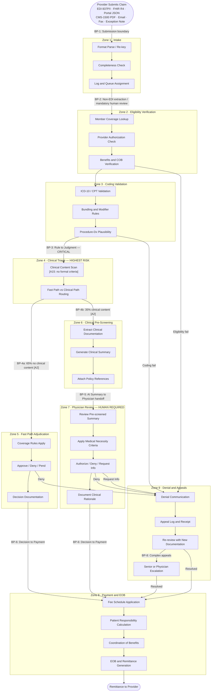

# Cognitive Load Map

**Project:** Greenfield Health Systems — AI Claims Processing Transformation  
**Prepared by:** FDE Engagement Lead  
**Date:** 2026-05-20  
**Status:** Active — based on scenario and stakeholder materials

---

## Table of Contents

1. [Executive Summary](#1-executive-summary)
2. [Work Stream Decomposition — Jobs to be Done](#2-work-stream-decomposition--jobs-to-be-done)
3. [Cognitive Load Map — Micro-Task Inventory](#3-cognitive-load-map--micro-task-inventory)
4. [Process Topology Diagram](#4-process-topology-diagram)
5. [Lived Process Narrative](#5-lived-process-narrative)
6. [Assumptions Referenced](#6-assumptions-referenced)

---

## 1. Executive Summary

Claims processing at Greenfield is a nine-zone cognitive workflow spanning intake, eligibility, coding, clinical triage, dual-path adjudication, payment, and exception management. Of approximately 1,667 claims per day [U1], each requires 35 minutes of active processing but consumes 8 days of elapsed time — confirming that the constraint is not task complexity but queue dynamics, system fragmentation, and the absence of structured handoffs between cognitive zones.

The micro-task inventory reveals a bimodal cognitive structure. Twenty-three of thirty-five micro-tasks are rule-bound, structured-input, and suited for agent delegation. Twelve are judgment-dependent or clinically sensitive and require physician oversight or deliberate human-in-the-loop design. The single highest-risk task in the entire workflow is **MT-4.1 (Clinical Content Identification)** — the triage decision that routes claims to Fast Path or Clinical Path. This step is currently performed informally, without documented criteria [A15], and its misclassification rate is the primary patient safety gate for the entire dual-path architecture [A6].

The topology diagram maps nine cognitive zones and eight breakpoints. Three breakpoints represent genuine control-transfer risks where mis-routing causes patient harm or financial exposure: BP-3 (rule-to-judgment at clinical triage), BP-4 (routing fork), and BP-5 (AI summary to physician handoff). The lived process narrative shows that the 8-day cycle time and 41% denial overturn rate are not caused by inherent task difficulty — they are caused by informal clinical triage, absent pre-screening, multi-system eligibility lookups without integration, manual denial letter generation [A16], and an SLA-unaware queue [A17]. All four are tractable through the proposed agentic architecture.

---

## 2. Work Stream Decomposition — Jobs to be Done

Each JtD is a cognitive contract: a trigger-bound commitment between an actor and an outcome, decomposed into what must be decided vs. executed, and which parts are knowledge-bound, rule-bound, or exception-bound.

---

### JtD-1 — Claim Intake and Format Validation

| Field | Content |
|-------|---------|
| **Trigger** | New claim arrives via EDI 837P/I, FHIR R4, provider portal JSON, CMS-1500 PDF (scanned or pre-OCR'd), email (.eml), fax PDF, fax-as-email, or exception note |
| **Actor (current)** | Intake system (EDI) + admin processor (all other formats) |
| **Goal** | Transform raw submission into a validated, queued work item; route exception notes as annotations to existing claims, not new records |
| **Key decisions** | Is the format parseable? Are required fields present and above confidence threshold? Which queue? Is this a new claim or an annotation to an existing record? |
| **Key systems** | EDI 837P/I parser, FHIR R4 parser, IDP pipeline (PDF/fax/email OCR and NLP extraction), claims management system (CMS) [A12] |
| **Expected output** | Validated claim record assigned to processing queue; or exception note attached to existing CMS claim record as annotation |
| **Type** | Execution + Exception-handling |
| **Assumptions** | [A14] ~80% of non-EDI claims require manual re-key; [A7] 30% of volume is non-EDI; fields not needed by ADR-1 or ADR-4 (plan_id, payer_id, provider identity, member_dob) are deferred to downstream ADRs — their absence does not trigger HUMAN_REQUIRED |

---

### JtD-2 — Member and Provider Eligibility Verification

| Field | Content |
|-------|---------|
| **Trigger** | Claim enters processing queue |
| **Actor (current)** | Admin processor |
| **Goal** | Confirm member has active coverage on date of service and billing provider is authorized |
| **Key decisions** | Is coverage active? Is provider in-network? Any prior auth requirements? |
| **Key systems** | Eligibility database, provider directory, group contract system [A15-systems] |
| **Expected output** | Eligibility confirmed (proceed) or flagged (deny/pend) |
| **Type** | Decision (rule-bound) |
| **Assumptions** | Multiple systems likely require manual cross-lookup; no unified eligibility API confirmed [A12] |

---

### JtD-3 — Coding and Compliance Validation

| Field | Content |
|-------|---------|
| **Trigger** | Eligibility confirmed |
| **Actor (current)** | Admin processor |
| **Goal** | Verify ICD-10/CPT codes are valid, correctly bundled, and consistent with reported diagnosis |
| **Key decisions** | Are codes valid? Do NCCI bundling and modifier rules apply? Does procedure match diagnosis? |
| **Key systems** | ICD-10/HCPCS reference databases, NCCI edits engine, payer policy library |
| **Expected output** | Coding confirmed (proceed) or exception flagged for correction |
| **Type** | Decision (rule-bound, with judgment edge cases on procedure–diagnosis plausibility) |
| **Assumptions** | Senior processors apply NCCI rules from memory; newer processors consult lookup tools — creating skill-dependent inconsistency |

---

### JtD-4 — Clinical Content Triage

| Field | Content |
|-------|---------|
| **Trigger** | Claim passes coding validation |
| **Actor (current)** | Admin processor (informal judgment) |
| **Goal** | Determine whether the claim contains clinical content requiring physician review |
| **Key decisions** | Does this claim involve diagnostic imaging, specialist authorization, or medical necessity determination? Fast Path or Clinical Path? |
| **Key systems** | CMS; no formal clinical criteria tool exists [A15] |
| **Expected output** | Routing decision: Fast Path (65%) or Clinical Path (35%) [A2] |
| **Type** | Decision (judgment-dependent — **highest-risk JtD in the workflow**) |
| **Assumptions** | **[A15]** No formal documented criteria for "clinical content." Routing driven by processor experience. This is the primary validation target for Phase 1 and the gating condition for [A6]. |

---

### JtD-5 — Fast Path Administrative Adjudication

| Field | Content |
|-------|---------|
| **Trigger** | Claim routed to Fast Path (no clinical content) |
| **Actor (current)** | Admin processor |
| **Goal** | Apply coverage and payment rules and issue a final determination on administrative claims |
| **Key decisions** | Approve, deny, or pend for additional information? |
| **Key systems** | Coverage rules engine, fee schedule, CMS |
| **Expected output** | Claim determination with rationale; triggers payment or denial workflow |
| **Type** | Decision (rule-bound for clean claims; exception-handling for edge cases) |
| **Assumptions** | [A11] AI-generated Fast Path denials assumed legally permissible pending legal review |

---

### JtD-6 — Clinical Pre-Screening and Summary Packaging

| Field | Content |
|-------|---------|
| **Trigger** | Claim routed to Clinical Path |
| **Actor (current)** | **This JtD does not currently exist.** Physician reads full file from scratch. |
| **Goal** | Extract clinically relevant content and package it for efficient physician review |
| **Key decisions** | What clinical information is relevant? What policy references apply? |
| **Key systems** | CMS, clinical documentation repository, coverage policy database |
| **Expected output** | Pre-screened clinical summary package (structured, physician-ready) |
| **Type** | Synthesis |
| **Assumptions** | Dr. Webb's 20 claims/hour throughput [A5] is predicated on this package being high quality. The agent creates this JtD — it is the core new capability of the architecture. |

---

### JtD-7 — Physician Clinical Review

| Field | Content |
|-------|---------|
| **Trigger** | Clinical summary package ready (target state) / Full claim file (current state) |
| **Actor (current)** | Physician / Advanced Practice Provider |
| **Goal** | Apply clinical judgment to determine medical necessity and authorize or deny |
| **Key decisions** | Is the service medically necessary? Does it meet coverage criteria? Request more information? |
| **Key systems** | Physician review portal, clinical policy database |
| **Expected output** | Clinical determination with documented rationale |
| **Type** | Decision (judgment-dependent; CMO's non-negotiable oversight requirement) |
| **Assumptions** | [A5] Current throughput 5–8 claims/hour from scratch; target 20/hour with pre-screening |

---

### JtD-8 — Payment Determination and EOB Generation

| Field | Content |
|-------|---------|
| **Trigger** | Adjudication decision made (either path) |
| **Actor (current)** | Payment system with processor verification |
| **Goal** | Calculate final payment, apply member cost-sharing, generate EOB and remittance |
| **Key decisions** | Fee schedule application, deductible/copay/coinsurance, coordination of benefits |
| **Key systems** | Fee schedule database, payment engine, EOB template system, remittance module |
| **Expected output** | Final payment amount, EOB to member, remittance advice to provider |
| **Type** | Execution (largely deterministic) |
| **Assumptions** | Payment engine is separate from CMS adjudication module; integration boundary exists [A12-analogous] |

---

### JtD-9 — Denial Communication and Appeal Management

| Field | Content |
|-------|---------|
| **Trigger** | Claim denied (any path) or appeal filed |
| **Actor (current)** | Admin processor (initial) + physician (clinical appeals) |
| **Goal** | Communicate denial with compliant documentation; manage and resolve incoming appeals |
| **Key decisions** | Is denial documentation regulatory-compliant? Is the appeal defensible? Escalate? |
| **Key systems** | CMS, denial letter templates, appeals tracking system |
| **Expected output** | Compliant denial letter with appeal rights; appeal resolution |
| **Type** | Communication + Exception-handling |
| **Assumptions** | [A16] Denial letters generated via manual template fill-in; inconsistent policy citation is a primary driver of the 41% overturn rate |

---

## 3. Cognitive Load Map — Micro-Task Inventory

**Scoring guide** — all dimensions H/M/L:

| Dimension | H means | L means |
|-----------|---------|---------|
| Cognitive Load | High reasoning demand, tacit knowledge required | Pattern-match or rule lookup |
| Input Structure | Structured, machine-readable | Unstructured narrative, mixed formats |
| Decision Determinism | Rule-bound, predictable output | Judgment-dependent, contextual |
| Exception Frequency | Frequent edge cases | Rare, predictable exceptions |
| Turn-Taking | High back-and-forth with humans/systems | Single-pass |
| Latency Constraint | Real-time or urgent | Batch acceptable |
| Compliance/Risk | High consequence if wrong; regulated | Low consequence |
| Tool/API Availability | Accessible APIs | Manual only or no API |

**Bold rows** = highest-risk micro-tasks in the workflow.

| ID | Micro-Task | Cognitive Load | Input Structure | Decision Determinism | Exception Freq | Turn-Taking | Latency | Compliance/Risk | Tool/API |
|----|-----------|:-:|:-:|:-:|:-:|:-:|:-:|:-:|:-:|
| MT-1.1 | Receive and identify claim format | L | M | H | M | L | L | M | M |
| MT-1.2 | Parse/extract claim fields across 10 channels (EDI 837P/I: deterministic parser; FHIR R4: dedicated parser, confidence-based — required fields typically absent → HUMAN_REQUIRED in practice; portal JSON/CMS-1500/fax: IDP extraction with confidence scoring; email/fax-email: IDP NLP, confidence-based — payer_id/plan_id deferred to ADR-2; exception notes: annotation routing only) [A14] | M | M | H | M | L | M | M | M |
| MT-1.3 | Validate claim completeness (required fields present) | L | H | H | M | M | L | M | H |
| MT-1.4 | Log claim in CMS and assign to queue | L | H | H | L | L | L | L | H |
| MT-2.1 | Member coverage lookup (dates, plan type) | L | H | H | M | L | M | H | M |
| MT-2.2 | Provider network authorization check | L | H | H | M | L | M | H | M |
| MT-2.3 | Benefit limits and coordination of benefits | M | M | M | M | M | L | H | M |
| MT-2.4 | Flag and resolve eligibility exceptions | M | M | M | H | H | H | H | L |
| MT-3.1 | Validate ICD-10 diagnosis codes | L | H | H | M | L | L | H | H |
| MT-3.2 | Validate CPT/HCPCS procedure codes | L | H | H | M | L | L | H | H |
| MT-3.3 | Apply bundling and modifier rules (NCCI) | M | H | M | M | L | L | H | H |
| MT-3.4 | Assess procedure–diagnosis plausibility | M | M | M | M | L | L | H | M |
| MT-3.5 | Flag coding anomalies for correction | M | M | M | H | M | M | H | M |
| **MT-4.1** | **Identify clinical content [A15] — no formal criteria exist** | **H** | **L** | **L** | **H** | **M** | **M** | **H** | **L** |
| **MT-4.2** | **Route claim: Fast Path vs. Clinical Path** | **M** | **M** | **L** | **H** | **L** | **M** | **H** | **M** |
| MT-5.1 | Apply coverage rules to administrative claim | M | H | H | M | L | M | H | H |
| MT-5.2 | Make approve / deny / pend decision (Fast Path) | M | H | H | M | L | M | H | H |
| MT-5.3 | Document Fast Path decision rationale | M | M | M | L | L | L | H | M |
| MT-5.4 | Trigger EOB and payment workflow | L | H | H | L | L | M | M | H |
| MT-6.1 | Extract relevant clinical documentation from file | H | L | L | M | L | M | H | M |
| MT-6.2 | Generate structured clinical summary | H | L | L | M | L | M | H | L |
| MT-6.3 | Attach applicable coverage policy references | M | H | H | M | L | M | H | M |
| MT-6.4 | Queue clinical package for physician review | L | H | H | L | L | M | M | H |
| MT-7.1 | Review pre-screened clinical summary | H | M | L | H | M | H | H | M |
| MT-7.2 | Apply medical necessity criteria | H | M | M | H | M | H | H | M |
| MT-7.3 | Make authorization / denial determination | H | M | L | H | M | H | H | M |
| MT-7.4 | Document clinical rationale | H | L | L | M | L | M | H | L |
| MT-7.5 | Request additional clinical information | M | M | M | H | H | H | H | M |
| MT-8.1 | Apply fee schedule to approved claim | L | H | H | L | L | L | H | H |
| MT-8.2 | Calculate patient responsibility (deductibles, copays) | L | H | H | M | L | L | H | H |
| MT-8.3 | Coordinate benefits for secondary coverage | M | M | M | M | M | L | H | M |
| MT-8.4 | Generate EOB and remittance advice | L | H | H | L | L | M | H | H |
| MT-9.1 | Generate compliant denial letter [A16] | M | M | M | M | L | M | H | M |
| MT-9.2 | Document appeal rights notification | L | H | H | L | L | M | H | M |
| MT-9.3 | Receive and log incoming appeal | L | M | H | M | L | M | H | M |
| MT-9.4 | Re-review claim with additional documentation | H | M | L | H | H | H | H | M |
| MT-9.5 | Escalate complex appeal to physician or senior reviewer | H | L | L | H | H | H | H | L |

**Pattern summary:**
- **Rule-bound + structured input** (MT-1.3, 1.4, 2.1, 2.2, 3.1, 3.2, 3.3, 5.1, 5.2, 8.1, 8.2, 8.4): Strong candidates for full agent delegation.
- **Synthesis + unstructured input** (MT-4.1, MT-6.1, MT-6.2, MT-7.4): Require significant agent design investment; MT-4.1 is safety-critical.
- **Judgment + high compliance** (MT-7.1–7.5, MT-9.4, MT-9.5): Human-required; agent supports but does not decide.

---

## 4. Process Topology Diagram

Nine cognitive zones and eight breakpoints. Breakpoints (BP) mark control transfers: provider→system, system→human, rule→judgment, AI synthesis→physician.

### Breakpoint Summary

| ID | Location | Transfer Type | Risk Level | Key Concern |
|----|----------|--------------|:----------:|-------------|
| BP-1 | Provider → Intake | External boundary | Low | Format validity |
| BP-2 | EDI parse → Non-EDI extraction or confidence-gated human review | System → Human | Medium | Transcription error on non-EDI [A14]; HUMAN_REQUIRED triggered by required-field confidence < 0.85, not by channel identity; fields deferred to downstream ADRs (plan_id → ADR-2, etc.) do not contribute |
| BP-3 | Coding → Clinical Triage | Rule → Judgment | **High** | Informal criteria [A15]; misclassification risk |
| BP-4a/b | Triage → Path routing | Judgment → Execution | **High** | False negative = patient safety failure [A6] |
| BP-5 | Pre-screening → Physician | AI Synthesis → Human | **High** | Summary quality determines physician throughput [A5] |
| BP-6 | Adjudication → Payment | Decision → Execution | Low | Deterministic calculation; API-dependent [A12] |
| BP-7 | Decision → Denial queue | Standard → Exception | Medium | Letter quality drives 41% overturn rate [A16] |
| BP-8 | Re-review → Escalation | Standard → Judgment | **High** | Appeal deadlines; defensibility at risk |

---

## 5. Lived Process Narrative

### What the SOP Says

A claim arrives, enters the CMS, and is assigned to an available processor. The processor checks eligibility, validates codes, reviews medical necessity, calculates payment, and issues a determination. Physician review is triggered for clinical claims. The cycle takes 35 minutes of active work. Denials include regulatory-compliant documentation. Appeals are resolved within deadline.

### What Actually Happens

**Claims sit before anyone touches them.** The 8-day average cycle time is not 8 days of processing — it is 8 days from receipt to resolution, most of which is queue wait. Queue management is informal and not SLA-aware [A17]: some claims are prioritized by payer relationship or convention; others sit untouched for 3–4 days. The 35-minute active processing benchmark is accurate but irrelevant — it is dwarfed by queue time.

**Non-EDI claims carry a hidden pre-processing burden — and more format diversity than the current intake system handles.** Approximately 30% of claims arrive as non-EDI submissions [A7], but the non-EDI bucket is not uniform: it spans FHIR R4 (modern provider submissions with reference URIs), provider portal JSON, scanned CMS-1500 PDFs, pre-OCR'd CMS-1500 text, email (.eml with structured headers), fax cover-sheet PDFs, fax-as-email plain text, and exception notes. Roughly 80% require some degree of manual field verification [A14]. HUMAN_REQUIRED is triggered by confidence scores on the fields ADR-1 and ADR-4 actually need — not by channel identity. Fields resolved downstream (plan_id → ADR-2, payer_id → ADR-2, provider identity → ADR-2+) are deferred and their absence does not force human review. FHIR R4 still produces HUMAN_REQUIRED in practice because the fields ADR-1 does need (member_id, member_name, prior_auth_required) are typically absent or unresolvable from a URI reference. Exception notes are not claim submissions at all; they reference existing CMS claim records and must be routed as annotations, not new claims. This step is not separately logged or reported, so the 35-minute average understates the true cost of non-EDI claims by an estimated 50–100%. The intake zone is the least visible cost driver in the operation.

**Eligibility lookups span multiple disconnected systems.** Processors open the member eligibility database, the provider directory, and the group contract system in separate windows and manually reconcile discrepancies. When coverage information is ambiguous — retroactive enrollment changes, policy renewal gaps — the claim gets pended while the processor calls the provider or member. This back-and-forth adds untracked hours to cycle time.

**Clinical triage is the most consequential step and the most informal.** There are no written criteria for what constitutes "clinical content" requiring physician review [A15]. Experienced processors use internalized patterns ("imaging goes upstairs," "specialist auth needs the physician queue"); newer processors apply different heuristics. The result is inconsistent routing: some claims that should be clinically reviewed reach the Fast Path; some administrative claims consume physician time unnecessarily. This inconsistency is a primary driver of the 41% denial overturn rate, where decisions made on the wrong path are challenged and reversed at appeal.

**Physicians read entire claim files from scratch.** When a claim reaches the clinical review queue, it arrives as a full file — eligibility history, coding data, clinical notes, prior auth records. Dr. Webb's team navigates the whole document to extract the 20% that is clinically relevant. This is why current physician throughput is estimated at 5–8 claims per hour [A5]: most of that time is document navigation, not clinical judgment. The pre-screening step (JtD-6) does not currently exist as a structured process. It is the primary new capability the AI architecture creates.

**Denial letters are written from prior examples, not from policy.** When a processor denies a claim, they copy language from a similar prior denial or manually fill in a regulatory template [A16]. There is no systematic mapping of denial rationale to the specific policy provision violated. This is the most likely explanation for the 41% overturn rate: denials are often correct in outcome but documented in ways that cannot withstand appellate scrutiny. A defensible denial requires a clear chain from clinical finding to policy provision to determination — not template language inserted by memory.

**Appeals re-enter the same queue as new claims.** There is no priority lane for appeals with regulatory deadlines. A time-sensitive appeal with a 30-day deadline competes for processor time with a fresh claim that arrived this morning. The result is a secondary SLA risk — appeal deadline breaches — that is not separately tracked or reported to VP Operations.

---

The aggregate effect of these patterns: an operation where the cognitive work itself is tractable, but the coordination overhead around it — queue management, system fragmentation, absent pre-screening, informal triage, and inconsistent documentation — multiplies cost and error at every handoff. The agentic architecture addresses all four structural causes. Phase 1 shadow mode exists to measure the most dangerous one: the false-negative rate at MT-4.1 [A6].

---

## 6. Assumptions Referenced

| ID | Description | Confidence | Used In |
|----|-------------|:----------:|---------|
| A2 | 35% clinical / 65% admin claims split | Low (50%) | JtD-4, MT-4.2, Zone 4–5 routing volumes |
| A5 | Physician throughput 5–8/hr without pre-screening | Low (45%) | JtD-7, Lived Narrative |
| A6 | <2% clinical flagging false-negative achievable | Medium (60%) | MT-4.1, BP-4 risk, narrative conclusion |
| A7 | 70% EDI / 30% non-EDI format split | Low (40%) | JtD-1, MT-1.2, narrative |
| A11 | AI Fast Path denials legally permissible | Low (45%) | JtD-5, MT-5.2 |
| A12 | CMS has usable API for integration | Low (40%) | JtD-1, 5, 8; BP-6 |
| A14 | ~80% of non-EDI claims require manual re-key | Low (40%) | MT-1.2, BP-2, narrative |
| A15 | Clinical flagging criteria are informal/undocumented | Medium (60%) | JtD-4, MT-4.1, MT-4.2, BP-3/4, narrative |
| A16 | Denial letters use manual template fill-in | Medium (55%) | JtD-9, MT-9.1, BP-7, narrative |
| A17 | Queue prioritization is informal and not SLA-aware | Medium (55%) | JtD-1, narrative |
| U1 | Volume discrepancy: 1,667 vs. 2,000 claims/day | — | Executive Summary |
| U8 | "Clinical content" not formally defined | — | JtD-4, MT-4.1 |

New assumptions A14–A17 are defined in full in `specs/assumptions.md`.
