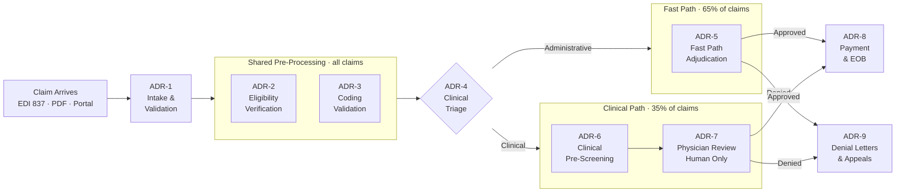
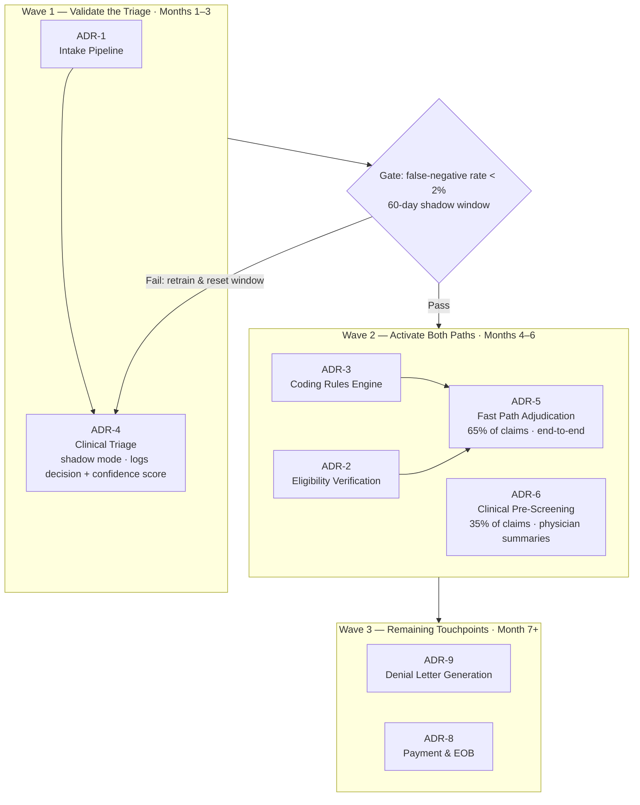

# Capstone Proposal
**Project:** Greenfield Health Systems — Clinical Content Triage Agent (ADR-4)

---

## Problem Framing & Success Metrics

Greenfield Health Systems processes ~50,000 claims per month but faces a structural capacity crisis: the team can handle roughly 524 claims per day while 1,300 require manual review — a daily deficit of 776 claims. That gap has compounded into a 9-day queue that violates payer SLAs and is accruing daily penalties. Worse, 41% of denied claims are overturned on appeal, meaning the current process is both too slow and systematically wrong. 

Three executives define success differently and, at face value, incompatibly: 
- CFO needs an 8 FTE headcount reduction within 6 months; that would give a $400K savings 
- CMO requires physician review on every clinical claim (non-negotiable)
- VP of Operations needs cycle times under 7 days on both processing paths 

The proposed solution is a dual-path AI architecture where an agent auto-adjudicates routine administrative claims (~65%) end-to-end and pre-screens clinical claims (~35%) so physicians review summaries instead of full files. Whether that split is real — and whether the agent can correctly identify clinical claims with fewer than 2% misses — is the single highest-risk question in the entire design.

**Success metrics:** 
- Clinical flagging false-negative rate < 2% (hard gate, patient safety)
- Average cycle time ≤ 6.5 days (Fast Path ≤ 4 days, Clinical Path ≤ 7 days)
- Fast Path adjudication rate ≥ 65%
- Denial overturn rate does not exceed 41% baseline within 90 days of launch
- 8 FTE admin reduction confirmed by Month 6

**Workflow:** 

---

## Intended Approach

The full transformation is delivered across three waves: 
- Wave 1 (Months 1–3) validates the routing model before anything is adjudicated autonomously: ADR-4 (Clinical Triage) runs in shadow mode to confirm the 65/35 split and prove the false-negative rate, while ADR-1 (Intake Pipeline) builds the structured input layer ADR-4 depends on and delivers ~$117K/year in intake automation savings. 
- Wave 2 (Months 4–6) activates both paths once the ADR-4 gate passes: ADR-3 (Coding Rules Engine) and ADR-2 (Eligibility Verification) are built first as prerequisites for ADR-5 (Fast Path Adjudication), which adjudicates 65% of claims end-to-end; ADR-6 (Clinical Pre-Screening) activates the Clinical Path with AI-generated physician summary packages at 2.7× throughput. Together, Wave 2 delivers the CFO's 13 FTE reduction, SLA restoration, and payer penalty avoidance. 
- Wave 3 (Month 7+) addresses remaining touchpoints: ADR-9 (Denial Letter Generation) targets the 41% overturn rate once legal review and a coverage rules engine are confirmed; ADR-8 (Payment & EOB) triggers the existing payment engine and is sequenced last because it addresses no primary stakeholder pain point.

**For this capstone, I am building ADR-4 — the Clinical Content Triage agent — because it is the cornerstone that determines whether the entire project is viable.** Every downstream ADR presupposes that claims are correctly routed between Fast Path and Clinical Path. Building those before triage is validated builds savings estimates on an unconfirmed split and creates exactly the patient safety exposure the CMO's requirement is designed to prevent.

**Pre-Phase 1 — Historical Split Analysis (Weeks 1–3):** Before any shadow mode or staffing commitments begin, a retrospective sample of 90–180 days of closed claims is pulled and classified against Dr. Webb's clinical criteria — the same criteria that will define Clinical Path routing. The purpose is to validate or correct the 65/35 split assumption before the financial model and headcount targets are presented to the board. Gate criterion: split analysis reviewed and signed by Dr. Webb; if the measured clinical content rate deviates from 35% by more than 10 percentage points, Sarah Chen revises the headcount model before Phase 1 begins. This analysis also serves as the labeled ground-truth dataset for calibrating Phase 1 flagging accuracy.

**Phase 1 — Shadow Mode (Months 1–3):** ADR-4 runs silently alongside the live system. Every claim is classified as administrative or clinical; no claims are adjudicated autonomously. For each decision, the agent logs its routing classification together with a confidence score, creating an auditable record that can be reviewed against physician ground-truth on a stratified sample. This phase measures the false-negative rate — the only metric that matters at this stage — and validates or corrects the 65/35 split assumption before any staffing commitments are made. Hard gate before Wave 2: false-negative rate < 2% over a 60-day shadow window. If the gate fails, the model is retrained on the false-negative cases, the window resets, and Wave 2 does not launch.

**Phase 2 — Live in Wave 2 (Months 4–6):** ADR-4 gate passed. Both paths go live. ADR-4 now routes every incoming claim for real: administrative claims flow to Fast Path (ADR-5) for end-to-end adjudication; clinical claims flow to Clinical Path (ADR-6) for physician-reviewed pre-screened summaries. The CFO gets the 13 FTE reduction target and SLA restoration; the CMO gets physician oversight structurally enforced on every clinical claim; the VP of Operations gets cycle time below 7 days on both paths with weekly monitoring and an automatic remediation trigger if either path slips.

---

## Why It's Hard Enough

1. **Getting it wrong has real consequences.** If the system misroutes a clinical claim, a patient bypasses required doctor review — that's the CMO's hard line. This isn't a normal accuracy problem; it demands near-zero errors on the dangerous failure type, which requires a completely different way of thinking about testing and safety.

2. **The rules don't exist yet.** The criteria for routing claims currently live only in the CMO's head — nothing is written down. Before building anything, you have to extract, formalize, and document that knowledge. The specification itself is the first engineering problem.

3. **The inputs are messy and the deployment is complex.** Claims arrive as structured transactions, PDFs, and free-text notes — all different shapes. On top of that, the agent must run silently alongside the live system for 60 days without touching real operations, which requires real systems design, not just a smart prompt.

---

## What I'd Expect to Learn

1. **How to evaluate when accuracy isn't the right metric.** I learn to design tests around the failure that actually matters (missing a clinical claim), measure whether the model's confidence scores are trustworthy, and build evaluation systems for safety-critical decisions.

2. **How to turn a business conflict into an engineering constraint.** The CFO wants automation; the CMO wants safety. I learn to translate that tension into one testable requirement — and then build the whole system around it.

3. **How to deploy AI that people will actually trust.** I learn to build explainability, audit trails, and escalation paths in from the start — not as afterthoughts — because in clinical settings, a correct answer without a reason is not deployable.

Reference documents:
`01-problem-framing-and-success-metrics`.
`02-engagement-intake-and-scope-definition`
`cognitive-load-map`
`03-agentic-solution-architecture`
`volume-×-value-analysis`
`04a-capability-spec-intake`
`04b-capability-spec-triage`
