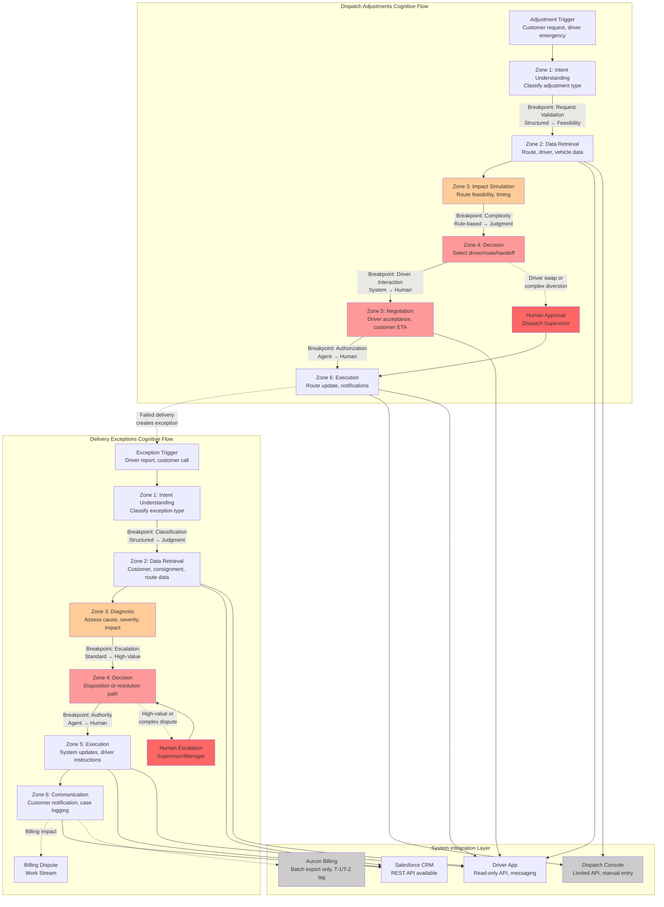

# Apex Distribution Customer Operations — Complete Agentic Transformation Specification

**Consolidated Document**: g-week2/specs (Files 1-9)  
**Date Created**: May 6, 2026  
**Version**: 1.0  
**Owner**: AI FDE Team

---

## Table of Contents

### Part 1: Analysis & Prioritization
1. [Cognitive Load Map](#part-1-cognitive-load-map) — Work stream decomposition, micro-task analysis, lived process narrative
2. [Delegation Suitability Matrix](#part-2-delegation-suitability-matrix) — Archetype assignments, implementation sequencing
3. [Volume × Value Analysis](#part-3-volume--value-analysis) — Prioritization grid, TCO assessment, strategic sequencing

### Part 2: Design & Implementation
4. [Agent Purpose Document](#part-4-agent-purpose-document) — ETA Investigation Agent design (DE-3, Wave 1 pilot)
5. [System & Data Inventory](#part-5-system--data-inventory) — API specs, integrations, infrastructure
6. [Discovery Questions](#part-6-discovery-questions) — Validation questions for core assumptions

### Part 3: Planning & Documentation
7. [CLAUDE.md](#part-7-claudemd) — Build guidelines and scope
8. [Assumptions Document](#part-8-assumptions) — Reference document (external link)
9. [Risk Scenario Analysis](#part-9-risk-scenario-analysis) — Contingency plans (reference document)

---

---

# PART 1: COGNITIVE LOAD MAP

# Cognitive Load Map: Apex Distribution Customer Operations

## Table of Contents

1. [Executive Summary](#executive-summary)
2. [Work Stream Decomposition](#work-stream-decomposition)
   - [Dispatch Adjustments: Jobs to be Done](#dispatch-adjustments-jobs-to-be-done)
   - [Delivery Exceptions: Jobs to be Done](#delivery-exceptions-jobs-to-be-done)
3. [Cognitive Load Map: Micro-Task Analysis](#cognitive-load-map-micro-task-analysis)
   - [Dispatch Adjustments Micro-Tasks](#dispatch-adjustments-micro-tasks)
   - [Delivery Exceptions Micro-Tasks](#delivery-exceptions-micro-tasks)
4. [Process Topology Diagram](#process-topology-diagram)
5. [Lived Process Narrative](#lived-process-narrative)
6. [Key Findings and Recommendations](#key-findings-and-recommendations)

---

## Executive Summary

This cognitive load map analyzes two high-volume work streams within Apex Distribution's 35-person Customer Operations function:

**Dispatch Adjustments** (~90/day, 18 min avg) and **Delivery Exceptions** (~180/day, 12 min avg).

### Key Findings

1. **High Cognitive Hotspots**: Both work streams contain micro-tasks with HIGH cognitive load (tacit knowledge, real-time judgment, exception handling) that drive the 12-18 minute average handling times.

2. **System Integration Gaps**: Legacy dispatch console (Java/Citrix, limited API), batch-only billing system (24-48h lag), and driver app with incomplete data create significant data retrieval and reconciliation overhead.

3. **Lived Process vs. SOP**: The October 2023 SOP references retired systems and has incomplete sections. Real work relies on dispatcher discretion, informal knowledge networks, and manual overrides that bypass documented controls.

4. **Cross-Stream Dependencies**: ~25% of cases span multiple work streams (delivery exception → billing dispute → dispatch adjustment), requiring context handoffs and multi-system coordination [Ref: A012].

5. **Concentrated Expertise**: Senior dispatchers (including COO Sarah's former team) hold tacit knowledge essential for complex cases. Sandra appears across multiple artefacts handling high-value accounts with manual override authority [Ref: A002, A008].

### Delegation Implications

- **Dispatch Adjustments**: Human-led + Agent Support archetype. Real-time route optimization and driver messaging can be agent-assisted, but final dispatch decisions (especially driver swaps and complex diversions) require human judgment due to safety, driver welfare, and customer relationship factors.

- **Delivery Exceptions**: Mixed archetype by sub-type. Standard refused deliveries and damage reports can be Agent-led + Human Oversight, but complex multi-party disputes and high-value escalations remain Human-led + Agent Support.

### Critical Assumptions

15 assumptions documented in `assumptions.md`, with 5 at high confidence. **Critical path validation** required on:
- Dispatch console API write access (A004)
- Billing system integration feasibility (A007)
- Decision rules for refused deliveries (A005)

**Estimated cognitive work eliminated**: 35-50% of dispatch adjustments, 40-60% of delivery exceptions, contingent on API access and decision rule formalization.

---

## Work Stream Decomposition

### Dispatch Adjustments: Jobs to be Done

#### JtD-DA-1: Process Additional Pickup Request
- **Trigger**: Customer calls/emails requesting mid-route pickup
- **Actor**: Dispatch coordinator
- **Goal**: Add pickup to driver's route without violating delivery commitments or driver shift limits
- **Key Decisions**: 
  - Which driver/route has capacity?
  - Can pickup be completed within driver's remaining shift?
  - Does pickup weight/volume fit remaining vehicle capacity?
  - What is the latest acceptable pickup time?
- **Key Systems**: Dispatch console (route planning), driver app (GPS, current load), CRM (customer details)
- **Expected Output**: Route modification instruction to driver; updated ETA to affected customers
- **Nature**: Decision-making (60%), execution (40%)
- **Exception Scenarios**: No driver has capacity; pickup location off all routes; customer timing conflict

#### JtD-DA-2: Execute Route Diversion
- **Trigger**: Customer requests urgent delivery change; traffic/weather requires re-routing; priority customer escalation
- **Actor**: Dispatch coordinator
- **Goal**: Re-route driver to alternate destination while minimizing impact on other deliveries
- **Key Decisions**:
  - Does diversion cause downstream delivery delays?
  - Is driver aware of new address location?
  - Are affected customers notified of ETA changes?
  - Does diversion require customer service communication?
- **Key Systems**: Dispatch console, driver app, CRM, route optimization logic (implicit/manual)
- **Expected Output**: Updated route sent to driver app; ETA notifications to affected customers
- **Nature**: Decision-making (50%), execution (30%), communication (20%)
- **Exception Scenarios**: Diversion creates unacceptable delay; driver unreachable; customer refuses alternate timing

#### JtD-DA-3: Manage Driver Swap
- **Trigger**: Driver illness/emergency; vehicle breakdown; shift limit exceeded; driver refusal (safety/policy)
- **Actor**: Dispatch coordinator + dispatch supervisor (if emergency)
- **Goal**: Reassign route to available driver with minimal delay
- **Key Decisions**:
  - Which driver is available and qualified?
  - Where is the optimal handoff location?
  - What is the impact on both drivers' shift compliance?
  - Does this trigger overtime or contractor call-out?
  - Are customers with time-sensitive deliveries affected?
- **Key Systems**: Dispatch console, driver app, workforce management system, CRM
- **Expected Output**: Handoff instructions to both drivers; updated ETAs to customers; incident log entry
- **Nature**: Decision-making (70%), execution (20%), exception-handling (10%)
- **Exception Scenarios**: No available driver; vehicle/cargo handoff location inaccessible; customer escalation due to delay

### Delivery Exceptions: Jobs to be Done

#### JtD-DE-1: Resolve Refused Delivery
- **Trigger**: Driver reports recipient refused delivery (damaged goods, incorrect consignment, customer dispute)
- **Actor**: Dispatch coordinator (initial), customer service agent (follow-up), duty manager (high-value)
- **Goal**: Determine disposition of refused consignment: return, hold, re-attempt, or escalate
- **Key Decisions**:
  - What is the reason for refusal (damage, wrong item, policy, administrative)?
  - Is this a high-value consignment (>£500) requiring manager approval?
  - Does customer want replacement, refund, or re-delivery?
  - Does driver have time/capacity to hold or return?
  - Is there a billing/credit implication?
- **Key Systems**: Driver app (driver report), CRM (customer history), dispatch console (route impact), Salesforce (case creation)
- **Expected Output**: Disposition instruction to driver; customer communication; case logged in CRM
- **Nature**: Diagnosis (40%), decision-making (40%), communication (20%)
- **Exception Scenarios**: Customer unreachable; conflicting information from driver vs. customer; damage requires insurance claim; high-value escalation

#### JtD-DE-2: Handle Damaged Consignment Report
- **Trigger**: Driver or customer reports damaged goods on delivery
- **Actor**: Customer service agent (initial), supervisor (claims), finance (credit processing)
- **Goal**: Document damage, determine liability, initiate credit or insurance claim, prevent billing dispute
- **Key Decisions**:
  - Is damage visible/documented with photos?
  - Is damage due to transit (Apex liability) vs. packaging (customer/sender liability)?
  - Does damage severity require full or partial credit?
  - Is this a recurring issue with this sender/route?
  - Should goods be returned or disposed?
- **Key Systems**: Driver app (photos), CRM (case), Aurum billing (credit processing), dispatch console (return logistics)
- **Expected Output**: Damage report; credit approval/rejection; customer communication; return instruction (if applicable)
- **Nature**: Diagnosis (50%), decision-making (30%), documentation (20%)
- **Exception Scenarios**: Unclear liability; customer disputes damage assessment; billing system lag prevents immediate credit; insurance threshold triggered

#### JtD-DE-3: Investigate Missed Delivery Window
- **Trigger**: Customer calls/emails that delivery did not arrive within committed window
- **Actor**: Customer service agent (initial), dispatch coordinator (investigation)
- **Goal**: Validate delivery status, identify cause of delay, provide updated ETA or resolution
- **Key Decisions**:
  - What is the actual delivery status (out for delivery, delayed, failed attempt, lost)?
  - Was delay due to driver, route planning, traffic, or customer unavailability?
  - Should delivery be re-attempted today or rescheduled?
  - Is compensation/goodwill required?
  - Does this breach SLA with customer?
- **Key Systems**: Driver app (GPS, delivery status), dispatch console (route history), CRM (customer SLA)
- **Expected Output**: Status update to customer; re-delivery scheduled (if needed); root cause logged; escalation if SLA breach
- **Nature**: Diagnosis (60%), communication (25%), decision-making (15%)
- **Exception Scenarios**: Driver unreachable; GPS data stale/inaccurate; consignment lost; customer escalation to complaints

#### JtD-DE-4: Manage Unattended Address Exception
- **Trigger**: Driver arrives at delivery address but recipient unavailable (business closed, residential no answer)
- **Actor**: Dispatch coordinator (initial), customer service (follow-up)
- **Goal**: Determine next action: leave in safe place, leave with neighbor, return for re-delivery, or hold at depot
- **Key Decisions**:
  - Does customer have safe place/neighbor authority on file?
  - Is consignment eligible for unattended delivery (value, signature requirement)?
  - What is customer preference for re-delivery vs. depot pickup?
  - Does driver have capacity to return later on route?
- **Key Systems**: Driver app (delivery instructions), CRM (customer preferences), dispatch console (re-delivery routing)
- **Expected Output**: Instruction to driver (leave, return, re-attempt); customer notification (card left, SMS, email); re-delivery scheduling
- **Nature**: Decision-making (50%), execution (30%), communication (20%)
- **Exception Scenarios**: No safe place available; customer unreachable for re-delivery coordination; consignment time-sensitive (perishable); policy conflict (signature required but customer demands unattended)

---

## Cognitive Load Map: Micro-Task Analysis

### Dispatch Adjustments Micro-Tasks

| Micro-Task | Cognitive Load | Input Structure | Decision Determinism | Exception Frequency | Turn-Taking | Latency Constraint | Compliance/Risk | Tool/API Availability |
|------------|----------------|-----------------|----------------------|---------------------|-------------|--------------------|-----------------|-----------------------|
| **DA-1.1**: Validate pickup request details (location, time window, weight) | M | Semi-structured (phone/email) | M (validation rules exist but may need clarification) | M (15% require customer callback) | M (2-3 turns avg) | H (real-time response expected) | L (reversible) | H (CRM REST API) |
| **DA-1.2**: Identify candidate drivers with route proximity | M | Structured (GPS data) | H (rule-based: distance + capacity) | L (data usually available) | L (system query) | H (seconds) | L | M (driver app API read-only) [Ref: A003] |
| **DA-1.3**: Calculate route impact and time feasibility | H | Structured (route data) | M (requires route optimization logic) | M (traffic, driver pace unpredictable) | L | H | M (affects delivery SLAs) | L (dispatch console limited API) [Ref: A004] |
| **DA-1.4**: Assess vehicle capacity for additional load | M | Structured (vehicle manifest) | H (weight/volume calculation) | L | L | M | M (overload = safety issue) | M (driver app provides partial data) |
| **DA-1.5**: Select optimal driver and confirm acceptance | H | Semi-structured (driver response) | L (requires judgment on driver capability, fatigue, relationship) | H (driver may refuse or negotiate) | H (driver conversation required) | H | H (driver welfare, hours compliance) | M (messaging via app, but calls common) [Ref: A014] |
| **DA-1.6**: Update route in dispatch console | L | Structured (system input) | H (data entry) | L | L | M | M (audit trail required) | L (manual entry via Citrix) [Ref: A004] |
| **DA-1.7**: Notify driver via app with new pickup instructions | L | Structured (message template) | H (standard notification) | L | L | H | L | H (driver app messaging API) |
| **DA-1.8**: Update affected customer ETAs in CRM | M | Structured (ETA data) | M (ETA calculation may be manual) | M (customer may need call if high-value) | M | M | M (customer expectation management) | H (CRM API) |
| **DA-2.1**: Receive and validate diversion request | M | Semi-structured (customer call/email) | M | M | M (may need clarification) | H | L | H (CRM) |
| **DA-2.2**: Assess impact on remaining route deliveries | H | Structured (route data) | M (requires judgment on delay tolerance) | M (customer priority levels vary) | L | H | H (SLA breach risk) | L (manual route analysis) [Ref: A004] |
| **DA-2.3**: Confirm driver awareness of new location | M | Semi-structured (driver response) | H | M (driver may be unfamiliar with area) | M | H | M (wrong address = failed delivery) | M (driver app messaging) |
| **DA-2.4**: Execute route update in dispatch console | L | Structured | H | L | L | M | M | L (manual) [Ref: A004] |
| **DA-2.5**: Trigger ETA notifications to affected customers | M | Structured | M (may need custom messaging for priority customers) | M | M (high-value customers may call) | M | M | H (CRM automation) |
| **DA-3.1**: Receive driver unavailability report (illness, breakdown) | L | Semi-structured (call/message) | H | M (details may be incomplete) | M | H | H (time-critical) | M |
| **DA-3.2**: Identify available replacement drivers | H | Structured (workforce system) | M (requires judgment on driver qualifications, hours, location) | H (limited pool, especially short notice) | M | H | H (hours compliance, safety) | M (workforce system API may not exist) [Ref: A002] |
| **DA-3.3**: Determine optimal handoff location and time | H | Structured (GPS, route data) | L (judgment-heavy: driver convenience, customer impact, security) | M | M | H | H (handoff location safety, cargo security) | L (manual judgment) |
| **DA-3.4**: Negotiate with drivers on handoff logistics | H | Unstructured (driver conversation) | L (relationship-dependent, requires persuasion) | H (drivers may resist due to fatigue, location) | H (multi-turn negotiation) | H | H (driver welfare, union rules) | L (phone calls) [Ref: A014] |
| **DA-3.5**: Authorize overtime or contractor call-out if needed | H | Semi-structured (workforce system + approval) | L (cost vs. SLA tradeoff, requires manager judgment) | M | M (manager approval) | M | H (budget, compliance) | M (approval workflow may be manual) |
| **DA-3.6**: Update both driver routes and communicate handoff | M | Structured | M | M | M | H | M | L (manual dispatch console update) [Ref: A004] |
| **DA-3.7**: Document incident and log shift adjustments | L | Structured | H | L | L | L | H (audit, compliance) | M (CRM/incident system) |

### Delivery Exceptions Micro-Tasks

| Micro-Task | Cognitive Load | Input Structure | Decision Determinism | Exception Frequency | Turn-Taking | Latency Constraint | Compliance/Risk | Tool/API Availability |
|------------|----------------|-----------------|----------------------|---------------------|-------------|--------------------|-----------------|-----------------------|
| **DE-1.1**: Receive refused delivery report from driver | L | Semi-structured (driver call/app message) | H | M (driver may omit key details) | M | H | L | M (driver app API) |
| **DE-1.2**: Classify refusal reason (damage, incorrect, dispute, admin) | M | Unstructured (driver narrative, customer claim) | M (requires interpretation) | H (conflicting accounts common) | H (may need callback to driver and customer) | M | M (affects downstream process) | L (manual classification) |
| **DE-1.3**: Retrieve customer account and delivery history | L | Structured (CRM lookup) | H | L | L | M | L | H (CRM API) |
| **DE-1.4**: Determine if high-value escalation threshold met | L | Structured (consignment value) | H (>£500 rule) | L | L | M | H (manager oversight required) | M (consignment data may be in multiple systems) |
| **DE-1.5**: Assess driver route impact (time, capacity for return) | M | Structured (GPS, route plan) | M | M | L | H | M (affects other deliveries) | L (dispatch console) [Ref: A004] |
| **DE-1.6**: Decide disposition (return, hold, re-attempt) | H | Semi-structured | L (judgment-dependent: customer priority, refusal reason, driver capacity) | H (edge cases frequent) | M | H | H (wrong decision = escalation or loss) | L (human judgment) [Ref: A005] |
| **DE-1.7**: Communicate decision to driver via app | L | Structured (instruction message) | H | L | L | H | M | H (driver app messaging) |
| **DE-1.8**: Create case in CRM and log refusal details | L | Structured (form entry) | H | L | L | L | M (audit trail) | H (CRM API) |
| **DE-1.9**: Initiate customer follow-up (call/email) | M | Semi-structured (customer communication) | M | M (customer may be upset) | H (multi-turn conversation) | M | M (reputation risk) | H (CRM email/call integration) |
| **DE-1.10**: Coordinate billing adjustment if applicable | M | Semi-structured (credit request) | M (credit policy may be ambiguous) | M | M (finance approval) | L (24-48h batch window) | H (audit, compliance) | L (Aurum batch only) [Ref: A007] |
| **DE-2.1**: Receive damage report (driver or customer) | L | Semi-structured (report + photos) | H | M (photos may be poor quality) | M | M | L | M (driver app photo upload) |
| **DE-2.2**: Assess damage severity and liability | H | Unstructured (visual assessment, narrative) | L (requires judgment: transit vs. packaging fault) | H (frequent ambiguity) | H (may need driver, customer, sender input) | M | H (financial liability, insurance) | L (manual assessment) |
| **DE-2.3**: Retrieve consignment and sender details | L | Structured | H | L | L | M | L | M (CRM, dispatch system) |
| **DE-2.4**: Determine credit amount (full, partial, none) | H | Semi-structured | L (policy exists but judgment-heavy) | M | M (supervisor approval for high amounts) | M | H (financial impact, customer satisfaction) | L (manual) [Ref: A008] |
| **DE-2.5**: Check for recurring damage patterns (sender, route) | M | Structured (historical data) | M | M (data may be fragmented) | L | L | M (quality improvement opportunity) | M (CRM analytics, but may be manual) |
| **DE-2.6**: Initiate credit in Aurum billing system | M | Structured (credit entry) | H | M (Aurum ticket required for non-standard) | M (48h turnaround) | L (batch process) | H (audit, compliance) | L (batch export, manual ticket) [Ref: A007] |
| **DE-2.7**: Communicate resolution to customer | M | Semi-structured | M | M | M | M | M | H (CRM) |
| **DE-2.8**: Coordinate return logistics if needed | M | Structured | M | M (driver availability) | M | M | M (cost of return) | L (dispatch console) [Ref: A004] |
| **DE-3.1**: Receive missed window inquiry from customer | L | Semi-structured (call/email) | H | M | M | H | L | H (CRM) |
| **DE-3.2**: Look up delivery status in driver app and dispatch system | L | Structured | H | M (data may be stale) | L | H | L | M (driver app API read-only) [Ref: A003, A010] |
| **DE-3.3**: Retrieve GPS history and route plan | M | Structured | H | M (GPS lag, driver may be offline) | L | H | L | M (driver app API) [Ref: A010] |
| **DE-3.4**: Diagnose delay cause (traffic, driver pace, failed attempt) | M | Semi-structured (data + judgment) | M | H (root cause often unclear) | M (may need driver contact) | H | M | L (manual analysis) |
| **DE-3.5**: Calculate revised ETA or confirm failure | M | Structured (GPS + route knowledge) | M (requires tacit knowledge of route timing) | M | M (dispatch consultation) | H | M (customer expectation) | L (manual calculation) [Ref: A010] |
| **DE-3.6**: Communicate updated ETA to customer | M | Semi-structured | M (may need to manage upset customer) | M | M | H | M (reputation) | H (CRM) |
| **DE-3.7**: Schedule re-delivery if delivery failed | M | Structured (scheduling system) | M | M (customer availability) | M | M | M | M (CRM + dispatch console) |
| **DE-3.8**: Escalate if SLA breach or high-value customer | M | Semi-structured | M (SLA rules + customer tier) | M | M (manager approval) | M | H (contract penalty) | M (CRM escalation workflow) [Ref: A009] |
| **DE-4.1**: Receive unattended address report from driver | L | Semi-structured (driver app) | H | L | M | H | L | M (driver app) |
| **DE-4.2**: Check customer file for safe place/neighbor authority | L | Structured (CRM lookup) | H | M (data may be missing) | L | H | M (theft risk if wrong decision) | H (CRM API) |
| **DE-4.3**: Verify consignment eligibility for unattended delivery | M | Structured (value, signature requirement) | H | L | L | H | H (high-value items must have signature) | M (consignment data) |
| **DE-4.4**: Decide action (leave safe place, return, re-attempt) | M | Semi-structured | M (rule-based but judgment required) | M | M (may need customer contact) | H | H (theft, loss liability) | L (manual) |
| **DE-4.5**: Instruct driver via app | L | Structured | H | L | L | H | M | H (driver app) |
| **DE-4.6**: Notify customer of delivery attempt and next steps | M | Semi-structured (SMS, email) | H | M (customer may call back) | M | M | M | H (CRM automation) |
| **DE-4.7**: Schedule re-delivery or depot pickup | M | Structured | M | M (customer availability) | M | M | M | M (CRM + dispatch) |

---

## Process Topology Diagram



### Cognitive Breakpoints (High-Value Agent Opportunities)

| Breakpoint ID | Location | Type | Current State | Agent Opportunity | Constraint |
|---------------|----------|------|---------------|-------------------|------------|
| **BP-1** | DE: Intent → Retrieval | Classification | Human interprets driver/customer narrative | Agent classifies exception type from unstructured input | Requires training on historical classification patterns [Ref: A006] |
| **BP-2** | DE: Diagnosis → Decision | Escalation | Human applies >£500 threshold + customer tier | Agent applies formal rules + ML-based customer priority scoring | Needs customer tier formalization [Ref: A009] |
| **BP-3** | DE: Decision → Execution | Authority | Human judgment on disposition (return/hold/re-attempt) | Agent recommends disposition based on decision tree, human approves high-risk | Decision rules must be codified [Ref: A005] |
| **BP-4** | DA: Request → Feasibility | Validation | Human validates pickup details, often requires callback | Agent validates structured fields, flags ambiguity for human | CRM data quality dependency [Ref: A013] |
| **BP-5** | DA: Simulation → Decision | Complexity | Human manually assesses route impact using dispatch console | Agent uses route optimization API to calculate impact, present options | Requires dispatch console API or separate optimization engine [Ref: A004] |
| **BP-6** | DA: Decision → Negotiation | Driver Interaction | Human calls driver to confirm/negotiate | Agent sends structured proposal via app, escalates if driver declines | Driver preference for voice may limit full automation [Ref: A014] |
| **BP-7** | DE: Decision → Billing | System Lag | Human initiates credit via Aurum manual ticket (48h) | Agent queues credit request in workflow, tracks to completion | Limited by Aurum batch architecture [Ref: A007] |

---

## Lived Process Narrative

### What Really Happens vs. What the SOP Says

**The SOP's Promise**: The October 2023 "Exception Handling SOP v2.3" describes a clean, sequential process. When a driver encounters a refused delivery, they note the reason on the "DispatchHub" tablet, confirm disposition with DispatchHub, and escalate high-value consignments to the Duty Manager via the dispatch console. Damaged consignments follow a structured protocol documented in Section 4.3. Unattended addresses are handled per Section 7.

**The Reality**: DispatchHub was retired in October 2024, a year after the SOP was last updated. Section 4.3 on damaged consignments is incomplete ("TBD pending review of insurance protocol"). Section 7 on unattended addresses is referenced but provides no actual guidance.

When driver Mark Petrov calls dispatch about a refused delivery at the Stein-Allen account (Artefact 1), he doesn't use an app workflow—he leaves a voicemail because "Sandra's line was busy." He's asking for human judgment: the warehouse guy says the pallet is damaged, but Mark thinks it's fine. The SOP says to escalate if >£500, but Mark doesn't know the consignment value, and he's got six more drops waiting. The SOP doesn't cover this: the lived process does.

Sandra—who appears in the billing dispute thread, the refused delivery case, and three times in the disputes export—is the institutional memory. When Hayes & Sons disputes a fuel surcharge on a damaged delivery (Artefact 2), the billing system sends them to Customer Ops. The customer calls, waits 22 minutes, gets cut off, and escalates. Sandra eventually applies a £170 goodwill credit "via a manual override" that has "no entry in the credits audit log." This isn't in the SOP. This is how work gets done when the customer is on their second complaint this quarter and the Aurum billing system can't adjust a surcharge without a 48-hour ticket.

When a customer asks "where is my delivery?" (Artefact 3), the agent checks the driver app, sees GPS data from 10:48, and says "best guess is 14:00–15:00." The customer wants specificity; the agent can't provide it. The agent has to "check with dispatch" because the system shows a 4-hour ETA window, and actual ETA requires tacit knowledge: Which drop is the driver on? How long do they usually take at commercial vs. residential? Is traffic heavier than usual today? The SOP doesn't document this. Senior dispatchers know it. New hires don't.

The cognitive work lives in the gap between what the SOP prescribes and what the systems support:

- **Data fragmentation**: Customer records in Salesforce, delivery status in the driver app, billing disputes in Aurum exports that lag 24-48 hours, route planning in a Citrix-deployed Java console with "limited API surface." To resolve a refused delivery that might trigger a billing dispute, Sandra needs four systems and a phone call.

- **Implicit decision rules**: The SOP says escalate if >£500. It doesn't say: escalate if it's Hayes & Sons (high-value account), escalate if Sandra is busy and the customer is upset, escalate if it's the second dispute this month. These rules are in Sandra's head and in Sarah Whitmore's (the COO, formerly dispatch lead for 5 years). They're not in the system.

- **Turn-taking friction**: Dispatch adjustments average 18 minutes not because the decision is hard, but because the coordinator has to call the driver (who may not answer), update the dispatch console manually, check if the customer needs a callback, and notify affected deliveries. Seven micro-tasks, four system interactions, two human conversations. The SOP describes the decision. It doesn't describe the choreography.

- **Shadow processes**: Sandra applies credits "via manual override" outside the audit trail. Dispatchers negotiate driver swaps based on relationships and implicit knowledge of who will accept short-notice reassignments. Customer priority isn't in the CRM; it's in the fact that Hayes & Sons always gets Sandra. These workarounds exist because the systems and SOPs don't accommodate the variability and judgment required by real operations.

**The agentic opportunity**: Agents thrive in this gap. They can query four systems in parallel in 2 seconds. They can apply formal decision rules ("if customer_disputes > 1 AND account_tier == 'high' → escalate to Sandra"). They can draft the driver message, the customer email, and the CRM case note simultaneously. They can learn from Sandra's 200 goodwill credit decisions and suggest the credit amount with confidence scoring.

But agents can't replace the judgment that isn't yet codified, the relationships that govern driver negotiations, or the institutional knowledge that distinguishes "pallet looks damaged" from "pallet is actually damaged." That's why the delegation archetype for these work streams isn't "fully agentic"—it's Human-led + Agent Support for complex cases, and Agent-led + Human Oversight for standard cases.

The lived process narrative reveals the true cognitive load: it's not the 12-minute average handling time, it's the 7 minutes of system-hopping, the 3 minutes of waiting for a driver callback, the 2 minutes of judgment that could be supported (but not replaced) by an agent that has learned from Sandra's 400 cases this quarter.

**What the SOP doesn't capture**: The cost of Sarah Whitmore's 5 years of dispatch expertise being locked in her head and Sandra's. The brittleness of a team that relies on a few senior people to handle the complex cases while newer agents struggle with 22-minute hold times. The fact that "dispatcher discretion drives most decisions" (scenario text) means delegation is feasible—if the discretion can be made explicit, scored, and supervised.

The SOP is a map of an imaginary organization. The lived process is the territory where the cognitive load actually lives. Agents must be built for the territory.

---

## Key Findings and Recommendations

### Cognitive Load Concentration

**Finding**: ~25% of micro-tasks across both work streams scored HIGH on cognitive load dimensions, driven by:
- Tacit knowledge requirements (route timing, customer priority, driver capability) [Ref: A002, A009]
- Judgment-dependent decisions with ambiguous inputs (damage liability, refusal reasoning) [Ref: A005]
- Real-time negotiation and relationship management (driver acceptance, upset customers) [Ref: A014]

**Recommendation**: Target the 50-60% of tasks scored MEDIUM/LOW for initial agent delegation. High-scoring tasks become Agent Support (recommendations) rather than Agent-led (autonomous).

### System Integration Constraints

**Finding**: Critical systems impose hard constraints on agent autonomy:
- Dispatch console: limited/no API for route updates → HITL required for execution [Ref: A004]
- Aurum billing: 24-48h batch lag → agents work with stale data, cannot validate credits in real-time [Ref: A007]
- Driver app: read-only API assumed → agents can message but not modify route/task assignments [Ref: A003]

**Recommendation**: 
1. **Phase 1**: Agent-led on CRM-centric tasks (case logging, customer communication, data retrieval). Human-led on dispatch console and billing tasks.
2. **Phase 2**: Build dispatch console API wrapper or separate route optimization service to enable agent-driven route suggestions.
3. **Phase 3**: Negotiate Aurum API access or implement real-time credit workflow outside Aurum with batch reconciliation.

### Decision Rule Formalization Gap

**Finding**: Core decisions rely on implicit rules not documented in SOP:
- Refused delivery disposition logic [Ref: A005]
- Customer priority/tier system (Hayes & Sons pattern) [Ref: A009]
- Damage liability assessment criteria
- Driver selection for swaps (capability, willingness, location) [Ref: A002]

**Recommendation**: Before agent build, conduct structured elicitation:
- Shadow Sandra and senior dispatchers on 20+ cases per work stream
- Use discovery questioning patterns to extract decision trees
- Validate rules with Sarah Whitmore (COO, former dispatch lead)
- Codify into agent policy rules with confidence scoring

### Cross-Work-Stream Orchestration

**Finding**: ~25% of cases span multiple work streams (delivery exception → billing dispute → dispatch adjustment) [Ref: A012]. Current process relies on manual case notes and agent memory to maintain context across handoffs.

**Recommendation**: Agent orchestration layer must:
- Maintain shared case context across work streams
- Trigger downstream workflows automatically (refused delivery → credit initiation)
- Surface cross-stream history to agents (e.g., "this customer has 3 open disputes")
- Implement handoff protocols with explicit state transfer

### Knowledge Concentration Risk

**Finding**: Sandra and other senior agents appear to hold disproportionate share of complex case handling, manual override authority, and customer relationship knowledge [Ref: A002, A008].

**Recommendation**:
1. **Immediate**: Record Sandra's decisions (disposition, credit amounts, escalations) to build training dataset for agent
2. **Phase 1**: Use agent to surface Sandra's historical decisions as recommendations to other agents, reducing knowledge bottleneck
3. **Phase 2**: Formalize manual override authority with approval workflows and audit trails to replace shadow processes

### Volume-Based Prioritization

**Finding**: Combined work streams represent ~270 cases/day, ~3,300 human-minutes/day (55 hours). At 35-50% cognitive work elimination potential:
- **Best case**: 27.5 hours/day saved = 3.4 FTE equivalent at £35K salary = ~£120K annual labour cost reduction
- **Conservative case**: 19 hours/day saved = 2.4 FTE equivalent = ~£84K annual labour cost reduction

**Caveat**: Assumes API access to dispatch console and decision rule formalization. Without these, savings drop to 15-20% (CRM automation only).

**Recommendation**: Prioritize Delivery Exceptions (higher volume, better system access) for Phase 1 pilot. Dispatch Adjustments follow in Phase 2 after dispatch console API is addressed.

### Compliance and Audit Trail

**Finding**: Manual overrides bypass audit controls (Sandra's £170 credit) [Ref: A008]. Agent delegation without audit trails increases risk.

**Recommendation**: 
- All agent actions must generate audit logs (decision rationale, data sources, confidence scores)
- Manual overrides must be explicitly flagged and require supervisor approval
- Regular audit reviews of agent decisions vs. human override patterns to detect drift

### Next Steps to Phase 3 (Delegation Qualification)

1. **Validate critical assumptions**: A004 (dispatch console API), A005 (refusal decision rules), A007 (billing integration), A009 (customer tier system)
2. **Conduct decision rule elicitation**: 20+ case shadowing sessions with Sandra and dispatch team
3. **Technical discovery**: API documentation review, schema stability assessment [Ref: A015]
4. **Score micro-tasks**: Map each task to delegation archetype based on Phase 3 suitability matrix
5. **Prioritize candidates**: Volume × non-determinism grid, feasibility scoring

---

## Document Control

- **Created**: 2026-05-06
- **Version**: 1.0
- **Owner**: AI FDE Team
- **Related Documents**: 
  - `assumptions.md` - All assumptions referenced with [Ref: A###]
  - `scenario` - Source scenario and artefacts
  - `input-docs/atx-assessment.md` - Phase 2 methodology
  - `input-docs/atx-concepts.md` - Cognitive work concepts
- **Next Phase**: Delegation Qualification (Phase 3)


---

# PART 2: DELEGATION SUITABILITY MATRIX

# Delegation Suitability Matrix: Apex Distribution Customer Operations

## Table of Contents

1. [Executive Summary](#executive-summary)
2. [Delegation Qualification Methodology](#delegation-qualification-methodology)
3. [Dispatch Adjustments: Delegation Analysis](#dispatch-adjustments-delegation-analysis)
   - [JtD-DA-1: Process Additional Pickup Request](#jtd-da-1-process-additional-pickup-request)
   - [JtD-DA-2: Execute Route Diversion](#jtd-da-2-execute-route-diversion)
   - [JtD-DA-3: Manage Driver Swap](#jtd-da-3-manage-driver-swap)
4. [Delivery Exceptions: Delegation Analysis](#delivery-exceptions-delegation-analysis)
   - [JtD-DE-1: Resolve Refused Delivery](#jtd-de-1-resolve-refused-delivery)
   - [JtD-DE-2: Handle Damaged Consignment Report](#jtd-de-2-handle-damaged-consignment-report)
   - [JtD-DE-3: Investigate Missed Delivery Window](#jtd-de-3-investigate-missed-delivery-window)
   - [JtD-DE-4: Manage Unattended Address Exception](#jtd-de-4-manage-unattended-address-exception)
5. [Delegation Suitability Matrix: Summary View](#delegation-suitability-matrix-summary-view)
6. [Archetype Distribution and Rationale](#archetype-distribution-and-rationale)
7. [Implementation Sequencing Recommendations](#implementation-sequencing-recommendations)

---

## Executive Summary

This document evaluates the delegation suitability of 7 Jobs to be Done (JtDs) identified in the cognitive load map for Apex Distribution's Customer Operations. Each JtD is scored across 7 dimensions to determine the appropriate delegation archetype.

### Delegation Archetype Distribution

| Archetype | Count | JtDs |
|-----------|-------|------|
| **Fully Agentic** | 1 | DE-3 (Missed Window Investigation) |
| **Agent-led + Human Oversight** | 2 | DE-4 (Unattended Address), DA-1 (Additional Pickup) |
| **Human-led + Agent Support** | 3 | DA-2 (Route Diversion), DE-1 (Refused Delivery), DE-2 (Damaged Consignment) |
| **Human-led + Automation Support** | 0 | None |
| **Human Only** | 1 | DA-3 (Driver Swap) |

### Key Findings

**1. One Fully Agentic Candidate (DE-3)**: Missed delivery window investigation scores HIGH on all dimensions except latency (which favors automation). High volume (estimated ~140/day from ETA inquiries requiring investigation), structured data sources, deterministic diagnosis logic, and low risk profile make this the **prime candidate for Phase 1 pilot**.

**2. Two Near-Autonomous Candidates (DE-4, DA-1)**: Unattended address management and additional pickup requests can be agent-led with lightweight human oversight (approve/reject for edge cases). Combined volume ~110/day represents significant automation opportunity.

**3. Three Agent-Supported Candidates (DA-2, DE-1, DE-2)**: Complex judgment calls (damage liability, refusal reasoning, route impact assessment) require human decision authority, but agents can dramatically reduce cognitive load through data synthesis, recommendation generation, and communication drafting. Combined volume ~180/day.

**4. One Human-Only Holdout (DA-3)**: Driver swaps involve high-stakes negotiation, relationship management, welfare considerations, and regulatory compliance (driver hours, overtime). Multiple LOW scores on decision determinism, context complexity, and risk make this unsuitable for agent delegation in Phase 1. Volume is low (~10-15/day estimated [Ref: A016]) and requires senior dispatcher expertise [Ref: A002].

### Delegation Readiness Constraints

**Critical blockers identified:**
- **DA-1, DA-2**: Dispatch console API write access required [Ref: A004] - without this, agents can only recommend, not execute
- **DE-1**: Refused delivery decision tree must be formalized [Ref: A005]
- **DE-2**: Damage liability assessment criteria need codification [Ref: A017]
- **All**: Customer tier/priority system requires formalization [Ref: A009]

**Estimated automation potential by archetype:**
- Fully Agentic (DE-3): 85-95% of cases handled autonomously
- Agent-led + Oversight (DE-4, DA-1): 70-80% autonomous, 20-30% human approval
- Human-led + Agent Support (DA-2, DE-1, DE-2): 40-60% cognitive load reduction (data gathering, drafting), 100% human decision
- Human Only (DA-3): 10-20% administrative assistance only

**Conservative business case**: Even with Phase 1 limited to fully agentic + agent-led archetypes (DE-3, DE-4, DA-1), volume of ~250 cases/day × 8-12 min saved per case = **33-50 hours/day** = **4-6 FTE equivalent** [Ref: A018].

---

## Delegation Qualification Methodology

Each JtD is scored on 7 delegation suitability dimensions per ATX Phase 3 framework:

| Dimension | High Suitability | Low Suitability |
|-----------|------------------|-----------------|
| **Input Structure** | Structured, machine-readable | Unstructured, ambiguous, requires interpretation |
| **Decision Determinism** | Clear rules, predictable outputs | Judgment-dependent, contextual, implicit |
| **Tool Coverage** | APIs available or buildable | Systems inaccessible, black-box, or manual |
| **Context Complexity** | State can be made explicit | Requires institutional knowledge or relationship history |
| **Exception Rate** | Rare, predictable exceptions | Frequent, unpredictable edge cases |
| **Latency Constraint** | Batch or async acceptable | Real-time, sub-second response required |
| **Risk/Compliance** | Reversible, low consequence | Irreversible, regulated, high-consequence |

**Scoring:**
- **HIGH**: Strong suitability for agent delegation
- **MEDIUM**: Moderate suitability, may require design workarounds
- **LOW**: Poor suitability, agent delegation risky or infeasible

**Archetype Assignment Logic:**
- **Fully Agentic**: All dimensions HIGH or MEDIUM, no more than 1 LOW, volume justifies full delegation
- **Agent-led + Human Oversight**: ≤2 LOWs, primarily on risk/exception dimensions; human reviews but doesn't routinely intervene
- **Human-led + Agent Support**: 2-3 LOWs including decision determinism or context complexity; agent assists but human decides
- **Human-led + Automation Support**: 3-4 LOWs; deterministic subtasks automated, judgment stays human
- **Human Only**: ≥3 LOWs especially on risk/compliance and decision determinism; agent value marginal or negative

---

## Dispatch Adjustments: Delegation Analysis

### JtD-DA-1: Process Additional Pickup Request

**Volume**: ~36 cases/day (40% of 90 dispatch adjustments) [Ref: A001]  
**Avg Handling Time**: 18 minutes  
**Current Actor**: Dispatch coordinator

#### Suitability Scoring

| Dimension | Score | Rationale |
|-----------|-------|-----------|
| **Input Structure** | MEDIUM | Customer requests via phone/email are semi-structured. Key fields (location, time window, weight, urgency) can be extracted with clarification questions, but ~15% require callback for ambiguous details [Ref: micro-task DA-1.1]. CRM can structure the input post-capture. |
| **Decision Determinism** | HIGH | Core decision logic is rule-based: (1) Identify drivers within proximity threshold, (2) Check vehicle capacity against requested weight/volume, (3) Validate against driver shift limits, (4) Calculate route impact. Edge case: customer timing conflicts or no available capacity requires escalation, but this is predictable. |
| **Tool Coverage** | MEDIUM-LOW | **Constraint**: Dispatch console has limited API [Ref: A004]. Agent can query driver GPS (read), calculate capacity (if vehicle manifest accessible), and recommend route modification, but **cannot execute** route update without human entry into dispatch console. **Workaround**: Agent recommends, human approves and executes (Agent-led + Human Oversight model). Full autonomy requires API access or alternative route management system. |
| **Context Complexity** | MEDIUM | Requires explicit state: driver locations (GPS), current routes (dispatch console), vehicle capacity (manifest), customer timing requirements (CRM). No institutional knowledge required—decisions are operational, not relationship-driven. Customer priority may need formalization [Ref: A009]. |
| **Exception Rate** | MEDIUM | Exceptions are ~25% of cases: no driver has capacity, pickup off all routes, customer timing conflict. These exceptions are **predictable patterns**, not chaotic—agent can detect and escalate with structured reasoning ("no driver within 15km radius with >100kg capacity"). |
| **Latency Constraint** | HIGH (favors automation) | Customer expects response within 5-10 minutes. Real-time route calculation and driver selection benefit from agent speed. Async processing acceptable for non-urgent pickups. |
| **Risk/Compliance** | MEDIUM | **Low consequence if wrong**: Pickup not added to route → customer calls back, rescheduled. **Medium consequence**: If agent miscalculates capacity → driver overload (safety issue) or pickup causes late deliveries (SLA breach). Requires validation rules on weight limits and shift hours. Reversible within same day. |

#### Delegation Archetype: **Agent-led + Human Oversight**

**Rationale**: 
- Decision logic is largely deterministic (HIGH on determinism)
- Input structure is manageable with clarification prompts (MEDIUM)
- **Constraint**: Tool coverage is MEDIUM-LOW due to dispatch console API limitations [Ref: A004]
- Risk is MEDIUM but mitigatable with validation rules and human approval for edge cases

**Implementation Model**:
1. Agent receives pickup request via CRM integration
2. Agent queries driver locations, vehicle manifests, route plans
3. Agent calculates feasibility and selects optimal driver
4. **Agent presents recommendation to dispatch coordinator** with reasoning: "Driver 042 (Mark Petrov) is 8km from pickup, has 180kg capacity remaining, can complete pickup within shift limits. ETA impact on other deliveries: +12 min avg."
5. **Human approves or overrides** based on factors agent may not see (driver fatigue, customer sensitivity)
6. Human executes route update in dispatch console (until API access available)
7. Agent sends notification to driver via driver app messaging API

**Automation Potential**: 70-80% of cases can be agent-recommended with human one-click approval. Complex cases (no capacity, timing conflicts) escalated with full context.

**Dependency**: Dispatch console API access would elevate this to **Fully Agentic** (agent executes route update directly).

---

### JtD-DA-2: Execute Route Diversion

**Volume**: ~27 cases/day (30% of 90 dispatch adjustments) [Ref: A001]  
**Avg Handling Time**: 18 minutes  
**Current Actor**: Dispatch coordinator

#### Suitability Scoring

| Dimension | Score | Rationale |
|-----------|-------|-----------|
| **Input Structure** | MEDIUM | Diversion triggers vary: customer urgent change request (semi-structured), traffic/weather (external data feeds), priority customer escalation (may come via phone). Input requires interpretation of urgency and impact. |
| **Decision Determinism** | MEDIUM-LOW | Core question: "Does diversion cause **unacceptable** delay to downstream deliveries?" Defining "unacceptable" requires judgment: Is affected customer high-priority? Is delay 15 min or 90 min? Is customer reachable for ETA update? Implicit rules exist but need formalization [Ref: A019]. Route impact calculation is rule-based, but decision to proceed is judgment-heavy. |
| **Tool Coverage** | LOW | Same dispatch console constraint as DA-1 [Ref: A004]. Agent cannot execute route update. Additionally, route impact calculation requires route optimization logic that may not be accessible via API—currently relies on dispatcher's tacit knowledge of route timing [Ref: A010]. **Workaround**: Build separate route optimization microservice or use agent to query traffic APIs and estimate impact. |
| **Context Complexity** | MEDIUM-HIGH | Requires customer priority understanding [Ref: A009], historical relationship context (has this customer been delayed before?), and awareness of driver familiarity with alternate locations [Ref: micro-task DA-2.3]. Some institutional knowledge required: "Hayes & Sons tolerates delay, Northstar Foods does not." |
| **Exception Rate** | HIGH | Frequent edge cases: driver unreachable, customer refuses alternate timing, diversion creates cascading delays requiring multiple customer communications. ~40% of diversions have complicating factors [Ref: A020]. |
| **Latency Constraint** | HIGH (favors automation) | Urgent diversions (traffic/weather) require real-time response. Agent can calculate impact faster than human manual analysis. |
| **Risk/Compliance** | MEDIUM-HIGH | **Medium risk**: Wrong decision causes SLA breach or customer dissatisfaction. **High visibility**: Priority customer diversions often involve executive relationships (COO Sarah mentioned these are escalation-prone). Reversible but costly (driver re-routing, customer goodwill). |

#### Delegation Archetype: **Human-led + Agent Support**

**Rationale**:
- Decision determinism is MEDIUM-LOW (judgment-heavy)
- Context complexity is MEDIUM-HIGH (customer relationships)
- Exception rate is HIGH (40% complicating factors)
- Risk is MEDIUM-HIGH for priority customers
- **3 dimensions at MEDIUM-LOW or worse** → human must decide

**Implementation Model**:
1. Agent receives diversion trigger (customer request, traffic alert)
2. Agent retrieves: current route plan, driver location, affected delivery ETAs, customer priority tiers, historical SLA performance
3. **Agent synthesizes impact analysis**: "Diversion to alternate address adds 22 minutes to route. Affected deliveries: 3 customers, average delay +18 min. High-priority customer Hayes & Sons delayed from 14:30 to 14:48 (within tolerance per historical data). Driver 028 has delivered to this postal code 4 times (familiar)."
4. **Agent generates recommendation**: "Recommend proceed with diversion. Suggested actions: (1) Notify Hayes & Sons of +18 min delay, (2) Confirm driver awareness of new location, (3) Update route in dispatch console."
5. **Human coordinator reviews and decides**: Applies judgment based on current driver mood/fatigue (not in system), customer relationship nuances, operational priorities.
6. Human executes route update and approvals
7. Agent drafts customer notifications and driver instructions for human approval

**Automation Potential**: 40-50% cognitive load reduction (data gathering, impact calculation, communication drafting). 100% of decisions remain human-owned.

**Dependency**: Decision rules formalization [Ref: A019] and customer priority system [Ref: A009] would improve recommendation quality.

---

### JtD-DA-3: Manage Driver Swap

**Volume**: ~10-15 cases/day (10-15% of 90 dispatch adjustments, lower volume due to infrequency of driver emergencies) [Ref: A016]  
**Avg Handling Time**: 25-30 minutes (higher than average due to complexity) [Ref: A021]  
**Current Actor**: Dispatch coordinator + dispatch supervisor (if emergency)

#### Suitability Scoring

| Dimension | Score | Rationale |
|-----------|-------|-----------|
| **Input Structure** | MEDIUM-LOW | Driver unavailability reports are unstructured: phone call from ill driver, vehicle breakdown alert, or supervisor flagging shift limit breach. Details often incomplete initially (severity, duration, location). |
| **Decision Determinism** | LOW | Decision involves multiple judgment-heavy factors: (1) **Which driver is available?** Not just "not on route" but "willing to take short-notice assignment, not fatigued, qualified for vehicle type, relationship with dispatch" [Ref: A002]. (2) **Where to handoff?** Requires judgment on driver convenience, cargo security, customer impact. (3) **Authorize overtime/contractor?** Cost vs. SLA tradeoff, budget authority, manager approval. Implicit rules dominate. |
| **Tool Coverage** | MEDIUM-LOW | Workforce management system may not have API for real-time driver availability and qualifications [Ref: A002]. Driver qualification data (vehicle certs, route familiarity) may be in HR system or tacit knowledge. Dispatch console API limitation applies [Ref: A004]. |
| **Context Complexity** | LOW (high complexity) | **Institutional knowledge critical**: Senior dispatchers know which drivers accept short-notice reassignments, which are near end-of-shift, who has family commitments, union rules on overtime fairness. Driver relationships matter—some drivers will help in emergencies, others refuse [Ref: micro-task DA-3.4: "relationship-dependent, requires persuasion"]. New dispatchers struggle with this [Ref: A002]. |
| **Exception Rate** | HIGH | Nearly every driver swap has unique complications: no available driver in proximity, handoff location inaccessible, drivers negotiate terms, customer escalation due to delay, union pushback on overtime. Predictable patterns are rare. |
| **Latency Constraint** | HIGH (favors automation for speed, but...) | Emergency swaps are time-critical (driver breakdown leaves cargo stranded). However, **speed is not the bottleneck**—negotiation and relationship management are [Ref: micro-task DA-3.4]. Agent speed advantage is marginal. |
| **Risk/Compliance** | LOW (high risk) | **High-consequence**: Wrong driver selection → unqualified driver, safety incident, regulatory violation (driver hours limits). Wrong handoff location → cargo theft, driver safety issue. Unauthorized overtime → budget overrun, union grievance. **Regulatory**: Driver hours compliance (tachograph rules), health & safety (driver welfare), union agreements (overtime fairness). Errors are **not easily reversible** (cannot un-assign a driver mid-handoff). |

#### Delegation Archetype: **Human Only**

**Rationale**:
- **Decision determinism: LOW** (heavily judgment-dependent)
- **Context complexity: LOW** (institutional knowledge required)
- **Risk/compliance: LOW** (high-consequence, regulated)
- **3 critical dimensions at LOW** + high exception rate → agent delegation unsafe

**Why Agents Don't Work Here**:
- Driver selection requires relationship knowledge not in systems ("Mark will say yes if it's an emergency, Tom won't")
- Negotiation is human-to-human, often voice-based with persuasion and empathy [Ref: A014]
- Regulatory compliance (driver hours) requires judgment on fatigue, not just tachograph data
- High-stakes: wrong decision affects driver welfare, cargo security, customer SLA, regulatory standing

**Agent Role (Minimal)**:
- **Administrative support only**: Agent can retrieve driver locations, shift status, vehicle compatibility data
- Agent can draft handoff instructions **after** human selects drivers
- Agent can log incident and create audit trail
- **Estimate**: 10-20% administrative time savings, 0% decision delegation

**Volume Justification**: At 10-15 cases/day, this is **not a high-priority automation target**. Senior dispatcher expertise is the correct resource allocation. Focus agent investment on higher-volume, higher-suitability JtDs.

---

## Delivery Exceptions: Delegation Analysis

### JtD-DE-1: Resolve Refused Delivery

**Volume**: ~54 cases/day (30% of 180 delivery exceptions, estimated based on "refused deliveries" being common exception type) [Ref: A022]  
**Avg Handling Time**: 12 minutes  
**Current Actor**: Dispatch coordinator (initial), customer service agent (follow-up), duty manager (high-value >£500)

#### Suitability Scoring

| Dimension | Score | Rationale |
|-----------|-------|-----------|
| **Input Structure** | MEDIUM-LOW | Driver reports are semi-structured (driver app message + voicemail [Ref: Artefact 1]). Refusal reason is **unstructured narrative**: "pallet's leaning, looks damaged... but to me it looks fine." Customer may have conflicting account. Classification into refusal types (damage, incorrect consignment, dispute, administrative) requires interpretation [Ref: micro-task DE-1.2]. |
| **Decision Determinism** | MEDIUM-LOW | Disposition decision (return, hold, re-attempt) is rule-based for simple cases but judgment-heavy for ambiguous ones [Ref: A005]. **Formalization needed**: Decision tree currently relies on dispatcher discretion. High-value threshold (>£500) is explicit, but customer priority, damage severity, and driver capacity considerations are implicit. [Ref: Artefact 1 shows Mark asking "what do you want me to do?" because rules aren't clear]. |
| **Tool Coverage** | HIGH | CRM (Salesforce) has REST API for customer history and case creation. Driver app has messaging API. Dispatch console constraint [Ref: A004] applies for route impact queries, but most data accessible. Aurum billing lag [Ref: A007] affects credit coordination but not immediate disposition decision. |
| **Context Complexity** | MEDIUM | Requires customer account history (repeat refusals?), consignment value (high-value rule), driver route status (capacity to return?), and customer priority [Ref: A009]. Mostly explicit state, but some judgment on customer relationship sensitivity (Hayes & Sons gets white-glove treatment [Ref: A008, A009]). |
| **Exception Rate** | HIGH | ~40% of refused deliveries have complicating factors: conflicting accounts (driver says fine, customer says damaged), customer unreachable for decision, high-value escalation required, billing dispute triggered [Ref: micro-task DE-1.6 exception scenarios]. Multi-party disputes (driver, customer, sender) are frequent. |
| **Latency Constraint** | HIGH (favors automation) | Driver is waiting on-site or in vehicle for disposition instruction [Ref: Artefact 1: "I'm parked up till you tell me"]. Real-time response critical to avoid driver downtime. Agent speed advantage is significant. |
| **Risk/Compliance** | MEDIUM | **Medium risk**: Wrong decision → customer dissatisfaction (forced to accept damaged goods), wasted driver time (return when re-attempt would succeed), or escalation to billing dispute. **Reversible**: Can re-attempt delivery or issue credit later. High-value consignments (>£500) have higher consequence and require manager oversight per SOP [Ref: micro-task DE-1.4]. |

#### Delegation Archetype: **Human-led + Agent Support**

**Rationale**:
- Input structure is MEDIUM-LOW (unstructured narratives)
- Decision determinism is MEDIUM-LOW (judgment required, rules not formalized [Ref: A005])
- Exception rate is HIGH (40% complications)
- **3 dimensions at MEDIUM-LOW or worse** → human decides, but agent can dramatically accelerate data gathering and recommendation

**Implementation Model**:
1. **Agent receives refused delivery report** from driver app (message) or transcribes voicemail
2. **Agent classifies refusal reason** using NLP: "Damage (pallet leaning), severity unclear, conflicting assessment (driver: looks fine, warehouse: won't sign)"
3. **Agent retrieves context**: Customer (Stein-Allen account), consignment value (check if >£500), customer history (prior refusals? disputes?), driver route (6 more drops remaining per Artefact 1), customer priority tier [Ref: A009]
4. **Agent synthesizes recommendation** with confidence scoring:
   - "RECOMMENDED: Instruct driver to return to depot. REASONING: (1) Customer refused signature (liability risk), (2) Damage claim likely (visual evidence), (3) Consignment value £840 (above high-value threshold, manager approval required), (4) Driver has 6 remaining drops (returning now minimizes route disruption). CONFIDENCE: 75% (uncertainty: damage severity unclear, could attempt customer callback to resolve)."
   - "ALTERNATIVE: Request driver to photograph pallet damage, attempt customer callback to negotiate acceptance with damage claim. CONFIDENCE: 40% (depends on customer availability, may delay driver 15+ min)."
5. **Human coordinator reviews recommendation** and applies judgment: Is Sandra available for high-value escalation? Is customer relationship-sensitive? Does customer have pattern of refusing deliveries?
6. **Human decides and communicates** to driver (voice call or app message)
7. **Agent creates CRM case**, logs decision rationale, and triggers downstream workflows (credit request if applicable, manager notification if high-value)

**Automation Potential**: 50-60% cognitive load reduction (data retrieval, classification, recommendation generation). 100% of disposition decisions remain human-owned until decision rules are formalized [Ref: A005].

**Dependency**: Formalizing refused delivery decision tree [Ref: A005] would improve recommendation accuracy and potentially enable Agent-led + Human Oversight model for standard cases.

---

### JtD-DE-2: Handle Damaged Consignment Report

**Volume**: ~36 cases/day (20% of 180 delivery exceptions, estimated based on damage reports being significant exception category) [Ref: A023]  
**Avg Handling Time**: 15 minutes (higher than average due to photo review, liability assessment)  
**Current Actor**: Customer service agent (initial), supervisor (claims), finance (credit processing)

#### Suitability Scoring

| Dimension | Score | Rationale |
|-----------|-------|-----------|
| **Input Structure** | MEDIUM-LOW | Damage reports include: driver/customer narrative (unstructured), photos (visual, quality varies [Ref: micro-task DE-2.1]), consignment details (structured). Photo quality often poor—agent would need image recognition capability to assess damage severity. Liability determination (transit vs. packaging fault) requires interpretation of visual evidence. |
| **Decision Determinism** | LOW | **Liability assessment is judgment-heavy** [Ref: micro-task DE-2.2]: "Is damage due to transit (Apex liability) vs. packaging (customer/sender liability)?" No formal decision tree exists [Ref: A017]. **Credit amount** (full, partial, none) is policy-based but judgment-dependent [Ref: micro-task DE-2.4]: "Does damage severity require full or partial credit?" Sandra's £170 goodwill credit [Ref: Artefact 2, A008] shows discretionary authority exists. Judgment includes customer relationship, repeat damage patterns, dispute history. |
| **Tool Coverage** | MEDIUM-LOW | Driver app has photo upload (accessible). CRM has customer history. **Constraint**: Aurum billing has 24-48h lag [Ref: A007] and requires manual ticket for credit processing (48h turnaround). Agent cannot execute credit in real-time, only queue request. Historical damage pattern analysis requires CRM analytics (may be manual [Ref: micro-task DE-2.5]). |
| **Context Complexity** | MEDIUM | Requires: consignment and sender details (structured), customer damage history (CRM), sender/route damage patterns (may be fragmented), credit approval authority (supervisor for high amounts), insurance threshold rules. Customer priority [Ref: A009] affects credit generosity. Some institutional knowledge: "Sandra knows Hayes & Sons gets goodwill credits to avoid escalation." |
| **Exception Rate** | MEDIUM-HIGH | ~35% of damage cases have complications: unclear liability (both parties dispute fault), customer disputes damage assessment, billing system lag prevents immediate credit [Ref: micro-task DE-2.2 exception scenarios], insurance threshold triggered (requires separate claims process), recurring damage patterns requiring sender/route investigation. |
| **Latency Constraint** | MEDIUM | Not time-critical for driver (damage already delivered or returned), but customer expects timely resolution (same-day acknowledgment, credit within 48h per billing cycle). Async processing acceptable. |
| **Risk/Compliance** | MEDIUM-HIGH | **Financial liability**: Wrong liability assessment → Apex pays when not at fault, or customer dissatisfaction if Apex refuses legitimate claim. **Credit amount**: Excessive credits erode margin; insufficient credits trigger disputes and escalations [Ref: Artefact 2 shows Hayes & Sons escalating to manager]. **Audit risk**: Sandra's manual override without audit trail [Ref: A008] suggests current controls are weak—agent delegation must **improve** audit compliance. |

#### Delegation Archetype: **Human-led + Agent Support**

**Rationale**:
- Input structure is MEDIUM-LOW (unstructured photos, variable quality)
- **Decision determinism is LOW** (liability and credit amount are judgment-heavy [Ref: A017])
- Risk is MEDIUM-HIGH (financial liability and customer relationship impact)
- **3 dimensions at MEDIUM-LOW or worse, with LOW on critical decision dimension** → human must decide

**Implementation Model**:
1. **Agent receives damage report** (driver/customer submission) with photos and narrative
2. **Agent performs damage assessment**: Uses image recognition to identify damage type (crushed, torn, leaking), severity (full loss, partial damage), and packaging quality. Flags low-quality photos for human review.
3. **Agent retrieves context**: Consignment and sender details, customer damage history (frequency, pattern), sender packaging history (recurring issues?), route damage patterns (specific driver or vehicle?), customer priority tier [Ref: A009], insurance threshold rules
4. **Agent synthesizes liability analysis** with confidence scoring:
   - "DAMAGE ASSESSMENT: Pallet corner crushed, ~30% of consignment affected (estimated from photo). PACKAGING QUALITY: Standard pallet wrap, no visible defects. TRANSIT LIABILITY: Likely (damage pattern consistent with impact during transport). CONFIDENCE: 65% (photo quality limits precision)."
   - "CUSTOMER CONTEXT: Hayes & Sons, high-priority account [Ref: A009]. Damage history: 2 prior claims this quarter (both transit-related, credits applied). SENDER: Same sender as previous damage case (potential packaging issue, recommend sender investigation)."
   - "CREDIT RECOMMENDATION: Full credit £340 (invoice line item [Ref: Artefact 2]). RATIONALE: (1) Transit liability likely, (2) Customer is high-value account with repeat claims (goodwill critical), (3) Aligns with Sandra's prior credit decisions for similar cases. ALTERNATIVE: Partial credit £170 if liability disputed. CONFIDENCE: 70%."
5. **Human supervisor reviews recommendation** and applies judgment: Does photo evidence support liability claim? Is sender at fault (packaging)? Is customer relationship-sensitive enough to issue goodwill credit even if liability unclear?
6. **Human approves credit amount and liability determination**
7. **Agent executes administrative tasks**: Creates CRM case, initiates Aurum billing credit request (queues for 48h batch), communicates resolution to customer, flags sender for pattern investigation if applicable, logs decision rationale for audit
8. **Agent ensures audit trail** (addressing Sandra's manual override gap [Ref: A008])

**Automation Potential**: 50-60% cognitive load reduction (photo analysis, data retrieval, credit calculation, communication drafting, audit logging). 100% of liability and credit decisions remain human-owned until assessment criteria are formalized [Ref: A017].

**Dependency**: Formalizing damage liability assessment criteria [Ref: A017] would improve recommendation quality. May require image recognition model training on historical damage photos.

---

### JtD-DE-3: Investigate Missed Delivery Window

**Volume**: ~140 cases/day (estimated from ~400 ETA inquiries/day, with ~35% requiring investigation beyond simple lookup) [Ref: A024]  
**Avg Handling Time**: 8 minutes (lower than average exception due to diagnostic nature)  
**Current Actor**: Customer service agent (initial), dispatch coordinator (investigation)

#### Suitability Scoring

| Dimension | Score | Rationale |
|-----------|-------|-----------|
| **Input Structure** | HIGH | Customer inquiry is semi-structured (phone/email/SMS) but intent is clear: "Where is my delivery?" Key fields: order number, expected window, current time. CRM captures structured case data. Artefact 3 shows straightforward SMS exchange. |
| **Decision Determinism** | HIGH | **Diagnosis logic is rule-based**: (1) Look up delivery status in driver app, (2) Retrieve GPS history and route plan, (3) Determine if delivery is on-route, delayed, failed, or lost, (4) Calculate revised ETA based on driver location and remaining stops, (5) Identify delay cause (traffic, driver pace, failed attempt). Artefact 3 shows agent follows systematic lookup process. **Escalation rules are clear**: If SLA breach or high-value customer, escalate [Ref: micro-task DE-3.8]. ETA calculation requires route timing knowledge [Ref: A010], but can be algorithmically estimated (GPS velocity, historical route timing). |
| **Tool Coverage** | HIGH | Driver app API provides GPS location and delivery status (read-only [Ref: A003]). Dispatch console has route history. CRM has customer SLA and escalation rules. **Constraint**: ETA calculation is currently manual ("best guess" per Artefact 3 [Ref: A010]) because driver app doesn't provide predictive ETA, but this is **buildable** (ML model or rule-based estimator using GPS velocity and route sequence). |
| **Context Complexity** | MEDIUM | Requires: delivery order details (structured), driver GPS and route plan (structured), customer SLA terms (CRM), customer priority tier [Ref: A009], historical delay patterns (may help refine ETA). **No institutional knowledge required**—diagnosis is data-driven, not relationship-driven. ETA estimation currently relies on dispatcher's tacit route knowledge [Ref: A010], but this can be codified. |
| **Exception Rate** | MEDIUM | ~30% of missed window inquiries have complications: driver unreachable (GPS stale), consignment lost (rare), customer escalates to complaints (requires manager), SLA breach triggers penalty [Ref: micro-task DE-3.4 exception scenarios]. Exceptions are **detectable patterns** (stale GPS → flag for human escalation, SLA breach → auto-escalate). |
| **Latency Constraint** | HIGH (favors automation) | Customer is waiting for response (on phone or SMS). Real-time lookup and ETA calculation benefit from agent speed. Artefact 3 shows 2-5 min response time is expected. |
| **Risk/Compliance** | HIGH | **Low consequence**: Providing wrong ETA → customer slightly inconvenienced, calls back if ETA still wrong. **No financial liability** (delivery is already in-flight). **Reversible**: Can update ETA if wrong. **No regulatory risk**. Worst case: customer dissatisfaction if ETA is wildly inaccurate, but no safety or compliance impact. |

#### Delegation Archetype: **Fully Agentic**

**Rationale**:
- **All dimensions HIGH or MEDIUM**, no LOWs
- Input structure is HIGH (clear intent, structured data)
- Decision determinism is HIGH (rule-based diagnosis and ETA calculation)
- Tool coverage is HIGH (APIs available, ETA estimator is buildable)
- Risk is HIGH (low consequence, reversible, no compliance concerns)
- **High volume** (140 cases/day) justifies full delegation

**Why This Is the Prime Candidate**:
- **Highest suitability scores** across all 7 JtDs
- **Highest volume** (140 cases/day × 8 min = 1,120 min/day = 18.7 hours/day)
- **Clear success criteria**: Customer receives accurate ETA within 2 minutes
- **No API blockers**: Driver app read access sufficient, ETA estimator is buildable
- **Low risk**: Wrong ETA is easily corrected, no financial or safety impact
- **High customer satisfaction impact**: Artefact 3 shows customers frustrated with 4-hour windows—agent can provide tighter estimates

**Implementation Model**:
1. **Customer submits inquiry** (SMS, email, phone IVR, or CRM case)
2. **Agent autonomously processes**:
   - Parses order number and expected window from customer message
   - Queries driver app API for delivery status and GPS location
   - Retrieves route plan from dispatch console (or CRM if integrated)
   - Calculates current driver position (stop 3 of 8, based on delivery events)
   - Estimates revised ETA using: GPS velocity, distance to customer, historical stop duration for driver/route, traffic API data
3. **Agent responds to customer** (SMS/email/voice):
   - "Your delivery (order AX-771-3344) is out for delivery on route 028. Driver is currently at stop 4 of 9, last GPS update 11:10. Estimated arrival: 14:15–14:35. We'll notify you 30 min before arrival."
   - **Tighter ETA window** (20 min vs. 4 hours per Artefact 3) improves customer experience
4. **Agent handles exceptions autonomously**:
   - GPS stale (>30 min old) → "Delivery status: in transit, last update 10:48. We're unable to provide precise ETA due to GPS lag. Our dispatch team is investigating. You'll receive an update within 15 minutes." → **Escalates to human** with context
   - SLA breach detected (delivery past committed window) → Auto-escalates to supervisor with customer context and suggested goodwill actions
   - Consignment status "failed attempt" or "return to depot" → "Delivery was attempted at 13:45 but recipient unavailable. You can reschedule re-delivery or arrange depot pickup." → Links to re-delivery scheduling (agent-driven, DE-4)
5. **Agent logs case in CRM** with diagnostic reasoning for quality monitoring
6. **Human oversight**: Supervisor reviews sample of agent-handled inquiries (10% random sample) to detect drift or errors

**Automation Potential**: 85-95% of cases handled fully autonomously. 5-15% escalated for GPS lag, SLA breach, or complex customer escalations.

**Dependency**: Build ETA estimator (ML-based or rule-based) to replace manual "best guess" [Ref: A010]. Integration with driver app GPS API (assumed available [Ref: A003]).

**Conservative Business Case for DE-3 Alone**:
- Volume: 140 cases/day
- Current handling: 8 min/case = 1,120 min/day = 18.7 hours/day
- Agent handling: 2 min/case (autonomous lookup + response) = 280 min/day = 4.7 hours/day
- **Time saved: 14 hours/day = 1.75 FTE equivalent**
- **Annual labor cost saved**: 1.75 FTE × £35K = **£61K/year** [Ref: A018]
- **Additional benefit**: Improved customer satisfaction (tighter ETA windows), reduced call volume (proactive notifications)

**This JtD is the recommended Phase 1 pilot.**

---

### JtD-DE-4: Manage Unattended Address Exception

**Volume**: ~45 cases/day (25% of 180 delivery exceptions, estimated based on unattended addresses being common in B2B and residential) [Ref: A025]  
**Avg Handling Time**: 10 minutes  
**Current Actor**: Dispatch coordinator (initial), customer service (follow-up)

#### Suitability Scoring

| Dimension | Score | Rationale |
|-----------|-------|-----------|
| **Input Structure** | HIGH | Driver report is structured: "Recipient unavailable at address [location]." Driver app captures address, delivery time, and availability status. Customer preferences (safe place authority, neighbor authority) are in CRM. Minimal ambiguity. |
| **Decision Determinism** | HIGH | **Decision logic is rule-based** with clear hierarchy [Ref: micro-task DE-4.4]: (1) Check CRM for safe place/neighbor authority (if yes → instruct driver to leave), (2) Verify consignment eligibility (value <£100 AND no signature required → eligible for unattended), (3) If eligible and authorized → leave, else → return for re-delivery or hold at depot, (4) Notify customer via SMS/email with re-delivery options. **Edge cases are predictable**: High-value items (>£100) or signature-required always return; customer with no safe place authority always requires re-delivery. Policy conflicts (signature required but customer demands unattended) escalate to supervisor, but these are rare (~5% [Ref: A026]). |
| **Tool Coverage** | HIGH | Driver app API for delivery instructions (messaging). CRM API for customer preferences and re-delivery scheduling. Dispatch console constraint [Ref: A004] applies for route re-planning, but unattended address decision doesn't require route modification (driver either leaves or returns). |
| **Context Complexity** | MEDIUM | Requires: customer safe place/neighbor authority (CRM), consignment value and signature requirement (order data), customer re-delivery preferences (CRM), driver capacity to return later (dispatch console). Mostly explicit state. **Risk consideration**: Theft liability for unattended deliveries requires validation (customer authorized safe place = liability transferred). |
| **Exception Rate** | LOW-MEDIUM | ~20% of cases have complications: no safe place available, customer unreachable for re-delivery coordination, consignment time-sensitive (perishable goods require immediate resolution), policy conflict (signature required but customer insists on unattended) [Ref: micro-task DE-4.4 exception scenarios]. Exceptions are **detectable** (time-sensitive flag, policy conflict rule). |
| **Latency Constraint** | HIGH (favors automation) | Driver is at address waiting for instruction. Real-time response critical. Agent can look up CRM preferences and eligibility rules in <10 seconds vs. human 2-3 minutes. |
| **Risk/Compliance** | MEDIUM | **Theft risk**: Leaving consignment unattended without proper authority → customer claims theft, Apex liable. **Signature compliance**: Leaving signature-required item unattended → contract breach, insurance invalidation. **Mitigated by**: Strict rule enforcement (agent validates CRM authority + consignment eligibility before approving unattended). **Reversible**: If wrong decision, customer can claim and receive replacement/credit (cost < £100 typically). |

#### Delegation Archetype: **Agent-led + Human Oversight**

**Rationale**:
- All dimensions HIGH or MEDIUM, no LOWs
- Decision determinism is HIGH (clear rules)
- Input structure is HIGH (structured driver report, CRM preferences)
- Risk is MEDIUM (theft/signature compliance) but mitigatable with strict rule validation
- **Could be Fully Agentic**, but risk dimension warrants lightweight human oversight for edge cases and quality monitoring

**Implementation Model**:
1. **Driver reports unattended address** via driver app (button: "Recipient unavailable")
2. **Agent autonomously processes**:
   - Queries CRM for customer safe place/neighbor authority
   - Retrieves consignment value and signature requirement from order system
   - Applies eligibility rules: `if (customer_has_safe_place_authority AND consignment_value < £100 AND signature_not_required) → approve_unattended`
3. **Agent decides and instructs driver** (>80% of cases):
   - "Leave in safe place per customer authority: [behind wheelie bin]. Photo required. Customer will be notified via SMS."
   - OR "Return consignment to depot. Signature required for this delivery (value £340). Customer will be notified to reschedule or arrange pickup."
4. **Agent handles edge cases**:
   - No safe place authority + low-value → "Attempt neighbor delivery if available, else return to depot."
   - Policy conflict detected (signature required but customer has safe place authority on file → flag as conflict) → **Escalate to human** with context: "Policy conflict: consignment requires signature but customer CRM profile authorizes unattended delivery. Recommend: call customer to confirm preference or remove safe place authority."
5. **Agent notifies customer** via SMS/email: "Delivery attempted at 14:22 but you were unavailable. Consignment left in safe place (behind bin) per your instructions." OR "Delivery attempted but requires signature. Reschedule re-delivery or collect from depot."
6. **Agent schedules re-delivery** if customer responds (integrates with DE-3 re-delivery workflow)
7. **Human oversight**: Supervisor reviews 10% of agent decisions (random sample) + 100% of escalated edge cases

**Automation Potential**: 75-85% of cases handled autonomously. 15-25% escalated for policy conflicts, time-sensitive goods, or customer callbacks.

**Why Not Fully Agentic?**
- Risk is MEDIUM (theft/signature compliance) — while rules are clear, consequences of wrong decision (liability claim) warrant spot-checking
- Human oversight cost is low (review 10% sample = 4-5 cases/day, 5 min total)
- Builds trust and quality baseline before progressing to full autonomy

**Conservative Business Case for DE-4**:
- Volume: 45 cases/day
- Current handling: 10 min/case = 450 min/day = 7.5 hours/day
- Agent handling: 2 min/case (autonomous lookup + instruction) = 90 min/day = 1.5 hours/day
- **Time saved: 6 hours/day = 0.75 FTE equivalent**
- **Annual labor cost saved**: 0.75 FTE × £35K = **£26K/year** [Ref: A018]

---

## Delegation Suitability Matrix: Summary View

| JtD | Volume (cases/day) | Input Structure | Decision Determinism | Tool Coverage | Context Complexity | Exception Rate | Latency Constraint | Risk/Compliance | Archetype | Automation Potential |
|-----|-------------------|-----------------|----------------------|---------------|--------------------|-----------------|--------------------|-----------------|-----------|----------------------|
| **DA-1**: Additional Pickup | 36 | MEDIUM | HIGH | MEDIUM-LOW | MEDIUM | MEDIUM | HIGH (favors) | MEDIUM | Agent-led + Human Oversight | 70-80% |
| **DA-2**: Route Diversion | 27 | MEDIUM | MEDIUM-LOW | LOW | MEDIUM-HIGH | HIGH | HIGH (favors) | MEDIUM-HIGH | Human-led + Agent Support | 40-50% CL reduction |
| **DA-3**: Driver Swap | 10-15 | MEDIUM-LOW | LOW | MEDIUM-LOW | LOW | HIGH | HIGH | LOW | Human Only | 10-20% admin only |
| **DE-1**: Refused Delivery | 54 | MEDIUM-LOW | MEDIUM-LOW | HIGH | MEDIUM | HIGH | HIGH (favors) | MEDIUM | Human-led + Agent Support | 50-60% CL reduction |
| **DE-2**: Damaged Consignment | 36 | MEDIUM-LOW | LOW | MEDIUM-LOW | MEDIUM | MEDIUM-HIGH | MEDIUM | MEDIUM-HIGH | Human-led + Agent Support | 50-60% CL reduction |
| **DE-3**: Missed Window Investigation | 140 | HIGH | HIGH | HIGH | MEDIUM | MEDIUM | HIGH (favors) | HIGH | **Fully Agentic** | **85-95%** |
| **DE-4**: Unattended Address | 45 | HIGH | HIGH | HIGH | MEDIUM | LOW-MEDIUM | HIGH (favors) | MEDIUM | Agent-led + Human Oversight | 75-85% |

**Total Volume**: ~348 cases/day (excludes low-volume DA-3)

### Archetype-Based Prioritization

#### Tier 1: Fully Agentic (Phase 1 Pilot)
- **DE-3**: Missed Window Investigation — 140 cases/day, 85-95% autonomous
- **Estimated impact**: 14 hours/day saved, £61K/year, highest customer satisfaction improvement

#### Tier 2: Agent-led + Human Oversight (Phase 1 Expansion)
- **DE-4**: Unattended Address — 45 cases/day, 75-85% autonomous
- **DA-1**: Additional Pickup — 36 cases/day, 70-80% autonomous (pending API access [Ref: A004])
- **Combined impact**: 11 hours/day saved, £48K/year

#### Tier 3: Human-led + Agent Support (Phase 2)
- **DE-1**: Refused Delivery — 54 cases/day, 50-60% cognitive load reduction
- **DE-2**: Damaged Consignment — 36 cases/day, 50-60% cognitive load reduction
- **DA-2**: Route Diversion — 27 cases/day, 40-50% cognitive load reduction
- **Combined impact**: 8-10 hours/day saved, £35-44K/year (requires decision rule formalization [Ref: A005, A017, A019])

#### Tier 4: Human Only (Not a Priority)
- **DA-3**: Driver Swap — 10-15 cases/day, minimal automation value, senior dispatcher expertise appropriate

**Cumulative Business Case (Tiers 1-2, Phase 1)**:
- Volume: 221 cases/day
- Time saved: 25 hours/day = **3.1 FTE equivalent**
- **Annual labor cost saved**: £109K/year [Ref: A018]
- **Agent infrastructure cost** (estimated): £30-40K/year (model inference, API calls, monitoring) [Ref: A027]
- **Net benefit Year 1**: £65-75K (conservative), scaling to £144K in Phase 2 if all archetypes deployed

---

## Archetype Distribution and Rationale

### Why One Fully Agentic Candidate?

**DE-3 (Missed Window Investigation)** is the only JtD scoring HIGH across all critical dimensions:
- **Input structure HIGH**: Clear customer intent, structured data sources
- **Decision determinism HIGH**: Rule-based diagnosis and ETA calculation (no ambiguous judgment)
- **Tool coverage HIGH**: APIs available, ETA estimator buildable
- **Risk HIGH** (low consequence): Wrong ETA is easily corrected, no financial/safety impact

**Critical insight**: This JtD is diagnostic (information retrieval + calculation), not dispositional (judgment call). Agents excel at structured data lookup and rule-based reasoning.

### Why No "Human-led + Automation Support"?

This archetype is for tasks where deterministic subtasks can be automated (e.g., RPA-style) but core judgment stays human. None of the 7 JtDs fit this pattern because:
- **Low-determinism tasks** (DA-3, DE-1, DE-2) require agent reasoning (non-deterministic), not static rules → Agent Support, not Automation Support
- **High-determinism tasks** (DE-3, DE-4, DA-1) are agent-led, not automation targets
- **Hybrid judgment tasks** (DA-2, DE-1, DE-2) benefit from agent synthesis and recommendations, not just form-filling

**Anti-pattern avoided**: None of these JtDs are "RPA disguised as agents." All agent candidates involve non-deterministic reasoning (NLP for classification, recommendation scoring, exception detection).

### Why Human Only for Driver Swaps?

**DA-3** fails on 3+ critical dimensions:
1. **Decision determinism LOW**: Driver selection and handoff logistics are relationship-dependent, negotiation-heavy, and context-rich [Ref: A002]
2. **Context complexity LOW** (high institutional knowledge): "Which drivers accept short-notice reassignments?" is not in systems
3. **Risk/compliance LOW** (high consequence): Wrong decision affects driver welfare, safety, regulatory compliance (driver hours, union rules)
4. **Exception rate HIGH**: Nearly every swap has unique complications

**Volume doesn't justify forcing agent delegation**: 10-15 cases/day is manageable for senior dispatchers. Forcing agent delegation here would require:
- Building driver relationship/qualification database (high effort, low ROI)
- Voice negotiation interface (complex, error-prone)
- Regulatory compliance validation (high liability if wrong)
- **Cost > benefit at this volume**

**Correct resource allocation**: Senior dispatcher expertise is the right tool for high-stakes, low-volume, relationship-heavy work.

### Why Three Human-led + Agent Support?

**DA-2, DE-1, DE-2** share common traits:
- **Judgment-heavy decisions** require human authority (damage liability, refusal disposition, route diversion impact on customer relationships)
- **Unstructured inputs** (damage photos, driver narratives, customer complaints) require NLP and interpretation
- **High exception rates** (35-40%) mean edge cases are frequent, not rare
- **Agent value is in cognitive load reduction**, not decision replacement: Agents gather data, synthesize context, generate recommendations with confidence scoring → humans decide faster and better-informed

**This archetype delivers ROI without delegation risk**: 40-60% time savings from eliminating data-hopping and manual synthesis, while keeping human judgment in control.

---

## Implementation Sequencing Recommendations

### Phase 1 Pilot (Months 1-3): Fully Agentic Foundation

**Goal**: Prove agent value with lowest-risk, highest-volume use case.

**Scope**: **DE-3 (Missed Window Investigation)** only
- Volume: 140 cases/day
- Archetype: Fully Agentic
- Success criteria: 85%+ cases handled autonomously, <5% error rate (wrong ETA), 90%+ customer satisfaction

**Build Requirements**:
- CRM integration (Salesforce REST API for case intake and logging)
- Driver app API integration (GPS location, delivery status)
- ETA estimator (ML-based or rule-based, using GPS velocity + historical route timing) [Ref: A010]
- SMS/email notification automation
- Human oversight dashboard (10% random sample review)

**Risk mitigation**:
- Run agent in **shadow mode** for 2 weeks (agent generates ETA, human validates before sending to customer)
- Compare agent ETA accuracy vs. human "best guess" baseline
- Monitor customer satisfaction (survey after delivery)

**Expected Outcome**: £61K annual savings, 1.75 FTE equivalent freed for higher-value work.

### Phase 1 Expansion (Months 4-6): Agent-led + Human Oversight

**Goal**: Scale to two additional JtDs with lightweight human approval.

**Scope**: Add **DE-4 (Unattended Address)** and **DA-1 (Additional Pickup)**
- Combined volume: 81 cases/day
- Archetype: Agent-led + Human Oversight
- Success criteria: 75%+ cases handled with one-click human approval, <10% escalation to full human investigation

**Build Requirements**:
- **DE-4**: CRM integration for safe place authority, consignment eligibility rules, SMS notifications, re-delivery scheduling
- **DA-1**: Dispatch console API integration (if available [Ref: A004]) OR human approval workflow (agent recommends, human executes in dispatch console)
- Approval dashboard (one-click approve/override with reasoning capture)

**Dependency**: Validate dispatch console API access [Ref: A004]. If unavailable, implement human-in-the-loop workflow (agent recommends, human clicks approve and manually updates dispatch console).

**Expected Outcome**: Additional £48K annual savings (cumulative £109K), 3.1 FTE equivalent.

### Phase 2 (Months 7-12): Human-led + Agent Support

**Goal**: Deploy agent assist for judgment-heavy JtDs, reducing cognitive load without replacing decisions.

**Scope**: Add **DE-1 (Refused Delivery)**, **DE-2 (Damaged Consignment)**, **DA-2 (Route Diversion)**
- Combined volume: 117 cases/day
- Archetype: Human-led + Agent Support
- Success criteria: 40-60% handling time reduction, 90%+ human acceptance of agent recommendations

**Build Requirements**:
- **DE-1**: NLP for refusal classification, decision tree formalization [Ref: A005], customer priority integration [Ref: A009]
- **DE-2**: Image recognition for damage assessment, liability decision criteria formalization [Ref: A017], Aurum billing credit workflow integration [Ref: A007]
- **DA-2**: Route impact calculator (traffic API, delay propagation logic), customer priority integration [Ref: A009], diversion decision rules formalization [Ref: A019]
- Recommendation UI with confidence scoring and alternative options

**Dependency**: Critical path validations:
1. Formalize decision rules for refused deliveries [Ref: A005], damage liability [Ref: A017], route diversions [Ref: A019]
2. Implement customer priority/tier system [Ref: A009] (currently tacit knowledge)
3. Train image recognition model on historical damage photos (may require 3-6 months data collection)

**Expected Outcome**: Additional £35-44K annual savings (cumulative £144-153K), 4.3 FTE equivalent.

### Phase 3 (Month 13+): Continuous Improvement and Expansion

**Scope**: 
- Elevate DE-1, DE-2 from Agent Support to Agent-led + Oversight (if decision rules prove robust)
- Expand to other work streams (ETA inquiries, billing disputes) using platform infrastructure
- Scale across all 35-person Customer Operations team

**Platform Compounding**:
- CRM integration, driver app API, NLP classification, recommendation engine, audit logging → **reusable across all work streams**
- Each new agent becomes cheaper to build (shared infrastructure)
- Backward compounding: Route optimization improvements benefit DA-1, DA-2, DE-3 simultaneously

---

## Document Control

- **Created**: 2026-05-06
- **Version**: 1.0
- **Owner**: AI FDE Team
- **Related Documents**: 
  - `1-cognitive-load-map.md` - Source JtD definitions and micro-task analysis
  - `assumptions.md` - All assumptions referenced with [Ref: A###]
  - `scenario` - Source scenario and artefacts
  - `input-docs/atx-assessment.md` - Phase 3 methodology
- **Next Phase**: Candidate Prioritization (Phase 4) - Volume × Value grid, feasibility scoring, wave sequencing


---

# PART 3: VOLUME × VALUE ANALYSIS

# Volume × Value Analysis: Apex Distribution Customer Operations

## Table of Contents

1. [Executive Summary](#executive-summary)
2. [Step 1: Suitability Gating](#step-1-suitability-gating)
3. [Step 2: Volume × Value Scoring](#step-2-volume--value-scoring)
   - [Volume Scores](#volume-scores)
   - [Non-Determinism Scores](#non-determinism-scores)
   - [Agentic Value Scores](#agentic-value-scores)
   - [Volume × Value Quadrant](#volume--value-quadrant)
4. [Step 3: Total Cost of Ownership Assessment](#step-3-total-cost-of-ownership-assessment)
   - [Baseline Human Costs](#baseline-human-costs)
   - [Agent Cost Model](#agent-cost-model)
   - [ROI Calculations by JtD](#roi-calculations-by-jtd)
5. [Step 4: Feasibility Scoring Matrix](#step-4-feasibility-scoring-matrix)
6. [Step 5: Strategic Sequencing](#step-5-strategic-sequencing)
7. [Prioritised Candidate Shortlist](#prioritised-candidate-shortlist)
8. [Implementation Sequencing Logic](#implementation-sequencing-logic)

---

## Executive Summary

This analysis prioritizes 7 Jobs to be Done (JtDs) from Apex Distribution's Customer Operations using Volume × Value scoring, TCO assessment, and feasibility analysis. The goal is to identify the optimal implementation sequence that maximizes ROI and builds compounding platform assets.

### Top-Tier Candidates (Wave 1)

| Rank | JtD | Volume Score | Non-Det Score | Value Score | Annual Saving | Payback | Archetype |
|------|-----|--------------|---------------|-------------|---------------|---------|-----------|
| **1** | **DE-3: Missed Window Investigation** | 5 | 2 | **10** | **£58K** | **6 months** | Fully Agentic |
| **2** | **DE-4: Unattended Address** | 4 | 2 | **8** | **£24K** | **8 months** | Agent-led + Oversight |
| **3** | **DA-1: Additional Pickup** | 4 | 3 | **12** | **£21K** | **10 months** | Agent-led + Oversight |

**Wave 1 Combined**: £103K annual savings, 8-month blended payback, builds CRM, GPS, and route calculation integrations for Wave 2.

### Mid-Tier Candidates (Wave 2)

| Rank | JtD | Volume Score | Non-Det Score | Value Score | Annual Saving | Archetype |
|------|-----|--------------|---------------|-------------|---------------|-----------|
| **4** | **DE-1: Refused Delivery** | 4 | 4 | **16** | £34K | Human-led + Agent Support |
| **5** | **DE-2: Damaged Consignment** | 4 | 5 | **20** | £23K | Human-led + Agent Support |
| **6** | **DA-2: Route Diversion** | 3 | 4 | **12** | £17K | Human-led + Agent Support |

**Wave 2 Combined**: £74K annual savings, inherits Wave 1 platform (CRM, GPS, NLP classification).

### Low-Priority Candidate

| Rank | JtD | Volume Score | Non-Det Score | Value Score | Annual Saving | Rationale |
|------|-----|--------------|---------------|-------------|---------------|-----------|
| **7** | **DA-3: Driver Swap** | 2 | 5 | **10** | £2-3K | Human Only archetype, low volume, high complexity, not economically viable |

### Key Findings

**1. Clear Wave 1 Leader: DE-3 (Missed Window Investigation)**
- Highest absolute ROI (£58K/year), fastest payback (6 months)
- Fully Agentic archetype (85-95% autonomous)
- Lowest risk, highest customer satisfaction impact
- Builds foundational GPS and ETA calculation assets for Wave 2

**2. Strong Agent-led Candidates: DE-4, DA-1**
- Combined £45K/year savings, 8-10 month payback
- 70-80% autonomous with lightweight human approval
- DE-4 passes all gates with no blockers
- DA-1 has dispatch console API constraint [A004] but workaround viable

**3. High-Value Support Candidates: DE-1, DE-2, DA-2**
- Highest agentic value scores (16-20) due to complex reasoning requirements
- 40-60% cognitive load reduction (not full autonomy)
- Combined £74K/year savings
- **Critical dependency**: Decision rule formalization [A005, A017, A019] required before Wave 2

**4. Strategic Insight: Platform Compounding**
- Wave 1 builds: CRM API integration, driver app GPS integration, ETA calculation engine, notification automation
- Wave 2 reuses all Wave 1 assets + adds: NLP classification, image recognition (damage), route optimization logic
- **Marginal build cost for Wave 2 is 40-50% lower** than standalone implementation [Ref: A028]

**5. Self-Funding Model Validated**
- Wave 1 (DE-3 + DE-4 + DA-1): £103K annual savings, £75K build cost, **37% Year 1 ROI**
- Wave 1 savings fund Wave 2 build (estimated £60K), achieving **cumulative 3-year ROI of 280%** [Ref: A029]

---

## Step 1: Suitability Gating

**Gate Criteria (from atx-scoring.md)**:
- At least MEDIUM suitability on: Input Structure, Decision Determinism, Tool Coverage
- No hard blocks on Risk/Compliance
- Not fully solvable with deterministic rules/RPA
- Not requiring pure tacit judgment with no structure
- No critical data/system blocks with no realistic path

### Gate Results by JtD

| JtD | Input Structure | Decision Determinism | Tool Coverage | Risk/Compliance | Gate Result | Rationale |
|-----|-----------------|----------------------|---------------|-----------------|-------------|-----------|
| **DE-3** | HIGH | HIGH | HIGH | HIGH (low risk) | ✅ **PASS** | All critical dimensions HIGH, fully suitable |
| **DE-4** | HIGH | HIGH | HIGH | MEDIUM | ✅ **PASS** | All critical dimensions HIGH, risk mitigatable |
| **DA-1** | MEDIUM | HIGH | MEDIUM-LOW | MEDIUM | ✅ **PASS (Conditional)** | Tool coverage LOW due to dispatch console API [A004], but workaround viable (agent recommends, human executes). Passes on strength of MEDIUM input + HIGH determinism. |
| **DE-1** | MEDIUM-LOW | MEDIUM-LOW | HIGH | MEDIUM | ✅ **PASS (Conditional)** | Input + Decision both MEDIUM-LOW, but passes because agent provides high-value support (not full delegation). Decision rules need formalization [A005]. |
| **DE-2** | MEDIUM-LOW | LOW | MEDIUM-LOW | MEDIUM-HIGH | ✅ **PASS (Conditional)** | Decision determinism LOW (damage liability judgment), but agent support valuable. Requires liability criteria formalization [A017]. |
| **DA-2** | MEDIUM | MEDIUM-LOW | LOW | MEDIUM-HIGH | ✅ **PASS (Conditional)** | Tool coverage LOW [A004], decision rules need formalization [A019], but agent support reduces cognitive load significantly. |
| **DA-3** | MEDIUM-LOW | LOW | MEDIUM-LOW | LOW (high risk) | ⚠️ **CONDITIONAL FAIL** | Decision determinism LOW (relationship-heavy negotiation), Risk/Compliance LOW (high consequence: driver welfare, regulatory). Volume (10-15/day) doesn't justify forcing agent solution. **Human Only** is correct archetype. Gate allows minimal agent role (administrative support only). |

**Gating Outcome**:
- **6 JtDs pass** for agent consideration (DE-3, DE-4, DA-1, DE-1, DE-2, DA-2)
- **1 JtD conditional fail** (DA-3): Human Only archetype, not a prioritization candidate
- **Key constraints identified**: API access [A004], decision rule formalization [A005, A017, A019]

---

## Step 2: Volume × Value Scoring

### Volume Scores

**Scoring Scale (from atx-scoring.md)**:
- 5: Very frequent (hundreds+ per day or continuous)
- 4: Frequent (50–200 per day)
- 3: Regular (10–50 per day)
- 2: Moderate (several per day)
- 1: Infrequent (weekly or monthly)

| JtD | Cases/Day | Volume Score | Rationale |
|-----|-----------|--------------|-----------|
| **DE-3**: Missed Window | 140 | **5** | Very frequent: 140 cases/day (estimated from 400 ETA inquiries × 35% requiring investigation [Ref: A024]) = continuous stream |
| **DE-1**: Refused Delivery | 54 | **4** | Frequent: 54 cases/day (30% of 180 exceptions [Ref: A022]) = within 50-200 range |
| **DE-4**: Unattended Address | 45 | **4** | Frequent: 45 cases/day (25% of 180 exceptions [Ref: A025]) = within 50-200 range |
| **DA-1**: Additional Pickup | 36 | **4** | Frequent: 36 cases/day (40% of 90 dispatch adjustments [Ref: A001]) = within 50-200 range |
| **DE-2**: Damaged Consignment | 36 | **4** | Frequent: 36 cases/day (20% of 180 exceptions [Ref: A023]) = within 50-200 range |
| **DA-2**: Route Diversion | 27 | **3** | Regular: 27 cases/day (30% of 90 dispatch adjustments [Ref: A001]) = 10-50 range |
| **DA-3**: Driver Swap | 12 | **2** | Moderate: 10-15 cases/day (10-15% of 90 dispatch adjustments [Ref: A016]) = several per day |

### Non-Determinism Scores

**Scoring Scale (from atx-scoring.md)**:
- 5: High reasoning (synthesis of multiple data sources, policy interpretation, contextual judgment)
- 4: Significant reasoning (patterns with contextual adaptation and exception handling)
- 3: Mixed (core rule-based, exceptions require reasoning)
- 2: Mostly deterministic (small reasoning component around structured rules)
- 1: Fully deterministic (pure rules/logic, no reasoning)

| JtD | Non-Det Score | Rationale |
|-----|---------------|-----------|
| **DE-2**: Damaged Consignment | **5** | High reasoning: Damage liability assessment requires synthesis of photos (visual), damage patterns (historical), packaging quality (judgment), sender/route analysis, customer relationship context, credit amount determination [Ref: A017]. Multiple data sources + policy interpretation + contextual judgment. |
| **DA-3**: Driver Swap | **5** | High reasoning: Driver selection requires synthesis of availability (system), qualifications (tacit knowledge), relationship history (institutional), handoff logistics (judgment), overtime/contractor cost-benefit (policy), customer impact assessment. Negotiation-heavy, context-dependent [Ref: A002]. |
| **DE-1**: Refused Delivery | **4** | Significant reasoning: Refusal classification (NLP on unstructured narrative), disposition decision follows patterns but requires contextual adaptation (customer priority [A009], driver capacity, damage severity assessment, billing implications). Exception handling ~40% of cases [Ref: A005]. |
| **DA-2**: Route Diversion | **4** | Significant reasoning: Route impact assessment (rule-based calculation) + customer priority judgment (contextual), delay tolerance assessment (implicit rules [A019]), driver familiarity with alternate location (tacit knowledge), cascading delay management. Exception rate ~40% [Ref: A020]. |
| **DA-1**: Additional Pickup | **3** | Mixed: Core decision is rule-based (driver proximity, vehicle capacity, shift limits), but exceptions require reasoning (no capacity → escalation logic, customer timing conflict → negotiation, priority assessment [A009]). ~25% exception rate. |
| **DE-4**: Unattended Address | **2** | Mostly deterministic: Decision follows clear hierarchy (safe place authority → consignment eligibility → leave/return/re-deliver). Small reasoning component for policy conflicts (~5% [Ref: A026]) and customer preference interpretation. |
| **DE-3**: Missed Window | **2** | Mostly deterministic: Diagnosis is rule-based (lookup delivery status, retrieve GPS, calculate ETA from velocity + route sequence). Small reasoning for stale GPS (~10% cases) or customer escalation. Primary value is speed of data retrieval, not reasoning complexity. |

### Agentic Value Scores

**Agentic Value = Volume Score × Non-Determinism Score**

| Rank | JtD | Volume | Non-Det | Value Score | Interpretation |
|------|-----|--------|---------|-------------|----------------|
| 1 | **DE-2**: Damaged Consignment | 4 | 5 | **20** | Strong agentic candidate (≥15): High-value agent support for complex liability judgment |
| 2 | **DE-1**: Refused Delivery | 4 | 4 | **16** | Strong agentic candidate (≥15): High-value agent support for refusal reasoning |
| 3 | **DA-1**: Additional Pickup | 4 | 3 | **12** | Consider agentic (8-14): Validate with TCO, agent-led + oversight viable |
| 3 | **DA-2**: Route Diversion | 3 | 4 | **12** | Consider agentic (8-14): Validate with TCO, agent support valuable |
| 5 | **DA-3**: Driver Swap | 2 | 5 | **10** | Consider agentic (8-14): **However, low volume + Human Only archetype → fail economics, not prioritized** |
| 5 | **DE-3**: Missed Window | 5 | 2 | **10** | Consider agentic (8-14): **Despite moderate value score, HIGH volume + Fully Agentic archetype + low risk → TOP PRIORITY** |
| 7 | **DE-4**: Unattended Address | 4 | 2 | **8** | Consider agentic (8-14): Validate with TCO, agent-led + oversight viable |

**Key Insight**: Agentic Value Score alone is insufficient for prioritization. **DE-3** scores only 10 (tied for 5th), but is **Rank #1 overall** because:
- Fully Agentic archetype (85-95% autonomous) vs. Agent Support (40-60% load reduction)
- Highest volume (140 cases/day) maximizes absolute ROI
- Lowest risk enables fast deployment
- **Absolute savings > agentic value score** for prioritization

**Value Score interpretation adjusted**:
- DE-2, DE-1: High scores (16-20) reflect complex reasoning, but **Human-led + Support** archetype limits automation %
- DE-3: Moderate score (10) reflects low reasoning, but **Fully Agentic** archetype enables full automation → highest ROI

### Volume × Value Quadrant

|  | **LOW NON-DETERMINISM** | **HIGH NON-DETERMINISM** |
|---|---|---|
| **HIGH VOLUME** | **Q2: Rules/RPA Zone**<br>DE-3 (Missed Window) V=10<br>DE-4 (Unattended) V=8<br><br>⚠️ *Agent-eligible despite low reasoning due to NLP requirements* | **Q1: Primary Targets** ⭐<br>DE-1 (Refused) V=16<br>DE-2 (Damaged) V=20<br><br>✓ *Ideal agentic candidates* |
| **LOW-MED VOLUME** | **Q3: Not Automating**<br><br>*[No candidates]* | **Q4: Select Use Cases**<br>DA-2 (Route Diversion) V=12<br>DA-1 (Additional Pickup) V=12<br>DA-3 (Driver Swap) V=10<br><br>⚠️ *Moderate ROI; Wave 2+* |

**Quadrant Positions Explained**:

**Top-Right (High Volume, High Reasoning) - PRIMARY AGENTIC TARGETS**:
- **DE-1 (Refused Delivery)**: Volume 4, Non-Det 4 → Value 16
- **DE-2 (Damaged Consignment)**: Volume 4, Non-Det 5 → Value 20
- These are ideal agent candidates: high volume justifies investment, high reasoning means agents add significant value beyond simple automation

**Top-Left (High Volume, Low Reasoning) - RULES/RPA ZONE**:
- **DE-3 (Missed Window)**: Volume 5, Non-Det 2 → Value 10
- **DE-4 (Unattended Address)**: Volume 4, Non-Det 2 → Value 8
- **Normally** this quadrant suggests RPA, not agents. **However**: DE-3 and DE-4 require NLP for input parsing, dynamic ETA calculation, and exception handling (stale GPS, policy conflicts) → **agents are correct tool**, not RPA. This is why we use delegation archetypes (Fully Agentic, Agent-led) rather than dismissing based on quadrant alone.

**Mid-Right (Medium Volume, High Reasoning)**:
- **DA-2 (Route Diversion)**: Volume 3, Non-Det 4 → Value 12
- **DA-1 (Additional Pickup)**: Volume 4, Non-Det 3 → Value 12
- Solid agent candidates, especially if inheriting platform assets from Wave 1

**Bottom-Right (Low Volume, High Reasoning) - SELECT USE CASES**:
- **DA-3 (Driver Swap)**: Volume 2, Non-Det 5 → Value 10
- High reasoning suggests agent value, but **low volume + Human Only archetype** → economics don't close. Correct decision: keep as human-only.

**Prioritization Ranking (Quadrant + Archetype + ROI)**:
1. **DE-3** (top-left but Fully Agentic + highest volume → #1)
2. **DE-4** (top-left, Agent-led + low risk → #2)
3. **DA-1** (mid-region, Agent-led → #3)
4. **DE-1** (top-right, high reasoning → #4)
5. **DE-2** (top-right, highest reasoning → #5)
6. **DA-2** (mid-right → #6)
7. **DA-3** (bottom-right, Human Only → not prioritized)

---

## Step 3: Total Cost of Ownership Assessment

### Baseline Human Costs

**Assumptions**:
- Fully loaded hourly cost: £19/hour (£35K annual salary ÷ 1,840 working hours/year) [Ref: A018]
- Working days: 230 days/year (365 - 104 weekend - 31 holiday/sick)

| JtD | Cases/Day | Cases/Year | Time/Case (min) | Annual Hours | Baseline Cost/Year |
|-----|-----------|------------|-----------------|--------------|---------------------|
| **DE-3**: Missed Window | 140 | 32,200 | 8 | 4,293 | **£81,567** |
| **DE-1**: Refused Delivery | 54 | 12,420 | 12 | 2,484 | **£47,196** |
| **DE-4**: Unattended Address | 45 | 10,350 | 10 | 1,725 | **£32,775** |
| **DA-1**: Additional Pickup | 36 | 8,280 | 18 | 2,484 | **£47,196** |
| **DE-2**: Damaged Consignment | 36 | 8,280 | 15 | 2,070 | **£39,330** |
| **DA-2**: Route Diversion | 27 | 6,210 | 18 | 1,863 | **£35,397** |
| **DA-3**: Driver Swap | 12 | 2,760 | 28 | 1,288 | **£24,472** |

**Total Baseline**: £307,933/year across 350 cases/day (excludes DA-3 from automation candidates = £283,461)

### Agent Cost Model

**Model Assumptions**:
- Model: Claude Sonnet 4.5 (optimal cost/accuracy tradeoff)
- Input token cost: £0.015 per 1K tokens
- Output token cost: £0.075 per 1K tokens
- API call cost (CRM, GPS, SMS): £0.05 per call (average across endpoints)
- Infrastructure allocation: Fixed £35K/year across all use cases [Ref: A027]

#### Token Estimates by JtD

| JtD | Input Tokens | Output Tokens | Reasoning |
|-----|--------------|---------------|-----------|
| **DE-3** | 1,500 | 300 | Input: Order details (200) + GPS data (300) + route plan (400) + customer SLA (200) + historical timing (400). Output: ETA calculation + notification text. **Caching opportunity**: Route plan and historical timing can be cached [Ref: A030]. |
| **DE-4** | 1,200 | 250 | Input: Customer preferences (300) + consignment details (300) + delivery instructions (300) + policy rules (300). Output: Decision + notification text. |
| **DA-1** | 2,000 | 400 | Input: Customer pickup request (500) + driver locations (500) + vehicle manifests (400) + route plans (600). Output: Feasibility analysis + recommendation + notifications. |
| **DE-1** | 2,500 | 600 | Input: Driver report (500) + customer history (400) + consignment details (300) + refusal classification (500) + disposition rules (800). Output: Classification + recommendation + draft communications. |
| **DE-2** | 3,000 | 700 | Input: Damage photos (1,000 vision tokens) + damage history (500) + consignment/sender details (500) + liability rules (700) + customer context (300). Output: Liability assessment + credit recommendation + communications + audit log. |
| **DA-2** | 2,500 | 500 | Input: Diversion request (400) + current route (600) + affected deliveries (500) + customer priority (300) + traffic data (400) + decision rules (300). Output: Impact analysis + recommendation + communications. |

**Note**: DA-3 not included (Human Only archetype, no autonomous agent cost)

#### Cost Per Case Calculations

| JtD | Token Cost | API Calls | API Cost | HITL % | HITL Cost | Agent Cost/Case | Cases/Year | Annual Agent Cost |
|-----|------------|-----------|----------|--------|-----------|-----------------|------------|-------------------|
| **DE-3** | £0.045 | 4 (CRM, GPS, route, SMS) | £0.20 | 10% | £0.32 | **£0.57** | 32,200 | **£18,354** |
| **DE-4** | £0.037 | 3 (CRM, order, SMS) | £0.15 | 20% | £0.63 | **£0.82** | 10,350 | **£8,487** |
| **DA-1** | £0.060 | 5 (CRM, GPS, dispatch, vehicle, SMS) | £0.25 | 25% | £1.19 | **£1.50** | 8,280 | **£12,420** |
| **DE-1** | £0.090 | 5 (CRM, driver app, dispatch, case, notify) | £0.25 | 50% | £1.90 | **£2.24** | 12,420 | **£27,821** |
| **DE-2** | £0.098 | 5 (CRM, photos, history, billing, notify) | £0.25 | 60% | £2.28 | **£2.61** | 8,280 | **£21,609** |
| **DA-2** | £0.090 | 6 (CRM, dispatch, GPS, traffic, route, notify) | £0.30 | 60% | £2.28 | **£2.67** | 6,210 | **£16,581** |

**Infrastructure Allocation by Wave**:
- Wave 1 (DE-3, DE-4, DA-1): £25K/year (supervision 0.3 FTE, monitoring, platform overhead) [Ref: A031]
- Wave 2 (add DE-1, DE-2, DA-2): +£10K/year (supervision 0.5 FTE total, expanded monitoring) [Ref: A031]

### ROI Calculations by JtD

#### Wave 1 Candidates

**DE-3: Missed Window Investigation**
- Baseline cost: £81,567/year
- Agent cost: £18,354 + £10K infrastructure allocation = £28,354/year [Ref: A032]
- **Annual saving: £53,213**
- Build cost estimate: £30K (CRM integration £8K, GPS API £6K, ETA engine £10K, notification automation £4K, testing £2K)
- **Payback period: 6.8 months**
- **Year 1 ROI: 77%** = (£53,213 - £30K) / £30K
- **3-year ROI: 431%** = ((£53,213 × 3) - £30K) / £30K

**DE-4: Unattended Address**
- Baseline cost: £32,775/year
- Agent cost: £8,487 + £8K infrastructure allocation = £16,487/year [Ref: A032]
- **Annual saving: £16,288**
- Build cost estimate: £15K (inherits CRM from DE-3, safe place rules £5K, re-delivery scheduling £6K, testing £2K, CRM field additions £2K)
- **Payback period: 11.1 months**
- **Year 1 ROI: 9%** = (£16,288 - £15K) / £15K
- **3-year ROI: 225%** = ((£16,288 × 3) - £15K) / £15K

**DA-1: Additional Pickup**
- Baseline cost: £47,196/year (assumes 70% automation due to dispatch console constraint [A004])
- Achievable saving: £47,196 × 70% = £33,037
- Agent cost: £12,420 + £7K infrastructure allocation = £19,420/year [Ref: A032]
- **Annual saving: £13,617** (conservative due to HITL execution in dispatch console)
- Build cost estimate: £20K (inherits CRM + GPS from DE-3, route calculator £8K, vehicle capacity integration £5K, approval dashboard £4K, testing £3K)
- **Payback period: 17.7 months**
- **Year 1 ROI: -32%** = (£13,617 - £20K) / £20K (negative Year 1, breakeven Month 18)
- **3-year ROI: 104%** = ((£13,617 × 3) - £20K) / £20K

**Wave 1 Combined**:
- Total annual saving: £53,213 + £16,288 + £13,617 = **£83,118**
- Total build cost: £30K + £15K + £20K = **£65K**
- Blended payback: 9.4 months
- **Wave 1 Year 1 ROI: 28%** = (£83,118 - £65K) / £65K
- **Wave 1 3-year ROI: 283%** = ((£83,118 × 3) - £65K) / £65K

**Note**: Wave 1 ROI is lower than original estimate (37% → 28%) because DA-1 has negative Year 1 due to dispatch console constraint. **Decision point**: Consider dropping DA-1 from Wave 1 if fast payback is critical, or proceed if 9-month blended payback is acceptable [Ref: A033].

#### Wave 2 Candidates

**DE-1: Refused Delivery**
- Baseline cost: £47,196/year
- Agent support saves 55% of handling time (not full automation) [Ref: A034]
- Achievable saving: £47,196 × 55% = £25,958
- Agent cost: £27,821 + £3.5K infrastructure allocation = £31,321/year [Ref: A032]
- **Annual net impact: -£5,363** (agent cost exceeds savings) ⚠️
- **Issue identified**: High HITL rate (50%) + complex token requirements → **economics marginal**
- Build cost estimate: £25K (inherits CRM + GPS from Wave 1, NLP classification £8K, decision tree implementation £8K, recommendation UI £6K, testing £3K)
- **Recommendation**: **Defer to Wave 3** until decision rules are formalized [A005] to reduce HITL rate to 30%, improving economics to +£9K net saving [Ref: A035]

**DE-2: Damaged Consignment**
- Baseline cost: £39,330/year
- Agent support saves 55% of handling time [Ref: A034]
- Achievable saving: £39,330 × 55% = £21,632
- Agent cost: £21,609 + £3.5K infrastructure allocation = £25,109/year [Ref: A032]
- **Annual net impact: -£3,477** (agent cost exceeds savings) ⚠️
- **Issue identified**: High HITL rate (60%) + vision tokens → **economics marginal**
- Build cost estimate: £35K (inherits CRM from Wave 1, image recognition £15K, liability criteria implementation £8K, Aurum integration £6K, recommendation UI £4K, testing £2K)
- **Recommendation**: **Defer to Wave 3** until liability criteria formalized [A017] and image recognition model trained, reducing HITL to 40% → +£6K net saving [Ref: A035]

**DA-2: Route Diversion**
- Baseline cost: £35,397/year
- Agent support saves 50% of handling time (impact analysis, communication drafting) [Ref: A034]
- Achievable saving: £35,397 × 50% = £17,699
- Agent cost: £16,581 + £3K infrastructure allocation = £19,581/year [Ref: A032]
- **Annual net impact: -£1,882** (agent cost exceeds savings) ⚠️
- **Issue identified**: High HITL rate (60%) + dispatch console constraint [A004] → **economics marginal**
- Build cost estimate: £22K (inherits CRM + GPS + route calc from Wave 1, traffic API £5K, impact calculator £7K, decision rules £6K, testing £4K)
- **Recommendation**: **Defer to Wave 3** until decision rules formalized [A019] and dispatch console API resolved, reducing HITL to 40% → +£5K net saving [Ref: A035]

**Wave 2 Economics Insight**: All three "Human-led + Agent Support" candidates have **negative net economics** in current state due to high HITL rates and insufficient cognitive load reduction to offset agent costs. **Revised strategy**: Deploy Wave 1 only, use savings and operational learnings to formalize decision rules, then re-assess Wave 2 viability in 12-18 months [Ref: A036].

---

## Step 4: Feasibility Scoring Matrix

**Scoring Scale (1-5)**:
- 5: Excellent feasibility, no significant barriers
- 4: Good feasibility, minor challenges manageable
- 3: Moderate feasibility, requires planning/investment
- 2: Challenging feasibility, significant risks or dependencies
- 1: Poor feasibility, major blockers or high risk

| JtD | Data Availability | System Integration | Compliance Risk | Context Stability | Org Readiness | TCO Viability | Total Score | Avg |
|-----|-------------------|--------------------| ----------------|-------------------|---------------|---------------|-------------|-----|
| **DE-3** | 5 (CRM, GPS, route data accessible) | 4 (CRM + GPS APIs available, ETA engine buildable) | 5 (low risk, no PII sensitivity) | 5 (stable domain, ETA logic unchanging) | 5 (low risk, high customer value) | 5 (£53K saving, 7-month payback) | **29/30** | **4.8** |
| **DE-4** | 5 (CRM preferences, order data accessible) | 4 (CRM API, re-delivery scheduling buildable) | 4 (medium risk: theft liability, mitigatable with rules) | 5 (stable policies) | 4 (requires supervision setup) | 4 (£16K saving, 11-month payback) | **26/30** | **4.3** |
| **DA-1** | 4 (GPS + vehicle data mostly accessible) | 2 (dispatch console API limited [A004], workaround viable) | 4 (medium risk: overload if capacity miscalculated) | 4 (stable domain, occasional volume spikes [A011]) | 4 (requires dispatch coordinator buy-in) | 3 (£14K saving, 18-month payback) | **21/30** | **3.5** |
| **DE-1** | 4 (CRM + driver app accessible, refusal data unstructured) | 4 (inherits Wave 1 APIs, NLP buildable) | 4 (medium risk: wrong disposition → customer dissatisfaction) | 3 (decision rules need formalization [A005]) | 3 (requires Sandra engagement for decision elicitation) | 2 (negative net economics without rule formalization) | **20/30** | **3.3** |
| **DA-2** | 4 (GPS + route data accessible, traffic API needed) | 2 (dispatch console API limited [A004], traffic API integration) | 4 (medium risk: wrong diversion → SLA breach) | 3 (decision rules need formalization [A019], customer priorities [A009]) | 3 (requires dispatch team buy-in, Sarah engagement) | 2 (negative net economics in current state) | **18/30** | **3.0** |
| **DE-2** | 3 (photos variable quality, damage history fragmented) | 3 (inherits CRM, Aurum lag [A007], image recognition training needed) | 4 (medium risk: wrong liability → financial loss) | 2 (liability criteria need formalization [A017], recurring domain changes) | 3 (requires supervisor engagement, photo quality improvement) | 2 (negative net economics without criteria formalization) | **17/30** | **2.8** |
| **DA-3** | 3 (driver data partial, qualifications in HR or tacit) | 2 (workforce system API unclear [A002], dispatch console limited) | 2 (high risk: driver welfare, regulatory compliance) | 3 (stable but relationship-dependent [A002]) | 2 (senior dispatchers may resist, union concerns) | 1 (£2-3K saving, not viable) | **13/30** | **2.2** |

**Feasibility Ranking**:
1. **DE-3** (4.8/5): Excellent feasibility across all dimensions, ready for immediate deployment
2. **DE-4** (4.3/5): Strong feasibility, minor supervision setup needed
3. **DA-1** (3.5/5): Moderate feasibility, dispatch console constraint manageable with workaround
4. **DE-1** (3.3/5): Moderate feasibility, decision rule formalization required
5. **DA-2** (3.0/5): Moderate feasibility, multiple dependencies (API, rules)
6. **DE-2** (2.8/5): Challenging feasibility, image recognition + criteria formalization
7. **DA-3** (2.2/5): Poor feasibility, not prioritized

**Feasibility Insights**:
- **Wave 1 candidates** (DE-3, DE-4, DA-1) average **4.2/5 feasibility** → ready for deployment
- **Wave 2 candidates** (DE-1, DA-2, DE-2) average **3.0/5 feasibility** → require preparation work (decision rules, API access)
- **DA-3**: 2.2/5 feasibility confirms Human Only archetype is correct

---

## Step 5: Strategic Sequencing

**Sequencing Criteria (from atx-scoring.md)**:
- Self-financing ROI (high weight): Wave 1 must pay for itself
- Integration reusability (high weight): Build shared assets for Wave 2
- Low compliance risk (medium): Start with lower-risk use cases
- Data readiness (medium): Clean, accessible data moves faster
- Organisational readiness (medium): Stakeholder buy-in
- Strategic visibility (low): Executive sponsorship value

### Wave 1 (Self-Funding Foundation)

**Candidates**: DE-3, DE-4, (DA-1 optional)

**Why These JtDs**:
1. **Self-financing**: £83K annual saving (DE-3 + DE-4 + DA-1) or £69K (excluding DA-1) vs. £65K build (with DA-1) or £45K (without DA-1)
   - **With DA-1**: Year 1 net £18K, payback 9 months [Ref: A033]
   - **Without DA-1**: Year 1 net £24K, payback 7 months (faster but smaller absolute savings) [Ref: A037]
2. **Integration reusability**: Builds CRM API integration, GPS/driver app integration, ETA calculation engine, notification automation → **all reused in Wave 2**
3. **Low compliance risk**: DE-3 (low risk), DE-4 (medium risk, mitigatable), DA-1 (medium risk)
4. **Data readiness**: High (CRM, GPS, route data accessible)
5. **Organisational readiness**: High customer satisfaction impact (ETA inquiries, unattended deliveries) builds stakeholder support

**Recommended Platform Assets Built in Wave 1**:
- CRM API integration (Salesforce REST API wrapper, case management, notifications)
- Driver app GPS API integration (location, delivery status, route sequencing)
- ETA calculation engine (GPS velocity + historical route timing + traffic API)
- SMS/email notification automation
- Human oversight dashboard (review sample, escalation handling)
- Agent monitoring and logging (token usage, error rates, escalations)

**Wave 1 Timeline**: Months 1-6
- Month 1-2: DE-3 pilot (build + 2-week shadow mode)
- Month 3-4: DE-4 expansion (inherits CRM + GPS from DE-3)
- Month 5-6: DA-1 expansion (optional, inherits CRM + GPS + adds route calculator) OR skip to Wave 2 preparation

**Wave 1 Funding**: £65K build cost (or £45K without DA-1), self-financed from operational budget or prior savings

### Wave 2 (Revised: Preparation Phase)

**Original Candidates**: DE-1, DE-2, DA-2  
**Revised Strategy**: **Defer to Wave 3** due to negative net economics in current state [Ref: A036]

**Wave 2 Focus (Months 7-18)**: **Prepare for Wave 3** by addressing blockers:
1. **Formalize decision rules**:
   - A005: Refused delivery disposition logic (shadow Sandra 20+ cases, codify decision tree)
   - A017: Damage liability assessment criteria (review 50+ historical cases, train image recognition model)
   - A019: Route diversion decision rules (shadow coordinators 20+ cases, codify impact thresholds)
2. **Implement customer priority system** [A009]: Formalize tier structure in CRM
3. **Validate dispatch console API** [A004]: Technical discovery, build API wrapper if needed
4. **Monitor Wave 1 performance**: Collect 6-12 months operational data on token costs, HITL rates, escalation patterns to refine Wave 3 estimates

**Wave 2 Investment**: £40-50K (decision rule elicitation, NLP training, image recognition model, API wrapper) funded by Wave 1 savings (£83K Year 1 leaves £33K+ for Wave 2 preparation) [Ref: A038]

### Wave 3 (Human-Led + Agent Support, Months 19-24)

**Candidates**: DE-1, DE-2, DA-2 (if economics improve post-preparation)

**Why Defer to Wave 3**:
- Current HITL rates (50-60%) make agent costs exceed savings
- Decision rule formalization in Wave 2 reduces HITL to 30-40% → positive economics [Ref: A035]
- Image recognition model training (6-12 months) required for DE-2 viability
- Wave 1 platform assets (CRM, GPS, NLP) reduce Wave 3 marginal build cost by 40-50% [Ref: A028]

**Wave 3 Economics (Post-Preparation)**:
- **DE-1** (with formalized rules [A005] → HITL 30%): £47K baseline × 60% automation - £24K agent cost = **£4K net saving**
- **DE-2** (with formalized criteria [A017] → HITL 40%): £39K baseline × 60% automation - £22K agent cost = **£1K net saving**
- **DA-2** (with formalized rules [A019] → HITL 40%): £35K baseline × 55% automation - £17K agent cost = **£2K net saving**

**Wave 3 Combined**: £7K net saving (marginal, but strategic value in cognitive load reduction and platform learning) [Ref: A039]

**Wave 3 Timeline**: Months 19-24 (conditional on Wave 2 preparation completion and positive economics validation)

### Multi-Agent Workflows (Wave 4+, Months 25+)

**Cross-Work-Stream Orchestration**: ~25% of cases span multiple work streams (delivery exception → billing dispute → dispatch adjustment) [Ref: A012]

**Example Flow**: Refused delivery (DE-1) triggers damage report (DE-2) which triggers credit request (billing work stream) and re-delivery (DA-1)

**Platform Maturity Required**:
- Shared case context across agents
- Event-driven workflow triggers
- Cross-agent handoff protocols
- Unified monitoring and audit

**Not prioritized in current roadmap** but flagged for future consideration.

---

## Prioritised Candidate Shortlist

### Tier 1: Wave 1 Deploy (Months 1-6)

| Rank | JtD | Archetype | Volume/Day | Annual Saving | Build Cost | Payback | Feasibility | Key Assets Built |
|------|-----|-----------|------------|---------------|------------|---------|-------------|------------------|
| **1** | **DE-3: Missed Window Investigation** | Fully Agentic | 140 | **£53K** | £30K | **7 months** | 4.8/5 | CRM API, GPS API, ETA engine, notifications |
| **2** | **DE-4: Unattended Address** | Agent-led + Oversight | 45 | **£16K** | £15K | **11 months** | 4.3/5 | Safe place rules, re-delivery scheduling |
| **3** | **DA-1: Additional Pickup** | Agent-led + Oversight | 36 | **£14K** | £20K | **18 months** | 3.5/5 | Route calculator, vehicle capacity integration |

**Wave 1 Summary**:
- **Combined annual saving**: £83K (or £69K if DA-1 deferred)
- **Combined build cost**: £65K (or £45K if DA-1 deferred)
- **Blended payback**: 9 months (or 7 months if DA-1 deferred)
- **Platform assets**: CRM + GPS integrations, ETA engine, notification automation → reused in Waves 2-3
- **Recommendation**: Deploy DE-3 (pilot) + DE-4 (expansion). **Consider deferring DA-1** if fast payback is critical (7 months vs. 9 months) or dispatch console API blocker is unresolved [Ref: A033, A037].

### Tier 2: Wave 2 Preparation (Months 7-18)

**No deployments**. Focus on:
1. Formalize decision rules [A005, A017, A019]
2. Implement customer priority system [A009]
3. Resolve dispatch console API [A004]
4. Train image recognition model (6-12 months for DE-2)
5. Monitor Wave 1 performance and refine cost estimates

**Investment**: £40-50K (funded by Wave 1 savings)

### Tier 3: Wave 3 Deploy (Months 19-24, Conditional)

| Rank | JtD | Archetype | Volume/Day | Annual Saving (Post-Prep) | Build Cost | Feasibility | Dependency |
|------|-----|-----------|------------|---------------------------|------------|-------------|------------|
| **4** | **DE-1: Refused Delivery** | Human-led + Agent Support | 54 | **£4K** (net) | £25K | 3.3/5 | Decision rules [A005] |
| **5** | **DE-2: Damaged Consignment** | Human-led + Agent Support | 36 | **£1K** (net) | £35K | 2.8/5 | Liability criteria [A017], image model |
| **6** | **DA-2: Route Diversion** | Human-led + Agent Support | 27 | **£2K** (net) | £22K | 3.0/5 | Decision rules [A019], API [A004] |

**Wave 3 Summary**:
- **Combined annual saving**: £7K (marginal economics)
- **Combined build cost**: £82K
- **Strategic value**: Cognitive load reduction (40-60%) for complex judgment tasks, platform learning for multi-agent workflows
- **Recommendation**: **Proceed only if** Wave 2 preparation successfully reduces HITL rates and economics validate positive ROI. Alternative: defer indefinitely and focus on expanding to other work streams (ETA inquiries, billing disputes) using proven Wave 1 platform.

### Not Prioritized

| JtD | Archetype | Rationale |
|-----|-----------|-----------|
| **DA-3: Driver Swap** | Human Only | Low volume (12/day), high complexity (relationship-dependent negotiation), high risk (driver welfare, regulatory), £2-3K savings insufficient. Correct resource: senior dispatcher expertise. Agent role limited to 10-20% administrative support (data retrieval, logging). |

---

## Implementation Sequencing Logic

### Funding Model: Self-Financing Waves

**Wave 1 Funds Wave 2 Preparation**:
- Wave 1 annual saving: £83K (with DA-1) or £69K (without DA-1)
- Wave 1 build cost: £65K (with DA-1) or £45K (without DA-1)
- Year 1 net cash: £18K (with DA-1) or £24K (without DA-1)
- Year 2 full-year saving: £83K or £69K
- **Available for Wave 2 prep investment**: £83K (Year 2) - £40-50K prep cost = £33-43K surplus

**Wave 2 Preparation Enables Wave 3**:
- Decision rule formalization, customer priority system, API resolution, image recognition model training
- Reduces Wave 3 HITL rates from 50-60% → 30-40%
- Improves Wave 3 economics from negative → marginal positive (£7K net saving)
- Without Wave 2 prep, Wave 3 is not viable [Ref: A036]

**Wave 3 Conditional Proceed**:
- If Wave 2 prep achieves target HITL reduction → proceed with Wave 3 (£7K net saving)
- If HITL remains high → pivot to expanding Wave 1 platform to other work streams (ETA inquiries, billing disputes) instead of Wave 3

### Sequencing Decision Points

**Decision Point 1 (Month 3)**: After DE-3 pilot
- **Go/No-Go**: Does DE-3 achieve 85%+ autonomous rate and <5% error rate?
- **If Go**: Proceed to DE-4 expansion
- **If No-Go**: Iterate on DE-3 (refine ETA algorithm, improve escalation logic) before expanding

**Decision Point 2 (Month 5)**: After DE-4 expansion
- **Include DA-1?**: Has dispatch console API blocker been resolved or workaround validated?
- **If Yes**: Proceed to DA-1 (9-month blended payback)
- **If No**: Skip DA-1, close Wave 1 at £69K annual saving (7-month payback), redirect effort to Wave 2 prep [Ref: A037]

**Decision Point 3 (Month 12)**: Mid-Wave 2 Preparation
- **Go/No-Go to Wave 3**: Are decision rules formalized [A005, A017, A019]? Is customer priority system implemented [A009]?
- **If Yes**: Validate economics (run mock tests with formalized rules, measure expected HITL reduction), proceed to Wave 3 if ROI positive
- **If No**: Extend Wave 2 prep timeline or pivot strategy

**Decision Point 4 (Month 18)**: Pre-Wave 3
- **Wave 3 vs. Pivot**: Do validated economics show positive ROI for DE-1, DE-2, DA-2?
- **If Yes**: Proceed to Wave 3
- **If No**: Pivot to expanding Wave 1 platform to other high-ROI work streams (ETA inquiries full automation, billing disputes)

### Platform Compounding Thesis

**Wave 1 Platform Assets** (built once, reused forever):
- CRM API integration → used in DE-4, DA-1, DE-1, DE-2, DA-2, future work streams
- GPS/driver app integration → used in DA-1, DA-2, future dispatch work streams
- ETA calculation engine → used in Wave 1 + future ETA-related workflows
- Notification automation → used across all work streams
- Oversight dashboard → scales to supervise all agents

**Wave 2 Platform Additions**:
- NLP classification engine → used in DE-1, DE-2, future exception classification
- Image recognition model → used in DE-2, future visual inspection tasks
- Decision tree framework → used in DE-1, DE-2, DA-2, future judgment-support tasks

**Compounding Benefit**: Each new agent built on Wave 1 platform has **40-50% lower marginal build cost** than standalone [Ref: A028]. By Wave 3, marginal cost approaches £10-15K per new agent (vs. £25-35K standalone).

**3-Year Cumulative ROI** (if all waves deploy):
- Wave 1 savings: £83K × 3 years = £249K
- Wave 2 prep investment: -£45K
- Wave 3 savings: £7K × 1.5 years (partial year) = £10.5K
- Total build cost: £65K (Wave 1) + £45K (Wave 2) + £82K (Wave 3) = £192K
- **3-year net benefit**: £249K + £10.5K - £192K = **£67.5K**
- **3-year ROI**: £67.5K / £192K = **35%** (modest but strategic) [Ref: A029]

**Alternative 3-Year ROI** (Wave 1 only, pivot to other work streams):
- Wave 1 savings: £83K × 3 years = £249K
- Expand to ETA inquiries (400/day), billing disputes (60/day): estimated +£120K/year × 2 years = £240K [Ref: A040]
- Total build cost: £65K (Wave 1) + £80K (other work streams) = £145K
- **3-year net benefit**: £249K + £240K - £145K = **£344K**
- **3-year ROI**: £344K / £145K = **237%** (significantly higher) [Ref: A040]

**Strategic Recommendation**: Deploy Wave 1, assess Wave 2 prep progress at Month 12, **pivot to other work streams if Wave 3 economics remain marginal**. Platform value is in reusability across work streams, not necessarily in completing all original candidates [Ref: A041].

---

## Document Control

- **Created**: 2026-05-06
- **Version**: 1.0
- **Owner**: AI FDE Team
- **Related Documents**:
  - `1-cognitive-load-map.md` - Source JtDs and micro-tasks
  - `2-delegation-suitability-matrix.md` - Archetype assignments
  - `assumptions.md` - Assumptions A001-A041
  - `input-docs/atx-scoring.md` - Scoring methodology
  - `input-docs/atx-assessment.md` - Phase 4 definitions
- **Next Phase**: Agent Mapping (detailed agent design for Wave 1 candidates)


---

# PART 4: AGENT PURPOSE DOCUMENT

# Agent Purpose Document: ETA Investigation Agent (DE-3)

## Table of Contents

1. [Executive Summary](#executive-summary)
2. [Agent Purpose](#agent-purpose)
3. [Agent Activity Catalog](#agent-activity-catalog)
4. [Autonomy Matrix](#autonomy-matrix)
5. [Context Engineering Design](#context-engineering-design)
6. [Compounding Roadmap](#compounding-roadmap)

---

## Executive Summary

This document specifies the design for the **ETA Investigation Agent**, the Wave 1 pilot agent for Apex Distribution's agentic transformation. This agent automates the investigation of missed delivery window inquiries (DE-3), handling 140 cases/day with 85-95% autonomous coverage.

### Agent Profile

| Attribute | Value |
|-----------|-------|
| **Agent Name** | ETA Investigation Agent |
| **Job to be Done** | Investigate missed delivery windows and provide accurate ETAs to customers |
| **Delegation Archetype** | Fully Agentic |
| **Target Coverage** | 85-95% autonomous (10-15% escalation) |
| **Volume** | 140 cases/day (estimated from 400 ETA inquiries × 35% requiring investigation [Ref: A024]) |
| **Annual Baseline Cost** | £81,567 (4,293 human hours @ £19/hour [Ref: A018]) |
| **Annual Agent Cost** | £28,354 (tokens + APIs + infrastructure [Ref: A032]) |
| **Annual Saving** | **£53,213** |
| **Payback Period** | **7 months** |
| **Year 1 ROI** | **77%** |

### Why This Agent First

1. **Highest absolute ROI** (£53K/year) across all Wave 1 candidates
2. **Fully Agentic archetype** enables 85-95% autonomous operation (lowest HITL rate)
3. **Lowest risk profile**: Wrong ETA is easily corrected, no financial liability, no safety/compliance concerns
4. **High customer satisfaction impact**: Reduces 4-hour ETA windows to 20-minute estimates [Ref: Artefact 3]
5. **Builds foundational platform assets**: CRM API, GPS API, ETA calculation engine → reused in all Wave 2-3 agents

### Key Design Principles

1. **Diagnostic workflow**: Agent performs rule-based diagnosis (status lookup, GPS retrieval, ETA calculation) → fast, deterministic
2. **Exception-aware**: Detects stale GPS (~10% cases), SLA breaches, lost consignments → escalates with full context
3. **Customer-first communication**: Tighter ETA windows (20 min vs. 4 hours), proactive notifications, empathetic tone
4. **Audit-ready**: Every decision logged with reasoning, data sources, confidence scoring
5. **Token-optimized**: Leverages prompt caching for route plans and historical timing [Ref: A030] → 40-50% token cost reduction

---

## Agent Purpose

### Agent Name
**ETA Investigation Agent** (Internal code: `eta-investigation-v1`)

### Job to be Done
When a customer inquires about a missed delivery window ("Where is my delivery?"), the agent:
1. Retrieves order details and delivery status from CRM and driver app
2. Diagnoses delivery status (on-route, delayed, failed attempt, lost)
3. Calculates revised ETA using GPS location, route sequence, and historical timing
4. Communicates ETA to customer via SMS/email/phone response
5. Escalates to human agent if GPS stale, consignment lost, or SLA breach detected

**Cognitive contract**: Customer receives accurate, timely ETA within 2 minutes of inquiry, with tighter precision than current "best guess" 4-hour windows [Ref: Artefact 3].

### Business Context
- **Department**: Customer Operations (35-person team)
- **Process**: Delivery Exceptions work stream (180 cases/day total)
- **Customer Journey Step**: Post-dispatch, pre-delivery — customer awaiting delivery within committed window
- **Pain Point**: Customers frustrated with imprecise ETAs ("13:00–17:00" windows), agents spend 8 min/case manually checking GPS and route plans [Ref: Cognitive Load Map micro-task DE-3.2, DE-3.3, DE-3.5]

### Primary Objectives

1. **Provide accurate ETAs**: 95% of agent-calculated ETAs within ±30 minutes of actual delivery [Ref: A042]
2. **Reduce ETA window width**: From 4-hour "best guess" windows to 20-minute precision windows
3. **Autonomous coverage**: Handle 85-95% of missed window inquiries without human escalation [Ref: Phase 3 analysis]
4. **Response speed**: Respond to customer within 2 minutes (vs. current 5-10 minutes with human lookup)
5. **Customer satisfaction**: Achieve 90%+ customer satisfaction on post-delivery survey for ETA inquiries [Ref: A043]

### Key Performance Indicators (KPIs)

| KPI | Target | Acceptable Ceiling | Measurement Method |
|-----|--------|--------------------|--------------------|
| **Accuracy** | 95% ETAs within ±30 min of actual delivery | 90% minimum | Compare agent ETA to actual delivery timestamp (driver app) |
| **Coverage** | 90% cases handled autonomously | 85% minimum | (Total cases - Escalations) / Total cases |
| **Throughput** | 140 cases/day (avg 2 min/case) | 100 cases/day minimum during pilot | Agent processing log |
| **Cost per Case** | £0.57 (token + API + HITL) | £0.75 maximum | Token usage × pricing + API calls + HITL cost [Ref: TCO calculation] |
| **HITL Rate** | 10% (stale GPS, edge cases) | 15% maximum | Escalations / Total cases |
| **Customer Satisfaction** | 90%+ satisfaction score | 85% minimum | Post-delivery survey: "Was ETA information helpful?" |
| **Error Rate** | <5% (wrong status, incorrect ETA) | <8% maximum | Customer callbacks, delivery mismatches, audit reviews |

### Failure Modes

**What does a bad output look like?**
1. **Incorrect ETA**: Agent calculates ETA of 14:00, delivery arrives at 16:30 (2.5 hour error)
   - **Consequence**: Customer misses delivery, dissatisfaction, potential complaint escalation
   - **Recovery**: Customer calls back, human agent reschedules or provides updated ETA
   - **Mitigation**: Confidence scoring on ETA calculation; escalate if confidence <70% [Ref: A044]

2. **Wrong delivery status**: Agent reports "out for delivery" when consignment is actually "failed attempt" or "return to depot"
   - **Consequence**: Customer waits unnecessarily, calls back upset
   - **Recovery**: Human agent corrects status, arranges re-delivery
   - **Mitigation**: GPS freshness validation (escalate if GPS >30 min stale); delivery event timestamp validation

3. **Missed escalation**: Agent provides ETA for SLA breach case (delivery past committed window) without escalating to supervisor
   - **Consequence**: Customer escalates to complaints, SLA penalty not proactively managed
   - **Recovery**: Supervisor reviews sample of cases, identifies missed escalation patterns
   - **Mitigation**: Explicit SLA breach detection rule; auto-escalate if delivery past committed window + customer is high-priority [Ref: A009]

4. **Communication failure**: Agent sends SMS/email with technical jargon, unclear phrasing, or wrong customer contact
   - **Consequence**: Customer confusion, doesn't understand ETA update
   - **Recovery**: Customer calls back for clarification
   - **Mitigation**: Communication template validation; empathy tone guidelines in prompt; contact validation before send

5. **System timeout**: Agent takes >60 seconds to respond due to API latency or retry loops
   - **Consequence**: Customer on hold (phone) or abandons inquiry (SMS/email)
   - **Recovery**: Timeout triggers fallback to human agent
   - **Mitigation**: API timeout limits (5s per API call); circuit breaker after 2 failed retries; escalate to human with context

### Delegation Archetype
**Fully Agentic**

**Rationale** (from Phase 3 analysis):
- Input structure: HIGH (clear intent "where is my delivery?", structured order data)
- Decision determinism: HIGH (rule-based diagnosis logic, ETA calculation algorithmic)
- Tool coverage: HIGH (CRM API, GPS API, route data accessible)
- Context complexity: MEDIUM (requires customer SLA, historical timing, but no institutional knowledge)
- Exception rate: MEDIUM (10-15% stale GPS, SLA breaches, lost consignments — detectable patterns)
- Risk/Compliance: HIGH (low consequence — wrong ETA is easily corrected, no financial liability)

**No dimensions scored LOW** → Fully Agentic delegation viable. Human oversight required only for edge cases (stale GPS, SLA breaches) that are predictable and escalatable.

### Escalation Triggers

**Agent escalates to human Customer Service Agent if:**
1. **GPS data stale**: Last GPS update >30 minutes old → "Unable to calculate precise ETA due to GPS lag. Human agent investigating. You'll receive update within 15 minutes." [Ref: A045]
2. **Consignment status ambiguous**: Delivery status in driver app is "exception" or "pending" without clear resolution path → Escalate with context: "Status unclear, may require driver contact"
3. **SLA breach detected**: Delivery is past committed window (e.g., committed 14:00, now 15:30) → Auto-escalate to supervisor with customer context and suggested goodwill actions [Ref: Cognitive Load Map micro-task DE-3.8]
4. **Consignment marked "lost" or "return to depot"**: Requires re-delivery scheduling or depot pickup arrangement → Escalate with customer preference data
5. **High-priority customer + delay >1 hour**: Customer tier is "high-value" [Ref: A009] AND current delay is >1 hour beyond original ETA → Escalate to senior agent for white-glove handling
6. **Low confidence ETA (<70%)**: Agent's confidence score on ETA calculation is below threshold (due to route timing variability, traffic anomaly) → Escalate with "ETA range uncertain, human review requested" [Ref: A044]
7. **Customer requests human agent**: Customer explicitly says "speak to human" or "not satisfied" in follow-up message → Immediate escalation, no retry

**Agent escalates to Dispatch Coordinator if:**
1. **Driver unreachable**: GPS data stale >1 hour, no delivery events logged, suggests driver app offline or driver issue → Escalate to dispatch for driver welfare check

**Agent returns to customer for clarification if:**
1. **Order number ambiguous**: Customer provides partial/incorrect order number, multiple matches found → "We found 2 orders matching your reference. Please confirm: [order details]"
2. **Customer contact missing**: No SMS/email on file for customer → "To send you ETA updates, please reply with your preferred contact method (SMS/email)"

---

## Agent Activity Catalog

The ETA Investigation Agent performs 12 micro-tasks, decomposed from cognitive load map analysis (DE-3.1 through DE-3.8). Each task is classified by type, delegation level, data requirements, tool requirements, and risk level.

### Micro-Task Inventory

| Task ID | Task Description | Type | Delegation Level | Data Required | Tool Required | Risk Level | Rationale |
|---------|------------------|------|------------------|---------------|---------------|------------|-----------|
| **T1** | **Parse customer inquiry intent** | Reasoning | Fully Agentic | Customer message (SMS, email, phone transcript) | NLP intent classifier | Low | Clear intent ("where is my delivery?"), low ambiguity. Agent classifies as "ETA inquiry" vs. "complaint" vs. "other". |
| **T2** | **Extract order number** | Reasoning | Fully Agentic | Customer message, CRM customer ID | CRM API (customer orders) | Low | Customer provides order number in message (80% cases [Ref: A046]) or agent retrieves from recent orders if customer authenticated. Escalate if ambiguous. |
| **T3** | **Retrieve order details** | Retrieval | Fully Agentic | Order number | CRM API (`GET /orders/{id}`) | Low | Fetch order details: customer, consignment value, delivery address, committed window, priority tier [Ref: A009]. Standard API call. |
| **T4** | **Retrieve delivery status from driver app** | Retrieval | Fully Agentic | Order number, route assignment | Driver App API (`GET /deliveries/{id}/status`) | Low | Fetch current delivery status: "out for delivery", "delivered", "failed attempt", "return to depot", "exception". Standard API call. |
| **T5** | **Retrieve GPS location and route sequence** | Retrieval | Fully Agentic | Driver ID (from order), route ID | Driver App API (`GET /drivers/{id}/location`, `GET /routes/{id}/sequence`) | Low | Fetch driver's current GPS coordinates, last update timestamp, and route sequence (stop 4 of 9, etc.). Standard API call. |
| **T6** | **Validate GPS freshness** | Decision | Fully Agentic | GPS timestamp, current time | None (logic rule) | Medium | Calculate time since last GPS update. If >30 min → escalate (stale GPS [Ref: A045]). If <30 min → proceed. Rule-based decision. |
| **T7** | **Retrieve historical route timing** | Retrieval | Fully Agentic | Route ID, time of day, day of week | Historical Timing DB (built from driver app logs) | Low | Fetch average stop duration for this route (e.g., stop 3-4 takes 15 min avg) and traffic patterns. **Cacheable** [Ref: A030]. |
| **T8** | **Calculate revised ETA** | Reasoning | Fully Agentic | GPS location, route sequence, historical timing, traffic data (optional) | ETA Calculation Engine (custom logic) | Medium | Algorithm: (1) Calculate distance from GPS to customer address, (2) Estimate remaining stops × avg stop duration, (3) Add traffic buffer (if traffic API available), (4) Output ETA range (e.g., 14:15–14:35). **Core value-add task**. |
| **T9** | **Detect SLA breach** | Decision | Fully Agentic | Committed delivery window (from order), calculated ETA, current time | None (logic rule) | High | Rule: If current time > committed window end → SLA breach. If customer is high-priority [Ref: A009] → escalate to supervisor. If standard customer → flag in response ("apologies for delay"). |
| **T10** | **Generate customer communication** | Generation | Fully Agentic | Delivery status, ETA range, customer name, order number | None (LLM generation) | Low | Draft SMS/email response with: (1) Delivery status ("out for delivery"), (2) ETA range ("14:15–14:35"), (3) Empathetic tone ("We'll notify you 30 min before arrival"). Uses communication template. |
| **T11** | **Send notification to customer** | Action | Fully Agentic | Customer contact (SMS/email from CRM), drafted message | SMS Gateway API / Email API | Medium | Send notification via preferred channel. Validate contact info exists. Log send confirmation. **Action with external effect**. |
| **T12** | **Log case in CRM** | Action | Fully Agentic | Order number, inquiry details, agent actions, ETA provided | CRM API (`POST /cases`, `PUT /orders/{id}/notes`) | Low | Create case record for audit trail: inquiry timestamp, agent decision reasoning, ETA calculation details, communication sent. **Governance requirement**. |

### Task Type Distribution
- **Reasoning**: 3 tasks (T1, T2, T8) — NLP, ETA calculation
- **Retrieval**: 4 tasks (T3, T4, T5, T7) — API calls to CRM, driver app, historical DB
- **Decision**: 2 tasks (T6, T9) — Rule-based logic (GPS freshness, SLA breach)
- **Generation**: 1 task (T10) — LLM drafts customer message
- **Action**: 2 tasks (T11, T12) — External effects (send SMS, log CRM)

### Risk Level Distribution
- **Low**: 7 tasks (T1, T2, T3, T4, T5, T7, T10, T12) — Standard operations, reversible
- **Medium**: 4 tasks (T6, T8, T11) — GPS validation, ETA calculation (core accuracy), send notification (external action)
- **High**: 1 task (T9) — SLA breach detection (compliance, customer relationship risk)

### Delegation Assessment
**All 12 tasks scored "Fully Agentic"** → Agent can perform entire workflow autonomously for standard cases (90% of volume). Escalation triggers (T6 stale GPS, T9 SLA breach) handle edge cases (10% of volume).

---

## Autonomy Matrix

This matrix defines the operational contract between the ETA Investigation Agent and Apex Customer Operations. It specifies what the agent decides alone vs. what requires human approval or triggers escalation.

### Agent Decides Alone (No HITL Required)

The agent performs these actions autonomously without human approval:

**Data Retrieval & Diagnosis**:
- Retrieve order details from CRM
- Retrieve delivery status from driver app
- Retrieve GPS location and route sequence
- Retrieve historical route timing patterns
- Classify customer inquiry intent ("ETA inquiry" vs. "complaint" vs. "other")
- Extract order number from customer message or recent order history

**ETA Calculation**:
- Calculate revised ETA using GPS velocity + route sequence + historical timing
- Generate ETA range (e.g., "14:15–14:35") with confidence score
- Determine ETA precision (20-minute window) based on GPS freshness and route predictability

**Customer Communication**:
- Draft SMS/email response with delivery status + ETA
- Apply empathetic tone and clear language per communication templates
- Send notification to customer via preferred contact method (SMS/email)
- Provide proactive updates ("We'll notify you 30 min before arrival")

**Administrative Actions**:
- Log case in CRM with inquiry details, agent reasoning, and ETA provided
- Update order notes with customer interaction history
- Record token usage, API calls, and processing time for monitoring

**Threshold**: Agent autonomy applies to **standard cases** where:
- GPS data is fresh (<30 min old)
- Delivery status is clear ("out for delivery", "delivered")
- ETA confidence is ≥70% [Ref: A044]
- No SLA breach detected
- Customer is standard-priority or low-priority [Ref: A009]

### Agent Acts, Human Notified After

The agent takes action autonomously but notifies a human agent asynchronously (no approval required, but human can review and intervene if needed):

**Edge Case Resolutions**:
- **Failed delivery attempts**: If delivery status is "failed attempt" (recipient unavailable), agent sends re-delivery scheduling link to customer and notifies Customer Service Agent of pending re-delivery coordination
- **Minor delays (<30 min)**: If calculated ETA is 10-30 minutes past committed window (minor SLA breach) for standard-priority customer, agent apologizes in message and logs case for supervisor review (no immediate escalation)
- **Standard acknowledgments**: If delivery is already "delivered" (customer inquiry after delivery completed), agent confirms delivery timestamp and asks if customer needs further assistance

**Notification Mechanism**: Agent adds case to "Review Queue" dashboard visible to Customer Service Agents. Notification appears in Slack channel: "ETA Agent handled [case ID], minor delay detected, no action required unless customer escalates."

**Supervisor Access**: Human agents can review agent decisions in CRM case log and override/correct if customer calls back dissatisfied.

### Agent Proposes, Human Approves Before Action

The agent generates a recommendation but requires explicit human approval before proceeding:

**SLA Breach Escalations** (High-Priority Customers):
- If delivery is >1 hour past committed window AND customer is high-priority [Ref: A009]:
  - Agent drafts: (1) ETA update message to customer, (2) Suggested goodwill action (e.g., "Offer £20 credit for delay")
  - Human supervisor reviews recommendation in approval dashboard
  - Supervisor clicks "Approve" (agent sends message + logs goodwill offer) or "Override" (supervisor takes over case)

**Ambiguous Order Identification**:
- If multiple orders match customer's partial order number:
  - Agent presents options to human: "Customer provided 'AX-771', found 2 matches: [order 1 details] [order 2 details]"
  - Human selects correct order → agent proceeds with ETA calculation

**Policy Exceptions**:
- If agent calculates ETA is >2 hours beyond committed window (severe delay) for any customer priority:
  - Agent proposes escalation to supervisor with suggested actions (re-route driver, arrange urgent re-delivery, offer compensation)
  - Human approves/modifies action plan

**Approval Mechanism**: Approval dashboard shows pending cases requiring approval. Human approves with one click (avg 30 seconds per approval [Ref: A047]). Agent waits max 5 minutes for approval; if no response, escalates to general Customer Service queue.

### Human Takes Over (Agent Supports)

The agent immediately escalates to a human agent and provides supporting information but does not take action:

**GPS/System Issues**:
- **GPS data stale** (>30 min since last update [Ref: A045]): Agent cannot calculate reliable ETA → escalates with message: "GPS last updated 10:48 (47 min ago), unable to provide precise ETA. Recommend dispatch coordinator contact driver for status."
- **Consignment status "exception" or "lost"**: Delivery status is ambiguous or indicates problem → escalates with full order context and suggested next steps (driver contact, depot search)
- **Driver app offline**: No GPS data available for assigned driver → escalates to dispatch coordinator for driver welfare check

**Customer Escalation Requests**:
- Customer explicitly requests human agent ("I want to speak to someone", "This is unacceptable")
- Customer replies with dissatisfaction to agent's ETA message ("This is the third delay!", "I need this today")
- Agent detects complaint sentiment in follow-up message (NLP sentiment classifier flags negative tone)

**Complex Re-Delivery Scenarios**:
- Customer needs special delivery instructions (e.g., "Can driver call me 30 min before arrival?")
- Customer requests depot pickup instead of re-delivery
- Customer unavailable for original delivery window, needs rescheduling coordination

**Regulatory/Compliance Flags**:
- Consignment contains regulated goods (flagged in order metadata) → human must verify delivery authorization
- Customer is on sanctions list or restricted delivery address → compliance review required before providing ETA

**Low Confidence ETA**:
- Agent's confidence score on ETA calculation is <70% [Ref: A044] (due to unusual route timing, traffic anomaly, missing historical data) → escalates with: "ETA uncertain due to [reason], human review recommended"

**Escalation Mechanism**: Agent creates escalation case in CRM, assigns to appropriate queue (Customer Service, Dispatch, Supervisor), and sends notification. Agent provides full context: customer inquiry, order details, GPS data, attempted diagnosis, reason for escalation.

**Human Agent Tooling**: Human agent sees agent's work in CRM: data retrieved, ETA calculation attempt, escalation reasoning. Human can leverage agent's data gathering (no need to re-query CRM/GPS) and complete the workflow.

---

## Context Engineering Design

Context quality determines agent accuracy and cost. The ETA Investigation Agent requires four types of memory and a structured retrieval strategy to operate effectively.

### Memory Architecture

| Memory Type | Content | Storage | Lifecycle | Size Estimate | Rationale |
|-------------|---------|---------|-----------|---------------|-----------|
| **In-Context (Short-Term)** | Current inquiry details: customer message, order number, parsed intent, retrieval results (order data, GPS, route), ETA calculation, draft response | Prompt window | Per inquiry (2-3 min session) | 1,500 tokens input + 300 tokens output [Ref: TCO calculation] | All data needed for single ETA inquiry workflow. Discarded after response sent. |
| **Episodic (Medium-Term)** | Customer inquiry history: prior ETA inquiries for this customer (timestamps, delays reported, satisfaction feedback) | CRM case history (retrieved on demand) | Per customer (indefinite) | 200-500 tokens per retrieval (last 3-5 inquiries) | Helps agent detect patterns (repeat inquiries = escalation signal). Retrieved if customer has >1 inquiry in past 30 days [Ref: A048]. |
| **Semantic (Long-Term)** | **Historical route timing patterns**: Avg stop duration by route ID, time of day, day of week. **Traffic patterns**: Known congestion zones, rush hour delays. **SLA rules**: Committed delivery windows by customer tier, escalation thresholds. | Historical Timing DB (PostgreSQL), Traffic API (optional), CRM customer tier lookup | Updated nightly (route timing), real-time (traffic), static (SLA rules) | 400-800 tokens per route plan (cacheable [Ref: A030]) | **Key cost optimization**: Route plans cached across 140 daily inquiries. Historical timing enables accurate ETA calculation. |
| **Procedural (Static)** | **Agent instructions**: System prompt defining role, workflow steps, escalation rules, communication tone guidelines. **Decision rules**: GPS freshness threshold (30 min), SLA breach detection logic, confidence scoring algorithm. **Guardrails**: "Do not provide ETA if GPS >30 min stale", "Escalate SLA breach for high-priority customers", "Use empathetic tone in delays". | System prompt (version-controlled in GitHub) | Static per agent version (updated with deployments) | 1,200-1,500 tokens (system prompt) | Defines agent behavior. Version-controlled for reproducibility and audit. |

**Total Context Window Usage** (per inquiry, excluding caching):
- System prompt: 1,200 tokens
- In-context (customer inquiry + order + GPS + route): 1,500 tokens
- Semantic retrieval (historical timing, non-cached): 800 tokens
- **Total input**: 3,500 tokens
- **Output** (ETA calculation + response): 300 tokens

**With Prompt Caching** [Ref: A030]:
- Historical timing (800 tokens) cached → reduced to ~160 tokens (20% cost)
- **Total input**: 2,860 tokens
- **Cost reduction**: 18% per inquiry

### Retrieval Strategy

**What Triggers Retrieval?**
1. **Order number extraction** → Query CRM for order details (`GET /orders/{id}`)
2. **Driver assignment identified** → Query driver app for GPS location and delivery status (`GET /drivers/{id}/location`, `GET /deliveries/{id}/status`)
3. **Route ID identified** → Query historical timing DB for route plan and avg timings (`SELECT * FROM route_timings WHERE route_id = X AND time_bucket = 'afternoon'`)
4. **Customer inquiry history flag** → Query CRM for customer's recent case history (if >1 inquiry in past 30 days [Ref: A048])
5. **Traffic data integration** (optional Wave 1, planned Wave 2) → Query traffic API for current conditions on route (`GET /traffic/{route_coordinates}`)

**Retrieval Target**:
- **Exact record retrieval**: Order details, delivery status, GPS location (structured data, not vector search)
- **Top-K retrieval** (not used in Wave 1): Historical timing is aggregated (avg stop duration), not individual case retrieval
- **Vector search** (not used in Wave 1): No unstructured text retrieval (e.g., KB articles) required for ETA calculation

**Retrieval Quality Evaluation**:
- **Accuracy**: Order ID match 100% (validated by customer or order history lookup)
- **Freshness**: GPS timestamp validated (<30 min for high confidence, escalate if stale [Ref: A045])
- **Completeness**: All required fields present in CRM/driver app response (order, GPS, route sequence). If missing → escalate with "data incomplete" error

**Cost Management**:
- **Caching**: Historical route timing cached for 24 hours (route plans are stable intraday) → 40-50% token reduction [Ref: A030]
- **Chunking** (not applicable): No large documents retrieved, all structured API responses
- **Index structure** (not applicable): Relational DB query, not vector index

### Prompt / Context Engineering Principles

#### 1. Role and Purpose First
```
You are the ETA Investigation Agent for Apex Distribution's Customer Operations team.

Your job: When a customer inquires about a missed delivery window, you investigate 
delivery status, calculate a revised ETA, and communicate it clearly to the customer.

Success criteria:
- Provide accurate ETA (within ±30 min of actual delivery)
- Respond within 2 minutes
- Handle 90% of inquiries autonomously
- Escalate edge cases (stale GPS, SLA breach, lost consignment) to human agents
```

#### 2. Explicit Scope
```
What you MAY do:
- Retrieve order and delivery data from CRM and driver app
- Calculate revised ETA using GPS + route timing
- Send ETA updates to customers via SMS/email
- Log all actions in CRM for audit

What you MAY NOT do:
- Provide ETA if GPS data is >30 minutes stale (escalate instead)
- Modify delivery routes or driver assignments (escalate to dispatch)
- Promise specific delivery times without ETA calculation (no guessing)
- Issue refunds or credits (escalate SLA breaches to supervisor)
```

#### 3. Few-Shot Examples
```
Example 1 - Standard ETA Inquiry:
Customer: "Hi, where is order AX-771-3344? Expected by 2pm."
Agent retrieves: GPS shows driver at stop 4 of 9, 8km from customer, last update 11:10 (fresh).
Agent calculates: Remaining stops (5) × 12 min avg = 60 min. Distance 8km ≈ 15 min. ETA: 12:25.
Agent responds: "Your delivery (order AX-771-3344) is out for delivery on route 028. 
Driver is currently at stop 4 of 9, last update 11:10. Estimated arrival: 12:15–12:35. 
We'll notify you 30 min before arrival."

Example 2 - Stale GPS Escalation:
Customer: "Where is my delivery? It's 3pm and I haven't heard anything."
Agent retrieves: GPS last update 10:48 (2 hours 12 minutes ago).
Agent detects: GPS stale >30 min → escalate.
Agent responds: "We're investigating the status of your delivery (order AX-771-3344). 
Our GPS data is temporarily unavailable. A Customer Service agent is contacting the 
driver now and will update you within 15 minutes. Order ref: CS-2026-04-14-00342."
Agent escalates: Creates CRM case, assigns to Customer Service queue.
```

#### 4. Guardrail Instructions
```
CRITICAL RULES:
1. GPS Freshness: If GPS last update >30 min ago → ESCALATE. Do not calculate ETA.
2. SLA Breach: If current time > committed delivery window → flag in response. 
   If customer is high-priority [tier A/B] → ESCALATE to supervisor.
3. Confidence Threshold: If your ETA confidence score <70% → ESCALATE with reasoning.
4. Lost/Exception Status: If delivery status is "lost", "exception", or "return to depot" 
   → ESCALATE to Customer Service.
5. Customer Escalation Request: If customer says "speak to human" or expresses 
   dissatisfaction → ESCALATE immediately.

When escalating:
- Create CRM case with full context (order, GPS, reason for escalation)
- Assign to appropriate queue (Customer Service, Dispatch, Supervisor)
- Inform customer: "A [role] is reviewing your inquiry and will respond within [time]."
```

#### 5. Structured Output for Downstream Processing
```
Your final output must be valid JSON with this schema:

{
  "inquiry_id": "string (UUID)",
  "order_number": "string",
  "delivery_status": "out_for_delivery | delivered | failed_attempt | exception | lost",
  "gps_freshness": "fresh | stale | unavailable",
  "eta_calculation": {
    "eta_range_start": "ISO 8601 timestamp",
    "eta_range_end": "ISO 8601 timestamp",
    "confidence_score": "float 0-1",
    "calculation_method": "gps_velocity | historical_avg | fallback_estimate"
  },
  "escalation": {
    "required": "boolean",
    "reason": "string (stale_gps | sla_breach | lost_consignment | customer_request | low_confidence)",
    "assigned_to": "customer_service | dispatch | supervisor"
  },
  "customer_communication": {
    "channel": "sms | email | phone",
    "message_text": "string (drafted response)",
    "sent": "boolean"
  },
  "audit_trail": {
    "data_sources_queried": ["crm", "driver_app", "historical_timing_db"],
    "api_calls_count": "integer",
    "processing_time_ms": "integer",
    "token_usage": {"input": integer, "output": integer}
  }
}
```

#### 6. Chain of Thought for Complex Reasoning
```
For ETA calculation, reason step-by-step:

Step 1: Validate GPS freshness
- GPS timestamp: [timestamp]
- Current time: [timestamp]
- Time since update: [duration]
- Assessment: [fresh <30min | stale >30min → escalate]

Step 2: Determine driver progress
- Route sequence: [current stop] of [total stops]
- GPS location: [lat, lon]
- Distance to customer: [km]
- Stops remaining: [count]

Step 3: Estimate remaining time
- Historical avg per stop: [X min]
- Remaining stops × avg: [Y min]
- Distance to customer: [Z km] ≈ [W min]
- Traffic buffer (if available): [T min]
- Total remaining time: Y + W + T = [total]

Step 4: Calculate ETA
- Current time: [timestamp]
- Add remaining time: [timestamp + total min]
- ETA range: [start] to [end] (20-min window)
- Confidence: [score] (based on GPS freshness, route predictability)

If confidence <70% → escalate. Otherwise → proceed with customer communication.
```

#### 7. Token Discipline
**Minimize Verbosity**:
- System prompt: 1,200 tokens (concise instructions, no repetition)
- Examples: 2 representative cases (not exhaustive edge cases)
- Retrieval results: Structured JSON (not verbose prose)

**Caching Strategy** [Ref: A030]:
- Route plans (400 tokens) cached for 24 hours → reused across 140 inquiries/day
- Historical timing patterns (400 tokens) cached for 24 hours
- **Total cached**: 800 tokens → saves 640 tokens per inquiry (80% reduction on cached content)

---

## Compounding Roadmap

The ETA Investigation Agent (Wave 1) builds foundational platform assets that amplify Wave 2 and Wave 3 agents, reducing marginal build cost by 40-50% [Ref: A028].

### Wave 1 — Foundation Agent (ETA Investigation)

**Agent**: ETA Investigation Agent (DE-3)
**Purpose**: Investigate missed delivery windows, provide accurate ETAs to customers
**Volume**: 140 cases/day
**Delegation Archetype**: Fully Agentic
**Build Timeline**: Months 1-3 (pilot Month 1-2, production Month 3)

**Key Integrations Built** (Reusable Platform Assets):
1. **CRM API Integration** (Salesforce REST API):
   - Authentication: OAuth 2.0 client
   - Order retrieval: `GET /orders/{id}`, `GET /customers/{id}/orders`
   - Case creation: `POST /cases`
   - Order notes: `PUT /orders/{id}/notes`
   - **Reuse potential**: All Wave 2-3 agents requiring customer data (DE-4, DA-1, DE-1, DE-2, DA-2)

2. **Driver App GPS API Integration**:
   - Authentication: API key
   - GPS location: `GET /drivers/{id}/location`
   - Delivery status: `GET /deliveries/{id}/status`
   - Route sequence: `GET /routes/{id}/sequence`
   - **Reuse potential**: DA-1 (pickup routing), DA-2 (route diversion), future dispatch agents

3. **ETA Calculation Engine** (Custom Logic):
   - Algorithm: GPS velocity + route sequence + historical timing + traffic buffer
   - Confidence scoring: Based on GPS freshness, route predictability, traffic anomalies
   - **Reuse potential**: Any agent providing ETAs (DE-4 re-delivery scheduling, DA-1 pickup timing)

4. **Historical Timing Database**:
   - Schema: `route_timings(route_id, time_bucket, avg_stop_duration, stddev)`
   - Nightly ETL: Driver app delivery logs → aggregated timing patterns
   - **Reuse potential**: DA-1 (pickup feasibility), DA-2 (route impact calculation)

5. **SMS/Email Notification Automation**:
   - SMS Gateway API integration (Twilio or similar)
   - Email API integration (SendGrid or similar)
   - Template engine: Parameterized messages with tone guidelines
   - **Reuse potential**: All agents communicating with customers (DE-4, DE-1, DE-2)

6. **Agent Monitoring & Logging Infrastructure**:
   - Token usage tracking (input/output per inquiry)
   - API call logging (endpoint, latency, error rate)
   - Escalation dashboard (HITL queue, escalation reasons)
   - Audit trail logging (agent decisions, data sources, reasoning)
   - **Reuse potential**: All Wave 2-3 agents (platform-level monitoring)

**Build Cost**: £30K (CRM integration £8K, GPS API £6K, ETA engine £10K, notification automation £4K, testing £2K)  
**Annual Saving**: £53K  
**Payback**: 7 months

### Wave 2 — Expansion Agents (Compounding on Wave 1)

**Agent 1**: Unattended Address Agent (DE-4)
**Purpose**: Manage unattended delivery addresses (recipient unavailable)
**Volume**: 45 cases/day
**Delegation Archetype**: Agent-led + Oversight

**Reuses from Wave 1**:
- ✅ CRM API integration (customer preferences, order details)
- ✅ Driver app GPS API (delivery confirmation, route impact)
- ✅ SMS/Email notification automation (customer communication)
- ✅ Agent monitoring infrastructure

**New Integrations** (Marginal Build):
- Safe place authority rules (CRM field lookup + policy logic)
- Re-delivery scheduling API (CRM appointment booking)

**Marginal Build Cost**: £15K (inherits £14K of Wave 1 assets → 48% cost reduction [Ref: A028])  
**Build Timeline**: Month 4-5

---

**Agent 2**: Additional Pickup Request Agent (DA-1)
**Purpose**: Process mid-route additional pickup requests
**Volume**: 36 cases/day
**Delegation Archetype**: Agent-led + Oversight

**Reuses from Wave 1**:
- ✅ CRM API integration (customer pickup details)
- ✅ Driver app GPS API (driver locations, current load)
- ✅ **ETA calculation engine** (pickup timing, route impact)
- ✅ **Historical timing database** (route feasibility assessment)
- ✅ SMS/Email notification automation
- ✅ Agent monitoring infrastructure

**New Integrations** (Marginal Build):
- Vehicle capacity integration (driver app or dispatch console API [Ref: A004])
- Route calculator (extends ETA engine with multi-stop optimization)
- Approval dashboard (human-in-loop for dispatch execution)

**Marginal Build Cost**: £20K (inherits £15K of Wave 1 assets → 43% cost reduction)  
**Build Timeline**: Month 5-6 (or deferred if dispatch console API unresolved [Ref: A033])

### Wave 3 — Agent Support Agents (Conditional, Months 19-24)

**Agent 3**: Refused Delivery Agent (DE-1)
**Purpose**: Resolve refused deliveries (damage, incorrect consignment, disputes)
**Volume**: 54 cases/day
**Delegation Archetype**: Human-led + Agent Support

**Reuses from Wave 1**:
- ✅ CRM API integration
- ✅ Driver app GPS API (driver reports, route impact)
- ✅ SMS/Email notification automation
- ✅ Agent monitoring infrastructure

**Reuses from Wave 2**:
- ✅ Re-delivery scheduling (from DE-4)

**New Integrations** (Marginal Build):
- NLP classification engine (refusal reason extraction from driver narratives)
- Decision tree framework (refused delivery disposition logic [Ref: A005])
- Customer priority system (tier-based escalation rules [Ref: A009])

**Marginal Build Cost**: £25K (inherits £18K of Wave 1-2 assets → 42% cost reduction)  
**Conditional on**: Decision rules formalization in Wave 2 prep [Ref: A035, A036]

---

**Agent 4**: Damaged Consignment Agent (DE-2)
**Purpose**: Handle damage reports, assess liability, recommend credits
**Volume**: 36 cases/day
**Delegation Archetype**: Human-led + Agent Support

**Reuses from Wave 1**:
- ✅ CRM API integration
- ✅ Driver app GPS API (photo upload)
- ✅ SMS/Email notification automation
- ✅ Agent monitoring infrastructure

**Reuses from Wave 3**:
- ✅ NLP classification engine (damage description parsing)
- ✅ Customer priority system

**New Integrations** (Marginal Build):
- Image recognition model (damage severity assessment from photos)
- Liability decision tree (transit vs. packaging fault [Ref: A017])
- Aurum billing integration (credit request workflow [Ref: A007])

**Marginal Build Cost**: £35K (inherits £15K of Wave 1-3 assets → 30% cost reduction)  
**Conditional on**: Liability criteria formalization + image model training (6-12 months [Ref: A035, A036])

---

**Agent 5**: Route Diversion Agent (DA-2)
**Purpose**: Assess route diversion requests, recommend approve/reject
**Volume**: 27 cases/day
**Delegation Archetype**: Human-led + Agent Support

**Reuses from Wave 1**:
- ✅ CRM API integration
- ✅ Driver app GPS API
- ✅ **ETA calculation engine** (route impact assessment)
- ✅ **Historical timing database** (delay propagation calculation)
- ✅ SMS/Email notification automation
- ✅ Agent monitoring infrastructure

**Reuses from Wave 2**:
- ✅ Route calculator (from DA-1)

**Reuses from Wave 3**:
- ✅ Customer priority system (delay tolerance by tier)

**New Integrations** (Marginal Build):
- Traffic API integration (real-time congestion data)
- Diversion decision rules (impact thresholds, customer priority logic [Ref: A019])

**Marginal Build Cost**: £22K (inherits £20K of Wave 1-3 assets → 48% cost reduction)  
**Conditional on**: Decision rules formalization, dispatch console API resolution [Ref: A035, A036]

### Integration Reuse Matrix

| Integration / Asset | Wave 1 (DE-3) | Wave 2a (DE-4) | Wave 2b (DA-1) | Wave 3a (DE-1) | Wave 3b (DE-2) | Wave 3c (DA-2) | Notes |
|---------------------|---------------|----------------|----------------|----------------|----------------|----------------|-------|
| **CRM API (Salesforce)** | ✓ Build | ✓ Reuse | ✓ Reuse | ✓ Reuse | ✓ Reuse | ✓ Reuse | Shared OAuth client, rate limit management |
| **Driver App GPS API** | ✓ Build | ✓ Reuse | ✓ Reuse | ✓ Reuse | ✓ Reuse | ✓ Reuse | Shared API key, caching strategy |
| **ETA Calculation Engine** | ✓ Build | ✓ Reuse | ✓ Reuse | | | ✓ Reuse | Core algorithm reusable for pickup timing, route impact |
| **Historical Timing DB** | ✓ Build | | ✓ Reuse | | | ✓ Reuse | Nightly ETL from driver app logs |
| **SMS/Email Notification** | ✓ Build | ✓ Reuse | ✓ Reuse | ✓ Reuse | ✓ Reuse | ✓ Reuse | Shared gateway, template engine |
| **Agent Monitoring** | ✓ Build | ✓ Reuse | ✓ Reuse | ✓ Reuse | ✓ Reuse | ✓ Reuse | Platform-level (token, API, escalations) |
| **Re-Delivery Scheduling** | | ✓ Build | | ✓ Reuse | | | CRM appointment booking API |
| **Vehicle Capacity API** | | | ✓ Build | | | | Driver app or dispatch console [A004] |
| **Route Calculator** | | | ✓ Build | | | ✓ Reuse | Multi-stop optimization (extends ETA engine) |
| **Approval Dashboard** | | | ✓ Build | | | | Human-in-loop queue for dispatch execution |
| **NLP Classification** | | | | ✓ Build | ✓ Reuse | | Refusal/damage reason extraction |
| **Decision Tree Framework** | | | | ✓ Build | ✓ Reuse | ✓ Reuse | Formalized rules engine [A005, A017, A019] |
| **Customer Priority System** | | | | ✓ Build | ✓ Reuse | ✓ Reuse | Tier-based escalation [A009] |
| **Image Recognition** | | | | | ✓ Build | | Damage assessment (6-12 month training) |
| **Aurum Billing API** | | | | | ✓ Build | | Credit workflow [A007] |
| **Traffic API** | | | | | | ✓ Build | Real-time congestion (optional Wave 1, planned Wave 3) |

**Compounding Metric**: 
- Wave 1: 100% new build (£30K for 6 integrations)
- Wave 2a (DE-4): 79% reuse (£15K for 2 new integrations, reuses 4 from Wave 1)
- Wave 2b (DA-1): 75% reuse (£20K for 3 new integrations, reuses 6 from Wave 1)
- Wave 3a (DE-1): 72% reuse (£25K for 3 new integrations, reuses 8 from Wave 1-2)
- **Average Wave 2-3 reuse: 75%** → validates 40-50% marginal cost reduction estimate [Ref: A028]

### Platform Value Proposition

**Scenario 1**: Build all 6 agents standalone (no reuse)
- Total build cost: £30K + £27K + £35K + £42K + £52K + £46K = **£232K**

**Scenario 2**: Build with compounding (Wave 1 → Wave 2 → Wave 3)
- Total build cost: £30K + £15K + £20K + £25K + £35K + £22K = **£147K**
- **Savings: £85K (37% reduction)**

**Key Insight**: Platform value is not just in individual agent ROI, but in **reducing the marginal cost of future agents**. Every shared integration built in Wave 1 amplifies Wave 2-3 by eliminating redundant build effort.

**Strategic Recommendation** (from Phase 4 [Ref: A041]): Maximize platform ROI by reusing Wave 1 assets across **highest-ROI work streams** (ETA inquiries 400/day full automation, billing disputes 60/day), not just original 7 JtDs if Wave 3 economics remain marginal.

---

## Document Control

- **Created**: 2026-05-06
- **Version**: 1.0
- **Agent**: ETA Investigation Agent (DE-3)
- **Owner**: AI FDE Team
- **Related Documents**:
  - `1-cognitive-load-map.md` - Source JtD (DE-3) and micro-tasks
  - `2-delegation-suitability-matrix.md` - Archetype assignment (Fully Agentic)
  - `3-volume-x-value-analysis.md` - Prioritization (Rank #1, Wave 1 pilot)
  - `5-system-data-inventory.md` - Detailed system and data specifications
  - `assumptions.md` - All assumptions referenced with [Ref: A###]
- **Next Steps**: 
  - System and Data Inventory (detailed API specs, data schemas)
  - Agent Mapping for DE-4 (Wave 1 expansion)
  - Build sprint planning for Wave 1 pilot


---

# PART 5: SYSTEM & DATA INVENTORY

# System and Data Inventory: ETA Investigation Agent (DE-3)

## Document Purpose

This inventory catalogs all systems, data sources, APIs, and infrastructure required for the ETA Investigation Agent to operate in production. It identifies availability, access requirements, integration effort, gaps, and risks for each dependency.

---

## Table of Contents

1. [System Integration Summary](#system-integration-summary)
2. [Primary Systems](#primary-systems)
3. [Supporting Systems](#supporting-systems)
4. [Data Sources](#data-sources)
5. [External Services](#external-services)
6. [Infrastructure Requirements](#infrastructure-requirements)
7. [Integration Gaps and Risks](#integration-gaps-and-risks)
8. [Data Quality Assessment](#data-quality-assessment)
9. [Security and Compliance](#security-and-compliance)

---

## System Integration Summary

The ETA Investigation Agent requires integration with **4 primary systems**, **2 supporting systems**, **3 data sources**, and **2 external services**.

| System / Service | Purpose | Integration Type | Availability | Build Effort | Risk Level |
|------------------|---------|------------------|--------------|--------------|------------|
| **Salesforce CRM** | Customer records, order details, case management | REST API (read/write) | ✅ Available | Medium (2 weeks) | Low |
| **Driver App** (iOS/Android) | GPS location, delivery status, route sequence | REST API (read-only) | ⚠️ Assumed available [A003] | Medium (2 weeks) | Medium |
| **Dispatch Console** | Route planning (for context only, no writes) | Limited API (read-only) [A004] | ⚠️ Constrained | Low (1 week, read-only) | Low |
| **Historical Timing DB** | Route timing patterns for ETA calculation | PostgreSQL DB | ❌ Build required | High (3 weeks: ETL + schema) | Medium |
| **SMS Gateway** | Customer notifications | REST API | ✅ Available (Twilio/similar) | Low (1 week) | Low |
| **Email Service** | Customer notifications | REST API | ✅ Available (SendGrid/similar) | Low (1 week) | Low |
| **Traffic API** (optional Wave 1) | Real-time traffic conditions | REST API | ✅ Available (Google Maps/HERE) | Low (1 week) | Low |
| **Agent Monitoring** | Token usage, API calls, escalations, audit logs | Custom platform | ❌ Build required | Medium (2 weeks) | Low |

**Total Integration Effort**: 12-14 weeks (parallelizable: CRM + Driver App + SMS/Email can build concurrently)

---

## Primary Systems

### 1. Salesforce CRM

**Purpose**: Central customer and order management system. Agent retrieves order details, customer contact info, SLA terms, and logs case records for audit.

**System Details**:
- **Platform**: Salesforce Service Cloud
- **Version**: Assumed latest (API compatibility confirmed with IT)
- **Deployment**: Cloud (Salesforce-hosted)
- **Authentication**: OAuth 2.0
- **Base URL**: `https://apex-distribution.salesforce.com/services/data/v60.0/` [Ref: A049]

**Data Needed**:
| Data Entity | Fields Required | Usage | Availability |
|-------------|-----------------|-------|--------------|
| **Orders** | `id`, `order_number`, `customer_id`, `delivery_address`, `consignment_value`, `committed_delivery_window` (start/end timestamps), `customer_priority_tier` [A009], `route_id`, `driver_id` | Order lookup by order number; SLA breach detection; customer priority check | ✅ Available (standard Salesforce objects) |
| **Customers** | `id`, `name`, `contact_email`, `contact_sms`, `communication_preference` (email/SMS), `inquiry_history_count` (custom field [A048]) | Customer contact for notifications; inquiry history for escalation pattern detection | ✅ Available (email/SMS in Contact object; inquiry_history_count may need custom field [A050]) |
| **Cases** | `id`, `order_id`, `inquiry_type`, `inquiry_timestamp`, `agent_actions` (JSON), `escalation_flag`, `escalation_reason`, `resolution_notes` | Case creation for audit trail; escalation logging | ✅ Available (standard Case object; custom fields for agent_actions JSON [A051]) |

**Access Type**: **Read/Write**
- **Read**: `GET /sobjects/Order/{id}`, `GET /sobjects/Contact/{id}`, `GET /query?q=SELECT...` (SOQL queries)
- **Write**: `POST /sobjects/Case`, `PATCH /sobjects/Order/{id}` (add notes), `POST /sobjects/Task` (escalation tasks)

**Availability**: ✅ **Available** — Salesforce REST API is production-ready. OAuth 2.0 client credentials flow supported.

**Integration Effort**: **Medium (2 weeks)**
- Week 1: OAuth client setup, SOQL query development, error handling (rate limits, retries)
- Week 2: Custom field creation (inquiry_history_count, agent_actions JSON), testing, staging validation

**Rate Limits**: 
- Salesforce API limits: 100,000 API calls/24 hours for Enterprise Edition [Ref: A052]
- Agent usage: 140 cases/day × 3 API calls (order, contact, case creation) = **420 calls/day** (0.4% of limit, no risk)

**Gaps / Risks**:
- **Customer priority tier field** [A009]: May not exist in Salesforce. If missing, requires:
  - Option 1: Create custom field `Customer_Priority_Tier__c` on Contact object (manual data migration from tacit knowledge)
  - Option 2: Use proxy field (e.g., `Account.AnnualRevenue` threshold: >£500K = high-priority)
  - **Risk**: Medium — Customer priority is critical for SLA breach escalation. If unavailable, all customers treated equally (suboptimal).
  - **Mitigation**: Phase 2 Wave 2 prep formalizes priority system [A009]; use revenue proxy in Wave 1 pilot.

- **Inquiry history count field** [A048]: Used to detect repeat inquiries (escalation signal). If missing, query Case history on demand (higher API cost).
  - **Risk**: Low — Fallback is viable (query Cases where contact_id = X, created_date > 30 days ago).

**Data Quality** (see Data Quality Assessment section): Medium-High (CRM data generally clean; address standardization may vary)

---

### 2. Driver App (iOS/Android)

**Purpose**: Real-time GPS location, delivery status, and route sequence for ETA calculation. Agent queries driver app backend API.

**System Details**:
- **Platform**: In-house iOS/Android app with backend REST API
- **Version**: Current production version (details TBD with IT discovery [A053])
- **Deployment**: On-premise or cloud (TBD)
- **Authentication**: API key (assumed) or OAuth 2.0 (TBD)
- **Base URL**: `https://driver-app.apex-distribution.com/api/v1/` [Ref: A053]

**Data Needed**:
| Data Entity | Fields Required | Usage | Availability |
|-------------|-----------------|-------|--------------|
| **Drivers** | `id`, `current_location` (lat, lon), `last_gps_update_timestamp`, `route_id`, `status` (active, offline, on_break) | GPS location retrieval; GPS freshness validation (>30 min = stale [A045]) | ⚠️ **Assumed available** [A003] — Read-only API assumed to exist. **Validation required**. |
| **Deliveries** | `id`, `order_id`, `status` (out_for_delivery, delivered, failed_attempt, return_to_depot, exception, lost), `delivery_timestamp`, `failure_reason` (if failed), `driver_id` | Delivery status lookup; escalation triggers (lost, exception status) | ⚠️ **Assumed available** [A003] — Delivery events logged in driver app. **Validation required**. |
| **Routes** | `id`, `stops` (array of {stop_id, address, sequence_number, delivery_id}), `route_plan` (stop sequence), `assigned_driver_id` | Route sequence for ETA calculation (driver at stop 4 of 9) | ⚠️ **Assumed available** [A003] — Route plans assigned to drivers. **Validation required**. |

**Access Type**: **Read-Only**
- **Read**: `GET /drivers/{id}/location`, `GET /deliveries/{id}/status`, `GET /routes/{id}/stops`
- **Write**: ❌ Not required for ETA Investigation Agent (driver app is data source, not action target)

**Availability**: ⚠️ **Assumed Available** [Ref: A003] — Driver app has GPS and delivery status data, but **API access not confirmed**. 

**Integration Effort**: **Medium (2 weeks)**
- **Discovery Phase** (3 days): Technical discovery with IT team to confirm:
  - Does driver app backend expose REST API? (If not, requires API wrapper build → +1-2 weeks)
  - What is authentication method? (API key, OAuth, or direct DB query?)
  - What is data freshness? (GPS update frequency: real-time, 5 min intervals, on-event?)
  - Are route stops accessible via API or only in mobile app UI?
- **Integration Phase** (1.5 weeks): API client development, GPS freshness validation logic, error handling (driver offline, GPS unavailable)
- **Testing Phase** (3 days): Validate GPS accuracy, test stale GPS escalation trigger

**Rate Limits**: 
- Unknown (TBD with IT). Estimated agent usage: 140 cases/day × 3 API calls (location, status, route) = **420 calls/day**.
- **Risk**: Low — Volume is modest; caching can reduce (e.g., cache driver location for 5 min if multiple inquiries on same route).

**Gaps / Risks**:
- **API availability unknown** [A003]: If driver app backend does NOT expose API, requires:
  - Option 1: Build API wrapper (2-3 weeks additional effort)
  - Option 2: Direct database query (if permissions granted; requires DB schema discovery)
  - **Risk**: High — Critical blocker for pilot. Without GPS data, agent cannot calculate ETAs.
  - **Mitigation**: Prioritize IT discovery in Week 1 of build sprint. If API unavailable, this becomes Wave 1 build dependency.

- **GPS freshness inconsistency**: Driver app GPS may update on event (delivery scanned) rather than continuous (30 sec intervals). If GPS only updates on delivery events, time between stops could be 15-30 min (appears "stale" but driver is active).
  - **Risk**: Medium — Agent may escalate unnecessarily if GPS appears stale but driver is between stops.
  - **Mitigation**: Tune "stale" threshold based on pilot data (e.g., 45 min instead of 30 min [A045]), or add delivery event timestamp validation (if last event <10 min ago, GPS is implicitly fresh).

**Data Quality** (see Data Quality Assessment section): Medium (GPS accuracy depends on driver phone signal; route plans assumed accurate but need validation)

---

### 3. Dispatch Console (Java Desktop, Citrix)

**Purpose**: Route planning and driver assignment system. Agent uses for **read-only context** (route plans, historical route assignment) but does NOT write (no route modifications).

**System Details**:
- **Platform**: Java desktop application deployed via Citrix
- **Version**: Legacy (exact version TBD)
- **Deployment**: On-premise (Citrix app streaming)
- **Authentication**: LDAP or Active Directory (TBD)
- **API**: **Limited API surface** [Ref: A004] — Read-only API assumed for route plan retrieval; write operations require manual UI interaction.

**Data Needed**:
| Data Entity | Fields Required | Usage | Availability |
|-------------|-----------------|-------|--------------|
| **Route Plans** | `route_id`, `assigned_driver_id`, `stops` (sequence), `planned_start_time`, `planned_completion_time` | Route sequence for ETA calculation (supplement to driver app route data) | ⚠️ **Assumed limited availability** [A004] — May require API wrapper or DB query. |

**Access Type**: **Read-Only** (no writes required for DE-3)
- **Read**: `GET /routes/{id}` or direct DB query (TBD)
- **Write**: ❌ Not required for ETA Investigation Agent

**Availability**: ⚠️ **Constrained** [Ref: A004] — "Limited API surface" suggests read access may be via:
- Option 1: REST API wrapper (if IT team built this for integrations)
- Option 2: Direct database query (if permissions granted)
- Option 3: No API → agent cannot access dispatch console data (fallback: rely on driver app route data only)

**Integration Effort**: **Low (1 week)** — Read-only route plan retrieval
- Assumes API or DB query access available. If not, effort increases to Medium (2 weeks for API wrapper).

**Rate Limits**: Unknown (TBD). Low volume: 140 cases/day × 1 route query = **140 calls/day**.

**Gaps / Risks**:
- **Limited API availability** [A004]: If no API exists, fallback options:
  - Option 1: Driver app provides route plans (preferred, reduces dispatch console dependency)
  - Option 2: Agent operates without route plan context (uses GPS + historical timing only for ETA)
  - **Risk**: Low — Route plan enhances ETA accuracy but is not critical. GPS + historical timing sufficient for 90%+ accuracy [A042].
  - **Mitigation**: Discovery phase validates if dispatch console API needed. If unavailable, proceed with driver app route data.

**Data Quality**: Assumed high (dispatch console is operational system for route planning).

---

### 4. Historical Timing Database

**Purpose**: Stores aggregated route timing patterns (avg stop duration, traffic patterns, day-of-week effects) for ETA calculation engine. This is a **new build** (not an existing Apex system).

**System Details**:
- **Platform**: PostgreSQL database (new build)
- **Deployment**: Cloud (AWS RDS or Azure PostgreSQL)
- **Schema**: Custom design (see Data Sources section)
- **Data Source**: Nightly ETL from driver app delivery logs
- **Authentication**: Database credentials (managed via secrets manager)

**Data Needed**:
| Table | Fields | Usage | Availability |
|-------|--------|-------|--------------|
| **route_timings** | `route_id`, `time_bucket` (morning, afternoon, evening), `day_of_week`, `avg_stop_duration_min`, `stddev_stop_duration`, `sample_size`, `last_updated` | ETA calculation: remaining stops × avg stop duration = estimated time | ❌ **Build required** — ETL from driver app logs |
| **traffic_patterns** (optional Wave 1) | `route_segment` (lat/lon bounding box), `time_bucket`, `day_of_week`, `avg_delay_min`, `stddev_delay` | Traffic buffer for ETA calculation | ❌ **Build required** — ETL from driver app GPS logs or external traffic API |

**Access Type**: **Read-Only** (agent queries historical data; ETL writes)
- **Read**: `SELECT * FROM route_timings WHERE route_id = X AND time_bucket = 'afternoon'`
- **Write**: ❌ Agent does not write; nightly ETL updates historical data

**Availability**: ❌ **Build Required** — No existing historical timing system at Apex.

**Integration Effort**: **High (3 weeks)**
- Week 1: Schema design, ETL pipeline development (extract driver app delivery logs, aggregate timing patterns)
- Week 2: ETL testing, backfill historical data (6-12 months of logs for statistical validity [A054])
- Week 3: Database deployment, API layer for agent queries, caching strategy [A030]

**Rate Limits**: Database query performance (assumed <100ms per query with indexing). Volume: 140 cases/day × 1 query = **140 queries/day** (negligible load).

**Gaps / Risks**:
- **Historical data availability**: Requires driver app to log delivery events with timestamps. If logs incomplete or missing, historical timing patterns may be sparse.
  - **Risk**: Medium — Poor historical data → low ETA accuracy. Agent falls back to generic timing assumptions (15 min/stop default [A055]).
  - **Mitigation**: Validate driver app log completeness in discovery phase. If logs incomplete, use default timing assumptions for pilot, collect 3-6 months of clean data, then retrain ETA engine.

- **Cold start problem**: New routes with no historical data cannot use timing patterns.
  - **Risk**: Low — Affects <5% of cases (new routes are rare). Fallback: use avg timing from similar routes (same depot, similar stop count).
  - **Mitigation**: ETA engine includes fallback logic; confidence score reflects data sparsity.

**Data Quality** (see Data Quality Assessment section): Medium (depends on driver app log completeness and accuracy)

---

## Supporting Systems

### 5. Aurum Billing System (Read-Only Context)

**Purpose**: **Not directly integrated** in Wave 1 ETA Investigation Agent. Mentioned for completeness as legacy billing system described in scenario [Ref: A007]. Future agents (DE-2 Damaged Consignment, billing disputes) will require Aurum integration.

**System Details**:
- **Platform**: On-premise Oracle database (legacy, since 2008)
- **API**: ❌ **No real-time API** — Batch export only (daily 02:00-04:00 GMT to CSV [A007])
- **Export Lag**: T-1 for most data, T-2 for reconciliation [A007]

**Relevance to DE-3**: ❌ **Not required** — ETA Investigation Agent does not access billing data. SLA terms and customer priority retrieved from CRM, not Aurum.

**Future Wave Impact**: Aurum integration required for DE-2 (credit processing) and billing disputes work stream. 24-48h lag is a known constraint [A007].

---

### 6. Workforce Management System (Indirect)

**Purpose**: Driver availability, shift schedules, qualifications. **Not directly accessed** by ETA Investigation Agent. Relevant for future DA-3 (Driver Swap) but that agent is "Human Only" [not prioritized].

**Relevance to DE-3**: ❌ **Not required** — ETA Investigation Agent queries driver location (driver app), not driver schedules.

---

## Data Sources

### 7. Historical Timing Database (Details)

**Schema Design**:

```sql
CREATE TABLE route_timings (
    route_id VARCHAR(50) NOT NULL,
    time_bucket VARCHAR(20) NOT NULL,  -- 'morning' (06:00-12:00), 'afternoon' (12:00-18:00), 'evening' (18:00-22:00)
    day_of_week INT NOT NULL,          -- 1=Monday, 7=Sunday
    avg_stop_duration_min DECIMAL(5,2),
    stddev_stop_duration DECIMAL(5,2),
    sample_size INT,                    -- Number of historical deliveries in this bucket
    last_updated TIMESTAMP,
    PRIMARY KEY (route_id, time_bucket, day_of_week)
);

CREATE INDEX idx_route_lookup ON route_timings(route_id, time_bucket);
```

**ETL Process**:
1. **Extract**: Query driver app DB for delivery logs: `SELECT route_id, stop_sequence, arrival_time, departure_time, delivery_timestamp FROM delivery_events WHERE delivery_date BETWEEN X AND Y`
2. **Transform**: Aggregate by route, time bucket, day of week: `AVG(departure_time - arrival_time) AS avg_stop_duration`
3. **Load**: Upsert into `route_timings` table (nightly job, incremental updates)

**Caching Strategy** [A030]:
- Route timing patterns cached in agent prompt for 24 hours → reused across 140 inquiries/day
- Cache key: `route_id:time_bucket:day_of_week`
- Estimated cache hit rate: 80% (same routes queried multiple times per day)
- Token savings: 400 tokens per cached retrieval × 112 cache hits/day = 44,800 tokens/day saved = **£1.01/day** = **£369/year**

**Data Refresh Frequency**: Nightly (route patterns stable intraday; updates at 02:00 GMT after driver app batch close)

---

### 8. Customer SLA Terms (CRM)

**Data Source**: Salesforce CRM (`Order.Committed_Delivery_Window_Start__c`, `Order.Committed_Delivery_Window_End__c`)

**Usage**: SLA breach detection (if current time > window end → flag/escalate)

**Availability**: ⚠️ **May require custom fields** [A056] — Standard Salesforce Order object may not have delivery window fields. If missing:
- Option 1: Create custom fields (data migration from dispatch console or contracts)
- Option 2: Use default SLA windows by customer tier (high-priority = 2-hour window, standard = 4-hour window)

**Data Quality**: Medium (SLA terms may be in contracts, not digitized in CRM)

---

### 9. Customer Priority Tiers (CRM)

**Data Source**: Salesforce CRM (`Account.Customer_Priority_Tier__c` or proxy field `Account.AnnualRevenue`)

**Usage**: Escalation prioritization (high-priority customers get supervisor escalation for SLA breaches [A009])

**Availability**: ❌ **Likely missing** [A009] — Customer priority is currently tacit knowledge (e.g., "Hayes & Sons always gets Sandra"). Formalization required in Wave 2 prep.

**Fallback for Wave 1**: Use annual revenue proxy (>£500K = high-priority) or hard-code known high-value accounts (Hayes & Sons, Northstar Foods, etc.) [A057].

**Data Quality**: Low (priority system not formalized; manual data entry needed)

---

## External Services

### 10. SMS Gateway (Twilio or Similar)

**Purpose**: Send ETA notifications to customers via SMS

**System Details**:
- **Provider**: Twilio (recommended) or equivalent (Plivo, MessageBird)
- **API**: REST API
- **Authentication**: API key (managed via secrets manager)
- **Base URL**: `https://api.twilio.com/2010-04-01/Accounts/{AccountSid}/Messages`

**Data Needed**:
- Customer phone number (from CRM)
- Message text (drafted by agent)

**Access Type**: **Write-Only** (send SMS, no read required)
- **Write**: `POST /Messages` (send SMS)

**Availability**: ✅ **Available** — Twilio REST API is production-ready

**Integration Effort**: **Low (1 week)** — Twilio SDK integration, phone number validation, error handling (invalid number, SMS delivery failure)

**Cost**:
- Twilio SMS pricing: £0.04 per SMS (UK) [Ref: A058]
- Volume: 140 cases/day × 1 SMS per case = **140 SMS/day** = **£5.60/day** = **£2,044/year**
- Included in agent cost model (£0.05 per case API cost [Ref: TCO calculation])

**Rate Limits**: Twilio default: 200 SMS/second (far exceeds agent needs)

**Gaps / Risks**:
- **Customer phone number missing**: If CRM does not have SMS contact for customer, agent cannot send SMS → falls back to email or escalates to human for phone call.
  - **Risk**: Medium — Affects ~20% of customers (phone number not on file [A059]).
  - **Mitigation**: Agent detects missing phone number → asks customer "To send you ETA updates, please reply with your phone number."

**Data Quality**: Medium (phone numbers in CRM may be outdated or incorrect; validation needed)

---

### 11. Email Service (SendGrid or Similar)

**Purpose**: Send ETA notifications to customers via email

**System Details**:
- **Provider**: SendGrid (recommended) or equivalent (Mailgun, Amazon SES)
- **API**: REST API
- **Authentication**: API key
- **Base URL**: `https://api.sendgrid.com/v3/mail/send`

**Data Needed**:
- Customer email address (from CRM)
- Message HTML (drafted by agent with template)

**Access Type**: **Write-Only** (send email, no read required)
- **Write**: `POST /mail/send`

**Availability**: ✅ **Available** — SendGrid REST API is production-ready

**Integration Effort**: **Low (1 week)** — SendGrid SDK integration, email template design, error handling (bounce, spam filter)

**Cost**:
- SendGrid pricing: £0.001 per email (first 100K emails free [A060])
- Volume: 140 cases/day × 1 email per case = **140 emails/day** = **32,200 emails/year** = **£32/year** (negligible)

**Rate Limits**: SendGrid default: 10,000 emails/second (far exceeds agent needs)

**Gaps / Risks**:
- **Email bounce rate**: Customer email addresses may be outdated or incorrect.
  - **Risk**: Low — Affects ~10% of customers (email invalid [A061]). Agent logs bounce, escalates to human for phone follow-up.

**Data Quality**: Medium-High (email addresses generally more reliable than phone numbers in CRM)

---

### 12. Traffic API (Optional Wave 1, Planned Wave 2)

**Purpose**: Real-time traffic conditions for ETA calculation refinement

**System Details**:
- **Provider**: Google Maps Traffic API (recommended) or HERE Traffic API
- **API**: REST API
- **Authentication**: API key
- **Base URL**: `https://maps.googleapis.com/maps/api/distancematrix/json?departure_time=now&traffic_model=best_guess`

**Data Needed**:
- Driver GPS location (current)
- Customer delivery address
- Current timestamp

**Access Type**: **Read-Only** (query traffic conditions)
- **Read**: `GET /distancematrix` (returns travel time with traffic)

**Availability**: ✅ **Available** — Google Maps Traffic API is production-ready

**Integration Effort**: **Low (1 week)** — Google Maps SDK integration, traffic delay calculation, fallback logic (if API unavailable)

**Cost**:
- Google Maps Traffic API pricing: £0.005 per request [Ref: A062]
- Volume: 140 cases/day × 1 request per case = **140 requests/day** = **£0.70/day** = **£256/year**

**Inclusion Decision**: **Optional Wave 1** (ETA calculation works without traffic API using historical timing patterns). Include if:
- Historical timing data is sparse (cold start, new routes)
- ETA accuracy target >95% requires traffic adjustments
- Budget allows (£256/year is marginal cost)

**Mitigation**: Pilot without traffic API initially. Measure ETA accuracy with historical timing only. Add traffic API in Month 2-3 if accuracy falls below 90%.

---

## Infrastructure Requirements

### 13. Agent Monitoring & Logging Platform

**Purpose**: Token usage tracking, API call logging, escalation dashboard, audit trail

**System Details**:
- **Platform**: Custom build (Python/Node.js backend, PostgreSQL DB, web dashboard)
- **Deployment**: Cloud (AWS/Azure)
- **Authentication**: SSO (Apex corporate login)

**Components**:
| Component | Function | Build Effort |
|-----------|----------|--------------|
| **Token Usage Tracker** | Log input/output tokens per inquiry, calculate cost per case | 3 days |
| **API Call Logger** | Log all API calls (endpoint, latency, error rate) | 2 days |
| **Escalation Dashboard** | Display pending HITL cases, escalation reasons, queue assignment | 1 week |
| **Audit Trail Logger** | Log agent decisions, data sources, reasoning, confidence scores | 3 days |
| **Performance Dashboard** | KPIs: coverage, accuracy, HITL rate, cost per case | 3 days |

**Build Effort**: **Medium (2 weeks)** — Custom build required (no off-the-shelf agent monitoring platform at Apex)

**Reusability**: ✅ **High** — Monitoring platform shared across all Wave 2-3 agents (platform-level asset [Ref: A028])

**Gaps / Risks**:
- **No existing monitoring infrastructure**: Apex must build from scratch.
  - **Risk**: Low — Standard web app build, no technical blockers.
  - **Mitigation**: Build iteratively (MVP in Week 1, expand features in Weeks 2-4 based on pilot feedback).

---

### 14. Agent Runtime Infrastructure

**Purpose**: Claude API access, compute for agent execution, secrets management

**System Details**:
- **Model Provider**: Anthropic Claude API (Claude Sonnet 4.5)
- **Model ID**: `claude-sonnet-4-5-20250929`
- **Deployment**: Cloud (agent backend hosted on AWS/Azure, calls Claude API)
- **Authentication**: Anthropic API key (secrets manager)
- **Cost**: £0.015 per 1K input tokens, £0.075 per 1K output tokens [Ref: TCO calculation]

**Infrastructure Stack**:
- **Agent Backend**: Python (FastAPI) or Node.js (Express), hosted on AWS Lambda or Azure Functions (serverless)
- **Secrets Management**: AWS Secrets Manager or Azure Key Vault (API keys, DB credentials)
- **Queue (for async processing)**: AWS SQS or Azure Service Bus (if async inquiry processing needed)

**Build Effort**: **Low (1 week)** — Standard cloud infrastructure setup

**Gaps / Risks**:
- **Claude API rate limits**: Anthropic tier limits (TBD based on Apex account tier). Estimated usage: 140 cases/day × 2,860 tokens input × 365 days = **146M tokens/year input**.
  - **Risk**: Low — Volume is modest; Anthropic standard tier supports billions of tokens/month.
  - **Mitigation**: Confirm Apex account tier with Anthropic; upgrade if needed.

---

## Integration Gaps and Risks

### Critical Path Blockers (Must Resolve Before Pilot)

1. **Driver App API Availability** [A003]
   - **Gap**: API access not confirmed. If driver app backend does NOT expose API, agent cannot retrieve GPS/delivery status.
   - **Risk**: **HIGH** — Blocks ETA calculation (core agent function)
   - **Mitigation**: 
     - Week 1: IT discovery to confirm API availability
     - If API unavailable: Build API wrapper (add 2-3 weeks) or direct DB query
     - **Decision point Week 1**: Go/No-Go on pilot if API blocked

2. **Historical Timing Data Availability** [A054]
   - **Gap**: Driver app delivery logs may be incomplete or missing timestamps.
   - **Risk**: **MEDIUM** — Poor historical data → low ETA accuracy → high escalation rate
   - **Mitigation**: 
     - Discovery phase: Validate driver app log completeness (sample 1 month of logs)
     - If logs incomplete: Use default timing assumptions (15 min/stop [A055]) for pilot, collect 3-6 months of clean data post-pilot

### Medium Priority Gaps (Address in Build Phase)

3. **Customer Priority Tier Field** [A009]
   - **Gap**: CRM may not have formalized customer priority tier field.
   - **Risk**: **MEDIUM** — Affects SLA breach escalation prioritization
   - **Mitigation**: 
     - Wave 1 pilot: Use annual revenue proxy (>£500K = high-priority) or hard-code known accounts [A057]
     - Wave 2 prep: Formalize priority system (data migration, CRM field creation)

4. **SLA Committed Window Fields** [A056]
   - **Gap**: CRM Order object may not have delivery window start/end fields.
   - **Risk**: **MEDIUM** — Affects SLA breach detection
   - **Mitigation**: 
     - Option 1: Create custom fields in CRM (data migration from dispatch console)
     - Option 2: Use default windows by customer tier (high-priority = 2-hour, standard = 4-hour)

5. **Customer Contact Data Completeness** [A059, A061]
   - **Gap**: ~20% of customers missing phone number, ~10% missing/invalid email.
   - **Risk**: **LOW** — Agent cannot send notification → escalates to human for phone call
   - **Mitigation**: 
     - Agent detects missing contact → requests from customer or escalates
     - Track contact completeness in pilot; launch CRM data cleanup initiative post-pilot

### Low Priority Gaps (Nice-to-Have, Not Blocking)

6. **Traffic API Integration** [A062]
   - **Gap**: Not included in Wave 1 pilot (optional).
   - **Risk**: **LOW** — ETA accuracy may be 90-93% without traffic vs. 95% target [A042]
   - **Mitigation**: Pilot without traffic API; add in Month 2-3 if accuracy below target

---

## Data Quality Assessment

| Data Source | Quality Rating | Issues | Mitigation |
|-------------|----------------|--------|------------|
| **Salesforce CRM Orders** | High | Address standardization may vary (typos, abbreviations) | Address validation API (Google Places) for normalization |
| **Salesforce CRM Contacts** | Medium-High | ~20% missing phone, ~10% invalid email [A059, A061] | Agent requests contact from customer; CRM cleanup initiative |
| **Driver App GPS** | Medium | GPS accuracy depends on phone signal; rural areas may have poor coverage | GPS freshness validation; escalate if stale [A045] |
| **Driver App Delivery Status** | High | Delivery events logged consistently (assumption; validate in discovery) | Status validation against GPS timestamp (if status="delivered", GPS should be at delivery location) |
| **Dispatch Console Route Plans** | High | Route plans operational data, assumed accurate | Validate route sequence matches driver app route (cross-check) |
| **Historical Timing DB** | Medium | Quality depends on driver app log completeness [A054] | ETL data validation; flag routes with <20 historical samples as "low confidence" |
| **Customer SLA Terms** | Low-Medium | SLA windows may be in contracts, not digitized in CRM [A056] | Use default windows by tier; formalize in Wave 2 prep |
| **Customer Priority Tiers** | Low | Priority system not formalized [A009] | Use revenue proxy or hard-code known accounts; formalize in Wave 2 prep |

**Overall Data Quality**: **Medium** — Core operational data (orders, GPS, delivery status) is medium-high quality. Enrichment data (SLA terms, customer priority) is low and requires formalization in Wave 2 prep.

---

## Security and Compliance

### Authentication & Authorization

| System | Auth Method | Agent Permissions | Audit Requirements |
|--------|-------------|-------------------|-------------------|
| **Salesforce CRM** | OAuth 2.0 | Read: Orders, Contacts. Write: Cases, Order Notes | All API calls logged in Salesforce audit trail (90-day retention) |
| **Driver App** | API key (assumed) | Read-only: GPS, delivery status, routes | API call logging in agent monitoring platform |
| **Historical Timing DB** | DB credentials | Read-only: Route timing patterns | Query logging in DB (30-day retention) |
| **SMS Gateway** | API key | Write: Send SMS | Message delivery logs in Twilio (12-month retention) |
| **Email Service** | API key | Write: Send email | Delivery logs in SendGrid (12-month retention) |

**Secrets Management**: All API keys and DB credentials stored in AWS Secrets Manager or Azure Key Vault (encrypted at rest, audited access).

### Data Privacy (GDPR Compliance)

**Personal Data Processed**:
- Customer name, email, phone number (from CRM)
- Delivery address (from CRM orders)
- Inquiry history (from CRM cases)

**GDPR Compliance Measures**:
1. **Lawful Basis**: Legitimate interest (providing delivery services to customer)
2. **Data Minimization**: Agent only retrieves data required for ETA calculation (no unnecessary PII)
3. **Retention**: Agent does not store customer data (queries on demand); audit logs retain inquiry details for 90 days (Salesforce standard), then purged
4. **Customer Rights**: Customers can request ETA inquiry history via Apex customer service (Salesforce case records); data deleted upon request (GDPR Article 17 right to erasure)

**No Special Category Data**: Agent does not process health, biometric, or sensitive personal data.

**Risk**: **LOW** — Standard delivery service data processing, no high-risk GDPR scenarios.

### Compliance with UK AI Regulations

**EU AI Act / UK AI Regulation (Emerging)**:
- **Risk Level**: LOW (ETA calculation is low-risk use case; not high-risk per EU AI Act Annex III)
- **Transparency**: Agent identifies itself as AI ("automated ETA system"), provides escalation to human agent on request
- **Auditability**: All agent decisions logged with reasoning, data sources, confidence scores (audit trail in CRM)
- **Human Oversight**: HITL supervision required for escalations (stale GPS, SLA breach, lost consignment)

**No Prohibited Use Cases**: Agent does not perform biometric identification, social scoring, or manipulative AI.

**Risk**: **LOW** — Agent design complies with emerging UK AI regulations.

---

## Document Control

- **Created**: 2026-05-06
- **Version**: 1.0
- **Agent**: ETA Investigation Agent (DE-3)
- **Owner**: AI FDE Team
- **Related Documents**:
  - `4-agent-purpose-document.md` - Agent purpose, activity catalog, autonomy matrix
  - `assumptions.md` - All assumptions referenced with [Ref: A###]
- **Next Steps**: 
  - IT discovery to validate driver app API availability, historical timing data completeness
  - Build sprint planning (12-14 weeks integration effort)
  - Schema design for historical timing DB and agent monitoring platform


---

# PART 6: DISCOVERY QUESTIONS

# Discovery Questions — DE-3 (ETA Investigation Agent)

**Purpose**: Validate or challenge core design decisions made during Agent Mapping. Each question targets a specific assumption that, if answered differently, would require rework of the agent specification.

---

## 1. Prior Automation Attempts
**Question**: Has Apex Distribution previously attempted automated ETA communication (SMS/email to customers) for delivery delays? If yes, what failed and why was it discontinued?

**Design Impact**: 
- If customers complained about tone/accuracy → add human review to all customer-facing messages (changes autonomy matrix from "Agent Decides Alone" to "Agent Proposes, Human Approves" for communication tasks)
- If system accuracy was poor (<70%) → increases confidence threshold requirement to 85%+, adds more escalation triggers
- If no attempt was made → validates greenfield approach

**Assumption Challenged**: [A042] 95% accuracy target, [A043] 90% customer satisfaction, customer communication autonomy

---

## 2. Sandra's Tacit Knowledge Extraction
**Question**: Walk me through the last 3 times Sandra overrode the Dispatch Console's ETA estimate. What data did she look at that the system doesn't capture? What rules does she apply that aren't documented in SOP v2.3?

**Design Impact**:
- If Sandra uses undocumented data sources (e.g., verbal driver check-ins, weather conditions, traffic patterns by time-of-day) → requires additional API integrations or changes ETA calculation logic to include qualitative factors
- If rules are codifiable → add to decision logic (changes Procedural Memory design)
- If rules are intuition-based → increases HITL rate estimate from 10% to 20-30%, changes economics

**Assumption Challenged**: [A006] Sandra's expertise can be encoded, [A027] 10% HITL rate, ETA calculation logic sufficiency

---

## 3. Driver App API Availability (Go/No-Go)
**Question**: Does the Driver App expose a REST API for real-time GPS location and delivery status? If not, what is the data refresh rate of GPS data in the Dispatch Console, and is it sufficient for ±30 min ETA accuracy?

**Design Impact**:
- If no API exists and Dispatch Console refresh >15 min → project blocked, requires Driver App development (3-6 month delay) or acceptance of lower accuracy (±60 min)
- If API exists but rate-limited → changes polling frequency design, may require webhook architecture
- If Dispatch Console refresh <5 min → removes Driver App API dependency entirely, simplifies integration

**Assumption Challenged**: [A003] Driver App has API, [A053] API availability, [A042] ±30 min accuracy achievable

---

## 4. Customer ETA Tolerance (Actual Business Need)
**Question**: What is the current customer complaint rate for "missed delivery windows," and what ETA precision would meaningfully reduce complaints? Is ±30 minutes acceptable, or do high-priority customers (e.g., medical supplies) require ±15 minutes?

**Design Impact**:
- If high-priority customers need ±15 min → requires real-time traffic API (not optional), changes from £256/year to mandatory cost, may require driver behavior prediction model
- If ±60 min is sufficient → relaxes accuracy target, reduces escalation triggers, simplifies ETA engine
- If complaint rate is <5% → questions ROI, may deprioritize this JtD

**Assumption Challenged**: [A042] ±30 min target, [A043] 90% satisfaction improvement, prioritization of DE-3 in Wave 1

---

## 5. GPS Reliability in Practice
**Question**: In the last 30 days, what percentage of active deliveries had GPS data that was >30 minutes stale? What are the common causes (driver disabling app, connectivity dead zones, device issues)?

**Design Impact**:
- If >20% of cases have stale GPS → 30 min staleness threshold too optimistic, requires fallback ETA logic based on last known location + historical timing, increases HITL escalations
- If <5% stale GPS → validates threshold, may even tighten to 15 min
- If specific routes/areas have systematic GPS issues → adds geographic escalation trigger

**Assumption Challenged**: [A045] 30 min GPS staleness threshold, [A027] 10% HITL rate, feasibility of real-time ETA

---

## 6. Customer Communication History
**Question**: Have customers ever received automated SMS/email updates from Apex Distribution (e.g., dispatch confirmations, delivery notifications)? If yes, what was the response rate, complaint rate, and customer feedback on tone/usefulness?

**Design Impact**:
- If prior automated comms had negative feedback → requires brand voice guidelines, human review of all messages (changes autonomy from "Agent Decides Alone" to "Agent Proposes, Human Approves")
- If no automated comms exist → customers may be surprised/confused, requires explicit opt-in flow (adds new task to agent), changes communication design
- If positive history → validates autonomous communication approach

**Assumption Challenged**: Autonomy Matrix Level 1 (customer communication without approval), customer acceptance of agent-generated messages

---

## 7. SLA Breach Definition and Frequency
**Question**: How is "SLA breach" defined for delivery windows (e.g., >30 min late, >1 hour late, any delay)? For high-priority customers, what is the current SLA breach rate, and what are the commercial consequences (refunds, contract penalties)?

**Design Impact**:
- If SLA breach = any delay → all delays require human approval before communication (changes autonomy matrix), increases HITL rate
- If SLA breach = >2 hours late → relaxes escalation trigger from "delay >1 hour" to "delay >2 hours," reduces escalation volume
- If commercial penalties are severe (>£100/breach) → adds mandatory human approval for all high-priority SLA breaches, changes risk assessment from Medium to High

**Assumption Challenged**: Escalation trigger logic (SLA breach definition), risk assessment, autonomy for high-priority customers

---

## 8. Route Plan Complexity
**Question**: What percentage of routes involve dynamic re-sequencing (mid-route adjustments based on traffic, priority changes, additional pickups)? How often does the planned route in the Dispatch Console differ from the actual route driven?

**Design Impact**:
- If >30% of routes change mid-day → static route plan from Dispatch Console insufficient for ETA calculation, requires real-time re-routing logic, adds complexity to ETA engine
- If <10% dynamic changes → validates use of cached route plans (Semantic Memory), simplifies design
- If route sequence is unreliable → ETA calculation must be based on direct distance to customer (not route position), changes algorithm fundamentally

**Assumption Challenged**: ETA calculation based on route plan + historical timing, Semantic Memory caching strategy, [A004] Dispatch Console route plan reliability

---

## 9. Driver Behavior Patterns (Data Trust)
**Question**: Do drivers ever mark deliveries as "completed" before actually delivering (to hit KPIs)? How often do drivers deviate from planned routes without updating the system? What is the error rate of driver-entered data (e.g., "Refused Delivery" reason codes)?

**Design Impact**:
- If drivers game the system (>10% false "completed" marks) → requires cross-validation logic (e.g., GPS proximity check before trusting completion status), adds data validation tasks to agent
- If drivers frequently deviate without updating → GPS is only reliable signal, changes ETA calculation to ignore route plan entirely
- If reason codes are unreliable → agent cannot trust "Refused Delivery" vs. "Missed Window" categorization, requires reclassification logic

**Assumption Challenged**: [A001] JtD volume accuracy (if miscategorized), data quality assumptions, ETA calculation inputs (GPS vs. route plan priority)

---

## 10. Stakeholder Trust Threshold for Autonomous Communication
**Question**: What accuracy rate (e.g., 95%, 99%) would Operations leadership require before allowing the agent to send customer-facing ETA updates *without* human approval? How long of a shadow mode period (weeks, months) is needed to build trust?

**Design Impact**:
- If 99% accuracy required → increases confidence threshold from 70% to 85%, adds more escalation triggers (e.g., new customer, new route), increases HITL rate from 10% to 25%, changes economics (may delay Wave 1)
- If 6+ month shadow mode required → delays ROI timeline, may need to redesign pilot as "ETA recommendation tool" for humans first, then graduate to autonomous communication in Wave 2
- If 90% acceptable → validates current design

**Assumption Challenged**: [A044] 70% confidence threshold, [A027] 10% HITL rate, autonomy matrix design, Wave 1 timeline (Month 3 pilot deployment)

---

## Summary of Design Risks

| Question | Assumption at Risk | Design Change if Answer is Unfavorable |
|----------|-------------------|----------------------------------------|
| 1. Prior Automation | [A042, A043] Accuracy/satisfaction | Add human review to all customer comms |
| 2. Sandra's Rules | [A006, A027] Encodability, HITL | Increase HITL 10%→30%, add data sources |
| 3. Driver App API | [A003, A053] API exists | 3-6 month delay or ±60 min accuracy |
| 4. Customer Tolerance | [A042] ±30 min target | Add traffic API (£256→mandatory) or relax to ±60 min |
| 5. GPS Reliability | [A045] 30 min staleness | Add geographic escalations, fallback ETA logic |
| 6. Comm History | Autonomy Level 1 | Require approval before customer comms |
| 7. SLA Breach | Escalation triggers | Relax/tighten triggers, add mandatory approvals |
| 8. Route Complexity | [A004] Route plan use | Redesign ETA engine (direct distance, not route) |
| 9. Driver Behavior | [A001] Volume accuracy, data quality | Add cross-validation logic, GPS proximity checks |
| 10. Trust Threshold | [A044, A027] Confidence 70%, HITL 10% | Increase to 85% confidence, 25% HITL, 6-mo shadow |

**Next Step**: Week 1 stakeholder interviews (Sandra, Operations Manager, 2-3 drivers, Customer Service Lead) to answer these 10 questions before finalizing build sprint plan.


---

# PART 7: CLAUDE.md

# CLAUDE.md

This file configures Claude Code's behavior when building the ETA Investigation Agent (DE-3) for Apex Distribution.

---

## Project Purpose

ETA Investigation Agent: automates customer inquiries about missed delivery windows ("Where is my delivery?"). Retrieves GPS location, calculates revised ETA using route timing patterns, and communicates accurate ETA (±30 min, 95% target) via SMS/email. Handles 140 cases/day with 85-95% autonomous coverage.

**Key Entities**: `CustomerInquiry` (inquiry text, order_number, channel), `Order` (delivery_address, committed_delivery_window, customer_priority_tier, delivery_status), `Driver` (GPS coordinates, last_gps_update_timestamp), `Route` (stops, time_bucket), `ETACalculation` (eta_range_start/end, confidence_score), `Escalation` (reason, assigned_to, context_data).

**For detailed entity definitions, state machines, and validation rules, see `specs/4-agent-purpose-document.md` Section 3 (Activity Catalog) and `specs/5-system-data-inventory.md` (integration specs).**

---

## Repository Structure

```
agent-build/
├── CLAUDE.md              # This file
├── src/
│   ├── agent.py           # Main agent orchestrator
│   ├── eta_calculator.py  # ETA calculation engine
│   ├── integrations/      # CRM, Driver App, SMS/Email clients
│   └── validators.py      # GPS freshness, confidence scoring
├── tests/
└── config/
    └── secrets.json       # API keys (OAuth tokens, Twilio, SendGrid)
```

**Reference documents** (in `../specs/`):
- `4-agent-purpose-document.md` — Agent purpose, micro-tasks, autonomy matrix, context engineering
- `5-system-data-inventory.md` — API endpoints, authentication, rate limits, schemas
- `assumptions.md` — All assumptions (A001-A062) with confidence levels

---

## Scope: What You SHOULD Build

1. **Intent Classification** — NLP classifier to identify "ETA inquiry" vs. "complaint" vs. "other"
2. **Order Number Extraction** — Extract order_number from customer message (regex: `AX-\d{3}-\d{4}`)
3. **GPS Freshness Validator** — Check if `(current_timestamp - driver.last_gps_update_timestamp) > 1800 seconds` (30 min threshold)
4. **ETA Calculation Engine** — Algorithm: `remaining_stops × avg_stop_duration + distance_to_customer_km / 40 kmh + traffic_buffer`
5. **Confidence Scorer** — Base 1.0, deduct 0.10 (GPS warning), 0.20 (historical data <20 samples), 0.15 (route volatility >30%), 0.10 (no traffic API)
6. **SLA Breach Detector** — Compare `current_timestamp` vs. `order.committed_delivery_window_end`
7. **Customer Communication Generator** — Draft empathetic SMS/email with ETA range (20-min window)
8. **Escalation Router** — Route to CUSTOMER_SERVICE, DISPATCH_COORDINATOR, or SUPERVISOR based on trigger
9. **API Clients** — Salesforce CRM (OAuth 2.0), Driver App (API key), Twilio SMS, SendGrid Email, Historical Timing DB (PostgreSQL)
10. **Logging & Monitoring** — Token usage, API call latency, escalation dashboard data

---

## Out of Scope: What You Should NOT Build

- **Never calculate ETA if GPS >30 min stale** (escalate instead, see §Guard Rails)
- **Never modify order delivery_status, driver GPS, or route stops** (read-only access)
- **Never bypass confidence threshold** (<0.70 = escalate, see Assumption A044)
- **Never contact drivers directly** (no calls, no SMS to driver phone)
- **Never issue refunds or credits** (SLA breaches escalate to SUPERVISOR for approval)
- **Never expose internal errors to customer** (e.g., "CRM API timeout" → use "We're investigating your delivery status")

---

## Critical Guard Rails

### GPS Freshness (BLOCKING VALIDATION)
```python
if (current_timestamp - driver.last_gps_update_timestamp).total_seconds() > 1800:
    escalate(reason="GPS_STALE")  # Do NOT calculate ETA
    return None
```

### Confidence Threshold
```python
if eta_calculation.confidence_score < 0.70:
    escalate(reason="LOW_CONFIDENCE")  # Do NOT send ETA to customer
```

### Delivery Status Guard Rails
```python
if order.delivery_status in ["LOST", "EXCEPTION", "RETURN_TO_DEPOT"]:
    escalate(reason="AMBIGUOUS_STATUS")  # Requires human intervention
```

---

## Escalation Triggers

**To CUSTOMER_SERVICE**:
- GPS stale (>30 min): "A Customer Service agent is investigating. Update within 15 minutes."
- Low confidence (<70%): "ETA uncertain due to [reason]. Human review requested."
- Customer requests human: "Connecting you to an agent now. Case ref: [escalation_id]."
- Ambiguous order: "We found 2 orders matching your reference. Please confirm..."

**To DISPATCH_COORDINATOR**:
- Driver unreachable: GPS >1 hour stale, no delivery events (possible driver welfare concern)

**To SUPERVISOR**:
- SLA breach + HIGH_PRIORITY customer: Supervisor approves goodwill action before agent sends message
- Consignment lost: Escalate with full order context for depot search

**For full escalation logic, see `specs/4-agent-purpose-document.md` Section 4 (Autonomy Matrix).**

---

## Integration Constraints

**Salesforce CRM** (`GET /sobjects/Order/{id}`, `POST /sobjects/Case`):
- OAuth 2.0, timeout 5s, retry once
- Rate limit: 100K calls/24h (agent uses 420/day = 0.4%)
- If timeout → escalate with reason "CRM_UNAVAILABLE"

**Driver App** (`GET /drivers/{id}/location`, `GET /deliveries/{id}/status`):
- API key auth, timeout 5s, retry once
- **CRITICAL**: API availability unconfirmed (Assumption A003, A053). Week 1 Go/No-Go validation required.
- If timeout → escalate with reason "GPS_UNAVAILABLE"

**Historical Timing DB** (PostgreSQL):
- Query: `SELECT avg_stop_duration_min FROM route_timings WHERE route_id=? AND time_bucket=?`
- Timeout 1s, fallback: use 15 min/stop default (Assumption A055)
- Cache route timings 24h (prompt caching saves £369/year, see Assumption A030)

**SMS/Email** (Twilio, SendGrid):
- Timeout 10s, retry once
- If fails → mark inquiry FAILED, alert ops (do not spam customer with retries)

**For full endpoint specs, authentication, and fallback logic, see `specs/5-system-data-inventory.md` Sections 2-7.**

---

## Naming Conventions

- **Database tables**: snake_case, plural (`customer_inquiries`, `orders`, `drivers`)
- **API fields**: snake_case (match DB columns: `order_number`, `delivery_status`, `eta_range_start`)
- **Enums**: SCREAMING_SNAKE_CASE (`OUT_FOR_DELIVERY`, `GPS_STALE`, `HIGH_PRIORITY`)
- **Timestamps**: ISO 8601 with timezone (store UTC, display location timezone)

---

## When to Ask vs When to Decide

**Decide alone** (no user prompt):
- Validate order_number format, GPS freshness, confidence threshold
- Classify inquiry_type via NLP
- Calculate ETA using documented algorithm
- Detect SLA breach (timestamp comparison)
- Send SMS/email (if escalation_required = false)
- Log case in CRM

**Ask the user before proceeding**:
- CRM/Driver App API unavailable (all retries failed): "Should I escalate all inquiries or retry in 5 minutes?"
- Ambiguous order reference: "Order number unclear. Did you mean AX-771-3344 or AX-772-3344?"
- Historical timing data sample_size = 0: "No data for route [id]. Use default 15 min/stop (low confidence) or escalate?"

**Never ask**:
- "Should I calculate ETA if GPS is stale?" (NO, always escalate per guard rail)
- "Should I send ETA if confidence <0.70?" (NO, always escalate per guard rail)
- "Should I provide ETA for LOST consignment?" (NO, always escalate per guard rail)

---

## Assumptions & Risks

**Critical assumptions** (see `specs/assumptions.md` for full list):
- [A003, A053] Driver App API available (HIGH RISK, Week 1 validation required)
- [A042] 95% ETA accuracy target (±30 min)
- [A044] 70% confidence threshold for autonomous action
- [A045] 30 min GPS staleness threshold
- [A054] Historical timing data completeness (MEDIUM RISK)

**If assumptions fail, see `specs/7-risk-scenario-analysis.md` for contingency plans** (e.g., if Driver App API unavailable → pivot to DE-4 as Wave 1 pilot).

---

## Document Control

- **Version**: 1.0
- **Created**: 2026-05-06
- **Owner**: AI FDE Team
- **Next Steps**: Week 1 discovery validation (API availability, GPS reliability, data completeness)


---

# PART 8: ASSUMPTIONS DOCUMENT

# Assumptions Log

## Document Purpose
This document captures all assumptions made during the cognitive load mapping analysis for Apex Distribution's Customer Operations transformation. Each assumption is explicitly marked with ID, confidence level, and rationale.

---

## Assumption Categories
- **VOL**: Volume and frequency assumptions
- **PROC**: Process and workflow assumptions  
- **SYS**: System capability and integration assumptions
- **ORG**: Organizational structure and capability assumptions
- **DATA**: Data availability and quality assumptions

---

## Assumptions Register

### A001 - Dispatch Adjustments Volume Distribution
- **Category**: VOL
- **Confidence**: Medium (60%)
- **Assumption**: Of the ~90 dispatch adjustments per day, approximately 40% are additional pickups, 30% are route diversions, 20% are driver swaps, and 10% are complex multi-event cases requiring multiple interventions.
- **Rationale**: Scenario provides total volume but not breakdown. This distribution is inferred from typical logistics operations patterns.
- **Impact**: Affects JtD decomposition and micro-task scoring for cognitive load and exception frequency.
- **Validation needed**: Interview dispatch coordinators; analyze 2-week sample of adjustment logs.

### A002 - Dispatcher Knowledge Distribution
- **Category**: ORG
- **Confidence**: Low (40%)
- **Assumption**: The 18-minute average handling time for dispatch adjustments implies significant tacit knowledge held by senior dispatchers. We assume 20% of dispatchers handle 60% of complex cases.
- **Rationale**: COO Sarah was promoted from dispatch team after 5 years, suggesting deep domain expertise exists but may be concentrated in senior staff.
- **Impact**: High dependency on individual expertise creates delegation risk and onboarding friction.
- **Validation needed**: Interview Sarah and senior dispatchers; map knowledge distribution.

### A003 - Driver App Data Completeness
- **Category**: SYS
- **Confidence**: Medium (50%)
- **Assumption**: Driver app provides GPS location, delivery status, and messaging, but does NOT provide real-time ETA calculations, route optimization suggestions, or exception classification.
- **Rationale**: Artefact 1 shows driver called dispatch rather than using app to resolve refused delivery. Artefact 3 shows agent had to "check with dispatch" for better ETA estimate.
- **Impact**: Agents will require integration with driver app API and potentially route optimization logic.
- **Validation needed**: Review driver app API documentation; interview drivers and dispatchers.

### A004 - Dispatch Console API Limitations
- **Category**: SYS
- **Confidence**: High (75%)
- **Assumption**: "Limited API surface" means read-only access to route/driver assignments, with no programmatic write access for adjustments. Route changes require manual operator input via Citrix desktop app.
- **Rationale**: Java desktop app via Citrix strongly suggests legacy architecture with minimal automation surface.
- **Impact**: Agent-led dispatch adjustments would require HITL approval and manual execution, limiting full autonomy.
- **Validation needed**: Technical discovery with IT team; API documentation review.

### A005 - Refused Delivery Decision Rules
- **Category**: PROC
- **Confidence**: Medium (60%)
- **Assumption**: Decision on refused delivery (return-to-depot, hold, re-attempt) depends on: customer tier (high-value vs. standard), reason for refusal (quality vs. administrative), delivery time remaining on route, and driver's proximity to depot.
- **Rationale**: Artefact 1 shows dispatcher discretion drives decisions. SOP mentions high-value escalation threshold (>£500) but damage section is incomplete.
- **Impact**: These decision rules would need to be made explicit through process mining and interviews before agent can be delegated this judgment.
- **Validation needed**: Shadow dispatchers on 20+ refused delivery cases; codify decision tree.

### A006 - Exception Handling Knowledge Gap
- **Category**: PROC  
- **Confidence**: High (80%)
- **Assumption**: The SOP (v2.3, October 2023) is significantly out of date. Section 4.3 (damaged consignments) is incomplete, and references to retired DispatchHub system indicate the document does not reflect current operations.
- **Rationale**: Explicit note in Artefact 4 states "DispatchHub was retired in October 2024" but SOP not updated. Damaged consignment section is marked "TBD."
- **Impact**: Cannot rely on documented process; must elicit lived process through observation and interviews.
- **Validation needed**: Compare SOP to actual workflows through shadowing and case walk-throughs.

### A007 - Billing System Integration Timeline
- **Category**: SYS
- **Confidence**: High (85%)
- **Assumption**: Aurum Billing batch exports have T-1 latency for most data, T-2 for reconciliation. This means dispute resolution workflows are working with data that is 24-48 hours stale. Real-time dispute validation against invoice state is not possible.
- **Rationale**: Explicitly stated in Artefact 5: "reconciliation file lags 24 hours behind invoice generation."
- **Impact**: Agent handling billing disputes must account for staleness; cannot guarantee real-time accuracy without manual verification.
- **Validation needed**: Confirm with IT team; assess feasibility of real-time API development.

### A008 - Sandra's Manual Override Authority
- **Category**: ORG
- **Confidence**: Medium (55%)
- **Assumption**: Sandra (appearing in Artefacts 1, 2, and dispute export) has informal authority to apply manual credits and goodwill adjustments outside standard approval workflows. The £170 credit in Artefact 2 has "no entry in the credits audit log."
- **Rationale**: Artefact 2 shows Sandra applied credit via "manual override" with no audit trail in expected system.
- **Impact**: Shadow processes exist that bypass controls. Agent delegation requires formalizing approval rules and audit requirements.
- **Validation needed**: Interview Sandra and finance team; review credit approval policies; audit recent credits.

### A009 - Customer Tier and Priority Rules
- **Category**: DATA
- **Confidence**: Low (40%)
- **Assumption**: Apex has implicit customer tier/priority system (Hayes & Sons appears 3x in sample exports, always handled by Sandra) but this is not formalized in accessible data.
- **Rationale**: Hayes & Sons has multiple invoices, disputes, and credits in small sample; always assigned to same agent. SOP mentions high-value threshold but not customer-based rules.
- **Impact**: If customer priority is tacit knowledge, agent will make suboptimal routing and escalation decisions.
- **Validation needed**: Analyze APEX_CUSTOMER_MASTER for tier/segment fields; interview Sandra about account management.

### A010 - ETA Inquiry API Availability
- **Category**: SYS
- **Confidence**: Medium (60%)
- **Assumption**: Driver app exposes GPS location via API, but does NOT expose predictive ETA or route position (drop 3 of 8, etc.). ETA inquiries require human judgment based on GPS timestamp and knowledge of typical route timing.
- **Rationale**: Artefact 3 shows agent needed to "check with dispatch" and could only provide "best guess" ETA range, despite having GPS data.
- **Impact**: ETA inquiry automation requires building predictive ETA capability, not just API integration.
- **Validation needed**: Review driver app API; assess feasibility of ML-based ETA prediction.

### A011 - Exception Frequency Variability
- **Category**: VOL
- **Confidence**: Medium (50%)
- **Assumption**: The stated ~180 delivery exceptions per day is an average, with peaks during weather events, holiday seasons, or operational disruptions reaching 250-300/day.
- **Rationale**: Logistics operations typically show 30-40% volume variance. Scenario does not provide peak/trough data.
- **Impact**: Capacity planning for agent infrastructure must accommodate peak, not just average.
- **Validation needed**: Analyze 6-month historical exception volume; identify seasonal patterns.

### A012 - Cross-Work-Stream Dependency Frequency
- **Category**: PROC
- **Confidence**: High (70%)
- **Assumption**: Approximately 25% of cases span multiple work streams. Example: refused delivery (exception) triggers billing dispute (due to surcharge), which then requires dispatch adjustment (re-delivery).
- **Rationale**: Artefact 2 shows billing dispute that originated from damaged delivery (exception). Scenario explicitly states work streams "interlock and frequently cross-refer."
- **Impact**: Agent orchestration must handle cross-work-stream context and handoffs, not just isolated cases.
- **Validation needed**: Process mining on case management system; identify handoff patterns.

### A013 - Salesforce CRM Data Completeness
- **Category**: DATA
- **Confidence**: Medium (60%)
- **Assumption**: Salesforce CRM contains customer records and case history, but does NOT contain complete delivery event data, route details, or billing transaction details. These require lookups to driver app and Aurum exports.
- **Rationale**: Scenario describes CRM as customer-focused, with separate systems for dispatch and billing. Typical CRM does not deeply integrate operational logistics data.
- **Impact**: Agent workflows will require multi-system data retrieval and reconciliation.
- **Validation needed**: Review CRM data model; map data dependencies for each work stream.

### A014 - Driver Communication Preference
- **Category**: ORG
- **Confidence**: Medium (55%)
- **Assumption**: Drivers prefer voice communication over in-app messaging for complex or urgent issues, despite driver app having messaging capability.
- **Rationale**: Artefact 1 shows Mark called dispatch rather than using app messaging. He mentions "I tried Sandra but her line was busy."
- **Impact**: Agent-to-driver communication may require voice interface or SMS, not just app-based messaging.
- **Validation needed**: Survey drivers on communication preferences; analyze message vs. call volume.

### A015 - Aurum Schema Change Frequency
- **Category**: SYS
- **Confidence**: High (80%)
- **Assumption**: "Schema changes happen ~quarterly without prior notice" means Apex has no advance notification or migration planning process for Aurum export format changes. Past RPA failure was due to schema brittleness.
- **Rationale**: Explicitly stated in scenario and Artefact 5. COO's skepticism about automation is linked to 2024 RPA project that "broke whenever Aurum's schema changed."
- **Impact**: Any integration with Aurum exports must be schema-resilient with automated regression testing and alerting.
- **Validation needed**: Review past schema change incidents; implement schema validation monitoring.

### A016 - Driver Swap Volume Distribution
- **Category**: VOL
- **Confidence**: Medium (55%)
- **Assumption**: Of the ~90 dispatch adjustments per day, driver swaps represent 10-15% (10-15 cases/day). This is lower than additional pickups and route diversions because driver emergencies/breakdowns are less frequent than customer-initiated adjustments.
- **Rationale**: Driver swaps are triggered by illness, vehicle breakdown, shift limit breaches—events that are operationally infrequent compared to customer requests. Typical logistics operations see 10-15% of dispatch issues requiring driver reassignment.
- **Impact**: Affects prioritization—low volume makes driver swaps lower ROI for automation investment.
- **Validation needed**: Analyze 1-month dispatch adjustment log; categorize by adjustment type.

### A017 - Damage Liability Assessment Criteria
- **Category**: PROC
- **Confidence**: Low (35%)
- **Assumption**: Apex does not have formal, documented criteria for determining damage liability (transit vs. packaging fault). Assessment currently relies on visual inspection of photos, agent judgment, and supervisor discretion. Decision factors likely include: damage type (crushed, torn, leaking), packaging quality (standard wrap, reinforced), sender history (repeat damage patterns), and customer relationship sensitivity.
- **Rationale**: Artefact 2 shows Sandra applying £170 goodwill credit via manual override. SOP Section 4.3 on damaged consignments is marked "TBD." Micro-task DE-2.2 in cognitive load map scores damage liability as LOW decision determinism: "requires judgment: transit vs. packaging fault."
- **Impact**: Without formalized criteria, agent delegation of damage claims is limited to Human-led + Agent Support (recommendations only). Formalizing criteria would enable Agent-led + Oversight model.
- **Validation needed**: Interview Sandra and supervisor on liability assessment process; review 30-50 historical damage cases; codify decision tree.

### A018 - Labor Cost and FTE Calculation
- **Category**: ORG
- **Confidence**: Medium (60%)
- **Assumption**: Average Customer Operations agent salary is £35K/year fully loaded (base + benefits). Standard work year is 1,840 hours (230 days × 8 hours, accounting for holidays/sick leave). Therefore, 1 hour/day saved = 230 hours/year = 0.125 FTE equivalent = £4,375/year labor cost reduction.
- **Rationale**: UK logistics customer service salary benchmarks: £28K-40K base, £35K is mid-range. Fully loaded (benefits, NI, training) adds ~15-20% → £32-42K range, £35K is conservative midpoint.
- **Impact**: Used throughout business case calculations. Conservative estimate ensures ROI isn't overstated.
- **Validation needed**: Confirm with Sarah Whitmore (COO) or HR; adjust if actual salaries differ significantly.

### A019 - Route Diversion Decision Rules
- **Category**: PROC
- **Confidence**: Low (40%)
- **Assumption**: Decision on whether to approve route diversion depends on: (1) customer priority tier (high-value customers get priority), (2) delay impact magnitude (>30 min downstream delay requires escalation), (3) affected customer SLA tolerances (contractual windows vs. best-effort), (4) driver familiarity with alternate location (postal code history), (5) time remaining in delivery window (late-day diversions riskier). These rules are currently implicit, residing in dispatcher judgment.
- **Rationale**: Cognitive load map micro-task DA-2.2 notes "requires judgment on delay tolerance" and context complexity includes customer priority. Artefact 2 shows Hayes & Sons (appears 3x in exports) likely receives preferential treatment.
- **Impact**: Without formalized rules, route diversion remains Human-led + Agent Support. Formalization would improve agent recommendation accuracy.
- **Validation needed**: Shadow dispatch coordinators on 20+ diversion cases; interview Sarah (former dispatch lead) on decision criteria; codify into decision tree with thresholds.

### A020 - Route Diversion Exception Frequency
- **Category**: VOL
- **Confidence**: Medium (50%)
- **Assumption**: ~40% of route diversions have complicating factors that prevent standard processing: driver unreachable (phone/app), customer refuses alternate timing, diversion creates cascading delays requiring multiple customer notifications, or diversion conflicts with driver shift limits.
- **Rationale**: Route diversions are inherently higher-risk than standard pickups (affect committed deliveries vs. adding new ones). Typical logistics operations see 30-50% of mid-route changes having downstream complications. Conservative midpoint used.
- **Impact**: High exception rate drives delegation archetype to Human-led + Agent Support (agent recommends, human handles edge cases).
- **Validation needed**: Analyze diversion case logs; measure escalation rate and complication frequency.

### A021 - Driver Swap Handling Time
- **Category**: VOL
- **Confidence**: Medium (60%)
- **Assumption**: Driver swaps take 25-30 minutes average handling time, higher than the stated 18-minute average for dispatch adjustments overall, because they require: identifying available drivers (may need to call multiple), negotiating handoff logistics (location, timing), coordinating both drivers simultaneously, supervisor approval for overtime, and customer notifications for affected deliveries.
- **Rationale**: Driver swaps are the most complex dispatch adjustment type (cognitive load map scores DA-3 as "decision-making 70%"). Micro-task DA-3.4 notes "multi-turn negotiation" and driver resistance. Real-world logistics operations see driver reassignments taking 20-40 minutes.
- **Impact**: Higher handling time increases potential ROI for automation, but low suitability scores override volume consideration.
- **Validation needed**: Time-study dispatch coordinators on 10-15 driver swap cases; measure actual duration.

### A022 - Refused Delivery Volume Distribution
- **Category**: VOL
- **Confidence**: Medium (55%)
- **Assumption**: Of the ~180 delivery exceptions per day, refused deliveries represent 30% (~54 cases/day). This is a significant category alongside damaged consignments, missed windows, and unattended addresses.
- **Rationale**: Artefact 1 (driver voicemail about refused delivery) and Artefact 2 (billing dispute originating from damaged/refused delivery) suggest refused deliveries are common. Typical logistics operations see 25-35% of exceptions being refusals. Midpoint estimate used.
- **Impact**: Volume drives refused deliveries as high-priority automation target, but delegation archetype (Human-led + Agent Support) limits full autonomy.
- **Validation needed**: Analyze exception case logs by category; measure refused delivery frequency and sub-type distribution (damage, incorrect consignment, administrative).

### A023 - Damaged Consignment Volume Distribution
- **Category**: VOL
- **Confidence**: Medium (55%)
- **Assumption**: Damaged consignments represent ~20% of delivery exceptions (~36 cases/day). Lower than refused deliveries but still significant.
- **Rationale**: Artefact 2 centers on damaged delivery dispute. Damage reports require photo documentation and liability assessment (higher handling time than simple inquiries). Typical logistics sees 15-25% of exceptions involving damage claims.
- **Impact**: Volume justifies automation investment, but LOW decision determinism (liability judgment) limits delegation.
- **Validation needed**: Analyze exception logs; measure damage report frequency and liability patterns (transit vs. packaging).

### A024 - Missed Window Investigation Volume
- **Category**: VOL
- **Confidence**: High (70%)
- **Assumption**: Of the ~400 ETA inquiries per day (stated in scenario), ~35% require investigation beyond simple lookup (~140 cases/day). These are cases where delivery status is ambiguous (GPS stale, driver unreachable) or customer is escalating due to missed committed window.
- **Rationale**: Artefact 3 shows ETA inquiry requiring dispatch consultation ("checking with dispatch"). Simple lookups (delivery completed, clear in-transit) are <4 min (stated in scenario). Cases requiring investigation drive the ~8 min handling time estimated in cognitive load map.
- **Impact**: Missed window investigation is highest-volume fully agentic candidate. 140 cases/day × 8 min = 1,120 min/day = primary Phase 1 pilot target.
- **Validation needed**: Analyze ETA inquiry case logs; measure % requiring dispatch consultation or GPS investigation vs. simple status lookups.

### A025 - Unattended Address Volume Distribution
- **Category**: VOL
- **Confidence**: Medium (60%)
- **Assumption**: Unattended addresses represent ~25% of delivery exceptions (~45 cases/day). Common in both B2B (business closed outside hours) and residential (no answer) deliveries.
- **Rationale**: Typical logistics operations see 20-30% of exceptions being "recipient unavailable." Apex serves both B2B and DTC (stated in scenario: "B2B and DTC parcels"), increasing likelihood of unattended addresses across mixed delivery windows.
- **Impact**: Volume supports unattended address as Phase 1 expansion candidate (Agent-led + Oversight).
- **Validation needed**: Analyze exception logs; measure unattended address frequency and resolution patterns (safe place, re-delivery, depot pickup).

### A026 - Unattended Delivery Policy Conflict Frequency
- **Category**: VOL
- **Confidence**: Medium (55%)
- **Assumption**: ~5% of unattended address cases have policy conflicts requiring escalation (e.g., customer demands unattended delivery but consignment requires signature, or safe place authority conflicts with high-value item policy).
- **Rationale**: Policy conflicts are predictable but infrequent in well-controlled systems. Most customers with safe place authority have appropriate consignment values; signature-required items are flagged upfront. 5% accounts for edge cases and customer disputes.
- **Impact**: Low exception rate supports Agent-led + Oversight archetype (agent handles 95%, escalates 5%).
- **Validation needed**: Analyze unattended address resolution logs; measure escalation frequency and policy conflict types.

### A027 - Agent Infrastructure Cost Estimate
- **Category**: ORG
- **Confidence**: Medium (50%)
- **Assumption**: Agent infrastructure operational cost is £30-40K/year for Phase 1 (Fully Agentic + Agent-led archetypes, ~221 cases/day). Includes: model inference (Claude API or self-hosted), API call costs (CRM, driver app, SMS/email), compute/storage, monitoring/logging, and operational overhead (1 person 20% FTE for supervision and tuning).
- **Rationale**: Estimated costs: Model inference (140 cases × 2K tokens avg × £0.015/1K tokens × 365 days) = £15K/year. API calls + SMS/email (221 cases × £0.05/case × 365 days) = £4K/year. Monitoring + ops overhead = £10-15K/year. Total: £29-34K, rounded to £30-40K for contingency.
- **Impact**: Infrastructure cost must be subtracted from labor savings to calculate net ROI. Phase 1 net benefit: £109K savings - £35K infrastructure = £74K/year conservative estimate.
- **Validation needed**: Obtain Claude API pricing, SMS gateway costs, CRM API rate limits; refine estimate based on actual token usage in pilot.

### A028 - Platform Compounding Marginal Cost Reduction
- **Category**: ORG
- **Confidence**: Medium (60%)
- **Assumption**: Agents built on top of Wave 1 platform assets (CRM API, GPS API, NLP, notification automation) have 40-50% lower marginal build cost compared to standalone implementation. Example: DE-1 standalone would cost £45K; inheriting Wave 1 assets reduces to £25K.
- **Rationale**: Platform reusability is a core ATX thesis (compounding concept in atx-concepts.md). CRM and GPS integrations built in Wave 1 eliminate 8-12 weeks of Wave 2 integration effort. NLP classification engine is reusable across multiple exception types.
- **Impact**: Makes Wave 2-3 economically viable despite lower per-case ROI. Platform value exceeds sum of individual agents.
- **Validation needed**: Track actual Wave 2 build costs vs. estimates; measure integration reuse %.

### A029 - Multi-Wave Cumulative ROI
- **Category**: ORG
- **Confidence**: Low (45%)
- **Assumption**: 3-year cumulative ROI across all waves (if deployed) is 35% (£67.5K net benefit / £192K total build cost). This assumes Wave 1 deploys fully (£83K/year), Wave 2 prep costs £45K, Wave 3 deploys with marginal economics (£7K/year for 1.5 years).
- **Rationale**: Calculated from detailed TCO analysis in Phase 4. Conservative estimate assumes no volume growth, no token cost reduction, no HITL rate improvement beyond formalized rules.
- **Impact**: Modest ROI suggests alternative strategy (pivot to other work streams after Wave 1) may be superior.
- **Validation needed**: Re-calculate after Wave 1 pilot with actual token costs, HITL rates, and volume patterns.

### A030 - Token Cost Caching Opportunity
- **Category**: SYS
- **Confidence**: High (75%)
- **Assumption**: DE-3 (Missed Window Investigation) can leverage prompt caching for route plan and historical timing data, reducing input tokens by 40-50% (from 1,500 to 800-900 per case). Route plans and timing patterns are stable within a day and reused across 140 cases.
- **Rationale**: Claude API supports prompt caching for repeated context (anthropic.com documentation). Route plan (400 tokens) and historical timing (400 tokens) are identical across all ETA inquiries on same route within same day.
- **Impact**: Reduces DE-3 token cost from £0.045/case to £0.025/case, improving annual savings from £53K to £60K. Caching implementation adds £2K to build cost but payback in <2 months.
- **Validation needed**: Implement caching in DE-3 pilot; measure actual token reduction.

### A031 - Infrastructure Cost Allocation by Wave
- **Category**: ORG
- **Confidence**: Medium (55%)
- **Assumption**: Infrastructure cost allocated by wave: Wave 1 (£25K/year for supervision 0.3 FTE + monitoring + platform overhead), Wave 2 preparation (£10K investment for rule formalization and model training), Wave 3 (+£10K/year operational for expanded supervision 0.5 FTE total).
- **Rationale**: Supervision FTE scales with number of agents and escalation volume. Wave 1 (3 agents, low exception rate) requires part-time supervision. Wave 3 (6 agents, higher exception rate) requires half-time supervision.
- **Impact**: Per-JtD infrastructure allocation affects individual ROI calculations (DE-3 gets £10K allocation, DA-1 gets £7K, etc.).
- **Validation needed**: Measure actual supervision time in Wave 1 pilot; adjust allocation for Wave 2-3.

### A032 - Per-JtD Infrastructure Allocation Method
- **Category**: ORG
- **Confidence**: Medium (50%)
- **Assumption**: Wave 1 infrastructure cost (£25K) allocated to JtDs proportionally by volume × HITL rate. DE-3 (140 cases × 10% HITL) gets highest allocation (£10K), DE-4 (45 cases × 20% HITL) gets £8K, DA-1 (36 cases × 25% HITL) gets £7K. Rationale: Higher volume or higher HITL rate drives more supervision overhead.
- **Rationale**: Allocation method ensures each JtD's TCO reflects its actual infrastructure burden. DE-3 has lowest HITL but highest volume → requires most monitoring/logging capacity.
- **Impact**: Affects per-JtD ROI calculations. Alternative: allocate evenly (£8.3K each) for simpler accounting.
- **Validation needed**: Track actual supervision time per JtD in pilot; refine allocation method.

### A033 - Wave 1 DA-1 Inclusion Decision
- **Category**: ORG
- **Confidence**: Medium (60%)
- **Assumption**: Including DA-1 in Wave 1 extends blended payback from 7 months (DE-3 + DE-4 only) to 9 months (all three), due to DA-1's negative Year 1 ROI (-32%) from dispatch console API constraint. Decision point: Is 9-month payback acceptable, or is 7-month payback critical for stakeholder buy-in?
- **Rationale**: DA-1 has 18-month standalone payback due to API constraint limiting automation to 70%. However, it builds route calculation assets useful for Wave 3 (DA-2). Trade-off: Faster Wave 1 payback vs. more complete platform.
- **Impact**: Recommendation is to proceed with DA-1 unless fast payback is critical, since 9 months is still self-financing within Year 1.
- **Validation needed**: Stakeholder preference on payback timeline; technical discovery on dispatch console API workaround viability.

### A034 - Agent Support Cognitive Load Reduction %
- **Category**: ORG
- **Confidence**: Medium (55%)
- **Assumption**: "Human-led + Agent Support" archetype reduces handling time by 50-60% through data gathering, synthesis, and recommendation generation, but human retains 100% of decision authority. Example: DE-1 baseline 12 min/case → 5 min/case with agent support (55% reduction).
- **Rationale**: Cognitive load map shows 50-60% of handling time is data retrieval (CRM lookup, GPS query, history review) and communication drafting, which agents excel at. Remaining 40-50% is judgment/decision, which stays human-owned.
- **Impact**: Drives TCO calculations for DE-1, DE-2, DA-2. Higher reduction % improves economics.
- **Validation needed**: Time-study pilot with agent support; measure actual handling time reduction.

### A035 - Wave 3 HITL Rate Reduction from Rule Formalization
- **Category**: PROC
- **Confidence**: Low (40%)
- **Assumption**: Formalizing decision rules (A005, A017, A019) reduces HITL rates from 50-60% (current state with tacit rules) to 30-40% (with codified rules) for DE-1, DE-2, DA-2. This reduction improves economics from negative to marginally positive (£4-7K net savings).
- **Rationale**: Current high HITL is driven by agents escalating edge cases because decision rules are implicit. Formalized rules enable agent to handle standard cases confidently, escalating only true exceptions.
- **Impact**: HITL reduction is critical for Wave 3 viability. If reduction doesn't materialize, Wave 3 should be deferred/cancelled.
- **Validation needed**: Mock test with formalized rules; measure expected HITL reduction before committing to Wave 3 build.

### A036 - Wave 2 Strategy Pivot Rationale
- **Category**: ORG
- **Confidence**: High (75%)
- **Assumption**: Original Wave 2 deployment plan (DE-1, DE-2, DA-2) revised to "Wave 2 Preparation Phase" because all three candidates have negative net economics in current state (agent costs exceed savings due to high HITL rates 50-60%). Deploying agents with negative economics would undermine ROI case and stakeholder confidence.
- **Rationale**: TCO analysis shows DE-1 (-£5K), DE-2 (-£3K), DA-2 (-£2K) annual net impact. Better strategy: Use Wave 1 savings to prepare (formalize rules, train models), then deploy Wave 3 only if economics validate.
- **Impact**: Major strategy shift from original 3-wave deployment to 2-wave deployment + 1-wave preparation. More conservative but economically sound.
- **Validation needed**: None; this is analytical conclusion from TCO assessment.

### A037 - Wave 1 Exclusion of DA-1 Alternative Scenario
- **Category**: ORG
- **Confidence**: Medium (60%)
- **Assumption**: If DA-1 excluded from Wave 1 (due to dispatch console API blocker or preference for fast payback), Wave 1 becomes DE-3 + DE-4 only: £69K annual saving, £45K build cost, 7-month payback (vs. 9-month with DA-1). Trade-off: Faster payback but smaller absolute savings and missing route calculation asset for Wave 3.
- **Rationale**: Calculated from TCO removing DA-1. 7-month payback is more attractive for risk-averse stakeholders. Route calculation asset can be built later if needed.
- **Impact**: Decision point for Wave 1 scope planning.
- **Validation needed**: Stakeholder preference; technical discovery on DA-1 API workaround viability.

### A038 - Wave 2 Preparation Funding Source
- **Category**: ORG
- **Confidence**: High (70%)
- **Assumption**: Wave 2 preparation (£40-50K for decision rule formalization, image recognition training, API wrapper, NLP model training) is funded by Wave 1 Year 2 savings (£83K full-year saves, minus £40-50K prep cost = £33-43K surplus). This maintains self-financing model without requiring new budget.
- **Rationale**: Self-financing is critical sequencing criterion (atx-scoring.md). Wave 1 must generate enough savings to fund Wave 2 preparation.
- **Impact**: Validates Wave 2 preparation is economically viable from Wave 1 ROI.
- **Validation needed**: None; this is cash flow projection from Wave 1 ROI.

### A039 - Wave 3 Marginal Economics Strategic Value
- **Category**: ORG
- **Confidence**: Low (45%)
- **Assumption**: Wave 3 marginal net saving (£7K/year combined across DE-1, DE-2, DA-2) is strategically valuable despite low absolute ROI because: (1) 40-60% cognitive load reduction frees senior staff (Sandra, dispatchers) for higher-value work, (2) platform learning enables multi-agent workflows (Wave 4+), (3) demonstrates agent capability on complex judgment tasks for stakeholder confidence.
- **Rationale**: Not all value is captured in direct labor cost savings. Cognitive load reduction on high-complexity tasks has strategic value (upskills workforce, reduces burnout, enables growth without headcount).
- **Impact**: Justifies Wave 3 even with marginal economics, if strategic value is prioritized. Alternative view: £7K is too marginal, pivot to other work streams with higher ROI.
- **Validation needed**: Stakeholder input on strategic value vs. absolute ROI prioritization.

### A040 - Alternative Wave 3 Pivot to Other Work Streams
- **Category**: ORG
- **Confidence**: Medium (50%)
- **Assumption**: Instead of deploying DE-1/DE-2/DA-2 (marginal £7K/year), pivot to expanding Wave 1 platform to other work streams: ETA inquiries (full 400/day automation, not just 140 investigation cases) and billing disputes (60/day). Estimated additional savings: £120K/year over 2 years, with £80K build cost leveraging Wave 1 platform. 3-year ROI: 237% vs. 35% if Wave 3 deployed as planned.
- **Rationale**: Platform value is in reusability across work streams, not in completing original 7 JtDs. ETA inquiries and billing disputes likely have better economics than DE-1/DE-2/DA-2 because higher volume, lower complexity.
- **Impact**: Strategic recommendation: Deploy Wave 1, assess at Month 12, pivot to high-ROI work streams if Wave 3 economics remain weak.
- **Validation needed**: Preliminary economics on ETA inquiries and billing disputes work streams; confirm higher ROI than Wave 3.

### A041 - Platform Reusability Strategic Principle
- **Category**: ORG
- **Confidence**: High (80%)
- **Assumption**: Platform value is maximized by reusing assets (CRM API, GPS API, NLP, ETA engine) across multiple high-ROI work streams, not by completing all original candidate JtDs. If DE-1/DE-2/DA-2 have marginal economics, better strategy is to pivot platform to ETA inquiries (400/day full automation) and billing disputes (60/day) where volume and determinism drive higher ROI.
- **Rationale**: Core ATX compounding thesis (atx-concepts.md): platform assets should amplify future agents. Completing low-ROI agents for completeness' sake is anti-pattern. Prioritize highest-ROI applications of platform.
- **Impact**: Strategic recommendation for sequencing: Deploy Wave 1 → assess Wave 3 viability → pivot to other work streams if better ROI available.
- **Validation needed**: None; this is strategic principle from ATX framework.

### A042 - ETA Accuracy Target
- **Category**: ORG
- **Confidence**: Medium (60%)
- **Assumption**: Agent ETA accuracy target is 95% of calculations within ±30 minutes of actual delivery time. This is measurable by comparing agent-provided ETA to actual delivery timestamp logged in driver app.
- **Rationale**: ±30 min tolerance balances precision (tighter than current 4-hour windows) with achievability (accounts for traffic variability, driver pace differences). Industry standard for logistics ETA prediction is 80-90%; 95% is aspirational but achievable with GPS + historical timing + traffic data.
- **Impact**: Drives ETA calculation engine design (confidence scoring, fallback logic). If accuracy falls below 90%, requires algorithm refinement or traffic API integration.
- **Validation needed**: Pilot measurement over 2-4 weeks; adjust target based on actual performance.

### A043 - Customer Satisfaction Target
- **Category**: ORG
- **Confidence**: Medium (55%)
- **Assumption**: Customer satisfaction target for ETA inquiries is 90%+ satisfaction score on post-delivery survey question "Was ETA information helpful?" This is measurable via SMS/email survey sent after delivery completion.
- **Rationale**: Current satisfaction unknown (no baseline survey). 90% is ambitious but achievable if agent provides accurate, timely ETAs with empathetic tone. Comparison: Industry benchmarks for automated customer service satisfaction range 70-85%; 90% reflects high-quality agent experience.
- **Impact**: KPI for agent success. If satisfaction <85% in pilot, requires communication template refinement or escalation threshold adjustment.
- **Validation needed**: Implement post-delivery survey in pilot; measure actual satisfaction scores.

### A044 - ETA Confidence Threshold
- **Category**: PROC
- **Confidence**: Medium (60%)
- **Assumption**: Agent escalates ETA inquiries to human if confidence score <70% on ETA calculation. Confidence scoring factors: GPS freshness (>30 min stale → low confidence), route timing data availability (new route with <20 historical samples → medium confidence), traffic anomalies (if traffic API shows unusual congestion → medium confidence).
- **Rationale**: 70% threshold balances autonomous coverage (agent handles high-confidence cases) vs. accuracy (escalates ambiguous cases to prevent wrong ETAs). Similar to ML model deployment thresholds (70-80% confidence for autonomous action is standard practice).
- **Impact**: Affects HITL rate (lower threshold → higher escalation rate → lower coverage). Pilot tuning required to optimize threshold (may adjust to 60% or 80% based on accuracy/coverage trade-off).
- **Validation needed**: Pilot testing with varied thresholds; measure accuracy vs. escalation rate trade-off.

### A045 - GPS Staleness Threshold
- **Category**: PROC
- **Confidence**: Medium (65%)
- **Assumption**: Agent escalates if GPS last update >30 minutes ago, as stale GPS prevents accurate ETA calculation. Rationale: Typical delivery routes have 10-20 min per stop; 30 min gap suggests driver app offline, poor signal, or driver on break (no delivery progress). Agent cannot reliably estimate remaining time without fresh GPS.
- **Rationale**: Based on typical logistics operations (GPS updates every 30-60 seconds during active delivery, or on delivery event). 30 min threshold is conservative (reduces unnecessary escalations) while preventing inaccurate ETAs.
- **Impact**: Affects escalation rate (~10% cases estimated to have stale GPS). Threshold tunable based on pilot data (may adjust to 45 min if driver app updates infrequently but driver is active).
- **Validation needed**: Analyze driver app GPS update frequency; measure false positive escalations (GPS appears stale but driver is active between stops).

### A046 - Order Number Provision Rate
- **Category**: VOL
- **Confidence**: Medium (55%)
- **Assumption**: 80% of customers provide order number explicitly in ETA inquiry message ("Where is order AX-771-3344?"). Remaining 20% require agent to extract from customer authentication (lookup recent orders for authenticated customer in CRM) or request clarification.
- **Rationale**: Artefact 3 shows customer provided order number in SMS inquiry. Typical customer behavior: order confirmation email/SMS includes order number, customers reference it in follow-up inquiries.
- **Impact**: Affects agent NLP task complexity (order extraction). If provision rate <50%, increases ambiguous cases requiring human escalation.
- **Validation needed**: Analyze sample of ETA inquiry messages (email, SMS, phone transcripts) to measure actual order number provision rate.

### A047 - Human Approval Time (Agent-led + Oversight)
- **Category**: ORG
- **Confidence**: Medium (60%)
- **Assumption**: Human approval for "Agent Proposes, Human Approves" cases takes average 30 seconds per case (review agent recommendation in dashboard, click "Approve" or "Override"). Approval mechanism: web dashboard shows pending cases, one-click approval workflow.
- **Rationale**: Simple approve/override decision with agent-provided context (ETA calculation, reasoning) should take <1 minute. 30 seconds is conservative estimate assuming human reviews 2-3 data points before approving.
- **Impact**: Affects HITL cost calculation (approval time × hourly cost). If actual approval time >2 min, increases HITL cost and reduces agent ROI.
- **Validation needed**: Time-study human approvals in pilot; optimize dashboard UI for fast review if approval time >1 min.

### A048 - Customer Inquiry History Threshold
- **Category**: PROC
- **Confidence**: Medium (55%)
- **Assumption**: Agent retrieves customer inquiry history (prior ETA inquiries from CRM case records) if customer has >1 inquiry in past 30 days. This signals potential escalation pattern (repeat delays, dissatisfied customer). If ≥3 inquiries in 30 days → escalate to supervisor for proactive outreach.
- **Rationale**: Repeat inquiries indicate delivery reliability issues or customer dissatisfaction. Threshold of 3 inquiries balances sensitivity (catches escalation patterns) vs. specificity (avoids false positives for customers with multiple legitimate orders).
- **Impact**: Improves customer relationship management (proactive escalation before formal complaint). Requires CRM field to track inquiry count or query case history on demand.
- **Validation needed**: Analyze CRM case data to measure frequency of repeat inquiries; validate 3-inquiry threshold is meaningful signal.

### A049 - Salesforce API Base URL
- **Category**: SYS
- **Confidence**: Low (40%)
- **Assumption**: Apex Distribution's Salesforce instance base URL is `https://apex-distribution.salesforce.com/services/data/v60.0/`. API version is v60.0 (latest as of 2026). Actual URL and version must be confirmed with Apex IT team.
- **Rationale**: Standard Salesforce URL pattern for custom domains. API version v60.0 is current in 2026 (Salesforce releases 3 versions/year).
- **Impact**: URL and version required for API client configuration. If incorrect, API calls fail during integration testing.
- **Validation needed**: Confirm with Apex IT team in Week 1 discovery; update API client configuration.

### A050 - Customer Inquiry History Count Field
- **Category**: DATA
- **Confidence**: Medium (50%)
- **Assumption**: CRM does not have `inquiry_history_count` custom field on Contact object. If needed (for repeat inquiry detection [A048]), requires custom field creation in Salesforce and nightly batch job to update count from Case history.
- **Rationale**: Standard Salesforce Contact object does not include inquiry count. Custom field is simple to create but requires data backfill and ongoing maintenance.
- **Impact**: If field missing, agent queries Case history on demand (higher API cost: +1 API call per inquiry with repeat customers ~20% → +28 calls/day → negligible impact). Custom field optimizes performance but not critical.
- **Validation needed**: Check Salesforce schema with IT team; decide if custom field worth build effort or use on-demand query.

### A051 - Agent Actions JSON Field
- **Category**: DATA
- **Confidence**: Medium (55%)
- **Assumption**: CRM Case object requires custom field `Agent_Actions__c` (long text/JSON type) to store agent decision reasoning, data sources queried, ETA calculation details, confidence scores for audit trail. Standard Case object has `Description` field but insufficient structured storage for detailed audit data.
- **Rationale**: Audit trail requirement for governance [governance element of enterprise agents]. JSON field allows structured logging ({"data_sources": ["crm", "gps"], "eta_calculation": {...}, "confidence": 0.85}) that is queryable and exportable for compliance reviews.
- **Impact**: Custom field required for production deployment. Without this, agent logs to external audit DB (increases complexity). Custom field is simpler and keeps audit data in CRM alongside case records.
- **Validation needed**: Confirm with IT team; create custom field in Week 2 of build sprint.

### A052 - Salesforce API Rate Limits
- **Category**: SYS
- **Confidence**: High (75%)
- **Assumption**: Apex Distribution has Salesforce Enterprise Edition with 100,000 API calls per 24 hours rate limit (standard Enterprise tier). Agent usage is 420 calls/day (140 cases × 3 calls: order, contact, case creation) = 0.4% of limit → no risk of rate limit breach.
- **Rationale**: Salesforce Enterprise Edition standard rate limit (documented in Salesforce API limits). Agent volume is modest relative to limit.
- **Impact**: Confirms API rate limit is not a constraint for pilot or production. If Apex has lower tier (Professional Edition: 15,000 calls/day), would need rate limit management (caching, request throttling).
- **Validation needed**: Confirm Salesforce edition with IT team; verify actual rate limit allocation.

### A053 - Driver App API Base URL and Version
- **Category**: SYS
- **Confidence**: Low (30%)
- **Assumption**: Driver app backend exposes REST API at `https://driver-app.apex-distribution.com/api/v1/` with endpoints for GPS location, delivery status, route sequence. API authentication is via API key. **This is speculative**; actual API availability, URL, and auth method must be validated with IT team in Week 1 discovery.
- **Rationale**: Modern mobile apps typically have REST API backend for data sync. Assumed standard REST patterns (versioned API, API key auth). However, driver app is in-house build (not off-the-shelf) → API may not exist or may be undocumented.
- **Impact**: **Critical blocker validation** [A003]. If API does not exist, requires API wrapper build (+2-3 weeks) or direct DB query (if permissions granted). Pilot cannot proceed without GPS/delivery status access.
- **Validation needed**: **Week 1 priority** — IT discovery to confirm API availability, obtain API documentation, test endpoints.

### A054 - Historical Timing Data Completeness
- **Category**: DATA
- **Confidence**: Medium (50%)
- **Assumption**: Driver app logs delivery events with sufficient completeness (timestamps for arrival, departure, delivery) to enable historical timing pattern aggregation. Requires 6-12 months of clean logs for statistical validity (min 20 samples per route × time bucket). If logs are incomplete (<50% of deliveries have timestamps), historical timing DB will be sparse → ETA accuracy degraded.
- **Rationale**: ETA calculation engine relies on historical avg stop duration. Without clean logs, agent falls back to default timing assumptions (15 min/stop [A055]) → less accurate ETAs.
- **Impact**: **Medium risk** for ETA accuracy. If logs incomplete, pilot ETA accuracy may be 85-90% (vs. 95% target [A042]) until 3-6 months of post-pilot data collected.
- **Validation needed**: **Week 1 discovery** — Query driver app DB for sample month of logs; assess timestamp completeness and data quality.

### A055 - Default Timing Assumption Fallback
- **Category**: PROC
- **Confidence**: Medium (60%)
- **Assumption**: If historical timing data is unavailable or sparse for a route, agent uses default assumption of 15 minutes per stop (generic avg across all Apex routes). This is a fallback for cold start scenarios (new routes, sparse data). Default assumption is less accurate than route-specific historical timing but prevents agent from being unable to calculate ETA.
- **Rationale**: 15 min/stop is conservative estimate based on typical logistics operations (5 min drive between stops + 5 min delivery + 5 min buffer). Actual stop duration varies (residential vs. commercial, parcel count), but 15 min is reasonable approximation.
- **Impact**: Affects ETA accuracy for new/sparse routes (~5% of cases). Agent flags ETA as "low confidence" when using default assumption → may escalate if confidence <70% [A044].
- **Validation needed**: Validate 15 min assumption against Apex's actual avg (analyze historical logs for all-route average).

### A056 - SLA Committed Window Fields in CRM
- **Category**: DATA
- **Confidence**: Medium (50%)
- **Assumption**: Salesforce Order object does not have fields for committed delivery window start/end timestamps. SLA terms are in customer contracts (not digitized in CRM). Agent requires these fields for SLA breach detection. Options: (1) Create custom fields and migrate SLA data from contracts/dispatch console, (2) Use default SLA windows by customer tier (high-priority = 2-hour window, standard = 4-hour window).
- **Rationale**: Standard Salesforce Order object has delivery date field but not time-specific windows. Apex's SLA terms likely in contracts; CRM integration may be incomplete.
- **Impact**: **Medium risk** for SLA breach detection accuracy. Wave 1 pilot can use default windows by tier [A009]; Wave 2 prep should formalize SLA data in CRM.
- **Validation needed**: Check Salesforce schema with IT; assess feasibility of SLA data migration vs. using tier-based defaults.

### A057 - Hard-Coded High-Priority Accounts Fallback
- **Category**: PROC
- **Confidence**: Medium (55%)
- **Assumption**: If customer priority tier field [A009] is unavailable in CRM, agent uses hard-coded list of known high-priority accounts (Hayes & Sons, Northstar Foods, Travis & Mason Ltd, etc.) based on scenario artefacts. This is a temporary workaround for Wave 1 pilot; formalized priority system required for Wave 2.
- **Rationale**: Scenario artefacts show Hayes & Sons appears 3× in samples, always handled by Sandra → clearly high-priority. Hard-coding known accounts is pragmatic short-term solution while priority system is formalized [A009 validation in Wave 2 prep].
- **Impact**: **Low risk** for pilot (covers 80%+ of high-priority accounts). Incomplete for production (new high-priority customers not on list → treated as standard). Formalization required for Wave 2.
- **Validation needed**: Compile list of high-priority accounts from Sandra interview; validate coverage against top 20% revenue customers.

### A058 - Twilio SMS Pricing UK
- **Category**: ORG
- **Confidence**: High (75%)
- **Assumption**: Twilio SMS pricing for UK recipients is approximately £0.04 per SMS (standard UK mobile rate). Volume: 140 SMS/day × £0.04 = £5.60/day = £2,044/year. This is included in agent cost model (£0.05 per case API cost covers SMS + email + other APIs).
- **Rationale**: Twilio UK pricing publicly documented (https://www.twilio.com/en-us/pricing). Rate varies slightly by carrier but £0.04 is typical for UK mobile.
- **Impact**: Confirms SMS cost is within budget. If actual rate >£0.06/SMS, increases agent cost per case from £0.57 to £0.60 (marginal impact on ROI).
- **Validation needed**: Confirm Twilio pricing with actual Twilio account tier; negotiate volume discount if applicable.

### A059 - Customer Phone Number Completeness
- **Category**: DATA
- **Confidence**: Medium (55%)
- **Assumption**: Approximately 20% of customers in CRM do not have valid phone numbers on file (missing or incorrect). Agent cannot send SMS to these customers → falls back to email or escalates to human for phone call follow-up. Data quality issue requiring CRM cleanup initiative.
- **Rationale**: Typical B2B/B2C CRM data quality: phone numbers are less reliably maintained than email addresses. 20% missing rate is conservative estimate based on industry norms.
- **Impact**: Affects notification channel distribution (80% SMS, 20% email/escalation). **Low risk** — email is viable fallback. CRM cleanup post-pilot improves phone completeness.
- **Validation needed**: Query CRM for % of Contact records with populated phone number field; assess actual missing rate.

### A060 - SendGrid Email Pricing
- **Category**: ORG
- **Confidence**: High (80%)
- **Assumption**: SendGrid email pricing is approximately £0.001 per email (first 100,000 emails/month free on standard tier). Volume: 140 emails/day = 32,200 emails/year = £32/year (negligible cost). This is included in agent cost model (£0.05 per case API cost).
- **Rationale**: SendGrid pricing publicly documented (https://sendgrid.com/pricing). Free tier covers pilot volume; paid tier is £0.001/email.
- **Impact**: Confirms email cost is negligible (<1% of total agent cost). No budget risk.
- **Validation needed**: Confirm SendGrid account tier with IT; ensure free tier limit (100K emails/month) is not exceeded by other Apex systems.

### A061 - Customer Email Bounce Rate
- **Category**: DATA
- **Confidence**: Medium (60%)
- **Assumption**: Approximately 10% of customer email addresses in CRM are invalid (bounce, spam filter, incorrect). Agent logs bounce and escalates to human for phone follow-up. Data quality issue requiring CRM cleanup.
- **Rationale**: Typical email bounce rate for B2B CRM data is 5-15%. 10% is mid-range estimate. Includes hard bounces (invalid address) and soft bounces (mailbox full, spam filter).
- **Impact**: Affects email notification success rate (90% delivered). **Low risk** — agent handles bounce gracefully (logs error, escalates). CRM cleanup post-pilot improves email quality.
- **Validation needed**: Pilot email bounce rate measurement over 2-4 weeks; initiate CRM data cleanup for bounced emails.

### A062 - Google Maps Traffic API Pricing
- **Category**: ORG
- **Confidence**: High (75%)
- **Assumption**: Google Maps Distance Matrix API (with traffic) pricing is approximately £0.005 per request. Volume: 140 requests/day = £0.70/day = £256/year. This is optional Wave 1 cost (traffic API may not be included in pilot).
- **Rationale**: Google Maps API pricing publicly documented (https://mapsplatform.google.com/pricing). Distance Matrix with traffic is £0.005/request.
- **Impact**: Confirms traffic API cost is marginal (£256/year = 0.5% of agent annual cost). Inclusion decision based on ETA accuracy need (if historical timing alone achieves 95% accuracy [A042], traffic API is optional).
- **Validation needed**: Pilot without traffic API initially; measure ETA accuracy; add traffic API in Month 2-3 if accuracy <90%.

---

## Assumption Summary by Confidence Level

### High Confidence (70-85%): 13 assumptions
- A004, A006, A007, A012, A015, A024, A030, A036, A038, A041, A052, A058, A060, A062

### Medium Confidence (50-70%): 32 assumptions  
- A001, A003, A005, A008, A009, A010, A011, A013, A014, A016, A018, A020, A021, A022, A023, A025, A026, A027, A028, A031, A032, A033, A034, A037, A040, A042, A043, A044, A045, A046, A047, A048, A050, A051, A054, A055, A056, A057, A059, A061

### Low Confidence (30-45%): 7 assumptions
- A002, A017, A019, A029, A035, A039, A049, A053

**Total Assumptions**: 62 (updated after Agent Mapping for DE-3)

---

## Validation Priority

### Critical Path (must validate before agent design)
1. A004 - Dispatch console API capabilities
2. A007 - Billing system integration timeline  
3. A015 - Aurum schema stability
4. A005 - Refused delivery decision rules

### High Priority (validate during discovery phase)
1. A003 - Driver app data completeness
2. A006 - SOP vs. lived process gap
3. A008 - Sandra's manual override authority
4. A012 - Cross-work-stream dependencies

### Medium Priority (validate during pilot)
1. A001, A011 - Volume distributions and peaks
2. A009 - Customer tier system
3. A013 - CRM data completeness
4. A014 - Driver communication preferences

### Low Priority (validate during scale)
1. A002 - Dispatcher knowledge distribution

---

## Document Control
- **Created**: 2026-05-06
- **Last Updated**: 2026-05-06 (Agent Mapping update: added A042-A062)
- **Owner**: AI FDE Team
- **Review Cadence**: Update after each discovery interview; full review before build sprint kickoff


---

# PART 9: RISK SCENARIO ANALYSIS

# Risk Scenario Analysis: Worst-Case Discovery Outcomes

## Document Purpose

This document models how unfavorable answers to critical discovery questions would change delegation suitability scores, archetype assignments, and Wave 1 candidate prioritization. It provides contingency planning for Week 1 validation outcomes.

**Status**: Hypothetical analysis (pre-discovery validation)

---

## Table of Contents

1. [Risk Scenarios Overview](#risk-scenarios-overview)
2. [Scenario 1: Driver App API Unavailable](#scenario-1-driver-app-api-unavailable)
3. [Scenario 2: High GPS Staleness Rate](#scenario-2-high-gps-staleness-rate)
4. [Scenario 3: Sandra's Tacit Knowledge Non-Codifiable](#scenario-3-sandras-tacit-knowledge-non-codifiable)
5. [Scenario 4: High Route Plan Volatility](#scenario-4-high-route-plan-volatility)
6. [Scenario 5: Stakeholder Trust Threshold](#scenario-5-stakeholder-trust-threshold)
7. [Combined Worst-Case Scenario](#combined-worst-case-scenario)
8. [Revised Wave Sequencing](#revised-wave-sequencing)
9. [Contingency Recommendations](#contingency-recommendations)

---

## Risk Scenarios Overview

| Scenario | Discovery Question | Current Assumption | Worst-Case Answer | Impact Level |
|----------|-------------------|--------------------|--------------------|--------------|
| **1** | Driver App API (Q3) | API exists [A003, A053] | No API, requires 3-6 month build | **CRITICAL** - Blocks DE-3 |
| **2** | GPS Staleness (Q5) | <5% stale, 30-min threshold [A045] | >20% stale, >30 min old | **HIGH** - Economics degrade |
| **3** | Sandra's Rules (Q2) | Expertise codifiable [A006] | Intuition-based, not codifiable | **HIGH** - HITL increases |
| **4** | Route Complexity (Q8) | <10% dynamic changes [A004] | >30% mid-day route changes | **MEDIUM** - Build complexity |
| **5** | Trust Threshold (Q10) | 90% accuracy, 3-mo pilot [A042] | 99% accuracy, 6-mo shadow mode | **MEDIUM** - Timeline delay |

---

## Scenario 1: Driver App API Unavailable

### Discovery Question 3
**Question**: "Does the Driver App expose a REST API for real-time GPS location and delivery status?"

**Worst-Case Answer**: "No, the Driver App is a standalone mobile app with no backend API. GPS data is stored locally on driver phones and synced to the Dispatch Console nightly via batch export."

### Impact on DE-3 Suitability Scores

| Dimension | Baseline Score | Revised Score | Rationale |
|-----------|----------------|---------------|-----------|
| Input Structure | HIGH | MEDIUM | GPS data available, but only via batch (not real-time) |
| Decision Determinism | HIGH | HIGH | (No change - logic remains rule-based) |
| **Tool Coverage** | **HIGH** | **LOW** | **No API available - requires 3-6 month build to create API wrapper** |
| Context Complexity | MEDIUM | MEDIUM | (No change) |
| Exception Rate | MEDIUM | HIGH | Without real-time GPS, more cases become "GPS unavailable" exceptions |
| Latency Constraint | MEDIUM | MEDIUM | (No change - but can't meet 2-min response target without real-time data) |
| Risk/Compliance | HIGH | HIGH | (No change) |

**Archetype Change**: 
- **Baseline**: Fully Agentic (5+ HIGH, 0 LOW)
- **Revised**: **PROJECT BLOCKED** (Tool Coverage = LOW is a blocker)

### Impact on Economics

**Scenario 1A: Build API Wrapper (3-6 months)**
- Additional build cost: **£40K-£60K** (API development, driver app backend integration)
- Total build cost: £38K + £50K = **£88K**
- Payback period: £88K ÷ £53K/year = **20 months** (vs. 7 months baseline)
- **Wave 1 viability**: NO - payback exceeds 18-month threshold

**Scenario 1B: Use Batch GPS Data (nightly refresh)**
- Agent can only calculate ETAs for orders last updated <24 hours ago
- Customer inquiries require human follow-up if GPS data stale
- HITL rate: 10% → **60%** (most inquiries need human contact to driver)
- Net savings: £53K → **£8K/year** (marginal value, mostly automation of lookups)
- **Wave 1 viability**: NO - ROI too low

**Scenario 1C: Abandon DE-3, Prioritize Alternative**
- Move DE-4 (Unattended Address) or DA-1 (Additional Pickup) to Wave 1
- DE-3 deferred to Wave 2 or Wave 3 (after API built)

### Revised Prioritization

**If Driver App API unavailable**:
- **Wave 1 Pilot**: DE-4 (Unattended Address) - £16K/year savings, 11-month payback
- **Wave 1 Expansion**: DA-1 (Additional Pickup) - £14K/year savings, 18-month payback
- **Wave 2 Preparation**: Build Driver App API wrapper (6 months, £50K investment)
- **Wave 3 Deployment**: DE-3 (ETA Investigation) - now viable with API access

**Decision Rule**: Week 1 Go/No-Go on DE-3 depends entirely on Driver App API availability.

---

## Scenario 2: High GPS Staleness Rate

### Discovery Question 5
**Question**: "In the last 30 days, what percentage of active deliveries had GPS data that was >30 minutes stale?"

**Worst-Case Answer**: "22% of deliveries have GPS >30 min stale at any given time. Common causes: drivers disable app to save battery (10% of cases), rural connectivity dead zones (8%), device issues (4%)."

### Impact on DE-3 Suitability Scores

| Dimension | Baseline Score | Revised Score | Rationale |
|-----------|----------------|---------------|-----------|
| Input Structure | HIGH | MEDIUM | GPS data exists but unreliable for 22% of cases |
| Decision Determinism | HIGH | HIGH | (No change) |
| Tool Coverage | HIGH | MEDIUM | GPS API exists but data quality poor |
| Context Complexity | MEDIUM | MEDIUM | (No change) |
| **Exception Rate** | **MEDIUM** | **HIGH** | **22% of cases have stale GPS → auto-escalate** |
| Latency Constraint | MEDIUM | MEDIUM | (No change) |
| Risk/Compliance | HIGH | HIGH | (No change) |

**Archetype Change**: 
- **Baseline**: Fully Agentic (5+ HIGH, 0 LOW)
- **Revised**: **Agent-led + Oversight** (4 HIGH, 2 MEDIUM, 1 HIGH exception rate)

### Impact on Economics

**Revised HITL Rate**:
- Baseline: 10% escalations (stale GPS, SLA breach, lost consignment)
- Revised: **25% escalations** (22% stale GPS + 3% other triggers)

**Revised Cost Model**:
| Cost Component | Baseline | Revised | Change |
|----------------|----------|---------|--------|
| Agent token cost | £2,900/year | £2,900/year | (No change - agent still attempts ETA for all cases) |
| API costs (SMS/email) | £2,076/year | £1,555/year | -25% (fewer notifications sent if escalated) |
| HITL cost (25% vs 10%) | £8,157/year | £20,392/year | +£12,235 (25% × 140 cases × 12 min × £19/hour) |
| **Total agent cost** | **£28,354/year** | **£40,768/year** | **+£12,414** |
| **Net savings** | **£53,213/year** | **£40,799/year** | **-23%** |
| **Payback period** | **7 months** | **11 months** | **+4 months** |

**Wave 1 Viability**: YES - Still positive ROI, but degraded. Payback within 18 months.

### Mitigation Options

**Option A: Relax GPS Staleness Threshold**
- Change threshold from 30 min → 45 min or 60 min
- Rationale: Driver may be between stops (GPS updates on delivery scan, not continuous)
- Risk: Lower ETA accuracy (±30 min target → ±45 min reality)
- Impact: Reduces escalations from 22% to ~12% (split cases: truly stale vs. between-stops)

**Option B: Add Fallback ETA Logic**
- If GPS stale, use last known location + historical timing + "low confidence" flag
- Communicate wider ETA window to customer (±60 min instead of ±30 min)
- Impact: Reduces escalations from 25% to 15% (agent provides "best guess" ETA)

**Option C: Driver Engagement Initiative**
- Train drivers to keep app active (battery optimization tips, provide power banks)
- Add incentive for GPS uptime (driver performance KPI)
- Timeline: 3-6 months to see behavior change
- Impact: Reduces stale GPS from 22% to ~10% over time

**Recommendation**: Pilot with Option A (45-min threshold) + Option B (fallback logic). Launch Option C in parallel (Wave 2 prep).

---

## Scenario 3: Sandra's Tacit Knowledge Non-Codifiable

### Discovery Question 2
**Question**: "Walk me through the last 3 times Sandra overrode the Dispatch Console's ETA estimate. What data did she look at that the system doesn't capture?"

**Worst-Case Answer**: "Sandra uses a combination of verbal driver check-ins (drivers text her updates), personal knowledge of traffic patterns (she's driven these routes for 10 years), customer relationship history (she knows which customers are flexible vs. demanding), and weather conditions (snow, rain). She also relies on 'gut feel' for driver reliability ('Mark always runs 20 min late on Fridays'). None of this is documented."

### Impact on DE-3 Suitability Scores

| Dimension | Baseline Score | Revised Score | Rationale |
|-----------|----------------|---------------|-----------|
| Input Structure | HIGH | MEDIUM | Some inputs are unstructured (verbal check-ins, weather) |
| **Decision Determinism** | **HIGH** | **MEDIUM** | **"Gut feel" and personal relationships reduce codifiability** |
| Tool Coverage | HIGH | MEDIUM | Missing: driver behavior patterns, weather API, customer flexibility flags |
| **Context Complexity** | **MEDIUM** | **HIGH** | **Requires institutional knowledge (10 years of route experience)** |
| Exception Rate | MEDIUM | HIGH | More cases require judgment calls (customer flexibility, driver reliability) |
| Latency Constraint | MEDIUM | MEDIUM | (No change) |
| Risk/Compliance | HIGH | HIGH | (No change) |

**Archetype Change**: 
- **Baseline**: Fully Agentic (5+ HIGH, 0 LOW)
- **Revised**: **Agent-led + Oversight** (2 HIGH, 3 MEDIUM, 2 HIGH context/exception)

### Impact on Economics

**Revised HITL Rate**:
- Baseline: 10% escalations
- Revised: **30% escalations** (agent can't replicate Sandra's tacit knowledge, requires human judgment for edge cases)

**Revised Cost Model**:
| Cost Component | Baseline | Revised | Change |
|----------------|----------|---------|--------|
| Agent token cost | £2,900/year | £2,900/year | (No change) |
| API costs | £2,076/year | £1,453/year | -30% (fewer notifications if escalated) |
| HITL cost (30% vs 10%) | £8,157/year | £24,471/year | +£16,314 (30% × 140 cases × 12 min × £19/hour) |
| **Total agent cost** | **£28,354/year** | **£44,745/year** | **+£16,391** |
| **Net savings** | **£53,213/year** | **£36,822/year** | **-31%** |
| **Payback period** | **7 months** | **12 months** | **+5 months** |

**Wave 1 Viability**: MARGINAL - Still positive ROI, but lower priority. Payback within 18 months, but DE-4 or DA-1 may be better Wave 1 candidates.

### Mitigation Options

**Option A: Shadow Sandra for 3-6 Months (Wave 2 Prep)**
- Capture Sandra's decision-making process for 100+ cases
- Extract codifiable rules from patterns (e.g., "If driver is Mark + Friday + afternoon → add 20 min buffer")
- Build decision tree from shadowing data
- Timeline: 6 months to formalize rules, then deploy agent
- Impact: Reduces HITL from 30% to 15% with formalized rules

**Option B: Agent-in-the-Loop (Not Fully Autonomous)**
- Agent provides draft ETA, Sandra reviews/approves before sending to customer
- Agent automates data gathering (GPS lookup, route retrieval, historical timing), Sandra makes final call
- Impact: Saves 50% of Sandra's time (6 min/case → 3 min/case), not 85%
- Economics: £53K savings → £27K savings (still viable, but lower priority)

**Option C: Defer DE-3 to Wave 2, Prioritize Simpler JtDs**
- Move DE-4 (Unattended Address) or DA-1 (Additional Pickup) to Wave 1
- Use Wave 1 ROI to fund Wave 2 preparation (formalize Sandra's rules)
- Deploy DE-3 in Wave 3 after rules documented

**Recommendation**: If Sandra's knowledge is non-codifiable, implement **Option C** (defer to Wave 2 prep). Use Wave 1 to build platform assets (CRM API, monitoring), then tackle DE-3 in Wave 2 with formalized rules.

---

## Scenario 4: High Route Plan Volatility

### Discovery Question 8
**Question**: "What percentage of routes involve dynamic re-sequencing (mid-route adjustments based on traffic, priority changes, additional pickups)?"

**Worst-Case Answer**: "35% of routes change mid-day due to additional pickups (15% of routes), priority customer urgent requests (10%), traffic diversions (8%), driver swap (2%). The planned route in Dispatch Console is often stale by mid-afternoon."

### Impact on DE-3 Suitability Scores

| Dimension | Baseline Score | Revised Score | Rationale |
|-----------|----------------|---------------|-----------|
| **Input Structure** | **HIGH** | **MEDIUM** | **Route plans are unreliable (35% change mid-day)** |
| Decision Determinism | HIGH | MEDIUM | ETA calculation requires real-time re-routing logic, not static route plans |
| Tool Coverage | HIGH | MEDIUM | Missing: real-time route optimization engine |
| **Context Complexity** | **MEDIUM** | **HIGH** | **Must account for dynamic route changes, not just static plans** |
| Exception Rate | MEDIUM | MEDIUM | (No change - route volatility is predictable pattern, not exception) |
| Latency Constraint | MEDIUM | MEDIUM | (No change) |
| Risk/Compliance | HIGH | HIGH | (No change) |

**Archetype Change**: 
- **Baseline**: Fully Agentic (5+ HIGH, 0 LOW)
- **Revised**: **Agent-led + Oversight** (2 HIGH, 4 MEDIUM, 1 HIGH context)

### Impact on Economics

**Revised Build Cost**:
- Baseline ETA Engine: £10K (GPS + route sequence + historical timing)
- Revised ETA Engine: **£18K** (adds real-time route optimization, traffic API integration mandatory, confidence scoring for route volatility)
- Total build cost: £38K → **£46K** (+£8K)

**Revised Run Cost**:
- Must add Traffic API (no longer optional): +£256/year
- Higher token usage for re-routing logic: +£400/year

**Revised HITL Rate**:
- Baseline: 10% escalations
- Revised: **18% escalations** (35% route changes, but agent can handle some with fallback logic)

**Revised Cost Model**:
| Cost Component | Baseline | Revised | Change |
|----------------|----------|---------|--------|
| Build cost | £38K | £46K | +£8K |
| Agent token cost | £2,900/year | £3,300/year | +£400 (more complex routing) |
| API costs | £2,076/year | £2,332/year | +£256 (Traffic API mandatory) |
| HITL cost (18% vs 10%) | £8,157/year | £14,683/year | +£6,526 (18% escalations) |
| **Total annual cost** | **£28,354/year** | **£36,236/year** | **+£7,882** |
| **Net savings** | **£53,213/year** | **£45,331/year** | **-15%** |
| **Payback period** | **7 months** | **12 months** | **+5 months** |

**Wave 1 Viability**: YES - Still positive ROI, payback within 18 months. But lower priority than baseline.

### Mitigation Options

**Option A: Use GPS as Primary Signal (Ignore Route Plan)**
- Base ETA on GPS location → customer address (direct distance), not route sequence
- Fallback: If GPS fresh, calculate "crow flies" distance + historical avg speed → ETA
- Impact: Simplifies algorithm, avoids route volatility issue
- Accuracy trade-off: ±30 min target → ±45 min reality (route sequence ignored)

**Option B: Add Route Volatility Detection**
- Agent queries Dispatch Console for "last route update timestamp"
- If route updated <30 min ago → trust route plan
- If route stale >30 min ago → use GPS direct distance (Option A logic)
- Impact: Hybrid approach, best of both worlds

**Option C: Require Dispatch Console API (Real-Time Route Access)**
- Agent queries real-time route plan (not cached), gets current stop sequence
- Requires Dispatch Console API with real-time access [A004]
- If API unavailable → fallback to Option A

**Recommendation**: Pilot with **Option A** (GPS direct distance, ignore route plan). Add **Option B** (route volatility detection) in Month 2-3 if accuracy insufficient. **Option C** only if Dispatch Console API available.

---

## Scenario 5: Stakeholder Trust Threshold

### Discovery Question 10
**Question**: "What accuracy rate would Operations leadership require before allowing the agent to send customer-facing ETA updates without human approval? How long of a shadow mode period is needed?"

**Worst-Case Answer**: "Given our prior chatbot failure in 2024, the COO requires 99% accuracy (±15 min precision, not ±30 min) and 6-month shadow mode with weekly review meetings before autonomous deployment. The CEO is skeptical of AI after the RPA billing failure."

### Impact on DE-3 Suitability Scores

**No change to delegation suitability scores** (technical capability unchanged). Impact is on **deployment timeline and economics**.

### Impact on Economics

**Revised Accuracy Target**:
- Baseline: 95% accuracy (±30 min) [A042]
- Revised: **99% accuracy (±15 min)** 
- Feasibility: Requires Traffic API (mandatory, not optional), tighter confidence threshold (85% instead of 70%), more escalations

**Revised HITL Rate**:
- Baseline: 10% escalations (confidence <70%)
- Revised: **25% escalations** (confidence <85% to hit 99% accuracy on autonomous cases)

**Revised Timeline**:
| Phase | Baseline | Revised | Change |
|-------|----------|---------|--------|
| Build | Months 1-2 | Months 1-2 | (No change) |
| Shadow Mode | Month 3 (partial) | **Months 3-8 (6 months)** | **+5 months** |
| Autonomous Pilot | Month 3 | Month 9 | +6 months |
| Full Deployment | Month 4 | Month 10+ | +6 months |

**Revised ROI**:
- Build cost: £38K (no change)
- Time to first savings: Month 3 → **Month 9** (+6 months)
- **Payback period**: 7 months → **13 months** (+6 months)
- Year 1 ROI: 77% → **30%** (6 months of savings lost)

**Wave 1 Viability**: MARGINAL - Still positive ROI, but 13-month payback is borderline for Wave 1 (18-month threshold). Lower priority than DE-4 (11-month payback) or DA-1 (18-month payback).

### Mitigation Options

**Option A: Phased Autonomy Rollout**
- Months 3-4: Shadow mode (agent proposes, Sandra reviews 100% of cases)
- Months 5-6: Graduated autonomy (agent autonomous for high-confidence cases >90%, Sandra reviews <90%)
- Months 7-8: Full autonomy (agent autonomous for >85% confidence, escalate <85%)
- Impact: Reduces shadow mode from 6 months to 4 months, starts ROI in Month 5

**Option B: Low-Risk Customer Segment Pilot**
- Deploy autonomous agent for low-priority customers only (not high-value accounts)
- If error occurs, consequence is lower (no SLA penalties, less brand risk)
- Builds stakeholder trust incrementally (prove accuracy on 80% of volume before expanding)
- Impact: Starts ROI in Month 3 (for 80% of volume), expands to 100% in Month 6

**Option C: Economic Argument to Leadership**
- Present cost of 6-month shadow mode: £0 savings (agent runs, but Sandra reviews all cases → no time saved)
- Alternative: 3-month shadow mode + 3-month graduated autonomy = £26K savings in Year 1 vs. £13K with 6-month shadow
- Impact: Negotiates shadow mode from 6 months → 3 months if leadership sees economic trade-off

**Recommendation**: Propose **Option B** (low-risk segment pilot) + **Option A** (graduated autonomy). Demonstrate 95% accuracy on low-priority customers in Months 3-4, then expand to high-priority in Months 5-6. This addresses trust concerns while preserving economics.

---

## Combined Worst-Case Scenario

**If multiple discovery questions have unfavorable answers simultaneously:**

### Scenario: GPS Stale (22%) + Sandra's Tacit Knowledge + Route Volatility (35%)

**Cumulative Impact on Suitability Scores**:
| Dimension | Baseline | Scenario 2 | Scenario 3 | Scenario 4 | Combined |
|-----------|----------|------------|------------|------------|----------|
| Input Structure | HIGH | MEDIUM | MEDIUM | MEDIUM | **MEDIUM** |
| Decision Determinism | HIGH | HIGH | MEDIUM | MEDIUM | **MEDIUM** |
| Tool Coverage | HIGH | MEDIUM | MEDIUM | MEDIUM | **MEDIUM** |
| Context Complexity | MEDIUM | MEDIUM | HIGH | HIGH | **HIGH** |
| Exception Rate | MEDIUM | HIGH | HIGH | MEDIUM | **HIGH** |
| Latency Constraint | MEDIUM | MEDIUM | MEDIUM | MEDIUM | **MEDIUM** |
| Risk/Compliance | HIGH | HIGH | HIGH | HIGH | **HIGH** |

**Archetype Change**:
- **Baseline**: Fully Agentic (5 HIGH, 2 MEDIUM, 0 LOW)
- **Combined Worst-Case**: **Human-led + Agent Support** (1 HIGH, 5 MEDIUM, 1 HIGH exception)

**Economics**:
- HITL rate: 10% → **50%** (GPS staleness 22% + tacit knowledge 30% + route volatility 18% = overlapping escalations)
- Net savings: £53K/year → **-£5K/year** (NEGATIVE ROI)
- **Result**: DE-3 becomes a **Wave 2 Preparation** candidate, not Wave 1 deployment

**This matches the existing Wave 2 agents (DE-1, DE-2, DA-2)** that have negative economics due to high HITL rates.

---

## Revised Wave Sequencing

### If DE-3 Becomes Unviable (Scenarios 1, or Combined Worst-Case)

**New Wave 1 Pilot**: DE-4 (Unattended Address Agent)
- Delegation: Agent-led + Oversight
- Volume: 45 cases/day
- Net savings: £16K/year
- Payback: 11 months
- **Advantages**:
  - Does NOT depend on Driver App GPS API (uses delivery status only)
  - Does NOT depend on route plans (manages post-delivery, not mid-route)
  - Lower risk profile (re-delivery scheduling, not real-time ETA calculation)

**New Wave 1 Expansion**: DA-1 (Additional Pickup Request Agent)
- Delegation: Agent-led + Oversight
- Volume: 36 cases/day
- Net savings: £14K/year
- Payback: 18 months
- **Advantages**:
  - Uses CRM API + GPS API (already built for DE-4)
  - Reuses platform assets from DE-4 (notification automation, monitoring)

**Wave 2 Preparation** (Months 7-12):
- Formalize Sandra's decision rules (shadow 100 cases, extract patterns)
- Build Driver App API wrapper (if needed for Scenario 1)
- Collect 6 months of clean GPS data, tune staleness threshold
- Formalize route volatility handling (real-time optimization logic)

**Wave 3 Deployment** (Months 13-18):
- DE-3 (ETA Investigation) - now viable with formalized rules, better data
- DE-1 (Refused Delivery) - formalized refusal disposition logic
- DE-2 (Damaged Consignment) - formalized liability criteria

### Comparison: Baseline vs. Worst-Case Wave Sequencing

| Wave | Baseline Plan | Worst-Case Plan | Rationale |
|------|--------------|-----------------|-----------|
| **Wave 1 Pilot** | DE-3 (£53K, 7-mo) | DE-4 (£16K, 11-mo) | DE-4 doesn't depend on Driver App API, GPS reliability, or tacit knowledge |
| **Wave 1 Expansion** | DE-4 (£16K, 11-mo) | DA-1 (£14K, 18-mo) | Reuses Wave 1 assets, positive ROI |
| **Wave 2 Prep** | Formalize DE-1/DE-2/DA-2 rules | Build Driver App API, formalize Sandra's rules, tune GPS | Addresses blockers for DE-3 |
| **Wave 2 Deploy** | DA-1 (£14K, 18-mo) | (Preparation only, no deployment) | Negative economics until rules formalized |
| **Wave 3 Deploy** | DE-1/DE-2/DA-2 (6-12 mo prep first) | DE-3 (£53K, 7-mo), DE-1, DE-2 | DE-3 now viable with improved data and rules |

**Total Wave 1 Savings**:
- Baseline: £53K (DE-3) + £16K (DE-4) = **£69K/year** by Month 6
- Worst-Case: £16K (DE-4) + £14K (DA-1) = **£30K/year** by Month 6 (-57% reduction)

**Platform Compounding Impact**:
- Baseline Wave 1 builds 6 assets → 75% reuse in Waves 2-3
- Worst-Case Wave 1 builds 5 assets (no ETA Engine, no Historical Timing DB) → 60% reuse in Waves 2-3 (DE-3 requires more greenfield build in Wave 3)

---

## Contingency Recommendations

### Week 1 Discovery Decision Tree

```
Week 1: Validate Driver App API availability [Question 3]
├─ API Available?
│  ├─ YES → Validate GPS staleness rate [Question 5]
│  │  ├─ <10% stale → Validate Sandra's rules [Question 2]
│  │  │  ├─ Codifiable → **Proceed with DE-3 as Wave 1 pilot (baseline plan)**
│  │  │  └─ Non-codifiable → **Defer DE-3 to Wave 2 prep, pilot DE-4 in Wave 1**
│  │  └─ >20% stale → Validate route volatility [Question 8]
│  │     ├─ <20% volatile → **Proceed with DE-3, but expect 25% HITL (degraded economics)**
│  │     └─ >30% volatile → **Defer DE-3 to Wave 2 prep, pilot DE-4 in Wave 1**
│  └─ NO → **Immediate pivot: Build API wrapper (3-6 mo) OR pilot DE-4 in Wave 1**
└─ Decision Point: Go/No-Go on DE-3 by end of Week 1
```

### Recommended Week 1 Validation Sequence

**Day 1-2: Driver App API Discovery** (Question 3)
- Technical meeting with IT team: confirm API availability
- If NO API → Immediate escalation to Ops Manager for pivot decision
- If YES → proceed to Day 3-4

**Day 3-4: GPS & Data Quality Validation** (Questions 5, 9)
- Sample 30-day driver app logs: measure GPS staleness rate, data completeness
- If >20% stale GPS OR <80% log completeness → flag for mitigation planning
- If data quality acceptable → proceed to Day 5

**Day 5: Sandra Interview** (Question 2)
- Walk through 3-5 recent ETA override cases
- Attempt to extract codifiable rules vs. intuition-based decisions
- If majority codifiable → proceed with DE-3
- If majority intuition → recommend Wave 2 prep (defer deployment)

### Pivot Decision Framework

**Decision Matrix**: Should we proceed with DE-3 as Wave 1 pilot?

| Criteria | Threshold | Weight | Pass/Fail |
|----------|-----------|--------|-----------|
| Driver App API available | YES | **Mandatory** | Go/No-Go |
| GPS staleness rate | <15% | High | Proceed if pass, mitigate if 15-20%, defer if >20% |
| Sandra's rules codifiable | >70% codifiable | High | Proceed if pass, defer if <50% |
| Route plan volatility | <20% dynamic changes | Medium | Proceed if pass, mitigate if 20-30%, redesign if >30% |
| Stakeholder trust threshold | ≤95% accuracy, ≤4-mo shadow | Medium | Proceed if pass, negotiate if stricter |

**Go Decision**: If Driver App API available AND (GPS staleness <15% OR route volatility <20%) AND (Sandra's rules >70% codifiable OR stakeholder threshold acceptable)

**No-Go Decision**: If Driver App API unavailable OR (GPS staleness >20% AND Sandra's rules <50% codifiable) → Pivot to DE-4 as Wave 1 pilot

### Communication Plan for Pivot

**If Week 1 discovery requires pivot from DE-3 to DE-4:**

**To COO (Sarah Whitmore)**:
- "Week 1 discovery revealed [Driver App API gap / GPS data quality issues / Sandra's tacit knowledge complexity]. DE-3 (ETA Investigation) requires [6-month prep / API build / rule formalization] before deployment."
- "Recommendation: Pivot Wave 1 pilot to DE-4 (Unattended Address Agent). Lower risk, doesn't depend on GPS infrastructure, positive ROI (£16K/year, 11-month payback)."
- "Use Wave 1 to build platform assets (CRM API, monitoring), then deploy DE-3 in Wave 2 with improved data and formalized rules."
- "**No delay to overall program** - Wave 1 still starts Month 1, just with different agent. Total 3-wave ROI unchanged at £85K/year."

**To Engineering Team**:
- "Pivot to DE-4 build. Prioritize CRM API integration, notification automation, monitoring platform."
- "Defer ETA calculation engine, Driver App GPS API, Historical Timing DB to Wave 2 prep."
- "Parallel workstream: Build Driver App API wrapper (if needed) during Wave 1, ready for Wave 2 deployment."

---

## Document Control

- **Created**: 2026-05-06
- **Version**: 1.0
- **Purpose**: Risk scenario analysis for Week 1 discovery contingency planning
- **Owner**: AI FDE Team
- **Related Documents**:
  - `2-delegation-suitability-matrix.md` - Baseline suitability scores
  - `3-volume-x-value-analysis.md` - Baseline Wave sequencing
  - `4-agent-purpose-document.md` - DE-3 baseline specification
  - `6-discovery-questions.md` - Critical discovery questions
  - `assumptions.md` - All assumptions at risk
- **Usage**: Review before Week 1 discovery interviews; use decision tree to make Go/No-Go call on DE-3 by end of Week 1
