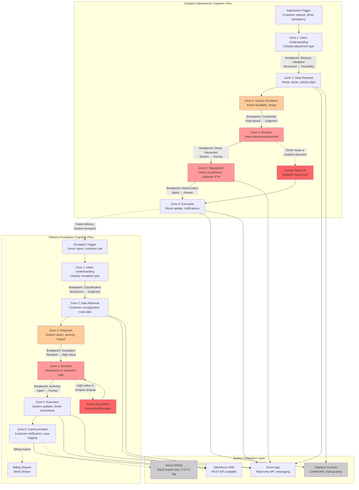

# Cognitive Load Map: Apex Distribution Customer Operations

## Table of Contents

1. [Executive Summary](#executive-summary)
2. [Work Stream Decomposition](#work-stream-decomposition)
   - [Dispatch Adjustments: Jobs to be Done](#dispatch-adjustments-jobs-to-be-done)
   - [Delivery Exceptions: Jobs to be Done](#delivery-exceptions-jobs-to-be-done)
3. [Cognitive Load Map: Micro-Task Analysis](#cognitive-load-map-micro-task-analysis)
   - [Dispatch Adjustments Micro-Tasks](#dispatch-adjustments-micro-tasks)
   - [Delivery Exceptions Micro-Tasks](#delivery-exceptions-micro-tasks)
4. [Process Topology Diagram](#process-topology-diagram)
5. [Lived Process Narrative](#lived-process-narrative)
6. [Key Findings and Recommendations](#key-findings-and-recommendations)

---

## Executive Summary

This cognitive load map analyzes two high-volume work streams within Apex Distribution's 35-person Customer Operations function:

**Dispatch Adjustments** (~90/day, 18 min avg) and **Delivery Exceptions** (~180/day, 12 min avg).

### Key Findings

1. **High Cognitive Hotspots**: Both work streams contain micro-tasks with HIGH cognitive load (tacit knowledge, real-time judgment, exception handling) that drive the 12-18 minute average handling times.

2. **System Integration Gaps**: Legacy dispatch console (Java/Citrix, limited API), batch-only billing system (24-48h lag), and driver app with incomplete data create significant data retrieval and reconciliation overhead.

3. **Lived Process vs. SOP**: The October 2023 SOP references retired systems and has incomplete sections. Real work relies on dispatcher discretion, informal knowledge networks, and manual overrides that bypass documented controls.

4. **Cross-Stream Dependencies**: ~25% of cases span multiple work streams (delivery exception → billing dispute → dispatch adjustment), requiring context handoffs and multi-system coordination [Ref: A012].

5. **Concentrated Expertise**: Senior dispatchers (including COO Sarah's former team) hold tacit knowledge essential for complex cases. Sandra appears across multiple artefacts handling high-value accounts with manual override authority [Ref: A002, A008].

### Delegation Implications

- **Dispatch Adjustments**: Human-led + Agent Support archetype. Real-time route optimization and driver messaging can be agent-assisted, but final dispatch decisions (especially driver swaps and complex diversions) require human judgment due to safety, driver welfare, and customer relationship factors.

- **Delivery Exceptions**: Mixed archetype by sub-type. Standard refused deliveries and damage reports can be Agent-led + Human Oversight, but complex multi-party disputes and high-value escalations remain Human-led + Agent Support.

### Critical Assumptions

15 assumptions documented in `assumptions.md`, with 5 at high confidence. **Critical path validation** required on:
- Dispatch console API write access (A004)
- Billing system integration feasibility (A007)
- Decision rules for refused deliveries (A005)

**Estimated cognitive work eliminated**: 35-50% of dispatch adjustments, 40-60% of delivery exceptions, contingent on API access and decision rule formalization.

---

## Work Stream Decomposition

### Dispatch Adjustments: Jobs to be Done

#### JtD-DA-1: Process Additional Pickup Request
- **Trigger**: Customer calls/emails requesting mid-route pickup
- **Actor**: Dispatch coordinator
- **Goal**: Add pickup to driver's route without violating delivery commitments or driver shift limits
- **Key Decisions**: 
  - Which driver/route has capacity?
  - Can pickup be completed within driver's remaining shift?
  - Does pickup weight/volume fit remaining vehicle capacity?
  - What is the latest acceptable pickup time?
- **Key Systems**: Dispatch console (route planning), driver app (GPS, current load), CRM (customer details)
- **Expected Output**: Route modification instruction to driver; updated ETA to affected customers
- **Nature**: Decision-making (60%), execution (40%)
- **Exception Scenarios**: No driver has capacity; pickup location off all routes; customer timing conflict

#### JtD-DA-2: Execute Route Diversion
- **Trigger**: Customer requests urgent delivery change; traffic/weather requires re-routing; priority customer escalation
- **Actor**: Dispatch coordinator
- **Goal**: Re-route driver to alternate destination while minimizing impact on other deliveries
- **Key Decisions**:
  - Does diversion cause downstream delivery delays?
  - Is driver aware of new address location?
  - Are affected customers notified of ETA changes?
  - Does diversion require customer service communication?
- **Key Systems**: Dispatch console, driver app, CRM, route optimization logic (implicit/manual)
- **Expected Output**: Updated route sent to driver app; ETA notifications to affected customers
- **Nature**: Decision-making (50%), execution (30%), communication (20%)
- **Exception Scenarios**: Diversion creates unacceptable delay; driver unreachable; customer refuses alternate timing

#### JtD-DA-3: Manage Driver Swap
- **Trigger**: Driver illness/emergency; vehicle breakdown; shift limit exceeded; driver refusal (safety/policy)
- **Actor**: Dispatch coordinator + dispatch supervisor (if emergency)
- **Goal**: Reassign route to available driver with minimal delay
- **Key Decisions**:
  - Which driver is available and qualified?
  - Where is the optimal handoff location?
  - What is the impact on both drivers' shift compliance?
  - Does this trigger overtime or contractor call-out?
  - Are customers with time-sensitive deliveries affected?
- **Key Systems**: Dispatch console, driver app, workforce management system, CRM
- **Expected Output**: Handoff instructions to both drivers; updated ETAs to customers; incident log entry
- **Nature**: Decision-making (70%), execution (20%), exception-handling (10%)
- **Exception Scenarios**: No available driver; vehicle/cargo handoff location inaccessible; customer escalation due to delay

### Delivery Exceptions: Jobs to be Done

#### JtD-DE-1: Resolve Refused Delivery
- **Trigger**: Driver reports recipient refused delivery (damaged goods, incorrect consignment, customer dispute)
- **Actor**: Dispatch coordinator (initial), customer service agent (follow-up), duty manager (high-value)
- **Goal**: Determine disposition of refused consignment: return, hold, re-attempt, or escalate
- **Key Decisions**:
  - What is the reason for refusal (damage, wrong item, policy, administrative)?
  - Is this a high-value consignment (>£500) requiring manager approval?
  - Does customer want replacement, refund, or re-delivery?
  - Does driver have time/capacity to hold or return?
  - Is there a billing/credit implication?
- **Key Systems**: Driver app (driver report), CRM (customer history), dispatch console (route impact), Salesforce (case creation)
- **Expected Output**: Disposition instruction to driver; customer communication; case logged in CRM
- **Nature**: Diagnosis (40%), decision-making (40%), communication (20%)
- **Exception Scenarios**: Customer unreachable; conflicting information from driver vs. customer; damage requires insurance claim; high-value escalation

#### JtD-DE-2: Handle Damaged Consignment Report
- **Trigger**: Driver or customer reports damaged goods on delivery
- **Actor**: Customer service agent (initial), supervisor (claims), finance (credit processing)
- **Goal**: Document damage, determine liability, initiate credit or insurance claim, prevent billing dispute
- **Key Decisions**:
  - Is damage visible/documented with photos?
  - Is damage due to transit (Apex liability) vs. packaging (customer/sender liability)?
  - Does damage severity require full or partial credit?
  - Is this a recurring issue with this sender/route?
  - Should goods be returned or disposed?
- **Key Systems**: Driver app (photos), CRM (case), Aurum billing (credit processing), dispatch console (return logistics)
- **Expected Output**: Damage report; credit approval/rejection; customer communication; return instruction (if applicable)
- **Nature**: Diagnosis (50%), decision-making (30%), documentation (20%)
- **Exception Scenarios**: Unclear liability; customer disputes damage assessment; billing system lag prevents immediate credit; insurance threshold triggered

#### JtD-DE-3: Investigate Missed Delivery Window
- **Trigger**: Customer calls/emails that delivery did not arrive within committed window
- **Actor**: Customer service agent (initial), dispatch coordinator (investigation)
- **Goal**: Validate delivery status, identify cause of delay, provide updated ETA or resolution
- **Key Decisions**:
  - What is the actual delivery status (out for delivery, delayed, failed attempt, lost)?
  - Was delay due to driver, route planning, traffic, or customer unavailability?
  - Should delivery be re-attempted today or rescheduled?
  - Is compensation/goodwill required?
  - Does this breach SLA with customer?
- **Key Systems**: Driver app (GPS, delivery status), dispatch console (route history), CRM (customer SLA)
- **Expected Output**: Status update to customer; re-delivery scheduled (if needed); root cause logged; escalation if SLA breach
- **Nature**: Diagnosis (60%), communication (25%), decision-making (15%)
- **Exception Scenarios**: Driver unreachable; GPS data stale/inaccurate; consignment lost; customer escalation to complaints

#### JtD-DE-4: Manage Unattended Address Exception
- **Trigger**: Driver arrives at delivery address but recipient unavailable (business closed, residential no answer)
- **Actor**: Dispatch coordinator (initial), customer service (follow-up)
- **Goal**: Determine next action: leave in safe place, leave with neighbor, return for re-delivery, or hold at depot
- **Key Decisions**:
  - Does customer have safe place/neighbor authority on file?
  - Is consignment eligible for unattended delivery (value, signature requirement)?
  - What is customer preference for re-delivery vs. depot pickup?
  - Does driver have capacity to return later on route?
- **Key Systems**: Driver app (delivery instructions), CRM (customer preferences), dispatch console (re-delivery routing)
- **Expected Output**: Instruction to driver (leave, return, re-attempt); customer notification (card left, SMS, email); re-delivery scheduling
- **Nature**: Decision-making (50%), execution (30%), communication (20%)
- **Exception Scenarios**: No safe place available; customer unreachable for re-delivery coordination; consignment time-sensitive (perishable); policy conflict (signature required but customer demands unattended)

---

## Cognitive Load Map: Micro-Task Analysis

### Dispatch Adjustments Micro-Tasks

| Micro-Task | Cognitive Load | Input Structure | Decision Determinism | Exception Frequency | Turn-Taking | Latency Constraint | Compliance/Risk | Tool/API Availability |
|------------|----------------|-----------------|----------------------|---------------------|-------------|--------------------|-----------------|-----------------------|
| **DA-1.1**: Validate pickup request details (location, time window, weight) | M | Semi-structured (phone/email) | M (validation rules exist but may need clarification) | M (15% require customer callback) | M (2-3 turns avg) | H (real-time response expected) | L (reversible) | H (CRM REST API) |
| **DA-1.2**: Identify candidate drivers with route proximity | M | Structured (GPS data) | H (rule-based: distance + capacity) | L (data usually available) | L (system query) | H (seconds) | L | M (driver app API read-only) [Ref: A003] |
| **DA-1.3**: Calculate route impact and time feasibility | H | Structured (route data) | M (requires route optimization logic) | M (traffic, driver pace unpredictable) | L | H | M (affects delivery SLAs) | L (dispatch console limited API) [Ref: A004] |
| **DA-1.4**: Assess vehicle capacity for additional load | M | Structured (vehicle manifest) | H (weight/volume calculation) | L | L | M | M (overload = safety issue) | M (driver app provides partial data) |
| **DA-1.5**: Select optimal driver and confirm acceptance | H | Semi-structured (driver response) | L (requires judgment on driver capability, fatigue, relationship) | H (driver may refuse or negotiate) | H (driver conversation required) | H | H (driver welfare, hours compliance) | M (messaging via app, but calls common) [Ref: A014] |
| **DA-1.6**: Update route in dispatch console | L | Structured (system input) | H (data entry) | L | L | M | M (audit trail required) | L (manual entry via Citrix) [Ref: A004] |
| **DA-1.7**: Notify driver via app with new pickup instructions | L | Structured (message template) | H (standard notification) | L | L | H | L | H (driver app messaging API) |
| **DA-1.8**: Update affected customer ETAs in CRM | M | Structured (ETA data) | M (ETA calculation may be manual) | M (customer may need call if high-value) | M | M | M (customer expectation management) | H (CRM API) |
| **DA-2.1**: Receive and validate diversion request | M | Semi-structured (customer call/email) | M | M | M (may need clarification) | H | L | H (CRM) |
| **DA-2.2**: Assess impact on remaining route deliveries | H | Structured (route data) | M (requires judgment on delay tolerance) | M (customer priority levels vary) | L | H | H (SLA breach risk) | L (manual route analysis) [Ref: A004] |
| **DA-2.3**: Confirm driver awareness of new location | M | Semi-structured (driver response) | H | M (driver may be unfamiliar with area) | M | H | M (wrong address = failed delivery) | M (driver app messaging) |
| **DA-2.4**: Execute route update in dispatch console | L | Structured | H | L | L | M | M | L (manual) [Ref: A004] |
| **DA-2.5**: Trigger ETA notifications to affected customers | M | Structured | M (may need custom messaging for priority customers) | M | M (high-value customers may call) | M | M | H (CRM automation) |
| **DA-3.1**: Receive driver unavailability report (illness, breakdown) | L | Semi-structured (call/message) | H | M (details may be incomplete) | M | H | H (time-critical) | M |
| **DA-3.2**: Identify available replacement drivers | H | Structured (workforce system) | M (requires judgment on driver qualifications, hours, location) | H (limited pool, especially short notice) | M | H | H (hours compliance, safety) | M (workforce system API may not exist) [Ref: A002] |
| **DA-3.3**: Determine optimal handoff location and time | H | Structured (GPS, route data) | L (judgment-heavy: driver convenience, customer impact, security) | M | M | H | H (handoff location safety, cargo security) | L (manual judgment) |
| **DA-3.4**: Negotiate with drivers on handoff logistics | H | Unstructured (driver conversation) | L (relationship-dependent, requires persuasion) | H (drivers may resist due to fatigue, location) | H (multi-turn negotiation) | H | H (driver welfare, union rules) | L (phone calls) [Ref: A014] |
| **DA-3.5**: Authorize overtime or contractor call-out if needed | H | Semi-structured (workforce system + approval) | L (cost vs. SLA tradeoff, requires manager judgment) | M | M (manager approval) | M | H (budget, compliance) | M (approval workflow may be manual) |
| **DA-3.6**: Update both driver routes and communicate handoff | M | Structured | M | M | M | H | M | L (manual dispatch console update) [Ref: A004] |
| **DA-3.7**: Document incident and log shift adjustments | L | Structured | H | L | L | L | H (audit, compliance) | M (CRM/incident system) |

### Delivery Exceptions Micro-Tasks

| Micro-Task | Cognitive Load | Input Structure | Decision Determinism | Exception Frequency | Turn-Taking | Latency Constraint | Compliance/Risk | Tool/API Availability |
|------------|----------------|-----------------|----------------------|---------------------|-------------|--------------------|-----------------|-----------------------|
| **DE-1.1**: Receive refused delivery report from driver | L | Semi-structured (driver call/app message) | H | M (driver may omit key details) | M | H | L | M (driver app API) |
| **DE-1.2**: Classify refusal reason (damage, incorrect, dispute, admin) | M | Unstructured (driver narrative, customer claim) | M (requires interpretation) | H (conflicting accounts common) | H (may need callback to driver and customer) | M | M (affects downstream process) | L (manual classification) |
| **DE-1.3**: Retrieve customer account and delivery history | L | Structured (CRM lookup) | H | L | L | M | L | H (CRM API) |
| **DE-1.4**: Determine if high-value escalation threshold met | L | Structured (consignment value) | H (>£500 rule) | L | L | M | H (manager oversight required) | M (consignment data may be in multiple systems) |
| **DE-1.5**: Assess driver route impact (time, capacity for return) | M | Structured (GPS, route plan) | M | M | L | H | M (affects other deliveries) | L (dispatch console) [Ref: A004] |
| **DE-1.6**: Decide disposition (return, hold, re-attempt) | H | Semi-structured | L (judgment-dependent: customer priority, refusal reason, driver capacity) | H (edge cases frequent) | M | H | H (wrong decision = escalation or loss) | L (human judgment) [Ref: A005] |
| **DE-1.7**: Communicate decision to driver via app | L | Structured (instruction message) | H | L | L | H | M | H (driver app messaging) |
| **DE-1.8**: Create case in CRM and log refusal details | L | Structured (form entry) | H | L | L | L | M (audit trail) | H (CRM API) |
| **DE-1.9**: Initiate customer follow-up (call/email) | M | Semi-structured (customer communication) | M | M (customer may be upset) | H (multi-turn conversation) | M | M (reputation risk) | H (CRM email/call integration) |
| **DE-1.10**: Coordinate billing adjustment if applicable | M | Semi-structured (credit request) | M (credit policy may be ambiguous) | M | M (finance approval) | L (24-48h batch window) | H (audit, compliance) | L (Aurum batch only) [Ref: A007] |
| **DE-2.1**: Receive damage report (driver or customer) | L | Semi-structured (report + photos) | H | M (photos may be poor quality) | M | M | L | M (driver app photo upload) |
| **DE-2.2**: Assess damage severity and liability | H | Unstructured (visual assessment, narrative) | L (requires judgment: transit vs. packaging fault) | H (frequent ambiguity) | H (may need driver, customer, sender input) | M | H (financial liability, insurance) | L (manual assessment) |
| **DE-2.3**: Retrieve consignment and sender details | L | Structured | H | L | L | M | L | M (CRM, dispatch system) |
| **DE-2.4**: Determine credit amount (full, partial, none) | H | Semi-structured | L (policy exists but judgment-heavy) | M | M (supervisor approval for high amounts) | M | H (financial impact, customer satisfaction) | L (manual) [Ref: A008] |
| **DE-2.5**: Check for recurring damage patterns (sender, route) | M | Structured (historical data) | M | M (data may be fragmented) | L | L | M (quality improvement opportunity) | M (CRM analytics, but may be manual) |
| **DE-2.6**: Initiate credit in Aurum billing system | M | Structured (credit entry) | H | M (Aurum ticket required for non-standard) | M (48h turnaround) | L (batch process) | H (audit, compliance) | L (batch export, manual ticket) [Ref: A007] |
| **DE-2.7**: Communicate resolution to customer | M | Semi-structured | M | M | M | M | M | H (CRM) |
| **DE-2.8**: Coordinate return logistics if needed | M | Structured | M | M (driver availability) | M | M | M (cost of return) | L (dispatch console) [Ref: A004] |
| **DE-3.1**: Receive missed window inquiry from customer | L | Semi-structured (call/email) | H | M | M | H | L | H (CRM) |
| **DE-3.2**: Look up delivery status in driver app and dispatch system | L | Structured | H | M (data may be stale) | L | H | L | M (driver app API read-only) [Ref: A003, A010] |
| **DE-3.3**: Retrieve GPS history and route plan | M | Structured | H | M (GPS lag, driver may be offline) | L | H | L | M (driver app API) [Ref: A010] |
| **DE-3.4**: Diagnose delay cause (traffic, driver pace, failed attempt) | M | Semi-structured (data + judgment) | M | H (root cause often unclear) | M (may need driver contact) | H | M | L (manual analysis) |
| **DE-3.5**: Calculate revised ETA or confirm failure | M | Structured (GPS + route knowledge) | M (requires tacit knowledge of route timing) | M | M (dispatch consultation) | H | M (customer expectation) | L (manual calculation) [Ref: A010] |
| **DE-3.6**: Communicate updated ETA to customer | M | Semi-structured | M (may need to manage upset customer) | M | M | H | M (reputation) | H (CRM) |
| **DE-3.7**: Schedule re-delivery if delivery failed | M | Structured (scheduling system) | M | M (customer availability) | M | M | M | M (CRM + dispatch console) |
| **DE-3.8**: Escalate if SLA breach or high-value customer | M | Semi-structured | M (SLA rules + customer tier) | M | M (manager approval) | M | H (contract penalty) | M (CRM escalation workflow) [Ref: A009] |
| **DE-4.1**: Receive unattended address report from driver | L | Semi-structured (driver app) | H | L | M | H | L | M (driver app) |
| **DE-4.2**: Check customer file for safe place/neighbor authority | L | Structured (CRM lookup) | H | M (data may be missing) | L | H | M (theft risk if wrong decision) | H (CRM API) |
| **DE-4.3**: Verify consignment eligibility for unattended delivery | M | Structured (value, signature requirement) | H | L | L | H | H (high-value items must have signature) | M (consignment data) |
| **DE-4.4**: Decide action (leave safe place, return, re-attempt) | M | Semi-structured | M (rule-based but judgment required) | M | M (may need customer contact) | H | H (theft, loss liability) | L (manual) |
| **DE-4.5**: Instruct driver via app | L | Structured | H | L | L | H | M | H (driver app) |
| **DE-4.6**: Notify customer of delivery attempt and next steps | M | Semi-structured (SMS, email) | H | M (customer may call back) | M | M | M | H (CRM automation) |
| **DE-4.7**: Schedule re-delivery or depot pickup | M | Structured | M | M (customer availability) | M | M | M | M (CRM + dispatch) |

---

## Process Topology Diagram

### Cognitive Breakpoints (High-Value Agent Opportunities)

| Breakpoint ID | Location | Type | Current State | Agent Opportunity | Constraint |
|---------------|----------|------|---------------|-------------------|------------|
| **BP-1** | DE: Intent → Retrieval | Classification | Human interprets driver/customer narrative | Agent classifies exception type from unstructured input | Requires training on historical classification patterns [Ref: A006] |
| **BP-2** | DE: Diagnosis → Decision | Escalation | Human applies >£500 threshold + customer tier | Agent applies formal rules + ML-based customer priority scoring | Needs customer tier formalization [Ref: A009] |
| **BP-3** | DE: Decision → Execution | Authority | Human judgment on disposition (return/hold/re-attempt) | Agent recommends disposition based on decision tree, human approves high-risk | Decision rules must be codified [Ref: A005] |
| **BP-4** | DA: Request → Feasibility | Validation | Human validates pickup details, often requires callback | Agent validates structured fields, flags ambiguity for human | CRM data quality dependency [Ref: A013] |
| **BP-5** | DA: Simulation → Decision | Complexity | Human manually assesses route impact using dispatch console | Agent uses route optimization API to calculate impact, present options | Requires dispatch console API or separate optimization engine [Ref: A004] |
| **BP-6** | DA: Decision → Negotiation | Driver Interaction | Human calls driver to confirm/negotiate | Agent sends structured proposal via app, escalates if driver declines | Driver preference for voice may limit full automation [Ref: A014] |
| **BP-7** | DE: Decision → Billing | System Lag | Human initiates credit via Aurum manual ticket (48h) | Agent queues credit request in workflow, tracks to completion | Limited by Aurum batch architecture [Ref: A007] |

---

## Lived Process Narrative

### What Really Happens vs. What the SOP Says

**The SOP's Promise**: The October 2023 "Exception Handling SOP v2.3" describes a clean, sequential process. When a driver encounters a refused delivery, they note the reason on the "DispatchHub" tablet, confirm disposition with DispatchHub, and escalate high-value consignments to the Duty Manager via the dispatch console. Damaged consignments follow a structured protocol documented in Section 4.3. Unattended addresses are handled per Section 7.

**The Reality**: DispatchHub was retired in October 2024, a year after the SOP was last updated. Section 4.3 on damaged consignments is incomplete ("TBD pending review of insurance protocol"). Section 7 on unattended addresses is referenced but provides no actual guidance.

When driver Mark Petrov calls dispatch about a refused delivery at the Stein-Allen account (Artefact 1), he doesn't use an app workflow—he leaves a voicemail because "Sandra's line was busy." He's asking for human judgment: the warehouse guy says the pallet is damaged, but Mark thinks it's fine. The SOP says to escalate if >£500, but Mark doesn't know the consignment value, and he's got six more drops waiting. The SOP doesn't cover this: the lived process does.

Sandra—who appears in the billing dispute thread, the refused delivery case, and three times in the disputes export—is the institutional memory. When Hayes & Sons disputes a fuel surcharge on a damaged delivery (Artefact 2), the billing system sends them to Customer Ops. The customer calls, waits 22 minutes, gets cut off, and escalates. Sandra eventually applies a £170 goodwill credit "via a manual override" that has "no entry in the credits audit log." This isn't in the SOP. This is how work gets done when the customer is on their second complaint this quarter and the Aurum billing system can't adjust a surcharge without a 48-hour ticket.

When a customer asks "where is my delivery?" (Artefact 3), the agent checks the driver app, sees GPS data from 10:48, and says "best guess is 14:00–15:00." The customer wants specificity; the agent can't provide it. The agent has to "check with dispatch" because the system shows a 4-hour ETA window, and actual ETA requires tacit knowledge: Which drop is the driver on? How long do they usually take at commercial vs. residential? Is traffic heavier than usual today? The SOP doesn't document this. Senior dispatchers know it. New hires don't.

The cognitive work lives in the gap between what the SOP prescribes and what the systems support:

- **Data fragmentation**: Customer records in Salesforce, delivery status in the driver app, billing disputes in Aurum exports that lag 24-48 hours, route planning in a Citrix-deployed Java console with "limited API surface." To resolve a refused delivery that might trigger a billing dispute, Sandra needs four systems and a phone call.

- **Implicit decision rules**: The SOP says escalate if >£500. It doesn't say: escalate if it's Hayes & Sons (high-value account), escalate if Sandra is busy and the customer is upset, escalate if it's the second dispute this month. These rules are in Sandra's head and in Sarah Whitmore's (the COO, formerly dispatch lead for 5 years). They're not in the system.

- **Turn-taking friction**: Dispatch adjustments average 18 minutes not because the decision is hard, but because the coordinator has to call the driver (who may not answer), update the dispatch console manually, check if the customer needs a callback, and notify affected deliveries. Seven micro-tasks, four system interactions, two human conversations. The SOP describes the decision. It doesn't describe the choreography.

- **Shadow processes**: Sandra applies credits "via manual override" outside the audit trail. Dispatchers negotiate driver swaps based on relationships and implicit knowledge of who will accept short-notice reassignments. Customer priority isn't in the CRM; it's in the fact that Hayes & Sons always gets Sandra. These workarounds exist because the systems and SOPs don't accommodate the variability and judgment required by real operations.

**The agentic opportunity**: Agents thrive in this gap. They can query four systems in parallel in 2 seconds. They can apply formal decision rules ("if customer_disputes > 1 AND account_tier == 'high' → escalate to Sandra"). They can draft the driver message, the customer email, and the CRM case note simultaneously. They can learn from Sandra's 200 goodwill credit decisions and suggest the credit amount with confidence scoring.

But agents can't replace the judgment that isn't yet codified, the relationships that govern driver negotiations, or the institutional knowledge that distinguishes "pallet looks damaged" from "pallet is actually damaged." That's why the delegation archetype for these work streams isn't "fully agentic"—it's Human-led + Agent Support for complex cases, and Agent-led + Human Oversight for standard cases.

The lived process narrative reveals the true cognitive load: it's not the 12-minute average handling time, it's the 7 minutes of system-hopping, the 3 minutes of waiting for a driver callback, the 2 minutes of judgment that could be supported (but not replaced) by an agent that has learned from Sandra's 400 cases this quarter.

**What the SOP doesn't capture**: The cost of Sarah Whitmore's 5 years of dispatch expertise being locked in her head and Sandra's. The brittleness of a team that relies on a few senior people to handle the complex cases while newer agents struggle with 22-minute hold times. The fact that "dispatcher discretion drives most decisions" (scenario text) means delegation is feasible—if the discretion can be made explicit, scored, and supervised.

The SOP is a map of an imaginary organization. The lived process is the territory where the cognitive load actually lives. Agents must be built for the territory.

---

## Key Findings and Recommendations

### Cognitive Load Concentration

**Finding**: ~25% of micro-tasks across both work streams scored HIGH on cognitive load dimensions, driven by:
- Tacit knowledge requirements (route timing, customer priority, driver capability) [Ref: A002, A009]
- Judgment-dependent decisions with ambiguous inputs (damage liability, refusal reasoning) [Ref: A005]
- Real-time negotiation and relationship management (driver acceptance, upset customers) [Ref: A014]

**Recommendation**: Target the 50-60% of tasks scored MEDIUM/LOW for initial agent delegation. High-scoring tasks become Agent Support (recommendations) rather than Agent-led (autonomous).

### System Integration Constraints

**Finding**: Critical systems impose hard constraints on agent autonomy:
- Dispatch console: limited/no API for route updates → HITL required for execution [Ref: A004]
- Aurum billing: 24-48h batch lag → agents work with stale data, cannot validate credits in real-time [Ref: A007]
- Driver app: read-only API assumed → agents can message but not modify route/task assignments [Ref: A003]

**Recommendation**: 
1. **Phase 1**: Agent-led on CRM-centric tasks (case logging, customer communication, data retrieval). Human-led on dispatch console and billing tasks.
2. **Phase 2**: Build dispatch console API wrapper or separate route optimization service to enable agent-driven route suggestions.
3. **Phase 3**: Negotiate Aurum API access or implement real-time credit workflow outside Aurum with batch reconciliation.

### Decision Rule Formalization Gap

**Finding**: Core decisions rely on implicit rules not documented in SOP:
- Refused delivery disposition logic [Ref: A005]
- Customer priority/tier system (Hayes & Sons pattern) [Ref: A009]
- Damage liability assessment criteria
- Driver selection for swaps (capability, willingness, location) [Ref: A002]

**Recommendation**: Before agent build, conduct structured elicitation:
- Shadow Sandra and senior dispatchers on 20+ cases per work stream
- Use discovery questioning patterns to extract decision trees
- Validate rules with Sarah Whitmore (COO, former dispatch lead)
- Codify into agent policy rules with confidence scoring

### Cross-Work-Stream Orchestration

**Finding**: ~25% of cases span multiple work streams (delivery exception → billing dispute → dispatch adjustment) [Ref: A012]. Current process relies on manual case notes and agent memory to maintain context across handoffs.

**Recommendation**: Agent orchestration layer must:
- Maintain shared case context across work streams
- Trigger downstream workflows automatically (refused delivery → credit initiation)
- Surface cross-stream history to agents (e.g., "this customer has 3 open disputes")
- Implement handoff protocols with explicit state transfer

### Knowledge Concentration Risk

**Finding**: Sandra and other senior agents appear to hold disproportionate share of complex case handling, manual override authority, and customer relationship knowledge [Ref: A002, A008].

**Recommendation**:
1. **Immediate**: Record Sandra's decisions (disposition, credit amounts, escalations) to build training dataset for agent
2. **Phase 1**: Use agent to surface Sandra's historical decisions as recommendations to other agents, reducing knowledge bottleneck
3. **Phase 2**: Formalize manual override authority with approval workflows and audit trails to replace shadow processes

### Volume-Based Prioritization

**Finding**: Combined work streams represent ~270 cases/day, ~3,300 human-minutes/day (55 hours). At 35-50% cognitive work elimination potential:
- **Best case**: 27.5 hours/day saved = 3.4 FTE equivalent at £35K salary = ~£120K annual labour cost reduction
- **Conservative case**: 19 hours/day saved = 2.4 FTE equivalent = ~£84K annual labour cost reduction

**Caveat**: Assumes API access to dispatch console and decision rule formalization. Without these, savings drop to 15-20% (CRM automation only).

**Recommendation**: Prioritize Delivery Exceptions (higher volume, better system access) for Phase 1 pilot. Dispatch Adjustments follow in Phase 2 after dispatch console API is addressed.

### Compliance and Audit Trail

**Finding**: Manual overrides bypass audit controls (Sandra's £170 credit) [Ref: A008]. Agent delegation without audit trails increases risk.

**Recommendation**: 
- All agent actions must generate audit logs (decision rationale, data sources, confidence scores)
- Manual overrides must be explicitly flagged and require supervisor approval
- Regular audit reviews of agent decisions vs. human override patterns to detect drift

### Next Steps to Phase 3 (Delegation Qualification)

1. **Validate critical assumptions**: A004 (dispatch console API), A005 (refusal decision rules), A007 (billing integration), A009 (customer tier system)
2. **Conduct decision rule elicitation**: 20+ case shadowing sessions with Sandra and dispatch team
3. **Technical discovery**: API documentation review, schema stability assessment [Ref: A015]
4. **Score micro-tasks**: Map each task to delegation archetype based on Phase 3 suitability matrix
5. **Prioritize candidates**: Volume × non-determinism grid, feasibility scoring

---

## Document Control

- **Created**: 2026-05-06
- **Version**: 1.0
- **Owner**: AI FDE Team
- **Related Documents**: 
  - `assumptions.md` - All assumptions referenced with [Ref: A###]
  - `scenario` - Source scenario and artefacts
  - `input-docs/atx-assessment.md` - Phase 2 methodology
  - `input-docs/atx-concepts.md` - Cognitive work concepts
- **Next Phase**: Delegation Qualification (Phase 3)
