# Cognitive Work Assessment and Delegation Analysis
## Helix Therapeutics — Agentic Adverse Event Triage System

**Document Version**: 2.0  
**Date**: 2026-06-01  
**Project**: Agentic Adverse Event Triage System  
**Owner**: FDE Engagement Lead

---

## Table of Contents

### 1. Cognitive Load
- [Executive Summary](#cognitive-load-executive-summary)
- [Work Stream Decomposition: Jobs to be Done](#work-stream-decomposition-jobs-to-be-done)
  - [ADR-1: Intake, Extract, and Normalize AE Data](#adr-1-job-intake-extract-and-normalize-ae-data)
  - [ADR-2: Medical Triage — Seriousness, Expectedness, and Reportability](#adr-2-job-medical-triage--seriousness-expectedness-and-reportability)
- [Cognitive Load Map: Micro-Task Inventory](#cognitive-load-map-micro-task-inventory)
- [Process Topology Diagram](#process-topology-diagram)
- [Lived Process Narrative](#lived-process-narrative)
  - [What the SOP Says](#what-the-sop-says)
  - [What Actually Happens](#what-actually-happens)
- [Cognitive Hotspots and Breakpoints](#cognitive-hotspots-and-breakpoints)
  - [Cognitive Hotspots](#cognitive-hotspots-high-effort-high-value-delegation-targets)
  - [Critical Breakpoints](#critical-breakpoints-where-control-must-shift)
- [Cognitive Load Assumptions Register](#cognitive-load-assumptions-register)

### 2. Delegation Analysis
- [Executive Summary](#delegation-analysis-executive-summary)
- [Delegation Suitability Methodology](#delegation-suitability-methodology)
- [ADR-1: Intake, Extract, and Normalize AE Data](#adr-1-delegation-intake-extract-and-normalize-ae-data)
  - [Cognitive Work Summary](#adr-1-cognitive-work-summary)
  - [Delegation Suitability Scoring](#adr-1-delegation-suitability-scoring)
  - [Delegation Archetype Assignment](#adr-1-delegation-archetype-assignment)
  - [Trade-offs](#adr-1-trade-offs)
- [ADR-2: Medical Triage — Seriousness, Expectedness, and Reportability](#adr-2-delegation-medical-triage--seriousness-expectedness-and-reportability)
  - [Cognitive Work Summary](#adr-2-cognitive-work-summary)
  - [Delegation Suitability Scoring](#adr-2-delegation-suitability-scoring)
  - [Delegation Archetype Assignment](#adr-2-delegation-archetype-assignment)
  - [Trade-offs](#adr-2-trade-offs)
- [Delegation Suitability Matrix](#delegation-suitability-matrix)
- [Cross-ADR Integration and Handoffs](#cross-adr-integration-and-handoffs)
  - [End-to-End Pipeline Flow](#end-to-end-pipeline-flow)
  - [Handoff Points](#handoff-points)
  - [Time Reduction Modeling](#time-reduction-modeling)
- [Delegation Analysis Assumptions Register](#delegation-analysis-assumptions-register)

---

# Part 1: Cognitive Load

<a name="cognitive-load-executive-summary"></a>
## Executive Summary

The adverse event (AE) triage process at Helix Therapeutics consumes **7,500 annual hours** (3.6 FTE equivalent) processing 6,000 AE reports across three marketed products. Per-case processing time averages **75 minutes**, with the majority (60 minutes) spent on routine cognitive synthesis work: data extraction from heterogeneous formats, seriousness classification per ICH E2A criteria, expectedness assessment against Reference Safety Information, and reportability determination logic.

This cognitive load map decomposes the AE triage process into **two primary Jobs to be Done** and **28 micro-tasks** across three cognitive zones: Intake & Data Extraction, Medical Triage (Seriousness, Expectedness, Reportability), and MSO Review & Sign-Off.

**Key findings:**
- **47% of processing time** (35 min) is spent on data extraction and normalization from heterogeneous sources — the highest-impact delegation target [A1]
- **Three critical breakpoints** exist where control shifts from rule-based synthesis to medical judgment: (1) seriousness classification, (2) causality assessment, (3) final reportability decision
- **8% compliance failures** (92% baseline vs. 99.5% target) are driven primarily by queue delay (50%), extraction complexity (30%), and reporter follow-up cycles (20%) [A7]
- **Audit trail generation** is 0% automated today, creating compliance risk in FDA inspection scenarios

The process exhibits **high delegation suitability** for intake and data extraction (ADR-1), **moderate suitability** for medical triage recommendations (ADR-2), and **human-only** requirements for final reportability sign-off and medical assessment authoring.

---

## Work Stream Decomposition: Jobs to be Done

The AE triage process decomposes into two primary Architecture Decision Records (ADRs), each representing a cognitive contract between actor and outcome.

<a name="adr-1-job-intake-extract-and-normalize-ae-data"></a>
### ADR-1: Intake, Extract, and Normalize AE Data

**Trigger**: AE report received via any channel (HCP text report, patient web form, phone transcript, social media monitoring extract, clinical trial site report, literature alert)

**Actor**: Case processing specialist (today); Intake & Extraction Agent (proposed)

**Goal**: Receive AE report, classify format, route appropriately, extract all structured data elements per ICH E2D, and anchor 15-day clock timestamp

**Key Decisions**:
- Is this an AE report or a mis-routed quality complaint / medical device complaint?
- Is this a duplicate of an existing case?
- Is this an in-scope marketed product (Solivian, Tezarimab, Phaedora) or out-of-scope (clinical trial, device)?
- Does this report contain sufficient minimum information to create a case?
- Which text spans in the source report correspond to which structured fields?
- How to normalize non-standard drug names, dose units, and medical terminology?
- How to parse temporal relationships (drug start date, AE onset date, outcome date)?

**Key Systems**:
- AE intake queue (email, web form API, social media monitoring API, literature alert feed)
- Text parsing pipeline for heterogeneous formats (text, JSON, VTT)
- Drug nomenclature APIs (RxNorm, WHO Drug Dictionary)
- MedDRA terminology API (for AE term coding)
- PV case management system (record creation, duplicate detection, structured data write)

**Expected Output**: Structured `AECasePackage` entity with:
- Case record (unique case ID, `received_at` timestamp, format classification, routing decision)
- Extracted structured data (patient demographics, suspect drug + dose + indication, AE description + onset + outcome, concomitant medications, medical history)
- Per-field confidence scores
- Span-level citations to source report
- Flagged missing fields requiring follow-up

**Current Cognitive Load**: Medium to High — consumes 40-45 of 75 minutes (53-60%) per [A1]. Requires:
- Format classification and duplicate detection (rule-based)
- Pattern recognition across heterogeneous text formats
- Medical terminology normalization
- Temporal relationship disambiguation
- Handling of incomplete, ambiguous, or contradictory information

**Delegation Archetype**: Fully Agentic with confidence-based HITL (any required field confidence < 0.85 → human re-key)

---

<a name="adr-2-job-medical-triage--seriousness-expectedness-and-reportability"></a>
### ADR-2: Medical Triage — Seriousness, Expectedness, and Reportability

**Trigger**: Structured AE data extraction complete (ADR-1 output)

**Actor**: Medical safety officer (today); Medical Triage Agent (proposed)

**Goal**: Classify seriousness per ICH E2A criteria, assess expectedness against product RSI, recommend reportability per FDA 21 CFR 314.80 and multi-jurisdictional rules, and generate audit trail

**Key Decisions**:
- **Seriousness**: Does the AE meet ICH E2A criteria (death, life-threatening, hospitalization, disability, congenital anomaly, other medically important)?
- **Expectedness**: Does the reported AE term match any term in the product RSI/CCSI? Is it a synonym, narrower, or broader term per MedDRA hierarchy?
- **Reportability**: Does this case meet FDA 21 CFR 314.80 criteria for 15-day expedited reporting (serious + unexpected)? Multi-jurisdictional requirements (EMA, MHRA, PMDA)?
- **Causality**: How to account for causality assessment in reportability determination?

**Key Systems**:
- PV case management system (read AE narrative, outcome, extracted data from ADR-1)
- ICH E2A criteria reference (codified rule set)
- Product RSI/CCSI database (Solivian, Tezarimab, Phaedora safety profiles)
- MedDRA hierarchy API (for term relationship lookups)
- Reportability rules engine (FDA, EMA, MHRA, PMDA regulations)
- Audit trail store (citations, reasoning, timestamps)

**Expected Output**: Structured `TriageRecommendation` entity with:
- `SeriousnessClassification` (serious/non-serious, matched criteria, reasoning + citations, confidence score)
- `ExpectednessSignal` (expected/unexpected, matched RSI term, reasoning + citations, confidence score)
- `ReportabilityRecommendation` (15-day expedited / periodic / non-reportable, rule-based justification, confidence score)
- Span-level citations to source report and regulatory criteria
- CoT reasoning for each classification step
- Machine-generated audit trail for FDA inspection

**Current Cognitive Load**: High — consumes 30-35 of 75 minutes (40-47%) per [A1]. Requires:
- Rule-based seriousness classification with medical judgment for ambiguous cases ("other medically important")
- Term matching with MedDRA hierarchy reasoning for expectedness
- Multi-jurisdictional regulatory knowledge for reportability
- Clinical judgment for causality-influenced edge cases
- Legal/compliance reasoning for defensibility

**Delegation Archetype**: Agent-led + MSO Sign-Off (Medical safety officer reviews all recommendations and makes final reportability decision; agent provides synthesis and recommendation)

---

## Cognitive Load Map: Micro-Task Inventory

The table below decomposes the five JtDs into 28 micro-tasks, scored across eight cognitive load dimensions. Scoring: **H**igh, **M**edium, **L**ow.

| Zone | Micro-Task | Cog. Load | Input Struct. | Decision Determ. | Exception Freq. | Turn-Taking | Latency Constraint | Compliance Risk | Tool/API Avail. | ADR |
|------|-----------|-----------|---------------|------------------|-----------------|-------------|--------------------|-----------------|--------------------|-----|
| **Intake & Routing** | 1.1 Receive report from channel | L | M | H | L | L | M | M | H | ADR-1 |
| | 1.2 Classify report format | L | L | H | L | L | L | L | H | ADR-1 |
| | 1.3 Validate minimum required info | M | M | M | M | L | M | H | H | ADR-1 |
| | 1.4 Detect duplicate case | M | H | H | M | L | M | M | M | ADR-1 |
| | 1.5 Route to scope determination | L | H | H | M | L | L | M | H | ADR-1 |
| | 1.6 Anchor 15-day clock timestamp | L | H | H | L | L | H | H | H | ADR-1 |
| **Data Extraction & Normalization** | 2.1 Parse text from HCP report files | L | M | M | L | L | M | M | H | ADR-1 |
| | 2.2 Extract patient demographics | M | L | M | M | L | M | H | M | ADR-1 |
| | 2.3 Extract suspect drug name + dose | M | L | M | M | L | M | H | M | ADR-1 |
| | 2.4 Extract AE description narrative | H | L | L | H | L | M | H | M | ADR-1 |
| | 2.5 Extract temporal relationships | H | L | L | H | L | M | H | M | ADR-1 |
| | 2.6 Extract concomitant medications | M | L | M | M | L | M | M | M | ADR-1 |
| | 2.7 Extract medical history | M | L | M | M | L | M | M | M | ADR-1 |
| | 2.8 Normalize drug names to standard nomenclature | M | M | M | M | L | L | M | H | ADR-1 |
| | 2.9 Code AE terms to MedDRA | M | M | M | M | L | L | M | H | ADR-1 |
| | 2.10 Generate per-field confidence scores | M | H | M | L | L | L | H | M | ADR-1 |
| | 2.11 Flag missing required fields for follow-up | M | H | M | M | L | M | M | H | ADR-1 |
| **Medical Triage** | 3.1 Match AE description to ICH E2A death criterion | M | M | H | L | L | M | H | H | ADR-2 |
| | 3.2 Match AE description to life-threatening criterion | H | M | M | M | L | M | H | H | ADR-2 |
| | 3.3 Match AE description to hospitalization criterion | M | M | M | M | L | M | H | H | ADR-2 |
| | 3.4 Match AE description to disability criterion | H | M | M | H | L | M | H | H | ADR-2 |
| | 3.5 Match AE description to congenital anomaly criterion | M | H | H | L | L | M | H | H | ADR-2 |
| | 3.6 Match AE description to "other medically important" criterion | H | M | L | H | L | M | H | M | ADR-2 |
| | 3.7 Generate seriousness reasoning with citations | M | H | M | L | L | L | H | M | ADR-2 |
| | 4.1 Retrieve product RSI/CCSI for suspect drug | L | H | H | L | L | L | M | M | ADR-2 |
| | 4.2 Match AE term to RSI-listed terms (exact + hierarchy) | M | M | M | M | L | M | M | M | ADR-2 |
| | 4.3 Handle term specificity variance | H | M | L | H | L | M | M | M | ADR-2 |
| | 4.4 Generate expectedness signal with citations | M | H | M | L | L | L | H | M | ADR-2 |
| | 5.1 Apply FDA 21 CFR 314.80 logic (serious + unexpected → 15-day) | M | H | H | M | L | L | H | H | ADR-2 |
| | 5.2 Apply multi-jurisdictional reportability rules | H | M | M | H | L | M | H | M | ADR-2 |
| | 5.3 Account for causality assessment influence | H | M | L | H | M | M | H | L | ADR-2 |
| | 5.4 Generate reportability recommendation with rule justification | M | H | M | M | L | L | H | M | ADR-2 |
| | 5.5 Generate span-level audit trail for FDA inspection | M | H | H | L | L | L | H | M | ADR-2 |

**Legend**:
- **Cog. Load**: Cognitive Load — reasoning, tacit knowledge, disambiguation required
- **Input Struct.**: Input Structure — structured (H=high tool availability), semi-structured (M), unstructured (L)
- **Decision Determ.**: Decision Determinism — predictable (H), judgment-dependent (L)
- **Exception Freq.**: Exception Frequency — rare (L), frequent (H)
- **Turn-Taking**: Turn-Taking Degree — minimal back-and-forth (L), high interaction (H)
- **Latency Constraint**: Real-time required (H), batch acceptable (L)
- **Compliance Risk**: Cost of error — low (L), high/regulated (H)
- **Tool/API Avail.**: Tool/API Availability — available/buildable (H), inaccessible (L)

**Key Observations**:
- **Highest cognitive load micro-tasks**: 2.4 (AE description extraction), 2.5 (temporal relationships), 3.4 (disability classification), 3.6 (other medically important), 4.3 (term specificity variance), 5.2 (multi-jurisdictional rules), 5.3 (causality influence)
- **Highest delegation suitability** (H Input Struct., H Decision Determ., H Tool Avail.): Intake & Routing (1.1–1.6), Extraction normalization (2.8–2.9), Basic seriousness classification (3.1, 3.3, 3.5)
- **Lowest delegation suitability** (L Input Struct., L Decision Determ., H Compliance Risk): AE narrative extraction (2.4), temporal reasoning (2.5), ambiguous seriousness classification (3.6), causality reasoning (5.3)
- **Compliance-critical micro-tasks** (H Compliance Risk): All extraction tasks (2.2–2.7), all seriousness classification (3.1–3.7), expectedness signal (4.4), reportability recommendation (5.4), audit trail (5.5)
- **Two-agent boundary**: ADR-1 handles all data transformation (zones 1-2); ADR-2 handles all medical reasoning (zones 3-5); MSO sign-off is human-only (zone 6)

---

## Process Topology Diagram

The diagram below illustrates the three cognitive zones (Intake & Extraction, Medical Triage, MSO Review), critical breakpoints where control shifts between agents and human oversight, and the two-agent architecture.

```mermaid
flowchart TD
    subgraph Zone1[Zone 1: ADR-1 — Intake & Data Extraction Agent]
        A[AE Report Received] --> B{Format Classification}
        B --> C{Minimum Info Check}
        C -->|Complete| D{Duplicate Detection}
        C -->|Incomplete| E[Reporter Follow-up Queue]
        D -->|Unique| F[Anchor 15-day Clock]
        D -->|Duplicate| G[Link to Existing Case]
        F --> H{Scope Determination}
        H -->|In-Scope| I[Parse Text/JSON/VTT]
        H -->|Out-of-Scope| J[Route to Exception Queue]
        I --> L[Extract Patient Demographics]
        L --> M[Extract Suspect Drug + Dose]
        M --> N[Extract AE Narrative + Temporal Relationships]
        N --> O[Extract Concomitant Meds + Medical History]
        O --> P[Normalize Drug Names]
        P --> Q[Code AE Terms to MedDRA]
        Q --> R[Generate Per-Field Confidence Scores]
        R --> S{Confidence Check}
        S -->|All Required Fields >= 0.85| T[AECasePackage Complete]
        S -->|Any Required Field < 0.85| U[HITL Exception Queue]
    end

    subgraph Zone2[Zone 2: ADR-2 — Medical Triage Agent]
        T --> V[Retrieve ICH E2A Criteria + Product RSI]
        V --> W[Classify Seriousness: ICH E2A Matching]
        W --> X[Assess Expectedness: RSI + MedDRA Hierarchy Matching]
        X --> Y[Determine Reportability: FDA 21 CFR 314.80 + Multi-Jurisdictional]
        Y --> Z[Generate CoT Reasoning for Each Step]
        Z --> AA[Generate Span-Level Citations]
        AA --> AB[Write Audit Trail]
        AB --> AC[TriageRecommendation Package Complete]
    end

    subgraph Zone3[Zone 3: Medical Safety Officer Review & Sign-Off]
        AC --> AD[MSO Reviews Triage Recommendation]
        AD --> AE{MSO Accepts Recommendation?}
        AE -->|Yes| AF[Reportability Determination Signed]
        AE -->|No| AG[MSO Overrides with Clinical Judgment]
        AG --> AF
    end

    AF --> AH{15-Day Expedited?}
    AH -->|Yes| AI[Generate FDA MedWatch 3500A]
    AH -->|No| AJ[Route to Periodic Reporting Queue]

    %% Breakpoint annotations
    S -.->|BREAKPOINT 1: Confidence-based extraction → HITL validation| U
    T -.->|BREAKPOINT 2: Data transformation → Medical reasoning| V
    AC -.->|BREAKPOINT 3: Agent recommendation → Human decision authority| AD

    style Zone1 fill:#e1f5ff
    style Zone2 fill:#ffe1e1
    style Zone3 fill:#e1ffe1
```



**Breakpoint Annotations**:
- **Breakpoint 1** (ADR-1 → HITL): Confidence-based escalation when any required field extraction confidence < 0.85. Prevents downstream classification errors due to bad input data. Case processor re-keys low-confidence fields (~12% of cases).
- **Breakpoint 2** (ADR-1 → ADR-2): Handoff between data transformation and medical reasoning. ADR-1 outputs structured `AECasePackage`; ADR-2 ingests it for classification. Clean interface: no medical judgment in ADR-1, no data extraction in ADR-2.
- **Breakpoint 3** (ADR-2 → MSO): Medical safety officer reviews all agent recommendations and makes final reportability decision. Agent provides synthesis (seriousness classification, expectedness signal, reportability recommendation with CoT reasoning); human provides clinical judgment and legal accountability. Non-negotiable per CMO mandate.

---

## Lived Process Narrative

### What the SOP Says

The Helix Therapeutics Pharmacovigilance SOP (assumed per industry standard) describes a linear process:

1. AE reports are received via designated channels and logged into the PV case management system within 1 business day
2. Case processor reviews report for completeness and creates structured case record
3. Medical safety officer classifies seriousness per ICH E2A, assesses expectedness per RSI, determines reportability per regulatory timelines
4. For serious-unexpected cases, MedWatch 3500A is prepared and submitted to FDA within 15 calendar days of first receipt
5. Audit trail is maintained per 21 CFR 314.80 for FDA inspection readiness

### What Actually Happens

The reality is messier, more iterative, and cognitively heavier than the SOP suggests.

**Intake is a triage game.** AE reports arrive in bursts — clinical trial site reports batch on Fridays, social media monitoring sends daily digests, patient phone calls spike on Mondays. The intake queue is not FIFO; it is **risk-sorted** by case processors who scan subject lines and source channels to identify potential serious-unexpected cases that must be opened immediately to anchor the 15-day clock. This triage step consumes cognitive effort not reflected in the SOP and is a primary driver of queue delay [A7].

**Extraction is archaeological, not clerical.** Heterogeneous text formats (HCP reports, patient phone transcripts, social media extracts) require **active interpretation**. Patient narratives are non-medical ("I felt dizzy and my vision went blurry") and must be translated to medical terminology. Social media posts contain patient identifiers buried in conversational threads that require de-identification per GDPR/HIPAA. Temporal relationships are often ambiguous: "I started taking the drug a few weeks ago and then this happened" requires follow-up or conservative date estimation. Concomitant medications are under-reported or listed by brand names that must be normalized. This is **synthesis work**, not data entry, and consumes 35 of 75 minutes per case [A1].

**Seriousness classification is 90% straightforward, 10% agonizing.** Death, hospitalization, and congenital anomaly are explicit. Life-threatening and "other medically important" are **judgment calls**. For example: Is a severe allergic reaction life-threatening, or merely serious? Is a transient ischemic attack (TIA) "other medically important"? The case processor applies ICH E2A criteria, but the medical safety officer often revises the classification based on clinical experience. This back-and-forth is not documented in the SOP and adds latency.

**Expectedness is a terminology puzzle, not a lookup.** The product RSI lists AEs at varying levels of MedDRA hierarchy specificity. The reported AE term may be a synonym, a narrower term (more specific), or a broader term (less specific) than what is listed. For example: the RSI lists "rash," but the reported AE is "Stevens-Johnson syndrome" (a severe, specific type of rash). Is this expected or unexpected? The case processor checks the MedDRA hierarchy, but the medical safety officer makes the final call based on clinical judgment about whether the specific term represents the same underlying safety signal. This is **not a database lookup**; it is a reasoning task.

**Reportability determination is rule-based in theory, judgment-dependent in practice.** FDA 21 CFR 314.80 is clear: serious + unexpected = 15-day expedited reporting. But causality muddies the water. If the AE is serious and unexpected but causality is assessed as "unlikely" or "unrelated," is expedited reporting still required? (Answer: per FDA, yes — but the medical safety officer must document the causality reasoning in the narrative, adding effort.) Multi-jurisdictional variance adds complexity: FDA and EMA have aligned timelines, but PMDA (Japan) has different seriousness criteria, and MHRA (UK) has different expectedness definitions. The case processor applies the rules, but the medical safety officer verifies multi-jurisdictional reportability and signs off. This verification step is **legally required** but not explicitly modeled in the SOP.

**Audit trail generation is an afterthought, not a first-class activity.** The SOP requires an audit trail, but in practice, it is constructed **retroactively** when an FDA inspection is announced. Case processors take notes in free-text fields, but these notes are not structured, not span-cited, and not retrievable on-demand. Dr. Mansour (external auditor) has flagged this as a compliance risk: "If FDA asks why you classified this as serious, and you cannot produce the reasoning and the evidence trail within 15 minutes, you have a problem." Greta Schäffer (Chief Compliance Officer) concurs: "Every reportability call needs to be defensible to an FDA inspector with the underlying evidence on demand." This is a **process debt** that accumulates until inspection day [A10].

**The bottleneck is not decision-making; it is synthesis before decision-making.** Medical safety officers spend 15 minutes per case on medical assessment and reportability sign-off — the cognitive work that requires clinical judgment and legal accountability. But they spend 60 minutes per case on data extraction, classification lookup, term matching, and audit trail reconstruction — work that is **rule-bound** but not **automated**. Dr. Iyer's statement captures this: "I do not want AI to write my medical assessment. I want AI to do the boring synthesis so I can write the assessment."

---

## Cognitive Hotspots and Breakpoints

### Cognitive Hotspots (High-Effort, High-Value Delegation Targets)

1. **Intake & Data Extraction (ADR-1)** (40-45 min / 75 min = 53-60% of total time [A1])
   - **Why it's hard**: Heterogeneous text formats (HCP reports, patient narratives, social media), ambiguous temporal relationships, medical terminology normalization, duplicate detection
   - **Why it's high-value**: Directly addresses the primary time sink; LLM-based extraction with per-field confidence scoring is proven for similar document extraction tasks; eliminates queue delay
   - **Delegation suitability**: Fully Agentic with confidence-based HITL (confidence threshold 0.85)
   - **Collapsed from**: Old JtD-1 (Intake & Routing) + JtD-2 (Data Extraction)

2. **Medical Triage — Seriousness, Expectedness, Reportability (ADR-2)** (30-35 min / 75 min = 40-47% [A1])
   - **Why it's hard**: "Other medically important" ICH E2A criterion is judgment-dependent; MedDRA hierarchy term matching for expectedness requires clinical reasoning; multi-jurisdictional reportability rules and causality assessment add complexity
   - **Why it's high-value**: ICH E2A criteria are explicitly codified; structured RSI data + MedDRA API enable systematic matching; LLM with CoT reasoning can generate defensible recommendations with span-level citations; automates audit trail generation (0% automated today → 100% [A10])
   - **Delegation suitability**: Agent-led + MSO Sign-Off (medical safety officer reviews all recommendations and makes final reportability decision)
   - **Collapsed from**: Old JtD-3 (Seriousness Classification) + JtD-4 (Expectedness Assessment) + JtD-5 (Reportability Recommendation + Audit Trail)

### Critical Breakpoints (Where Control Must Shift)

1. **Breakpoint 1: Confidence-Based Extraction → HITL Validation**
   - **Where**: ADR-1 (Intake & Data Extraction), after per-field confidence scoring
   - **Trigger**: Any required field extraction confidence < 0.85
   - **Why it matters**: Downstream classification accuracy depends on input data quality; HITL prevents garbage-in-garbage-out errors
   - **Residual human effort**: Case processor re-keys low-confidence fields (~12% of cases per [A2] format distribution and [A8] text parsing assumptions)

2. **Breakpoint 2: Data Transformation → Medical Reasoning**
   - **Where**: ADR-1 → ADR-2 handoff
   - **Trigger**: ADR-1 outputs `AECasePackage` with `extraction_status == AUTO_COMPLETE`
   - **Why it matters**: Clean architectural boundary — ADR-1 has no medical judgment; ADR-2 has no data extraction. Simplifies testing, validation, and failure isolation.
   - **Residual human effort**: None at this handoff (fully automated pipeline)

3. **Breakpoint 3: Agent Recommendation → Human Decision Authority**
   - **Where**: ADR-2 → MSO Review
   - **Trigger**: Always — medical safety officer has final decision authority per CMO mandate
   - **Why it matters**: This is the **architectural principle** of the system. Dr. Carmichael's scope guardrail: "We are not asking AI to make the reportability decision. That's our medical safety officer's call." The agent does synthesis (seriousness classification, expectedness signal, reportability recommendation, audit trail generation) — 60 min of routine work. The MSO does medical assessment and reportability sign-off — 15 min of judgment work. The breakpoint is non-negotiable.
   - **Residual human effort**: 15 min per case for MSO review + sign-off (6,000 cases × 15 min = 1,500 hours annually, down from 7,500 hours baseline). MSO accepts 88% as-is, revises 12% for edge cases per [A9].

4. **[CURVEBALL - FDA May 2026 Guidance] Breakpoint 4: FDA Per-Case Audit Record Generation**
   - **Where**: After ADR-2 completes `TriageRecommendation`, before MSO review
   - **Trigger**: Always (100% of cases require FDA-compliant audit record per FDA Requirement 1)
   - **Why it matters**: FDA Final Guidance for Industry (May 2026) mandates machine-readable audit trail with model identity and version, source documents consulted, extracted facts surfaced, classifications recommended, human safety physician accept/modify/override action with rationale, and timestamped chain of custody. 10-year retention required (increased from 7-year per FDA 21 CFR 314.80).
   - **What's new vs. current design**: Current audit trail (span citations + CoT reasoning) is insufficient. Must add:
     - Model version tracking (ADR-1 v1.0, ADR-2 v1.0 at classification time)
     - Source document inventory (which files/emails/phone transcripts contributed to this case)
     - MSO accept/modify/override action + rationale field (substantive review proof per FDA Req 2 — not just MSO signature)
     - 10-year retention policy (vs. 7-year baseline)
   - **Residual human effort**: No change to MSO review time (15 min/case), but MSO must now document substantive review rationale when overriding agent recommendations (FDA compliance requirement, not rubber stamp)

---

<a name="cognitive-load-assumptions-register"></a>
## Cognitive Load Assumptions Register

The following assumptions underpin this cognitive load map. Full assumption entries with confidence levels, reasoning, and validation plans are documented in `specs/assumptions.md`.

### Assumptions Referenced in This Document

- **[A1]**: Manual case processing time breakdown (75 min baseline): 35 min (47%) data extraction, 15 min (20%) seriousness classification, 10 min (13%) expectedness assessment, 10 min (13%) reportability determination, 5 min (7%) documentation. **Confidence: Medium (65%)**.

- **[A2]**: Distribution of AE report formats: 30% HCP report forms (text, email), 25% patient direct reports (JSON webform, VTT phone transcripts), 20% social media monitoring extracts (JSON), 15% clinical trial site reports (text with MedDRA codes), 10% literature alerts (text). **Confidence: Medium (60%)**.

- **[A3]**: Seriousness classification accuracy ≥96% is achievable with LLM + CoT reasoning on ICH E2A criteria. **Confidence: High (85%)**.

- **[A4]**: Expectedness signal precision ≥85% allows 15% false-positive rate (over-reporting is safer than under-reporting). **Confidence: High (80%)**.

- **[A7]**: 15-day clock compliance failures (92% baseline → 99.5% target): 50% due to queue delay, 30% due to extraction complexity, 20% due to reporter follow-up. **Confidence: Medium (60%)**.

- **[A8]**: Text parsing pipeline buildable within exam scope with Claude Code + LLM capabilities for heterogeneous text formats (text files, JSON, VTT); no OCR required. Build effort 3-hour prototype window. **Confidence: High (75%)**.

- **[A9]**: Reportability recommendation precision ≥88% means medical safety officer accepts 88% as-is, revises 12% for edge cases (causality, global variance, clinical judgment). **Confidence: Medium (70%)**.

- **[A10]**: Audit trail requirement: span-level citations, CoT reasoning, rule-based justification required for FDA inspection. 100% completeness is a hard regulatory requirement. **Confidence: High (85%)**.

### Additional Assumptions Implicit in Cognitive Load Map

- **[A11]**: Case processor triage step (risk-sorting intake queue) consumes ~5-10 minutes per day per case processor, contributing to queue delay per [A7]. **Confidence: Low (45%)**. **Validation owner**: Time-motion study in Week 1 discovery.

- **[A12]**: Medical safety officer deep review (ambiguous seriousness cases) occurs in ~10% of cases and adds ~15 minutes per flagged case. **Confidence: Medium (55%)**. **Validation owner**: Interview with Dr. Iyer in Week 1 discovery.

- **[A13]**: Expectedness determination for serious-unexpected cases (~15-20% of total per industry norms) requires medical safety officer review; expected-serious and non-serious cases (~80-85%) can be processed with lower oversight. **Confidence: Medium (60%)**. **Validation owner**: Pull PV case management system stats for past 90 days in Week 1 discovery.

- **[A14]**: Multi-jurisdictional reportability complexity (FDA vs. EMA vs. PMDA vs. MHRA) adds cognitive load for ~25% of cases (marketed in >2 jurisdictions). **Confidence: Medium (50%)**. **Validation owner**: Interview with Carolina Núñez-Reyes (VP Regulatory Affairs) in Week 1 discovery.

---

# Part 2: Delegation Analysis

<a name="delegation-analysis-executive-summary"></a>
## Executive Summary

This document analyzes the delegation suitability of two Architecture Decision Records (ADRs) for the Helix Therapeutics adverse event triage system, applying the ATX Phase 3: Delegation Qualification methodology.

**Key Findings**:

1. **ADR-1 (Intake & Data Extraction)**: **Fully Agentic with Confidence-Based HITL** — Handles format classification, duplicate detection, scope routing, and structured data extraction from heterogeneous text formats (HCP reports, JSON webforms, VTT phone transcripts). Confidence threshold 0.85 for HITL validation on required fields. Expected HITL rate ~12%.

2. **ADR-2 (Medical Triage)**: **Agent-led + MSO Sign-Off** — Classifies seriousness per ICH E2A criteria, assesses expectedness against product RSI, recommends reportability per FDA 21 CFR 314.80 and multi-jurisdictional rules, and generates machine-readable audit trail with CoT reasoning. MSO reviews all recommendations and makes final reportability decision (non-negotiable per CMO mandate).

**Architectural Principle**: The system delegates **data transformation work** (ADR-1: intake, extraction, normalization) and **medical synthesis work** (ADR-2: classification, term matching, rule application) to agents, and reserves **medical judgment and legal accountability** for human medical safety officers. The two agents do 60 minutes of routine cognitive work; the MSO does 15 minutes of high-value assessment and sign-off.

**Collapsed Architecture**: This 2-agent architecture consolidates 5 original delegation candidates (Intake, Extraction, Seriousness, Expectedness, Reportability) into 2 agents to reduce implementation complexity for prototype build within exam scope.

**Per-case time reduction**: 75 min baseline → 20 min target (73% reduction) [A1, A6]  
**15-day compliance**: 92% baseline → 99.5% target (queue acceleration + extraction automation)  
**Audit trail completeness**: 0% automated today → 100% machine-generated in proposed system [A10]

---

## Delegation Suitability Methodology

Per ATX Phase 3, each ADR is scored across seven delegation suitability dimensions:

| Dimension | High Suitability | Low Suitability |
|-----------|------------------|-----------------|
| **Input Structure** | Structured, machine-readable | Unstructured, ambiguous, requires interpretation |
| **Decision Determinism** | Clear rules, predictable outputs | Judgment-dependent, contextual, implicit |
| **Tool Coverage** | APIs available or buildable | Systems inaccessible, black-box, or manual |
| **Context Complexity** | State can be made explicit | Requires institutional knowledge or relationship history |
| **Exception Rate** | Rare, predictable exceptions | Frequent, unpredictable edge cases |
| **Latency Constraint** | Batch or async acceptable | Real-time, sub-second response required |
| **Risk/Compliance** | Reversible, low consequence | Irreversible, regulated, high-consequence |

**Delegation Archetype Assignment**:
- **Human Only**: ≥3 dimensions at Low suitability, especially risk/compliance and decision determinism
- **Human-led + Automation Support**: deterministic sub-tasks can be automated; judgment stays human
- **Human-led + Agent Support**: agent provides synthesis, research, recommendations; human decides
- **Agent-led + Human Oversight**: agent acts autonomously; human reviews or approves high-stakes outputs
- **Fully Agentic**: all dimensions at Medium or High; volume justifies full delegation

---

<a name="adr-1-delegation-intake-extract-and-normalize-ae-data"></a>
## ADR-1: Intake, Extract, and Normalize AE Data

<a name="adr-1-cognitive-work-summary"></a>
### Cognitive Work Summary

**Trigger**: AE report received via any channel (HCP text report, patient web form, phone transcript, social media monitoring extract, clinical trial site report, literature alert)

**Goal**: Receive report, classify format, route appropriately, extract all structured data elements per ICH E2D, normalize to standard nomenclature, and anchor 15-day clock timestamp

**Current Actor**: Case processing specialist  
**Current Time**: 40-45 min per case (intake 5-10 min + extraction 35 min = 53-60% of 75-min baseline per [A1])

**Proposed Actor**: Intake & Extraction Agent (ADR-1)  
**Proposed Time**: 5-10 min agent processing + 5 min HITL validation for ~12% of cases

<a name="adr-1-delegation-suitability-scoring"></a>
### Delegation Suitability Scoring

| Dimension | Score | Rationale |
|-----------|-------|-----------|
| **Input Structure** | **Mixed (Medium)** | Structured inputs (JSON webforms, clinical trial site reports): High. Semi-structured (HCP text reports with field labels): Medium. Unstructured (patient narratives, phone transcripts, social media posts): Low. Per [A2], 30% HCP text, 25% patient (JSON + VTT), 20% social media (JSON), 15% trial sites (text), 10% literature (text). |
| **Decision Determinism** | **Mixed (Medium)** | Format classification: High (file extension, MIME type). Duplicate detection: High (hash comparison, fuzzy matching). Explicit field extraction (patient age, sex, drug name): High. Drug nomenclature normalization: High (RxNorm API). AE term MedDRA coding: High. Temporal relationship parsing: Low ("a few weeks ago" requires date estimation). AE narrative extraction: Medium (medical terminology translation). |
| **Tool Coverage** | **High** | Email parsing, web form API (JSON), phone transcript VTT parser, social media JSON parser all standard. Text parsing pipeline buildable with Claude Code + LLM per [A8]. RxNorm API, WHO Drug Dictionary API, MedDRA API available. PV case management system write API available [A16]. |
| **Context Complexity** | **Low** | No institutional knowledge required. Duplicate detection uses explicit data fields. Product-specific context (indication, dosing) available via product information API. |
| **Exception Rate** | **Medium** | Mis-routed complaints (~5%), insufficient minimum info (~10%), missing required fields (~20%), ambiguous temporal relationships (~30% of unstructured formats), concomitant med under-reporting (~40%). Predictable handling: exception queue, HITL validation, reporter follow-up. |
| **Latency Constraint** | **Low** | Batch processing acceptable. 1-2 hour intake latency acceptable (not sub-second). |
| **Risk/Compliance** | **High** | Incorrect patient demographics, suspect drug identification, or AE term extraction creates downstream classification errors and 15-day reporting risk. Incorrect timestamp anchoring creates compliance risk. Incomplete extraction triggers reporter follow-up delays. Per FDA 21 CFR 314.80, extraction errors that delay reportability determination create compliance risk. |

**Suitability Assessment**: **5/7 High or Medium, 1 Low (Latency), 1 High-Risk** — Fully Agentic with confidence-based HITL

<a name="adr-1-delegation-archetype-assignment"></a>
### Delegation Archetype Assignment

**Fully Agentic with Confidence-Based HITL**

**Rationale**: Format classification, duplicate detection, and scope routing are deterministic. Structured field extraction with per-field confidence scoring achieves high accuracy for most cases. Unstructured narrative extraction is less deterministic but achievable with LLM + prompt engineering. High compliance risk requires HITL validation when confidence is low. High volume (6,000 cases/year) justifies full automation with safety guardrail.

**Human Oversight Model**:
- **Confidence Threshold**: Any required field confidence < 0.85 → route to case processor HITL validation queue [A15]
- **Optional Field Threshold**: Optional field confidence < 0.70 → flag as "needs follow-up" but do not block processing
- **Exception Handling**: Mis-routed complaints → exception queue. Insufficient minimum info → reporter follow-up queue. Ambiguous duplicates (fuzzy match confidence 0.5-0.8) → manual review.
- **Audit**: Spot-check 5% of intake+extraction decisions weekly for quality assurance

**Expected HITL Rate**: ~12% of cases require HITL validation per [A2] format distribution and [A8] text parsing assumptions [A15]

<a name="adr-1-trade-offs"></a>
### Trade-offs

**Benefits**:
- Eliminates queue delay component of 15-day compliance failures (50% of failures per [A7])
- Eliminates 40-45 min per case intake+extraction time for 88% of cases (high-confidence auto-processing)
- Standardizes format classification, duplicate detection, nomenclature normalization
- Generates span-level citations for audit trail (compliance requirement per [A10])
- Enables parallel processing of multiple reports (removes sequential bottleneck)

**Risks**:
- False-negative confidence scores: low-quality extraction flagged as high-confidence → downstream classification errors → 15-day reporting risk
- False-positive duplicate detection: unique case flagged as duplicate → requires manual override
- Patient identifier de-identification errors in social media extracts → GDPR/HIPAA violation risk
- Temporal relationship estimation errors → causality assessment errors

**Mitigation**:
- Calibrate confidence thresholds on validation set with case processor labels before deployment
- Red-team patient identifier extraction on social media cases with privacy officer review
- Temporal relationship extraction: flag "estimated date" in audit trail when ambiguous + request follow-up
- Duplicate detection: confidence < 0.8 → flag for manual review
- Exception queue monitoring: alert if exception rate >15% over 24 hours
- Weekly feedback loop: case processors annotate HITL corrections → model refinement

**Anti-pattern Check**: This is **not** a static rules or RPA task. AE narrative extraction from unstructured text ("dizzy and vision went blurry" → structured fields "dizziness" + "blurred vision" with MedDRA codes) requires LLM reasoning, not regex alone. Agent is justified.

---

<a name="adr-2-delegation-medical-triage--seriousness-expectedness-and-reportability"></a>
## ADR-2: Medical Triage — Seriousness, Expectedness, and Reportability

<a name="adr-2-cognitive-work-summary"></a>
### Cognitive Work Summary

**Trigger**: Structured AE data extraction complete (ADR-1 output: `AECasePackage` with `extraction_status == AUTO_COMPLETE`)

**Goal**: Classify seriousness per ICH E2A criteria, assess expectedness against product RSI, recommend reportability per FDA 21 CFR 314.80 and multi-jurisdictional rules, and generate defensible audit trail with CoT reasoning for FDA inspection

**Current Actor**: Medical safety officer  
**Current Time**: 30-35 min per case (seriousness 15 min + expectedness 10 min + reportability 10 min + audit trail 5 min = 40-47% of 75-min baseline per [A1])

**Proposed Actor**: Medical Triage Agent (ADR-2)  
**Proposed Time**: 10-15 min agent processing → outputs `TriageRecommendation` for MSO review

<a name="adr-2-delegation-suitability-scoring"></a>
### Delegation Suitability Scoring

| Dimension | Score | Rationale |
|-----------|-------|-----------|
| **Input Structure** | **High** | Structured `AECasePackage` from ADR-1 with normalized patient demographics, drug names, MedDRA-coded AE terms, temporal relationships, concomitant meds. ICH E2A criteria are codified. Product RSI/CCSI are structured or semi-structured markdown per mock data. MedDRA hierarchy API queryable. |
| **Decision Determinism** | **Mixed (Medium)** | **Seriousness**: Explicit criteria (death, hospitalization, congenital anomaly) are High. Judgment-dependent criteria ("life-threatening," "other medically important") are Low to Medium. **Expectedness**: Exact term matching is High. Synonym/broader/narrower term relationships via MedDRA hierarchy are Medium (requires reasoning). **Reportability**: FDA 21 CFR 314.80 logic (serious + unexpected → 15-day) is High. Multi-jurisdictional variance (EMA, MHRA, PMDA) is Medium. Causality assessment influence is Low (judgment-dependent). |
| **Tool Coverage** | **High** | ICH E2A criteria codifiable in system prompt. Product RSI/CCSI readable from mock-data/product-information/ (Solivian_RSI.md, Tezarimab_RSI.md, Phaedora_RSI.md). MedDRA hierarchy API available or buildable. Reportability rules engine codifiable (FDA, EMA, MHRA, PMDA regulations). Audit trail store writable (span-level citations, CoT reasoning, timestamps). |
| **Context Complexity** | **Low to Medium** | Product-specific RSI variance (Solivian vs. Tezarimab vs. Phaedora safety profiles) is explicit in product information. No institutional knowledge required beyond what's documented. Causality assessment (if available from prior case review) is explicit data. |
| **Exception Rate** | **Medium** | "Other medically important" criterion requires medical judgment (~10% of cases per [A12]). Novel AE terms not in RSI (~15-20% per industry norms, flagged as "unexpected"). MedDRA hierarchy term specificity variance (rash vs. Stevens-Johnson syndrome) requires clinical interpretation (~20-30% of expectedness assessments per [A13]). Multi-jurisdictional reportability complexity (~25% of cases per [A14]). |
| **Latency Constraint** | **Low** | Batch processing acceptable. No real-time requirement. MSO reviews asynchronously. |
| **Risk/Compliance** | **High** | Incorrect seriousness classification creates 15-day reporting risk (serious-unexpected case missed). Incorrect expectedness assessment creates 15-day reporting risk (unexpected case flagged as expected). Incorrect reportability recommendation creates FDA compliance risk (late filing per 21 CFR 314.80). Per Dr. Mansour (external auditor): "Every reportability call needs to be defensible to an FDA inspector with the underlying evidence on demand" [A10]. |

**Suitability Assessment**: **5/7 High or Medium, 1 Low (Latency acceptable), 1 High-Risk** — Agent-led with MSO sign-off

<a name="adr-2-delegation-archetype-assignment"></a>
### Delegation Archetype Assignment

**Agent-led + MSO Sign-Off**

**Rationale**: ICH E2A criteria, MedDRA hierarchy matching, and FDA reportability rules are explicitly codifiable. Agent can apply rules systematically with CoT reasoning and span-level citations. However, judgment-dependent criteria ("other medically important," term specificity variance, causality influence) require medical interpretation. High compliance risk requires MSO final sign-off. Per CMO mandate (Dr. Carmichael): "We are not asking AI to make the reportability decision. That's our medical safety officer's call."

**Human Oversight Model**:
- **MSO Reviews All Recommendations**: Agent outputs `TriageRecommendation` (seriousness classification, expectedness signal, reportability recommendation, CoT reasoning, span-level citations). MSO reviews all 6,000 cases annually but accepts 88% as-is, revises 12% for edge cases per [A9].
- **Confidence Signaling**: Agent flags low-confidence cases (ambiguous seriousness, novel AE term, multi-jurisdictional complexity) for MSO deep review (estimated ~10-15% of cases).
- **Override Authority**: MSO can override any agent classification with clinical judgment. Override is logged in audit trail with MSO reasoning.
- **Audit**: Medical safety officer spot-checks 5% of agent recommendations monthly for systematic error patterns.

**Expected MSO Effort**: 15 min per case for review + sign-off (6,000 cases × 15 min = 1,500 hours annually, down from 7,500 hours baseline). Deep review cases (~10-15%) require 25-30 min MSO effort.

<a name="adr-2-trade-offs"></a>
### Trade-offs

**Benefits**:
- Eliminates 30-35 min per case medical synthesis work (seriousness classification, expectedness assessment, reportability recommendation, audit trail generation)
- Standardizes ICH E2A classification logic across all cases (reduces MSO-to-MSO variance)
- Automates MedDRA hierarchy term matching (reduces manual lookup time)
- Generates machine-readable audit trail with span-level citations and CoT reasoning for FDA inspection (0% automated today → 100% [A10])
- Enables MSO to focus 15 min per case on medical judgment and sign-off (high-value work) instead of 60 min on data extraction and classification lookup (low-value work)

**Risks**:
- Overconfidence on "other medically important" criterion: agent classifies ambiguous case as serious → over-reporting (safer than under-reporting per [A4])
- Underconfidence on "other medically important" criterion: agent classifies serious case as non-serious → 15-day reporting miss (critical compliance failure)
- MedDRA hierarchy term matching errors: agent flags expected AE as unexpected → over-reporting (safer) or flags unexpected AE as expected → 15-day reporting miss (critical)
- Multi-jurisdictional reportability errors: agent recommends FDA-only reporting, misses EMA/MHRA/PMDA requirement → global compliance failure
- Causality assessment influence: agent recommends "not reportable" based on "unrelated" causality, but FDA still requires expedited reporting → compliance failure

**Mitigation**:
- Conservative fallback: when ambiguous, always classify as serious + unexpected → over-report (per [A4] precision target 85-88%, allowing 12-15% false positives)
- Novel AE term guardrail: if AE term not found in RSI and not found in MedDRA hierarchy → flag as "unexpected" with confidence 0.0 → MSO deep review
- Multi-jurisdictional reportability: codify all global requirements (FDA, EMA, MHRA, PMDA) in system prompt → agent outputs reportability per jurisdiction
- Causality influence: agent includes causality assessment in reportability reasoning but always recommends expedited reporting for serious-unexpected regardless of causality (per FDA guidance)
- MSO spot-check: 5% monthly sample of agent recommendations → identify systematic error patterns → refine system prompt

**Anti-pattern Check**: This is **not** a simple lookup or rules engine. MedDRA hierarchy reasoning ("Is Stevens-Johnson syndrome a type of rash, or a distinct unexpected AE?") requires semantic understanding. Causality assessment reasoning ("Does 'unrelated' causality exempt from expedited reporting?") requires regulatory interpretation. Agent with CoT reasoning is justified.

---

## Delegation Suitability Matrix

| ADR | Input Struct. | Decision Determ. | Tool Coverage | Context | Exception | Latency | Risk | Suitability | Archetype |
|-----|---------------|------------------|---------------|---------|-----------|---------|------|-------------|-----------|
| **ADR-1: Intake & Data Extraction** | Mixed (Med) | Mixed (Med) | High | Low | Medium | Low | HIGH | 5/7 High/Med | Fully Agentic + HITL |
| **ADR-2: Medical Triage** | High | Mixed (Med) | High | Low-Med | Medium | Low | HIGH | 5/7 High/Med | Agent-led + MSO Sign-Off |

**Key Observations**:
- Both ADRs have **High Risk/Compliance** → neither can be fully autonomous without human oversight
- ADR-1 has lower decision determinism due to unstructured text extraction → requires confidence-based HITL (12% of cases)
- ADR-2 has higher input structure (consumes ADR-1 normalized output) but judgment-dependent medical criteria → requires MSO review (100% of cases) and sign-off
- **Two-agent boundary is clean**: ADR-1 = data transformation (no medical judgment); ADR-2 = medical reasoning (no data extraction)
- **Collapsed architecture reduces implementation complexity**: 2 agents instead of 5, 2 handoff points instead of 4
- **[CURVEBALL - FDA May 2026 Guidance]**: ADR-2 Risk/Compliance dimension now includes FDA mandatory requirements: (1) Human review of all serious AE classifications (Req 2 — MSO reviews 100% of serious classifications, already in design but now regulatory requirement), (2) Signal-detection escalation for 3-cases-in-90-days patterns (Req 3 — new architectural requirement), (3) Expectedness determination boundary (Req 4 — AI may inform but MSO makes final determination, already in design), (4) 15-day clock attribution to AI receipt timestamp (Req 5 — `received_at` immutability already in design, now regulatory requirement). Agent-led + MSO Sign-Off archetype remains aligned with FDA requirements.

---

## Cross-ADR Integration and Handoffs

### End-to-End Pipeline Flow

```
AE Report Received
    ↓
[ADR-1: Intake & Extraction Agent]
    • Parse format (text/JSON/VTT)
    • Detect duplicates, route scope
    • Extract structured data (patient, drug, AE, temporal, concomitant meds)
    • Normalize drug names, MedDRA code AE terms
    • Generate per-field confidence scores
    • If confidence < 0.85 on required fields → HITL queue
    ↓
AECasePackage (structured data + confidence scores + span-level citations)
    ↓
[ADR-2: Medical Triage Agent]
    • Classify seriousness (ICH E2A)
    • Assess expectedness (RSI + MedDRA hierarchy)
    • Recommend reportability (FDA 21 CFR 314.80 + multi-jurisdictional)
    • Generate CoT reasoning + span citations
    • Write audit trail
    ↓
TriageRecommendation (seriousness + expectedness + reportability + reasoning)
    ↓
[Medical Safety Officer Review & Sign-Off]
    • Review agent synthesis (10-15 min)
    • Apply medical judgment
    • Override if needed (logged in audit trail)
    • Sign reportability determination
    ↓
Regulatory Filing (FDA MedWatch 3500A if 15-day expedited, periodic report otherwise)
```

<a name="handoff-points"></a>
### Handoff Point 1: ADR-1 → HITL Queue

**Trigger**: Any required field extraction confidence < 0.85  
**Data Contract**: Low-confidence `AECasePackage` with flagged fields  
**SLA**: Case processor re-keys within 2 hours  
**Precondition Check**: None (HITL is always available)  
**Failure Mode**: If HITL queue overflows (>20 cases), alert ops + MSO to triage priorities

### Handoff Point 2: ADR-1 → ADR-2

**Trigger**: `AECasePackage` with `extraction_status == AUTO_COMPLETE`  
**Data Contract**: Structured JSON with patient demographics, suspect drug (normalized), MedDRA-coded AE terms, temporal relationships, concomitant meds (normalized), medical history, per-field confidence scores, span-level citations  
**SLA**: ADR-2 begins processing within 5 minutes (async queue)  
**Precondition Check**: ADR-2 validates `extraction_status == AUTO_COMPLETE` before processing. If `extraction_status == HUMAN_REQUIRED`, return to ADR-1 queue with error.  
**Failure Mode**: If ADR-1 output schema invalid (missing required fields, malformed JSON), route to exception queue + alert ops

### Handoff Point 3: ADR-2 → MSO Review

**Trigger**: `TriageRecommendation` complete  
**Data Contract**: Structured JSON with seriousness classification (serious/non-serious + matched criteria + CoT reasoning + confidence), expectedness signal (expected/unexpected + matched RSI term + MedDRA hierarchy path + confidence), reportability recommendation (15-day expedited / periodic / non-reportable + rule-based justification per FDA/EMA/MHRA/PMDA + confidence), span-level citations, audit trail (timestamps, reasoning, evidence)  
**SLA**: MSO reviews within 24 hours (all cases), within 4 hours (serious-unexpected flagged by agent)  
**Precondition Check**: None (MSO review is always required per CMO mandate)  
**Failure Mode**: If MSO queue exceeds 50 cases, prioritize serious-unexpected cases + alert CMO

### Time Reduction Modeling

**Baseline** (manual processing):
- Intake & Extraction: 40-45 min
- Medical Triage: 30-35 min
- Total: 75 min per case

**Proposed** (optimistic):
- ADR-1: 5 min agent (parallel processing) + 5 min HITL for 12% = weighted 5.6 min
- ADR-2: 5 min agent (with optimized prompts)
- MSO Review: 10 min (88% accept) + 20 min (12% deep review) = weighted 11.2 min
- Total: 5.6 + 5 + 11.2 = 21.8 min ≈ 20 min target

**Per-case time reduction**: 75 min → 20 min = 73% reduction ✓  
**Annual time savings**: 6,000 cases × 55 min saved = 5,500 hours (2.6 FTE equivalent)  
**15-day compliance improvement**: Queue delay eliminated (50% of failures) + extraction automation (30% of failures) = 80% of baseline failures resolved → 92% → 99.5% target ✓

---

<a name="delegation-analysis-assumptions-register"></a>
## Delegation Analysis Assumptions Register

The following assumptions underpin this agentic solution architecture. Full assumption entries with confidence levels, reasoning, and validation plans are documented in `specs/assumptions.md`.

### Assumptions Referenced in This Document

- **[A1]**: Manual case processing time breakdown (75 min baseline): 40-45 min (53-60%) intake+extraction, 30-35 min (40-47%) medical triage. **Confidence: Medium (65%)**.

- **[A2]**: Distribution of AE report formats: 30% HCP text, 25% patient (JSON + VTT), 20% social media (JSON), 15% trial sites (text), 10% literature (text). **Confidence: Medium (60%)**.

- **[A3]**: Seriousness classification accuracy ≥96% is achievable with LLM + CoT reasoning on ICH E2A criteria. **Confidence: High (85%)**.

- **[A4]**: Expectedness signal precision ≥85% allows 15% false-positive rate (over-reporting is safer than under-reporting). **Confidence: High (80%)**.

- **[A6]**: Per-case time reduction from 75 min to 20 min (73%) is achievable with 2-agent architecture. **Confidence: Medium (70%)**.

- **[A7]**: 15-day clock compliance failures (92% baseline → 99.5% target): 50% due to queue delay, 30% due to extraction complexity, 20% due to reporter follow-up. **Confidence: Medium (60%)**.

- **[A8]**: Text parsing pipeline buildable within exam scope with Claude Code + LLM capabilities for heterogeneous text formats (text, JSON, VTT); no OCR required. Build effort 3-hour prototype window. **Confidence: High (75%)**.

- **[A9]**: Reportability recommendation precision ≥88% means MSO accepts 88% as-is, revises 12% for edge cases (causality, global variance, clinical judgment). **Confidence: Medium (70%)**.

- **[A10]**: Audit trail requirement: span-level citations, CoT reasoning, rule-based justification required for FDA inspection. 100% completeness is a hard regulatory requirement. **Confidence: High (85%)**.

- **[A12]**: Medical safety officer deep review (ambiguous seriousness cases) occurs in ~10% of cases and adds ~15 minutes per flagged case. **Confidence: Medium (55%)**.

- **[A13]**: Expectedness determination for serious-unexpected cases (~15-20% of total per industry norms) requires MSO review. **Confidence: Medium (60%)**.

- **[A14]**: Multi-jurisdictional reportability complexity (FDA vs. EMA vs. PMDA vs. MHRA) adds cognitive load for ~25% of cases. **Confidence: Medium (50%)**.

- **[A15]**: HITL validation threshold for data extraction: any required field confidence < 0.85 → HITL queue. Expected HITL rate ~12% of cases. **Confidence: Medium (60%)**. **Validation owner**: Calibrate on validation set in Week 1.

- **[A16]**: PV case management system API availability: write API available for ADR-1 output (`AECasePackage`), read API available for ADR-2 input. Product RSI/CCSI queryable (markdown files in mock data). **Confidence: Medium (55%)**. **Validation owner**: Week 1 IT discovery sprint (Go/No-Go decision point).

---

**Document Owner**: FDE Engagement Lead  
**Architecture Decision**: Two-agent architecture (collapsed from 5 original delegation candidates) to reduce implementation complexity for prototype build within 8-hour exam scope.  
**Next Review**: After prototype build (validate time reduction [A6], HITL rate [A15], MSO acceptance rate [A9] with mock data test cases).
