# Cognitive Load Map — Helix Therapeutics PV Triage System

**Document Version**: 1.0  
**Date**: 2026-06-01  
**Project**: Agentic Adverse Event Triage System

---

## Table of Contents

1. [Executive Summary](#executive-summary)
2. [Work Stream Decomposition: Jobs to be Done](#work-stream-decomposition-jobs-to-be-done)
3. [Cognitive Load Map: Micro-Task Inventory](#cognitive-load-map-micro-task-inventory)
4. [Process Topology Diagram](#process-topology-diagram)
5. [Lived Process Narrative](#lived-process-narrative)
6. [Cognitive Hotspots and Breakpoints](#cognitive-hotspots-and-breakpoints)
7. [Assumptions Register](#assumptions-register)

---

## Executive Summary

The adverse event (AE) triage process at Helix Therapeutics consumes **7,500 annual hours** (3.6 FTE equivalent) processing 6,000 AE reports across three marketed products. Per-case processing time averages **75 minutes**, with the majority (60 minutes) spent on routine cognitive synthesis work: data extraction from heterogeneous formats, seriousness classification per ICH E2A criteria, expectedness assessment against Reference Safety Information, and reportability determination logic.

This cognitive load map decomposes the AE triage process into **two primary Jobs to be Done** and **28 micro-tasks** across three cognitive zones: Intake & Data Extraction, Medical Triage (Seriousness, Expectedness, Reportability), and MSO Review & Sign-Off.

**Key findings:**
- **47% of processing time** (35 min) is spent on data extraction and normalization from heterogeneous sources — the highest-impact delegation target [A1]
- **Three critical breakpoints** exist where control shifts from rule-based synthesis to medical judgment: (1) seriousness classification, (2) causality assessment, (3) final reportability decision
- **8% compliance failures** (92% baseline vs. 99.5% target) are driven primarily by queue delay (50%), extraction complexity (30%), and reporter follow-up cycles (20%) [A7]
- **Audit trail generation** is 0% automated today, creating compliance risk in FDA inspection scenarios

The process exhibits **high delegation suitability** for intake and data extraction (ADR-1), **moderate suitability** for medical triage recommendations (ADR-2), and **human-only** requirements for final reportability sign-off and medical assessment authoring.

---

## Work Stream Decomposition: Jobs to be Done

The AE triage process decomposes into two primary Architecture Decision Records (ADRs), each representing a cognitive contract between actor and outcome.

### ADR-1: Intake, Extract, and Normalize AE Data

**Trigger**: AE report received via any channel (HCP text report, patient web form, phone transcript, social media monitoring extract, clinical trial site report, literature alert)

**Actor**: Case processing specialist (today); Intake & Extraction Agent (proposed)

**Goal**: Receive AE report, classify format, route appropriately, extract all structured data elements per ICH E2D, and anchor 15-day clock timestamp

**Key Decisions**:
- Is this an AE report or a mis-routed quality complaint / medical device complaint?
- Is this a duplicate of an existing case?
- Is this an in-scope marketed product (Solivian, Tezarimab, Phaedora) or out-of-scope (clinical trial, device)?
- Does this report contain sufficient minimum information to create a case?
- Which text spans in the source report correspond to which structured fields?
- How to normalize non-standard drug names, dose units, and medical terminology?
- How to parse temporal relationships (drug start date, AE onset date, outcome date)?

**Key Systems**:
- AE intake queue (email, web form API, social media monitoring API, literature alert feed)
- Text parsing pipeline for heterogeneous formats (text, JSON, VTT)
- Drug nomenclature APIs (RxNorm, WHO Drug Dictionary)
- MedDRA terminology API (for AE term coding)
- PV case management system (record creation, duplicate detection, structured data write)

**Expected Output**: Structured `AECasePackage` entity with:
- Case record (unique case ID, `received_at` timestamp, format classification, routing decision)
- Extracted structured data (patient demographics, suspect drug + dose + indication, AE description + onset + outcome, concomitant medications, medical history)
- Per-field confidence scores
- Span-level citations to source report
- Flagged missing fields requiring follow-up

**Current Cognitive Load**: Medium to High — consumes 40-45 of 75 minutes (53-60%) per [A1]. Requires:
- Format classification and duplicate detection (rule-based)
- Pattern recognition across heterogeneous text formats
- Medical terminology normalization
- Temporal relationship disambiguation
- Handling of incomplete, ambiguous, or contradictory information

**Delegation Archetype**: Fully Agentic with confidence-based HITL (any required field confidence < 0.85 → human re-key)

---

### ADR-2: Medical Triage — Seriousness, Expectedness, and Reportability

**Trigger**: Structured AE data extraction complete (ADR-1 output)

**Actor**: Medical safety officer (today); Medical Triage Agent (proposed)

**Goal**: Classify seriousness per ICH E2A criteria, assess expectedness against product RSI, recommend reportability per FDA 21 CFR 314.80 and multi-jurisdictional rules, and generate audit trail

**Key Decisions**:
- **Seriousness**: Does the AE meet ICH E2A criteria (death, life-threatening, hospitalization, disability, congenital anomaly, other medically important)?
- **Expectedness**: Does the reported AE term match any term in the product RSI/CCSI? Is it a synonym, narrower, or broader term per MedDRA hierarchy?
- **Reportability**: Does this case meet FDA 21 CFR 314.80 criteria for 15-day expedited reporting (serious + unexpected)? Multi-jurisdictional requirements (EMA, MHRA, PMDA)?
- **Causality**: How to account for causality assessment in reportability determination?

**Key Systems**:
- PV case management system (read AE narrative, outcome, extracted data from ADR-1)
- ICH E2A criteria reference (codified rule set)
- Product RSI/CCSI database (Solivian, Tezarimab, Phaedora safety profiles)
- MedDRA hierarchy API (for term relationship lookups)
- Reportability rules engine (FDA, EMA, MHRA, PMDA regulations)
- Audit trail store (citations, reasoning, timestamps)

**Expected Output**: Structured `TriageRecommendation` entity with:
- `SeriousnessClassification` (serious/non-serious, matched criteria, reasoning + citations, confidence score)
- `ExpectednessSignal` (expected/unexpected, matched RSI term, reasoning + citations, confidence score)
- `ReportabilityRecommendation` (15-day expedited / periodic / non-reportable, rule-based justification, confidence score)
- Span-level citations to source report and regulatory criteria
- CoT reasoning for each classification step
- Machine-generated audit trail for FDA inspection

**Current Cognitive Load**: High — consumes 30-35 of 75 minutes (40-47%) per [A1]. Requires:
- Rule-based seriousness classification with medical judgment for ambiguous cases ("other medically important")
- Term matching with MedDRA hierarchy reasoning for expectedness
- Multi-jurisdictional regulatory knowledge for reportability
- Clinical judgment for causality-influenced edge cases
- Legal/compliance reasoning for defensibility

**Delegation Archetype**: Agent-led + MSO Sign-Off (Medical safety officer reviews all recommendations and makes final reportability decision; agent provides synthesis and recommendation)

---

## Cognitive Load Map: Micro-Task Inventory

The table below decomposes the five JtDs into 28 micro-tasks, scored across eight cognitive load dimensions. Scoring: **H**igh, **M**edium, **L**ow.

| Zone | Micro-Task | Cog. Load | Input Struct. | Decision Determ. | Exception Freq. | Turn-Taking | Latency Constraint | Compliance Risk | Tool/API Avail. | ADR |
|------|-----------|-----------|---------------|------------------|-----------------|-------------|--------------------|-----------------|--------------------|-----|
| **Intake & Routing** | 1.1 Receive report from channel | L | M | H | L | L | M | M | H | ADR-1 |
| | 1.2 Classify report format | L | L | H | L | L | L | L | H | ADR-1 |
| | 1.3 Validate minimum required info | M | M | M | M | L | M | H | H | ADR-1 |
| | 1.4 Detect duplicate case | M | H | H | M | L | M | M | M | ADR-1 |
| | 1.5 Route to scope determination | L | H | H | M | L | L | M | H | ADR-1 |
| | 1.6 Anchor 15-day clock timestamp | L | H | H | L | L | H | H | H | ADR-1 |
| **Data Extraction & Normalization** | 2.1 Parse text from HCP report files | L | M | M | L | L | M | M | H | ADR-1 |
| | 2.2 Extract patient demographics | M | L | M | M | L | M | H | M | ADR-1 |
| | 2.3 Extract suspect drug name + dose | M | L | M | M | L | M | H | M | ADR-1 |
| | 2.4 Extract AE description narrative | H | L | L | H | L | M | H | M | ADR-1 |
| | 2.5 Extract temporal relationships | H | L | L | H | L | M | H | M | ADR-1 |
| | 2.6 Extract concomitant medications | M | L | M | M | L | M | M | M | ADR-1 |
| | 2.7 Extract medical history | M | L | M | M | L | M | M | M | ADR-1 |
| | 2.8 Normalize drug names to standard nomenclature | M | M | M | M | L | L | M | H | ADR-1 |
| | 2.9 Code AE terms to MedDRA | M | M | M | M | L | L | M | H | ADR-1 |
| | 2.10 Generate per-field confidence scores | M | H | M | L | L | L | H | M | ADR-1 |
| | 2.11 Flag missing required fields for follow-up | M | H | M | M | L | M | M | H | ADR-1 |
| **Medical Triage** | 3.1 Match AE description to ICH E2A death criterion | M | M | H | L | L | M | H | H | ADR-2 |
| | 3.2 Match AE description to life-threatening criterion | H | M | M | M | L | M | H | H | ADR-2 |
| | 3.3 Match AE description to hospitalization criterion | M | M | M | M | L | M | H | H | ADR-2 |
| | 3.4 Match AE description to disability criterion | H | M | M | H | L | M | H | H | ADR-2 |
| | 3.5 Match AE description to congenital anomaly criterion | M | H | H | L | L | M | H | H | ADR-2 |
| | 3.6 Match AE description to "other medically important" criterion | H | M | L | H | L | M | H | M | ADR-2 |
| | 3.7 Generate seriousness reasoning with citations | M | H | M | L | L | L | H | M | ADR-2 |
| | 4.1 Retrieve product RSI/CCSI for suspect drug | L | H | H | L | L | L | M | M | ADR-2 |
| | 4.2 Match AE term to RSI-listed terms (exact + hierarchy) | M | M | M | M | L | M | M | M | ADR-2 |
| | 4.3 Handle term specificity variance | H | M | L | H | L | M | M | M | ADR-2 |
| | 4.4 Generate expectedness signal with citations | M | H | M | L | L | L | H | M | ADR-2 |
| | 5.1 Apply FDA 21 CFR 314.80 logic (serious + unexpected → 15-day) | M | H | H | M | L | L | H | H | ADR-2 |
| | 5.2 Apply multi-jurisdictional reportability rules | H | M | M | H | L | M | H | M | ADR-2 |
| | 5.3 Account for causality assessment influence | H | M | L | H | M | M | H | L | ADR-2 |
| | 5.4 Generate reportability recommendation with rule justification | M | H | M | M | L | L | H | M | ADR-2 |
| | 5.5 Generate span-level audit trail for FDA inspection | M | H | H | L | L | L | H | M | ADR-2 |

**Legend**:
- **Cog. Load**: Cognitive Load — reasoning, tacit knowledge, disambiguation required
- **Input Struct.**: Input Structure — structured (H=high tool availability), semi-structured (M), unstructured (L)
- **Decision Determ.**: Decision Determinism — predictable (H), judgment-dependent (L)
- **Exception Freq.**: Exception Frequency — rare (L), frequent (H)
- **Turn-Taking**: Turn-Taking Degree — minimal back-and-forth (L), high interaction (H)
- **Latency Constraint**: Real-time required (H), batch acceptable (L)
- **Compliance Risk**: Cost of error — low (L), high/regulated (H)
- **Tool/API Avail.**: Tool/API Availability — available/buildable (H), inaccessible (L)

**Key Observations**:
- **Highest cognitive load micro-tasks**: 2.4 (AE description extraction), 2.5 (temporal relationships), 3.4 (disability classification), 3.6 (other medically important), 4.3 (term specificity variance), 5.2 (multi-jurisdictional rules), 5.3 (causality influence)
- **Highest delegation suitability** (H Input Struct., H Decision Determ., H Tool Avail.): Intake & Routing (1.1–1.6), Extraction normalization (2.8–2.9), Basic seriousness classification (3.1, 3.3, 3.5)
- **Lowest delegation suitability** (L Input Struct., L Decision Determ., H Compliance Risk): AE narrative extraction (2.4), temporal reasoning (2.5), ambiguous seriousness classification (3.6), causality reasoning (5.3)
- **Compliance-critical micro-tasks** (H Compliance Risk): All extraction tasks (2.2–2.7), all seriousness classification (3.1–3.7), expectedness signal (4.4), reportability recommendation (5.4), audit trail (5.5)
- **Two-agent boundary**: ADR-1 handles all data transformation (zones 1-2); ADR-2 handles all medical reasoning (zones 3-5); MSO sign-off is human-only (zone 6)

---

## Process Topology Diagram

The diagram below illustrates the three cognitive zones (Intake & Extraction, Medical Triage, MSO Review), critical breakpoints where control shifts between agents and human oversight, and the two-agent architecture.

```mermaid
flowchart TD
    subgraph Zone1[Zone 1: ADR-1 — Intake & Data Extraction Agent]
        A[AE Report Received] --> B{Format Classification}
        B --> C{Minimum Info Check}
        C -->|Complete| D{Duplicate Detection}
        C -->|Incomplete| E[Reporter Follow-up Queue]
        D -->|Unique| F[Anchor 15-day Clock]
        D -->|Duplicate| G[Link to Existing Case]
        F --> H{Scope Determination}
        H -->|In-Scope| I[Parse Text/JSON/VTT]
        H -->|Out-of-Scope| J[Route to Exception Queue]
        I --> L[Extract Patient Demographics]
        L --> M[Extract Suspect Drug + Dose]
        M --> N[Extract AE Narrative + Temporal Relationships]
        N --> O[Extract Concomitant Meds + Medical History]
        O --> P[Normalize Drug Names]
        P --> Q[Code AE Terms to MedDRA]
        Q --> R[Generate Per-Field Confidence Scores]
        R --> S{Confidence Check}
        S -->|All Required Fields >= 0.85| T[AECasePackage Complete]
        S -->|Any Required Field < 0.85| U[HITL Exception Queue]
    end

    subgraph Zone2[Zone 2: ADR-2 — Medical Triage Agent]
        T --> V[Retrieve ICH E2A Criteria + Product RSI]
        V --> W[Classify Seriousness: ICH E2A Matching]
        W --> X[Assess Expectedness: RSI + MedDRA Hierarchy Matching]
        X --> Y[Determine Reportability: FDA 21 CFR 314.80 + Multi-Jurisdictional]
        Y --> Z[Generate CoT Reasoning for Each Step]
        Z --> AA[Generate Span-Level Citations]
        AA --> AB[Write Audit Trail]
        AB --> AC[TriageRecommendation Package Complete]
    end

    subgraph Zone3[Zone 3: Medical Safety Officer Review & Sign-Off]
        AC --> AD[MSO Reviews Triage Recommendation]
        AD --> AE{MSO Accepts Recommendation?}
        AE -->|Yes| AF[Reportability Determination Signed]
        AE -->|No| AG[MSO Overrides with Clinical Judgment]
        AG --> AF
    end

    AF --> AH{15-Day Expedited?}
    AH -->|Yes| AI[Generate FDA MedWatch 3500A]
    AH -->|No| AJ[Route to Periodic Reporting Queue]

    %% Breakpoint annotations
    S -.->|BREAKPOINT 1: Confidence-based extraction → HITL validation| U
    T -.->|BREAKPOINT 2: Data transformation → Medical reasoning| V
    AC -.->|BREAKPOINT 3: Agent recommendation → Human decision authority| AD

    style Zone1 fill:#e1f5ff
    style Zone2 fill:#ffe1e1
    style Zone3 fill:#e1ffe1
```

**Breakpoint Annotations**:
- **Breakpoint 1** (ADR-1 → HITL): Confidence-based escalation when any required field extraction confidence < 0.85. Prevents downstream classification errors due to bad input data. Case processor re-keys low-confidence fields (~12% of cases).
- **Breakpoint 2** (ADR-1 → ADR-2): Handoff between data transformation and medical reasoning. ADR-1 outputs structured `AECasePackage`; ADR-2 ingests it for classification. Clean interface: no medical judgment in ADR-1, no data extraction in ADR-2.
- **Breakpoint 3** (ADR-2 → MSO): Medical safety officer reviews all agent recommendations and makes final reportability decision. Agent provides synthesis (seriousness classification, expectedness signal, reportability recommendation with CoT reasoning); human provides clinical judgment and legal accountability. Non-negotiable per CMO mandate.

---

## Lived Process Narrative

### What the SOP Says

The Helix Therapeutics Pharmacovigilance SOP (assumed per industry standard) describes a linear process:

1. AE reports are received via designated channels and logged into the PV case management system within 1 business day
2. Case processor reviews report for completeness and creates structured case record
3. Medical safety officer classifies seriousness per ICH E2A, assesses expectedness per RSI, determines reportability per regulatory timelines
4. For serious-unexpected cases, MedWatch 3500A is prepared and submitted to FDA within 15 calendar days of first receipt
5. Audit trail is maintained per 21 CFR 314.80 for FDA inspection readiness

### What Actually Happens

The reality is messier, more iterative, and cognitively heavier than the SOP suggests.

**Intake is a triage game.** AE reports arrive in bursts — clinical trial site reports batch on Fridays, social media monitoring sends daily digests, patient phone calls spike on Mondays. The intake queue is not FIFO; it is **risk-sorted** by case processors who scan subject lines and source channels to identify potential serious-unexpected cases that must be opened immediately to anchor the 15-day clock. This triage step consumes cognitive effort not reflected in the SOP and is a primary driver of queue delay [A7].

**Extraction is archaeological, not clerical.** Heterogeneous text formats (HCP reports, patient phone transcripts, social media extracts) require **active interpretation**. Patient narratives are non-medical ("I felt dizzy and my vision went blurry") and must be translated to medical terminology. Social media posts contain patient identifiers buried in conversational threads that require de-identification per GDPR/HIPAA. Temporal relationships are often ambiguous: "I started taking the drug a few weeks ago and then this happened" requires follow-up or conservative date estimation. Concomitant medications are under-reported or listed by brand names that must be normalized. This is **synthesis work**, not data entry, and consumes 35 of 75 minutes per case [A1].

**Seriousness classification is 90% straightforward, 10% agonizing.** Death, hospitalization, and congenital anomaly are explicit. Life-threatening and "other medically important" are **judgment calls**. For example: Is a severe allergic reaction life-threatening, or merely serious? Is a transient ischemic attack (TIA) "other medically important"? The case processor applies ICH E2A criteria, but the medical safety officer often revises the classification based on clinical experience. This back-and-forth is not documented in the SOP and adds latency.

**Expectedness is a terminology puzzle, not a lookup.** The product RSI lists AEs at varying levels of MedDRA hierarchy specificity. The reported AE term may be a synonym, a narrower term (more specific), or a broader term (less specific) than what is listed. For example: the RSI lists "rash," but the reported AE is "Stevens-Johnson syndrome" (a severe, specific type of rash). Is this expected or unexpected? The case processor checks the MedDRA hierarchy, but the medical safety officer makes the final call based on clinical judgment about whether the specific term represents the same underlying safety signal. This is **not a database lookup**; it is a reasoning task.

**Reportability determination is rule-based in theory, judgment-dependent in practice.** FDA 21 CFR 314.80 is clear: serious + unexpected = 15-day expedited reporting. But causality muddies the water. If the AE is serious and unexpected but causality is assessed as "unlikely" or "unrelated," is expedited reporting still required? (Answer: per FDA, yes — but the medical safety officer must document the causality reasoning in the narrative, adding effort.) Multi-jurisdictional variance adds complexity: FDA and EMA have aligned timelines, but PMDA (Japan) has different seriousness criteria, and MHRA (UK) has different expectedness definitions. The case processor applies the rules, but the medical safety officer verifies multi-jurisdictional reportability and signs off. This verification step is **legally required** but not explicitly modeled in the SOP.

**Audit trail generation is an afterthought, not a first-class activity.** The SOP requires an audit trail, but in practice, it is constructed **retroactively** when an FDA inspection is announced. Case processors take notes in free-text fields, but these notes are not structured, not span-cited, and not retrievable on-demand. Dr. Mansour (external auditor) has flagged this as a compliance risk: "If FDA asks why you classified this as serious, and you cannot produce the reasoning and the evidence trail within 15 minutes, you have a problem." Greta Schäffer (Chief Compliance Officer) concurs: "Every reportability call needs to be defensible to an FDA inspector with the underlying evidence on demand." This is a **process debt** that accumulates until inspection day [A10].

**The bottleneck is not decision-making; it is synthesis before decision-making.** Medical safety officers spend 15 minutes per case on medical assessment and reportability sign-off — the cognitive work that requires clinical judgment and legal accountability. But they spend 60 minutes per case on data extraction, classification lookup, term matching, and audit trail reconstruction — work that is **rule-bound** but not **automated**. Dr. Iyer's statement captures this: "I do not want AI to write my medical assessment. I want AI to do the boring synthesis so I can write the assessment."

---

## Cognitive Hotspots and Breakpoints

### Cognitive Hotspots (High-Effort, High-Value Delegation Targets)

1. **Intake & Data Extraction (ADR-1)** (40-45 min / 75 min = 53-60% of total time [A1])
   - **Why it's hard**: Heterogeneous text formats (HCP reports, patient narratives, social media), ambiguous temporal relationships, medical terminology normalization, duplicate detection
   - **Why it's high-value**: Directly addresses the primary time sink; LLM-based extraction with per-field confidence scoring is proven for similar document extraction tasks; eliminates queue delay
   - **Delegation suitability**: Fully Agentic with confidence-based HITL (confidence threshold 0.85)
   - **Collapsed from**: Old JtD-1 (Intake & Routing) + JtD-2 (Data Extraction)

2. **Medical Triage — Seriousness, Expectedness, Reportability (ADR-2)** (30-35 min / 75 min = 40-47% [A1])
   - **Why it's hard**: "Other medically important" ICH E2A criterion is judgment-dependent; MedDRA hierarchy term matching for expectedness requires clinical reasoning; multi-jurisdictional reportability rules and causality assessment add complexity
   - **Why it's high-value**: ICH E2A criteria are explicitly codified; structured RSI data + MedDRA API enable systematic matching; LLM with CoT reasoning can generate defensible recommendations with span-level citations; automates audit trail generation (0% automated today → 100% [A10])
   - **Delegation suitability**: Agent-led + MSO Sign-Off (medical safety officer reviews all recommendations and makes final reportability decision)
   - **Collapsed from**: Old JtD-3 (Seriousness Classification) + JtD-4 (Expectedness Assessment) + JtD-5 (Reportability Recommendation + Audit Trail)

### Critical Breakpoints (Where Control Must Shift)

1. **Breakpoint 1: Confidence-Based Extraction → HITL Validation**
   - **Where**: ADR-1 (Intake & Data Extraction), after per-field confidence scoring
   - **Trigger**: Any required field extraction confidence < 0.85
   - **Why it matters**: Downstream classification accuracy depends on input data quality; HITL prevents garbage-in-garbage-out errors
   - **Residual human effort**: Case processor re-keys low-confidence fields (~12% of cases per [A2] format distribution and [A8] text parsing assumptions)

2. **Breakpoint 2: Data Transformation → Medical Reasoning**
   - **Where**: ADR-1 → ADR-2 handoff
   - **Trigger**: ADR-1 outputs `AECasePackage` with `extraction_status == AUTO_COMPLETE`
   - **Why it matters**: Clean architectural boundary — ADR-1 has no medical judgment; ADR-2 has no data extraction. Simplifies testing, validation, and failure isolation.
   - **Residual human effort**: None at this handoff (fully automated pipeline)

3. **Breakpoint 3: Agent Recommendation → Human Decision Authority**
   - **Where**: ADR-2 → MSO Review
   - **Trigger**: Always — medical safety officer has final decision authority per CMO mandate
   - **Why it matters**: This is the **architectural principle** of the system. Dr. Carmichael's scope guardrail: "We are not asking AI to make the reportability decision. That's our medical safety officer's call." The agent does synthesis (seriousness classification, expectedness signal, reportability recommendation, audit trail generation) — 60 min of routine work. The MSO does medical assessment and reportability sign-off — 15 min of judgment work. The breakpoint is non-negotiable.
   - **Residual human effort**: 15 min per case for MSO review + sign-off (6,000 cases × 15 min = 1,500 hours annually, down from 7,500 hours baseline). MSO accepts 88% as-is, revises 12% for edge cases per [A9].

---

## Assumptions Register

The following assumptions underpin this cognitive load map. Full assumption entries with confidence levels, reasoning, and validation plans are documented in `specs/assumptions.md`.

### Assumptions Referenced in This Document

- **[A1]**: Manual case processing time breakdown (75 min baseline): 35 min (47%) data extraction, 15 min (20%) seriousness classification, 10 min (13%) expectedness assessment, 10 min (13%) reportability determination, 5 min (7%) documentation. **Confidence: Medium (65%)**.

- **[A2]**: Distribution of AE report formats: 30% HCP report forms (text, email), 25% patient direct reports (JSON webform, VTT phone transcripts), 20% social media monitoring extracts (JSON), 15% clinical trial site reports (text with MedDRA codes), 10% literature alerts (text). **Confidence: Medium (60%)**.

- **[A3]**: Seriousness classification accuracy ≥96% is achievable with LLM + CoT reasoning on ICH E2A criteria. **Confidence: High (85%)**.

- **[A4]**: Expectedness signal precision ≥85% allows 15% false-positive rate (over-reporting is safer than under-reporting). **Confidence: High (80%)**.

- **[A7]**: 15-day clock compliance failures (92% baseline → 99.5% target): 50% due to queue delay, 30% due to extraction complexity, 20% due to reporter follow-up. **Confidence: Medium (60%)**.

- **[A8]**: Text parsing pipeline buildable within exam scope with Claude Code + LLM capabilities for heterogeneous text formats (text files, JSON, VTT); no OCR required. Build effort 3-hour prototype window. **Confidence: High (75%)**.

- **[A9]**: Reportability recommendation precision ≥88% means medical safety officer accepts 88% as-is, revises 12% for edge cases (causality, global variance, clinical judgment). **Confidence: Medium (70%)**.

- **[A10]**: Audit trail requirement: span-level citations, CoT reasoning, rule-based justification required for FDA inspection. 100% completeness is a hard regulatory requirement. **Confidence: High (85%)**.

### Additional Assumptions Implicit in Cognitive Load Map

- **[A11]**: Case processor triage step (risk-sorting intake queue) consumes ~5-10 minutes per day per case processor, contributing to queue delay per [A7]. **Confidence: Low (45%)**. **Validation owner**: Time-motion study in Week 1 discovery.

- **[A12]**: Medical safety officer deep review (ambiguous seriousness cases) occurs in ~10% of cases and adds ~15 minutes per flagged case. **Confidence: Medium (55%)**. **Validation owner**: Interview with Dr. Iyer in Week 1 discovery.

- **[A13]**: Expectedness determination for serious-unexpected cases (~15-20% of total per industry norms) requires medical safety officer review; expected-serious and non-serious cases (~80-85%) can be processed with lower oversight. **Confidence: Medium (60%)**. **Validation owner**: Pull PV case management system stats for past 90 days in Week 1 discovery.

- **[A14]**: Multi-jurisdictional reportability complexity (FDA vs. EMA vs. PMDA vs. MHRA) adds cognitive load for ~25% of cases (marketed in >2 jurisdictions). **Confidence: Medium (50%)**. **Validation owner**: Interview with Carolina Núñez-Reyes (VP Regulatory Affairs) in Week 1 discovery.

---

**Document Owner**: FDE Engagement Lead  
**Next Review**: After Week 1 Discovery Sprint (validate [A1], [A11], [A12], [A13], [A14] with time-motion study and stakeholder interviews)
