# Cognitive Load Map: Small-Clinic Patient Intake
## Scenario 5 — Westbridge Family Medicine

**Practice**: Westbridge Family Medicine (6-physician, 2 locations, ~180 patients/day)  
**Function**: 4-person front-desk intake team  
**Stakeholder**: Dana Velazquez, RN, Practice Manager (11 years tenure)

---

## Table of Contents

1. [Executive Summary](#executive-summary)
2. [Work Stream Decomposition: Jobs to be Done](#1-work-stream-decomposition-jobs-to-be-done)
3. [Cognitive Load Map: Micro-Task Inventory](#2-cognitive-load-map-micro-task-inventory)
4. [Process Topology: Zones, Breakpoints, and Handoffs](#3-process-topology-zones-breakpoints-and-handoffs)
5. [Lived Process Narrative](#4-lived-process-narrative)

---

## Executive Summary

### Context
Westbridge Family Medicine operates patient intake across two locations with a 4-person front-desk team handling ~180 patients/day. The intake process spans four work streams: insurance verification, prior authorization, pre-visit questionnaires/triage, and medication reconciliation. Total daily cognitive load exceeds 44 hours of work for a 4-person team, indicating capacity constraints and reliance on institutional knowledge concentrated in one person (Dana Velazquez, Practice Manager).

### Critical Findings

**Three documented failure modes in the last quarter**:
1. **PA status gaps**: Patients arriving for visits without cleared prior authorizations, resulting in aborted visits and rescheduling (Artefact 5.2)
2. **Stale insurance verification**: Patients with continuous coverage billed as self-pay due to >6-month verification staleness (Artefact 5.3, "third time")
3. **Payer-specific workaround misses**: PA denials requiring resubmission when tribal-knowledge workarounds aren't applied (Artefact 5.1)

**Shadow system risk**: Dana maintains critical PA chase logic in a personal Google Sheets tracker, not visible to other staff. This system encodes multi-year observational learning about payer-specific behavioral patterns (UHC always 6 days, Wellpath always denies first submission, Humana exactly 6 days). If Dana leaves, PA tracking degrades.

**Compliance exposure**: Hard constraints require (1) no clinical judgment by non-clinical staff, (2) clear human escalation paths for visit-reason triage, (3) HIPAA compliance. Current visit-reason triage has no documented escalation thresholds, creating under-escalation (safety risk) vs. over-escalation (physician interruption) tension.

### Highest-Value Automation Opportunities

| Opportunity | Impact | Cognitive Load | Risk Reduction |
|-------------|--------|----------------|----------------|
| **Encode Dana's PA chase patterns** | 300 min/day (~5 hrs) | High (tribal knowledge) | Prevents visit cancellations + claim denials |
| **Automate stale verification detection** | Prevents 3rd-time billing failures | Medium | Eliminates patient billing disputes |
| **Day-of-visit PA status alerts** | Prevents aborted visits | Medium | Patient satisfaction + revenue protection |
| **Structured med reconciliation interviews** | 1,080 min/day (~18 hrs) | High (DoseSpot gaps) | Prescribing safety (allergy/interaction risks) |

### Highest-Risk Delegation Boundaries

**Must remain human-led with agent support only**:
- **Visit-reason triage** (clinical judgment required; non-clinical staff cannot triage urgency)
- **Medication change documentation** (front-desk documents but cannot assess clinical significance)
- **PA escalation decisions** (balancing medical need vs. billing risk requires judgment)

**Can be agent-led with human oversight**:
- **Insurance eligibility verification** (structured API calls; manual fallback for 30% failure rate)
- **PA requirement lookup** (rule-based; payer CPT matrices)
- **PA chase timing** (Dana's patterns are articulable and encodable)

### Key Breakpoints Requiring Design Attention

1. **Breakpoint 1**: Availity auto-verify → manual phone verification (30% of cases; 10–20 min payer hold time)
2. **Breakpoint 2**: Visit-reason capture → clinical triage escalation (ambiguous symptoms; no documented red-flag criteria)
3. **Breakpoint 3**: PA submission → PA chase (Dana's shadow system; payer-specific timing rules)
4. **Breakpoint 4**: DoseSpot sync → patient verbal confirmation (gaps for small pharmacies, assistance programs, mail-order)
5. **Breakpoint 5**: athenahealth (system of record) → Google Sheets (shadow PA tracker; audit trail incomplete)

### System Integration Gaps

**No standard APIs**:
- 20+ payer-specific portals for PA submission/status (each with different UI/workflows)
- State Medicaid MCO portals (eligibility churn, inconsistent plan identifiers)
- Paper intake forms for 30%+ of patients (dual workflow complexity)

**API available but underutilized**:
- athenahealth PA tracking module (Dana doesn't trust it; missing custom fields she needs)
- Availity eligibility (30% failure rate; unclear if technical vs. patient eligibility issues)
- DoseSpot pharmacy sync (coverage gaps for certain patient populations)

### Strategic Recommendations

**Phase 1 — Risk Mitigation (Quick Wins)**:
1. Automate stale insurance verification detection (>6 months → trigger re-verify)
2. Day-of-visit PA status check at check-in (prevent aborted visits)
3. Encode Dana's payer-specific PA chase timing (reduce tribal knowledge dependency)

**Phase 2 — Volume Reduction (Scale)**:
4. Structured medication reconciliation interviews (close DoseSpot gaps)
5. Rule-based visit-reason red-flag escalation (formalize informal protocols)
6. Availity retry logic + payer configuration review (reduce 30% manual verification rate)

**Phase 3 — System Consolidation (Long-term)**:
7. Replace Google Sheets PA tracker with shared, auditable system
8. Integrate or augment athenahealth PA module (if API-accessible)
9. Pre-visit patient portal prompts (insurance updates, questionnaire completion)

### Open Questions Requiring Coach Elicitation

**Critical for design** (must answer before proceeding):
- Can Dana articulate her payer-specific PA chase rules explicitly?
- Why isn't PA status checked at check-in (missing workflow step or cumbersome process)?
- Are there documented visit-reason triage protocols, or is it pure staff judgment?
- What causes the 30% Availity failure rate (API issues vs. patient eligibility)?

**Important for scoping**:
- What HIPAA/malpractice constraints exist for AI in patient intake?
- What prior automation attempts have been made, and what happened?
- Why doesn't athenahealth's PA module meet Dana's needs?

See `scenario5-discovery-questions.md` for complete elicitation strategy.

---

## 1. Work Stream Decomposition: Jobs to be Done

### Work Stream 1: Insurance Verification
**Volume**: ~180/day (~126/day auto-pass + ~54/day manual resolution)  
**Handling time**: 3 min automated + 5 min manual for 30% failure rate  
**Effective load**: ~180 × 3 min + 54 × 5 min = ~540 min/day (~9 hrs/day total)

#### JtD 1.1: Verify active insurance eligibility (automated path)
- **Trigger**: Patient scheduled or checks in
- **Actor**: Availity API (automated) + front-desk staff (exception handling)
- **Goal**: Confirm patient has active coverage for date of service
- **Key decisions**: 
  - Is coverage active on visit date?
  - Does plan require copay/deductible verification?
  - Does verification need refresh (>6 months stale)?
- **Key systems**: athenahealth (EHR), Availity (eligibility API)
- **Expected output**: Eligibility confirmed OR escalation to manual verification
- **Cognitive type**: Execution + exception-handling

**Assumption A01** [Confidence: High, upgraded from Medium]: The 30% manual-verification rate includes both true eligibility failures (patient coverage lapsed) and system integration failures (Availity timeout, missing payer configuration). Discovery Q7 confirms breakdown: **60% patient eligibility issues (coverage lapsed, plan changed, wrong card) + 40% system failures (Availity timeout, payer not in system, payer ID mismatch)**. System failures are fixable by agent (retry logic, fuzzy matching); patient failures require patient communication.

#### JtD 1.2: Resolve manual insurance verification cases
- **Trigger**: Availity auto-verify fails OR last verification >6 months old
- **Actor**: Front-desk staff
- **Goal**: Establish current coverage status via phone, portal, or patient-provided card
- **Key decisions**:
  - Call payer directly vs. use patient portal?
  - Accept patient-provided card at face value or require confirmation?
  - Defer verification and bill as self-pay vs. delay visit?
- **Key systems**: Phone (payer customer service), athenahealth (manual entry), physical insurance card
- **Expected output**: Eligibility confirmed + athenahealth updated OR patient reclassified as self-pay
- **Cognitive type**: Decision-making + communication

**Assumption A02** [Confidence: High]: Artefact 5.3 shows a 6-month verification window caused a billing miss. Practice has no automated refresh trigger; staff rely on visual review of "last verified" date. This is a documented failure mode.

#### JtD 1.3: Handle self-pay and Medicaid managed-care edge cases
- **Trigger**: Patient presents without insurance OR has Medicaid managed-care
- **Actor**: Front-desk staff
- **Goal**: Document payment arrangement or managed-care plan details
- **Key decisions**:
  - Accept visit as self-pay with payment plan?
  - Identify correct Medicaid MCO (state plan vs. managed plan)?
  - Flag patient for financial counseling?
- **Key systems**: athenahealth (billing flags), manual forms
- **Expected output**: Payment arrangement documented OR managed-care plan clarified
- **Cognitive type**: Synthesis + exception-handling

**Assumption A03** [Confidence: Medium]: Scenario states insurance verification is "especially complex for self-pay or Medicaid managed-care patients" but doesn't specify what makes it complex. Likely: multiple MCO plans with different coverage rules, frequent eligibility churn, missing plan identifiers on patient cards.

---

### Work Stream 2: Prior-Authorization Check
**Volume**: ~25/day  
**Handling time**: ~12 min/case  
**Effective load**: ~300 min/day (~5 hrs/day total)

#### JtD 2.1: Identify PA requirement for scheduled procedure/imaging/referral
- **Trigger**: Physician orders procedure, imaging, or specialty referral
- **Actor**: Front-desk staff (often at time of scheduling, sometimes day-of)
- **Goal**: Determine if payer requires prior authorization
- **Key decisions**:
  - Does this CPT code + payer combination require PA?
  - Is there an existing PA on file from prior submission?
  - Is PA submission responsibility on practice or on specialist/imaging center?
- **Key systems**: athenahealth (order management), payer-specific PA requirement lists (often manual lookup)
- **Expected output**: PA required (trigger submission) OR no PA required (proceed) OR PA responsibility clarified
- **Cognitive type**: Decision-making + knowledge retrieval

**Assumption A04** [Confidence: High]: No centralized PA requirement database mentioned. Staff likely maintain informal lists or rely on athenahealth's built-in payer rules (which are frequently out of date). Artefact 5.2 shows a PA-pending case that wasn't flagged at check-in, indicating tracking gaps.

#### JtD 2.2: Submit PA request to payer
- **Trigger**: PA requirement identified + physician order documented
- **Actor**: Front-desk staff (Dana likely handles escalations)
- **Goal**: Submit PA request with required clinical documentation
- **Key decisions**:
  - Which clinical notes/documentation does this payer require?
  - Submit via payer portal vs. fax vs. phone?
  - Apply payer-specific workarounds (7-8 documented patterns below)?
- **Key systems**: Payer portals (various), athenahealth (clinical notes), fax, phone
- **Expected output**: PA request submitted + tracking number logged
- **Cognitive type**: Execution + synthesis (assembling documentation)

**Payer-Specific Workarounds** [Discovery Q2 - confirmed by Dana]:
1. **Wellpath colonoscopy**: Attach prior visit note (not requested on form, but required to avoid denial)
2. **Aetna specialty referrals**: Include PCP referral letter (form says "supporting documentation" optional, but denial without it)
3. **Humana imaging (MRI/CT)**: Include diagnostic code + clinical rationale in plain English (ICD code alone triggers denial)
4. **BCBS PPO cardiac procedures**: Attach most recent EKG or stress test result (even if 6 months old)
5. **Medicaid managed care DME**: Require face-to-face visit note within 6 months (any MCO, any durable medical equipment)
6-8. Additional payer patterns documented in Dana's Google Sheets but not formalized

**Assumption A05** [Confidence: High]: Artefact 5.1 documents payer-specific behavioral patterns (Aetna fast, UHC always 6 days, Wellpath always denies first time, Humana exactly 6 days). Dana has built tribal knowledge that isn't in athenahealth. This is institutional memory, not system-encoded.

**Assumption A27** [Confidence: High]: 7-8 payer-specific PA submission workarounds exist (Dana enumerated 5 explicitly in Q2, stated "7-8 total"). High-value tribal knowledge for agent to encode.

#### JtD 2.3: Chase pending PA approvals
- **Trigger**: PA submitted + SLA approaching + visit scheduled
- **Actor**: Dana (primary) + front-desk staff
- **Goal**: Obtain PA decision before scheduled visit date
- **Key decisions**:
  - When to chase (Dana's payer-specific timing rules - see below)?
  - Phone vs. portal check?
  - Escalate to physician or reschedule visit if PA won't clear in time?
- **Key systems**: Payer portals/phone, Google Sheets (Dana's chase list), athenahealth (visit scheduling)
- **Expected output**: PA approved OR denied (with reason) OR visit rescheduled
- **Cognitive type**: Decision-making + communication

**Dana's PA Chase Timing Rules** [Discovery Q1 - fully articulable and encodable]:
- **UnitedHealthcare Choice**: Stated SLA 5 days; actual response day 6. Don't chase before day 6 (waste of time). Always chase day 6 (they approve on phone when called). If denied day 6 → escalate to physician immediately.
- **Aetna**: 3 days (faster in 2024-2025; used to be 5 days)
- **Humana Medicare Advantage**: Exactly 6 days (like clockwork; never 5, never 7)
- **Wellpath Medicaid**: 7-10 days + always deny colonoscopy first time unless prior visit note attached. Chase day 7 minimum.
- **Logic pattern**: Dana doesn't trust stated SLAs; uses observed payer behavior from years of experience.

**Assumption A06** [Confidence: High]: Dana's chase list (Artefact 5.1) operates outside athenahealth. This is a shadow system. The "Standard SLA" vs. "My target chase" column shows Dana doesn't trust stated SLAs; she's built payer-specific timing models from experience.

**Google Sheets Shadow System Features** [Discovery Q10 - why Dana doesn't use athenahealth PA module]:
1. **Custom chase date per payer** (athenahealth doesn't support this)
2. **Payer-specific notes** (athenahealth has generic notes field only)
3. **Visit linkage** (which patient visit is blocked by this PA)
4. **List view sorted by chase date** (athenahealth requires clicking through patient records individually)

**Assumption A07** [Confidence: High, upgraded from Medium]: Artefact 5.2 shows a PA-pending case reached the exam room before PA status was confirmed. Discovery Q3 confirms: **PA status check is missing from check-in workflow**. Front desk assumes "if visit is on schedule, PA must be cleared." This assumption breaks when PA submission is close to visit date or payer response is delayed.

---

### Work Stream 3: Pre-Visit Questionnaire & Visit-Reason Triage
**Volume**: ~180/day  
**Handling time**: ~4 min/case  
**Effective load**: ~720 min/day (~12 hrs/day total)

#### JtD 3.1: Collect pre-visit questionnaire (portal or paper)
- **Trigger**: Patient scheduled OR patient arrives without portal completion
- **Actor**: Patient (self-service via portal) + front-desk staff (paper intake for non-portal patients)
- **Goal**: Capture visit reason, symptom onset, current medications, recent hospitalizations
- **Key decisions**:
  - Patient completes via portal before visit vs. paper at check-in?
  - Staff enter paper form into athenahealth vs. hand to physician?
  - Incomplete questionnaire: delay visit or proceed with partial data?
- **Key systems**: athenahealth patient portal, paper forms, athenahealth (manual entry)
- **Expected output**: Questionnaire completed + entered into EHR
- **Cognitive type**: Execution + data entry

**Assumption A08** [Confidence: High, upgraded from Medium]: Scenario mentions "phone + paper intake forms (for patients without portal accounts)" but doesn't state portal adoption rate. Discovery Q17 confirms: **65-70% portal adoption, 30-35% paper**. Non-portal group is mostly older patients (65+), non-English speakers, and technology-averse. Paper workflow is permanent (not temporary). Volume split: ~117-126 portal, ~54-63 paper.

#### JtD 3.2: Triage visit reason (routine vs. urgent vs. same-day)
- **Trigger**: Visit reason captured (via portal or paper)
- **Actor**: Front-desk staff (initial) + RN/physician (escalation for clinical judgment)
- **Goal**: Route patient to appropriate visit slot and physician preparation level
- **Key decisions**:
  - Is stated reason routine (annual physical, med refill) vs. urgent (acute symptom) vs. same-day (potential emergency)?
  - Does triage require clinical judgment (escalate to RN/physician)?
  - Does visit reason match scheduled appointment type (e.g., patient scheduled "physical" but describes acute chest pain)?
- **Key systems**: athenahealth (visit reason field), phone/verbal communication with clinical staff
- **Expected output**: Visit classified (routine/urgent/same-day) + clinical staff alerted if needed
- **Cognitive type**: Decision-making + exception-handling

**Informal Red-Flag Symptoms** [Discovery Q4 - Dana's current practice, not documented]:
- Chest pain (or "chest discomfort," "chest pressure," "chest tightness")
- Difficulty breathing / shortness of breath
- Severe bleeding
- Any symptom with "sudden" prefix (sudden vision loss, sudden severe headache, sudden weakness)
- Follow-up questions Dana asks for gray-zone cases: "Constant or intermittent?" "Any shortness of breath?" "When did it start?"

**Prior Under-Triage Incident** [Discovery Q5 - shapes risk tolerance]:
- **8 months ago**: Male patient, 60s, scheduled routine follow-up for "indigestion"
- Front desk didn't flag (indigestion doesn't sound urgent)
- **Actual diagnosis**: Silent myocardial infarction (heart attack)
- Caught by physician during visit; patient went to ER; survived
- **Impact**: Senior physician told Dana "be more careful about chest symptoms even if patient downplays it"
- **Dana's concern about AI**: "What if it misses something like that?"

**Assumption A09** [Confidence: High]: Hard constraint #2 states "any contact with the stated visit reason must preserve a clear human escalation path." Front-desk staff are not clinically trained (Dana is RN but not doing intake directly). Triage must be rule-based with low-threshold escalation to clinical staff. Q4 confirms no documented protocols exist.

**Assumption A10** [Confidence: High, upgraded from Medium]: No formal acute-symptom protocols. Dana has informal red-flag list in her head (confirmed Q4). Agent can formalize these rules, but must collaborate with Dana + physicians to define comprehensive criteria and escalation thresholds.

**Assumption A28** [Confidence: High]: Prior under-triage incident (heart attack 8 months ago) shapes Dana's and senior physician's risk tolerance. Agent triage design must prioritize safety (over-escalate) over efficiency (minimize false positives).

---

### Work Stream 4: Medication Reconciliation & Allergy-Flag Review
**Volume**: ~180/day  
**Handling time**: ~6 min/case  
**Effective load**: ~1,080 min/day (~18 hrs/day total)

#### JtD 4.1: Pull current medication list from DoseSpot/pharmacy
- **Trigger**: Patient checks in or portal pre-visit form submitted
- **Actor**: Front-desk staff (DoseSpot integration) + patient (verbal confirmation)
- **Goal**: Retrieve current active prescriptions from patient's pharmacy(ies)
- **Key decisions**:
  - Trust DoseSpot pharmacy sync vs. ask patient to confirm?
  - Patient uses multiple pharmacies (mail-order + local): which to pull?
  - Over-the-counter meds: rely on patient self-report vs. skip?
- **Key systems**: DoseSpot (pharmacy integration), athenahealth (med list), patient verbal confirmation
- **Expected output**: Medication list retrieved + displayed for review
- **Cognitive type**: Execution + data retrieval

**Assumption A11** [Confidence: High, upgraded from Medium]: DoseSpot integration mentioned but scenario states "especially complex for self-pay or Medicaid managed-care patients." Discovery Q8 confirms DoseSpot gaps: **(1) Small independent pharmacies (especially in lower-income areas) not in DoseSpot network, (2) Manufacturer assistance programs (discount cards, samples) don't show up (not submitted as pharmacy claims), (3) Mail-order prescriptions have sync delays of weeks, (4) OTC meds/supplements not tracked (patients don't self-report unless prompted)**. Agent interview script should prompt for all four categories.

#### JtD 4.2: Reconcile medication changes with patient
- **Trigger**: Medication list pulled from DoseSpot
- **Actor**: Front-desk staff (initial review) + patient (verbal confirmation) + RN/physician (clinical escalation)
- **Goal**: Identify and document changes (stopped meds, new meds, dosage changes)
- **Key decisions**:
  - Patient reports stopping med: remove from active list or flag for physician review?
  - Patient reports new med from specialist or ER: add immediately or defer to physician confirmation?
  - Dosage discrepancy between patient report and DoseSpot: which to trust?
- **Key systems**: athenahealth (med list), patient interview, DoseSpot
- **Expected output**: Med list updated + change flags documented for physician review
- **Cognitive type**: Synthesis + decision-making

**Assumption A12** [Confidence: High]: Hard constraint #1 states "No clinical judgment by the agent." Front-desk staff are not making clinical decisions about med changes; they're documenting patient-reported changes and flagging for physician review. Any automation must preserve this boundary.

#### JtD 4.3: Review and update allergy flags
- **Trigger**: Med reconciliation in progress
- **Actor**: Front-desk staff + patient (verbal confirmation)
- **Goal**: Confirm current allergy list is accurate and complete
- **Key decisions**:
  - Patient reports new allergy: add immediately or defer to physician documentation?
  - Allergy severity not documented: ask patient or flag for physician?
  - Patient unsure if reaction was true allergy vs. side effect: how to document?
- **Key systems**: athenahealth (allergy list), patient interview
- **Expected output**: Allergy list confirmed/updated + flags visible to prescribing system
- **Cognitive type**: Execution + exception-handling

**Assumption A13** [Confidence: Medium]: No mention of allergy decision-support or drug-allergy interaction alerts at intake stage. Assuming these alerts fire at prescribing time (physician-facing), not at intake.

---

## 2. Cognitive Load Map: Micro-Task Inventory

### Scoring Key
- **H** = High
- **M** = Medium
- **L** = Low

| Micro-Task | Cognitive Load | Input Structure | Decision Determinism | Exception Frequency | Turn-Taking Degree | Latency Constraint | Compliance/Risk Sensitivity | Tool/API Availability |
|------------|----------------|-----------------|---------------------|---------------------|-------------------|-------------------|---------------------------|---------------------|
| **WS1: Insurance Verification** |
| 1.1a: Trigger Availity eligibility check | L | H (structured: patient ID, DOS, payer) | H (API call, binary response) | L (API downtime rare) | L (system-to-system) | M (real-time at check-in) | M (billing impact if wrong) | H (Availity REST API) |
| 1.1b: Interpret Availity response (active/inactive/error) | M | M (structured response + error codes) | M (error codes require interpretation) | M (~30% failure rate) | L | M | M | H |
| 1.2a: Call payer to verify coverage (manual fallback) | H | L (unstructured phone conversation) | L (payer rep judgment varies) | H (payer systems down, wait times) | H (multi-turn conversation) | H (patient waiting at desk) | M | L (phone, no API) |
| 1.2b: Document manual verification result in athenahealth | M | L (free-text or dropdowns) | M (staff judgment on what to document) | M (incomplete info from payer) | L | M | M (audit trail required) | M (athenahealth UI, no direct API for this use case) |
| 1.3a: Identify self-pay vs. Medicaid MCO plan | H | L (patient-provided card, verbal) | L (plan names inconsistent, card info incomplete) | H (frequent for Medicaid) | M (patient interaction) | M | H (billing/compliance impact) | L (manual lookup) |
| 1.3b: Verify Medicaid MCO eligibility | H | L (state portal or phone) | L (MCO eligibility rules vary by state/plan) | H (eligibility churn common) | H (portal navigation or phone) | H | H | L (state portals, no standard API) |
| **WS2: Prior Authorization** |
| 2.1a: Lookup PA requirement for CPT code + payer | M | M (CPT code structured, payer rules semi-structured) | M (rules exist but change frequently) | M (new codes, payer updates) | L | L (done at scheduling, not urgent) | H (PA miss = denied claim or delayed care) | L (payer PDFs, no API) |
| 2.1b: Check if existing PA on file | M | H (athenahealth PA tracking) | H (lookup in EHR) | L | L | L | H | M (athenahealth has PA tracking but unclear if API-accessible) |
| 2.2a: Assemble clinical documentation for PA submission | H | L (physician notes, diagnostic codes, clinical rationale) | M (payer-specific requirements) | M (payers reject for missing docs) | M (may need to ask physician for clarification) | M (PA must submit days before visit) | H (incomplete PA = denial) | M (athenahealth API for notes, but assembly is manual synthesis) |
| 2.2b: Submit PA via payer portal or fax | M | M (payer portal forms or fax) | M (portal workflows vary by payer) | M (portal errors, fax failures) | L | M | H | L (payer portals, no standard API; fax is manual) |
| 2.2c: Apply payer-specific workaround (e.g., Wellpath colonoscopy pattern) | H | L (tribal knowledge) | L (workaround not documented) | L (pattern is stable once known) | L | M | H (workaround failure = denial + delay) | L (manual, no system support) |
| 2.3a: Decide when to chase pending PA (Dana's payer-specific timing) | H | M (Google Sheets chase list + payer patterns) | L (judgment-based on payer behavior) | M (payer response times vary) | L | M | H (late chase = missed visit) | L (Google Sheets, shadow system) |
| 2.3b: Check PA status via payer portal or phone | M | M (portal status or phone inquiry) | M (portals sometimes stale) | M (portal lag, phone wait times) | M (phone: multi-turn) | M | M | L (payer portals, no API) |
| 2.3c: Escalate to physician or reschedule visit if PA won't clear | H | M (PA status + visit schedule + patient urgency) | L (requires balancing medical need vs. billing risk) | M (urgent cases require escalation) | H (physician, patient, scheduling coordination) | M | H (wrong call = delayed care or denied claim) | M (athenahealth scheduling API exists) |
| **WS3: Pre-Visit Questionnaire & Triage** |
| 3.1a: Prompt patient to complete portal questionnaire | L | H (patient ID, visit scheduled) | H (automated reminder) | L | L | L | L | H (athenahealth patient portal API) |
| 3.1b: Collect paper intake form at check-in | M | L (patient handwriting, incomplete fields) | M (staff prompt for missing fields) | M (patients skip fields) | M (patient interaction) | M (check-in time-sensitive) | M (incomplete = physician delays) | L (paper, manual entry) |
| 3.1c: Enter paper form data into athenahealth | M | L (handwriting interpretation) | M (staff judgment on unclear entries) | M (illegible handwriting, ambiguous symptom descriptions) | L | M | M (data accuracy matters for clinical decisions) | M (athenahealth UI) |
| 3.2a: Classify visit reason (routine/urgent/same-day) | H | L (patient symptom description, unstructured) | L (requires clinical judgment) | H (patients under-report or over-report urgency) | M (may need to ask clarifying questions) | H (urgent cases need immediate routing) | H (wrong triage = delayed care or wasted urgent slot) | L (manual decision) |
| 3.2b: Escalate ambiguous visit reason to RN/physician | M | L (symptom description) | M (escalation threshold is judgment call) | M (gray-zone cases common) | H (RN/physician consultation) | H (patient waiting) | H (failure to escalate urgent case = safety risk) | M (phone/pager/EHR messaging) |
| **WS4: Medication Reconciliation & Allergy Review** |
| 4.1a: Pull med list from DoseSpot | L | H (patient ID, pharmacy linkage) | H (automated sync) | M (DoseSpot gaps for some pharmacies) | L | M | M (missing med = safety risk) | H (DoseSpot API integrated with athenahealth) |
| 4.1b: Prompt patient to confirm med list | M | M (DoseSpot list + patient verbal) | M (patient memory varies) | M (patients forget to mention OTC, supplements) | M (patient interaction) | M | M (incomplete list = prescribing risk) | L (manual conversation) |
| 4.2a: Document patient-reported med changes | M | L (patient verbal report, unstructured) | M (staff decide whether to update immediately or flag for physician) | M (patients report changes inconsistently) | M (patient interaction + clarification) | M | H (incorrect med list = prescribing error risk) | M (athenahealth UI for med list) |
| 4.2b: Flag med changes for physician review | M | M (med change + context) | M (judgment: routine vs. needs immediate physician review) | M | L | M | H | M (athenahealth task/flag system) |
| 4.3a: Confirm allergy list with patient | M | M (athenahealth allergy list + patient verbal) | M (patient may not distinguish allergy vs. side effect) | M (patients unsure or have forgotten) | M (patient interaction) | M | H (missing allergy = prescribing risk) | M (athenahealth allergy list UI) |
| 4.3b: Document new or updated allergy | M | L (patient description of reaction) | M (staff document symptom, physician confirms allergy vs. intolerance) | M (patient descriptions vary in specificity) | M (may need clarification) | M | H (wrong allergy entry = false alert or missed alert) | M (athenahealth allergy UI) |

### Summary Observations

**Highest cognitive load micro-tasks**:
1. 2.2c: Apply payer-specific PA workaround (tribal knowledge, high risk)
2. 2.3a: Decide when to chase PA (Dana's shadow system, payer-pattern expertise)
3. 3.2a: Classify visit reason urgency (clinical judgment required)
4. 1.3a/1.3b: Medicaid MCO verification (unstructured, high compliance risk)
5. 2.3c: Escalate PA delay decision (balancing medical need vs. billing)

**Highest tool/API gaps**:
- Payer-specific PA requirement lookups (no standard API)
- Payer portals for PA submission and status checking (no standard API, 20+ different portals)
- Manual phone calls to payers (insurance verification, PA status)
- Google Sheets as shadow PA chase system
- Paper intake forms (30%+ of patients)

**Highest compliance/risk tasks**:
- Visit-reason triage (patient safety)
- Medication reconciliation and allergy review (prescribing safety)
- PA submission and tracking (billing compliance + access to care)
- Medicaid MCO eligibility (billing compliance)

---

## 3. Process Topology: Zones, Breakpoints, and Handoffs

### Cognitive Zones

The patient intake process operates across six cognitive zones:

#### Zone 1: **Intent Understanding & Scheduling Context**
**Activities**: Patient schedules visit, states visit reason, provides insurance info  
**Cognitive demand**: Low to Medium (routine) to High (ambiguous symptom descriptions)  
**Primary actors**: Patient, front-desk staff  
**Systems**: athenahealth (scheduling), patient portal, phone  
**Breakpoint risk**: Patient under-communicates urgency; front-desk misclassifies visit type

#### Zone 2: **Eligibility & Coverage Verification**
**Activities**: Insurance verification (auto + manual), self-pay/MCO plan identification  
**Cognitive demand**: Medium (automated path) to High (manual verification, Medicaid MCO)  
**Primary actors**: Availity API (automated), front-desk staff (manual), payer customer service (phone)  
**Systems**: Availity, athenahealth, payer portals/phone  
**Breakpoint risk**: Stale verification (>6 months) causes downstream billing failure [A02]; MCO plan misidentification causes claim denial

#### Zone 3: **Authorization & Compliance Gating**
**Activities**: PA requirement lookup, PA submission, PA status chasing  
**Cognitive demand**: High (tribal knowledge required, payer-specific patterns)  
**Primary actors**: Front-desk staff, Dana (chase list owner), payer portals/phone  
**Systems**: athenahealth (PA tracking, incomplete), payer portals (20+ different systems), fax, Google Sheets (Dana's shadow system)  
**Breakpoint risk**: PA requirement missed → denied claim; PA delay not caught → patient arrives for visit without PA clearance [A07]; payer-specific workaround (e.g., Wellpath) not applied → denial + resubmit cycle [A05]

#### Zone 4: **Clinical Data Gathering**
**Activities**: Pre-visit questionnaire, visit-reason triage, medication reconciliation, allergy review  
**Cognitive demand**: Medium (routine data collection) to High (ambiguous symptoms, clinical judgment required)  
**Primary actors**: Patient (self-service or assisted), front-desk staff, DoseSpot API, RN/physician (escalation)  
**Systems**: athenahealth patient portal, paper forms, DoseSpot, athenahealth EHR  
**Breakpoint risk**: Non-clinical staff performing clinical triage → patient safety risk; incomplete med list → prescribing error; missing allergy → adverse drug event

#### Zone 5: **Escalation & Exception Routing**
**Activities**: Clinical triage escalation, PA escalation, scheduling changes  
**Cognitive demand**: High (requires judgment about urgency, risk, and resource trade-offs)  
**Primary actors**: Front-desk staff (initial), Dana (PA escalations), RN/physician (clinical escalations)  
**Systems**: Phone, pager, athenahealth messaging, verbal handoff  
**Breakpoint risk**: Escalation threshold unclear → under-escalation (safety risk) or over-escalation (physician interruption burden)

#### Zone 6: **Documentation & Audit Trail**
**Activities**: Recording verification results, PA tracking, med/allergy updates, visit-reason notes  
**Cognitive demand**: Medium (structured documentation) to High (judgment about what to document)  
**Primary actors**: Front-desk staff, Dana  
**Systems**: athenahealth (primary), Google Sheets (shadow system for PA chase)  
**Breakpoint risk**: Documentation incomplete or in wrong system (e.g., PA chase in Google Sheets, not athenahealth) → audit/compliance gaps, staff knowledge not transferable

---

### Key Breakpoints

#### Breakpoint 1: **Automated Eligibility Check → Manual Verification**
**Location**: Insurance verification (JtD 1.1 → 1.2)  
**Trigger**: Availity API failure or >6-month stale verification  
**Control shift**: System (Availity) → Human (front-desk staff via phone/portal)  
**Risk**: ~30% of cases hit this breakpoint daily (~54 cases/day). Each case adds 5 min + patient wait time. Phone wait times with payers can be 10–20 min [A14: Confidence Medium — typical for payer customer service].  
**Delegation opportunity**: Reduce breakpoint frequency by (1) automated verification refresh triggers, (2) Availity API retry logic, (3) patient portal pre-visit verification prompts.

#### Breakpoint 2: **Visit-Reason Triage → Clinical Escalation**
**Location**: Pre-visit questionnaire (JtD 3.2)  
**Trigger**: Symptom description suggests urgency but front-desk staff cannot make clinical judgment  
**Control shift**: Rule-based triage → Clinical judgment (RN/physician)  
**Risk**: Front-desk staff are not clinically trained. Over-escalation creates physician interruption burden; under-escalation creates patient safety risk. No documented escalation threshold.  
**Hard constraint**: "Any contact with the stated visit reason must preserve a clear human escalation path" [Scenario constraint #2].  
**Delegation opportunity**: Rule-based symptom red-flags (chest pain, difficulty breathing, severe bleeding, etc.) with mandatory escalation. Agent cannot make final triage decision but can flag high-priority cases for immediate clinical review.

#### Breakpoint 3: **PA Submission → PA Chase**
**Location**: Prior authorization (JtD 2.2 → 2.3)  
**Trigger**: PA submitted; now waiting for payer response within SLA window  
**Control shift**: Execution (submission) → Monitoring + Judgment (when to chase, when to escalate)  
**Risk**: Dana's "my target chase" timing (Artefact 5.1) is tribal knowledge, not system-encoded. Payer SLAs are unreliable; Dana has built payer-specific behavioral models. New staff don't have this knowledge. PA delays cause visit cancellations and patient frustration [A07, Artefact 5.2].  
**Delegation opportunity**: Encode Dana's payer-specific chase timing into agent logic. Automate PA status checks via payer portals (where APIs exist). Alert Dana only when PA is at risk of missing visit date.

#### Breakpoint 4: **DoseSpot Pharmacy Sync → Patient Verbal Confirmation**
**Location**: Medication reconciliation (JtD 4.1 → 4.2)  
**Trigger**: DoseSpot med list retrieved; patient asked to confirm/correct  
**Control shift**: System (DoseSpot) → Human (patient verbal report) → Human (staff judgment on what to document)  
**Risk**: DoseSpot has coverage gaps (small pharmacies, mail-order, medication assistance programs [A11]). Patients forget OTC meds, supplements, or meds from specialists. Front-desk staff must decide whether to update med list immediately or flag for physician review [A12].  
**Delegation opportunity**: Agent can structure patient interview (prompt for OTC, supplements, recent specialist visits), cross-reference against DoseSpot, and flag discrepancies for physician review. Cannot make clinical decision about med changes.

#### Breakpoint 5: **athenahealth (System of Record) → Google Sheets (Shadow System)**
**Location**: PA tracking (JtD 2.3)  
**Trigger**: PA submitted; Dana logs in her Google Sheets chase list, not athenahealth  
**Control shift**: EHR → Personal spreadsheet  
**Risk**: PA chase list is not visible to other front-desk staff. Not backed up. Dana's knowledge not transferable. If Dana leaves, PA chase process breaks. Audit trail is incomplete (PA status in two systems).  
**Delegation opportunity**: Migrate PA chase logic into athenahealth or agent-managed system with shared visibility. Encode Dana's payer-pattern knowledge as agent rules.

---

### Process Flow Diagram (Mermaid)

```mermaid
flowchart TD
    Start([Patient Schedules Visit]) --> Z1[Zone 1: Intent Understanding]
    
    Z1 --> Z1A[Visit reason captured<br/>portal or phone]
    Z1A --> Z1B[Insurance info captured]
    Z1B --> Z1C[Visit scheduled in athenahealth]
    
    Z1C --> Z2[Zone 2: Eligibility Verification]
    Z2 --> Z2A{Availity auto-verify<br/>3 min}
    Z2A -->|SUCCESS 70%| Z3
    Z2A -->|FAILURE 30%| BP1[⚠️ Breakpoint 1:<br/>Manual Verification<br/>5 min]
    BP1 --> Z2B[Call payer phone]
    Z2B --> Z2C[Document result<br/>in athenahealth]
    Z2C --> Z3
    
    Z3[Zone 3: PA Check<br/>if applicable ~25/day] --> Z3A[Lookup PA requirement<br/>payer rules, CPT code]
    Z3A --> Z3B{Existing PA<br/>on file?}
    Z3B -->|No, PA required| Z3C[Assemble clinical docs]
    Z3B -->|Yes or Not required| Z4
    Z3C --> Z3D[Submit via<br/>payer portal/fax]
    Z3D --> BP3A[⚠️ Breakpoint 3:<br/>Dana logs in<br/>Google Sheets]
    BP3A --> BP3B[⚠️ Breakpoint 3:<br/>Chase PA per<br/>payer-specific timing]
    BP3B --> Z4
    
    Z4[Zone 4: Clinical Data Gathering<br/>day of visit or pre-visit] --> Z4A{Pre-visit<br/>questionnaire}
    Z4A -->|Portal 70%| Z4B
    Z4A -->|Paper 30%| Z4B
    Z4B[Visit-reason captured] --> BP2{⚠️ Breakpoint 2:<br/>Triage routine/<br/>urgent/same-day}
    BP2 -->|Ambiguous| Z4C[Escalate to<br/>RN/physician]
    BP2 -->|Clear| Z4D
    Z4C --> Z4D[Continue intake]
    
    Z4D --> BP4[⚠️ Breakpoint 4:<br/>Medication Reconciliation]
    BP4 --> Z4E[DoseSpot pull]
    Z4E --> Z4F[Patient verbal<br/>confirmation]
    Z4F --> Z4G[Staff document<br/>med changes]
    Z4G --> Z4H[Allergy review<br/>patient confirmation]
    
    Z4H --> Z5{Zone 5: Escalation &<br/>Exception Routing<br/>as needed}
    Z5 -->|PA won't clear| Z5A[Reschedule or<br/>escalate to physician]
    Z5 -->|Urgent symptoms| Z5B[Immediate RN/<br/>physician review]
    Z5 -->|Self-pay or MCO| Z5C[Dana escalation]
    Z5 -->|No exceptions| Z6
    Z5A --> Z6
    Z5B --> Z6
    Z5C --> Z6
    
    Z6[Zone 6: Documentation] --> Z6A[athenahealth:<br/>eligibility, meds,<br/>allergies, visit reason]
    Z6A --> BP5[⚠️ Breakpoint 5:<br/>Google Sheets<br/>PA chase list<br/>shadow system]
    BP5 --> CheckIn([Patient Checks In<br/>for Visit])
    CheckIn --> Visit([Physician Sees Patient])
    
    style BP1 fill:#ff9999
    style BP2 fill:#ff9999
    style BP3A fill:#ff9999
    style BP3B fill:#ff9999
    style BP4 fill:#ff9999
    style BP5 fill:#ff9999
    style Z1 fill:#e6f3ff
    style Z2 fill:#e6f3ff
    style Z3 fill:#e6f3ff
    style Z4 fill:#e6f3ff
    style Z5 fill:#ffe6e6
    style Z6 fill:#e6f3ff
```

---

## 4. Lived Process Narrative

### What the SOP Says

The documented intake process at Westbridge Family Medicine is straightforward: insurance verified at scheduling via Availity; prior authorizations submitted 5 business days before procedures; pre-visit questionnaires completed via patient portal; medication reconciliation performed using DoseSpot's pharmacy sync; allergies confirmed at check-in. Front-desk staff follow athenahealth workflows; escalations go to Dana or clinical staff as appropriate.

### What Actually Happens

**Insurance verification is a two-tier system**. The automated Availity check works for about 70% of cases — commercial insurance with stable coverage. The other 30% hit manual verification: Medicaid managed-care patients whose plan names don't match Availity's database, self-pay patients negotiating payment arrangements, or patients whose verification is more than six months old. That six-month window is a known failure mode. Artefact 5.3 documents a patient billed as self-pay because verification had expired (last check was 10 months prior), even though the patient had continuous Aetna coverage. The claim was refiled, but it took 12 minutes of front-desk time and created patient frustration. athenahealth doesn't automatically refresh stale verifications; staff catch it by eye when they remember to check the "last verified" date. When the desk is busy, they don't.

**Prior authorization is where Dana's institutional knowledge lives**. The practice has athenahealth's PA tracking module, but Dana doesn't trust it. She maintains a Google Sheets "PA chase list" (Artefact 5.1) with columns the EHR doesn't have: "Standard SLA" (what the payer says), "My target chase" (when Dana actually chases, based on years of experience), and a "Notes" column encoding payer-specific behavioral patterns. Aetna is fast this month (unusual). UnitedHealthcare Choice is always 6 days, sometimes 7. Wellpath (Medicaid MCO) always denies colonoscopy PAs on the first submission unless you attach the prior visit note — something their form doesn't ask for but their reviewers always want. Humana Medicare Advantage is exactly 6 days, never 5. Dana chases based on these patterns, not the stated SLA. The chase list is not visible to the rest of the front-desk team. If Dana is out, PA tracking degrades.

Artefact 5.2 shows what happens when PA tracking gaps aren't caught: a patient (TJ) arrived for an MRI follow-up visit, but the PA for the MRI was still pending. Front-desk didn't flag it at check-in. The physician aborted the visit at exam-room check and rescheduled for the following week once PA cleared. The patient said, "This is the second time this has happened to me." The physician's note to Dana: "Please review." The gap is that PA status isn't systematically checked at check-in; it's assumed that if the visit is on the schedule, PA must be clear. That assumption breaks when PA submissions are close to the visit date or when payer response times slip.

**Pre-visit questionnaires live in two worlds**. Portal adoption is partial [A08]; maybe 70% of patients complete the questionnaire online before their visit. The other 30% show up with no questionnaire, and front-desk staff hand them a clipboard with a paper form. If the patient fills it out completely, staff enter it into athenahealth. If they don't (and many don't), staff prompt them verbally at check-in: "What brings you in today?" The patient gives a one-sentence answer, and staff type it into the "visit reason" field. That field is unstructured free text. Sometimes the patient under-describes urgency ("I've had some chest discomfort") or over-describes routine issues ("severe headache" turns out to be a mild sinus headache). Front-desk staff are not clinically trained and cannot triage symptoms. They escalate ambiguous cases to the RN or physician, but there's no documented threshold for when to escalate. It's a judgment call, and different staff members have different thresholds [A09, A10].

**Medication reconciliation depends on DoseSpot working**. When it works, it pulls the patient's active prescriptions from their pharmacy and displays them in athenahealth. Staff ask the patient, "Is this list correct?" Most patients say yes. Some say, "I stopped taking that one" or "My cardiologist added this new one last month." Staff document the change and flag it for the physician to review. The system breaks down for patients who use multiple pharmacies (mail-order for maintenance meds, local for acute), patients on medication assistance programs that don't report to DoseSpot, and patients who forget to mention over-the-counter meds or supplements [A11]. Front-desk staff can't make clinical decisions about whether a med change matters, so they flag everything for physician review. That creates noise: physicians get flagged for routine med refills they already know about.

**Allergy review is a check-the-box step** — until it isn't. Staff ask, "Any new allergies?" Most patients say no. Occasionally a patient says, "I think I'm allergic to that antibiotic I took last year" and describes a symptom. Staff enter it into the allergy list, but they don't document severity or distinguish between true allergy (anaphylaxis) and intolerance (nausea). That's supposed to be the physician's job during the visit. The risk is that an incomplete or ambiguous allergy entry either creates a false alert (physician overrides it) or fails to prevent a prescribing error.

### The Shadow Systems

Two systems operate outside athenahealth:
1. **Dana's PA chase list** (Google Sheets, Artefact 5.1) — tribal knowledge about payer behavior, not accessible to other staff, not backed up in the EHR.
2. **Verbal handoffs** — front-desk staff verbally tell the RN or physician about urgent cases, med changes, or PA issues. Sometimes these handoffs are documented in athenahealth (as a task or message); sometimes they're not. When they're not, the information lives in the moment and disappears.

### The Failure Modes

Three documented failure modes:
1. **Stale insurance verification** (Artefact 5.3) — patient billed incorrectly because verification >6 months old.
2. **PA status not checked at check-in** (Artefact 5.2) — patient arrived for visit without PA cleared; visit aborted; patient frustrated.
3. **PA submitted without payer-specific workaround** (Artefact 5.1 footnote) — Wellpath colonoscopy denial, requiring resubmit with prior visit note, adding 7–10 days to approval cycle.

All three are process gaps, not staff errors. The systems don't encode the knowledge that prevents these failures. That knowledge lives in Dana's head and in her Google Sheets.

---

**Document cross-references**:
- Assumptions: See `scenario5-assumptions.md` for confidence-leveled inference tracking.
- Discovery questions: See `scenario5-discovery-questions.md` for coach role-play elicitation priorities.
