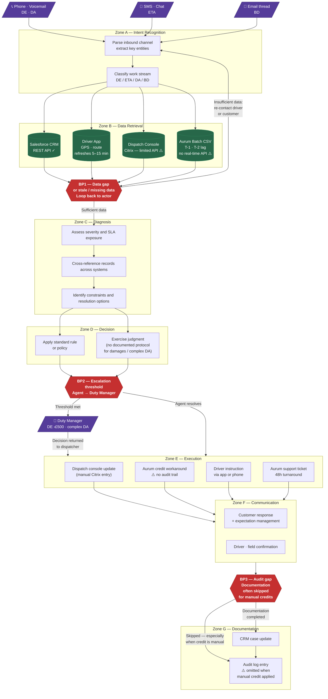

# Apex Distribution — Cognitive Load Map
## Customer Operations · Phase 2 Deliverable

**Version:** 1.0  
**Date:** 2026-05-11  
**Assumptions file:** `specs/assumptions.md`

---

## Table of Contents

1. [Executive Summary](#1-executive-summary)
2. [Work Stream Decomposition — Jobs to be Done](#2-work-stream-decomposition--jobs-to-be-done)
   - 2.1 Delivery Exceptions (DE)
   - 2.2 ETA Inquiries (ETA)
   - 2.3 Dispatch Adjustments (DA)
   - 2.4 Billing Disputes (BD)
3. [Cognitive Load Map — Micro-Task Inventory](#3-cognitive-load-map--micro-task-inventory)
4. [Process Topology Diagram](#4-process-topology-diagram)
5. [Lived Process Narrative](#5-lived-process-narrative)

---

## 1. Executive Summary

Apex Distribution's 35-person Customer Operations function handles ~730 cases per day across four work streams. The documented operating model — expressed in SOPs that reference retired tooling and leave damage handling as "TBD" — bears little resemblance to how work actually gets done. The lived operation is held together by dispatcher judgment, informal phone calls, and workarounds that bypass both system constraints and audit requirements.

Three structural fractures define the cognitive landscape:

**Fracture 1 — The Aurum constraint.** The legacy billing system exports data 24 hours late, accepts no real-time writes, and changes schema quarterly without notice. Every billing dispute resolution involves a choice between an undocumented manual credit (fast, no audit trail) and a formal Aurum ticket (48-hour turnaround, documented). Agents consistently choose speed over auditability. This is not a behaviour problem — it is a system design problem. *(Assumptions: A-BD-01, A-BD-02, A-BD-03)*

**Fracture 2 — The documentation gap.** The SOP for exception handling references DispatchHub, which was retired in October 2024 — 18 months ago. The damaged consignment protocol is explicitly marked "TBD." Agents have filled the gap with tacit knowledge and phone-based improvisation. What passes for a protocol is actually institutional memory concentrated in a small number of senior agents. *(Assumptions: A-DE-03, A-DE-04)*

**Fracture 3 — The GPS staleness problem.** Driver location data refreshes every 5–15 minutes. The 400 daily ETA inquiries are answered using stale coordinates. Agents bridge this gap by estimating, and sometimes calling the driver. The customer's experience (a 4-hour window that cannot be narrowed) is a direct consequence of data infrastructure, not agent capability. *(Assumption: A-ETA-01)*

The agentic opportunity is concentrated in the spaces where cognitive load is high but information is available — or could be made available — in structured form. The ETA stream is the most structurally ready for full delegation. Dispatch adjustment impact assessment and billing dispute cross-referencing represent the highest-value judgment-support opportunities. Billing execution (credit application) cannot be delegated until the Aurum constraint is addressed.

---

## 2. Work Stream Decomposition — Jobs to be Done

> A Job to be Done is a cognitive contract between an actor and an outcome. Each JtD below specifies: trigger, actor, goal, key decisions, key systems, expected output, and cognitive type.

### 2.1 Delivery Exceptions (DE)

~180 cases/day · avg 12 min · dispatcher discretion · *(Assumption: A-GEN-02, A-DE-01)*

| JtD ID | JtD Name | Trigger | Actor | Goal | Key Decisions | Key Systems | Output | Type |
|--------|----------|---------|-------|------|---------------|-------------|--------|------|
| JtD-DE1 | Triage inbound exception | Driver call / voicemail / app alert | Dispatcher | Understand the exception context before acting | What type? What urgency? Who is blocked? | Phone · Driver App | Classified exception with priority | Exception-handling |
| JtD-DE2 | Diagnose exception severity | Classified exception | Dispatcher | Determine whether standard or escalation path applies | Is it damage, refusal, or missed window? Is consignment value >£500? | CRM · Driver App | Severity classification + escalation flag | Decision-making |
| JtD-DE3 | Determine resolution path | Diagnosed exception | Dispatcher | Choose return / hold / re-attempt / accept with conditions | Route economics, customer relationship, consignment condition, driver availability | CRM · Dispatch Console | Resolution instruction | Decision-making |
| JtD-DE4 | Communicate decision to driver | Resolution decision | Dispatcher | Instruct driver clearly so they can act | How to frame instruction; whether to acknowledge ambiguity | Driver App · Phone | Acknowledged driver instruction | Communication |
| JtD-DE5 | Document and close case | Resolution executed | Dispatcher | Record outcome for case history and billing audit trail | What level of detail to record; whether to flag for billing review | CRM | Closed case record | Execution |

### 2.2 ETA Inquiries (ETA)

~400 cases/day · avg 4 min · mostly lookup · *(Assumption: A-ETA-01, A-ETA-02)*

| JtD ID | JtD Name | Trigger | Actor | Goal | Key Decisions | Key Systems | Output | Type |
|--------|----------|---------|-------|------|---------------|-------------|--------|------|
| JtD-ETA1 | Identify order and route | "Where is order #X?" via SMS / email / phone | Agent | Locate the correct order and its active route | Which order? Which driver? Is it on-route? | CRM | Order + route confirmation | Execution |
| JtD-ETA2 | Estimate delivery time | Located order on active route | Agent | Provide best-available ETA to customer | How stale is GPS data? Is a driver call needed? How wide is the confidence range? | Driver App · Dispatch Console | ETA estimate with confidence qualifier | Synthesis |
| JtD-ETA3 | Respond to customer | ETA estimated | Agent | Communicate ETA clearly; manage expectation if window is wide | Whether to qualify ("best estimate"); whether to offer a callback | CRM / SMS | Customer-facing ETA message | Communication |

### 2.3 Dispatch Adjustments (DA)

~90 cases/day · avg 18 min · tight time pressure · *(Assumptions: A-DA-01, A-DA-02, A-DA-03, A-DA-04)*

| JtD ID | JtD Name | Trigger | Actor | Goal | Key Decisions | Key Systems | Output | Type |
|--------|----------|---------|-------|------|---------------|-------------|--------|------|
| JtD-DA1 | Classify and prioritise adjustment request | Inbound request (customer / operations) | Dispatcher | Understand urgency and type of change needed | Additional pickup vs. diversion vs. driver swap? Time before impact? | Phone · CRM | Classified adjustment request with urgency flag | Exception-handling |
| JtD-DA2 | Assess downstream ripple impact | Classified request | Dispatcher | Determine which drops are affected by the change | Which driver? Which subsequent stops? SLA exposure? | Dispatch Console · Driver App | Impact assessment (mental model) | Synthesis |
| JtD-DA3 | Design revised route or assignment | Impact assessed | Dispatcher | Select best feasible resolution within current constraints | Optimise: driver capacity, route distance, SLA priority, driver overtime | Dispatch Console | Revised route / assignment decision | Decision-making |
| JtD-DA4 | Execute and communicate change | Resolution decided | Dispatcher | Apply change in system and inform affected drivers | Sequence of console updates; driver notification timing | Dispatch Console · Driver App | Updated routes; informed drivers | Execution |

### 2.4 Billing Disputes (BD)

~60 cases/day · avg 28 min · legacy system constraint · *(Assumptions: A-BD-01, A-BD-02, A-BD-03, A-BD-04, A-BD-06)*

| JtD ID | JtD Name | Trigger | Actor | Goal | Key Decisions | Key Systems | Output | Type |
|--------|----------|---------|-------|------|---------------|-------------|--------|------|
| JtD-BD1 | Receive and categorise dispute | Inbound email / call from customer | Agent | Understand what is being disputed and why | Surcharge dispute? Damage claim? Redelivery fee? First contact or escalation? | CRM · Email | Categorised dispute case | Exception-handling |
| JtD-BD2 | Retrieve and reconcile billing data | Categorised dispute | Agent | Pull relevant invoice and cross-reference against delivery record | Is the Aurum batch current? Are there matching records in CRM? | Aurum CSV · CRM | Reconciled billing picture | Synthesis |
| JtD-BD3 | Validate the claim | Reconciled data | Agent | Determine whether the dispute is legitimate and what resolution applies | Does damage evidence exist? Is the surcharge rule applicable? What is precedent? | CRM · Aurum CSV | Validated claim with recommended resolution | Decision-making |
| JtD-BD4 | Execute resolution | Validated claim | Agent | Apply credit, reject, or escalate within system constraints | Manual credit workaround vs. Aurum ticket vs. escalation? Audit trail implications? | Aurum (manual) · CRM | Applied resolution (credit or ticket) | Execution |
| JtD-BD5 | Communicate and document | Resolution applied | Agent | Inform customer of outcome; ensure audit trail is complete | How to explain Aurum constraint to customer? Is documentation compliant? | CRM · Email | Customer communication + case record | Communication |

---

## 3. Cognitive Load Map — Micro-Task Inventory

**Scoring key**

| Dimension | H | M | L |
|-----------|---|---|---|
| **CL** Cognitive Load | High reasoning / tacit knowledge | Moderate | Routine / lookup |
| **IS** Input Structure | Structured / machine-readable | Semi-structured | Unstructured / verbal |
| **DD** Decision Determinism | Rule-bound / predictable | Mixed | Judgment-dependent |
| **EF** Exception Frequency | Frequent edge cases | Occasional | Rare / predictable |
| **TT** Turn-Taking Degree | Extensive back-and-forth | Some | Single interaction |
| **LC** Latency Constraint | Real-time required | Near-real-time | Batch acceptable |
| **CR** Compliance / Risk | High consequence / regulated | Medium | Low / reversible |
| **TA** Tool / API Availability | Good APIs available | Partial / limited | Manual only |

---

### Work Stream DE — Delivery Exceptions

| MT ID | Micro-Task | CL | IS | DD | EF | TT | LC | CR | TA | Notes |
|-------|-----------|----|----|----|----|----|----|----|----|-------|
| DE-MT1 | Parse inbound exception (call / voicemail / app) | M | L | M | M | L | H | L | M | Voicemail is unstructured; transcription needed. Driver parked and waiting. |
| DE-MT2 | Classify exception type (damage / refusal / missed window) | H | L | M | H | M | H | M | L | SOP 4.3 is TBD; classification relies on tacit knowledge. *(A-DE-03)* |
| DE-MT3 | Retrieve order and delivery record from CRM | L | H | H | L | L | H | L | H | Deterministic lookup; REST API available. |
| DE-MT4 | Retrieve driver GPS and route status from Driver App | L | H | M | M | L | H | L | H | Data available but may be stale. *(A-ETA-01 applies here too)* |
| DE-MT5 | Assess damage or refusal context and severity | H | L | L | H | H | H | H | L | Highest cognitive load in stream. No protocol. Pure judgment. *(A-DE-03)* |
| DE-MT6 | Determine resolution path (return / hold / re-attempt / accept) | H | L | L | H | M | H | H | L | Dispatcher discretion; weighs route economics, customer relationship, item value. *(A-DE-01)* |
| DE-MT7 | Communicate decision to driver | L | H | H | L | M | H | M | H | Instruction delivery once decision made; driver app or phone. |
| DE-MT8 | Update CRM case record | L | H | H | L | L | L | M | H | Routine documentation; CRM REST API. |
| DE-MT9 | Escalate to Duty Manager (>£500 / high complexity) | M | M | M | L | H | H | H | M | Infrequent; triggers when SOP 4.2 threshold met. *(A-DE-02)* |

---

### Work Stream ETA — ETA Inquiries

| MT ID | Micro-Task | CL | IS | DD | EF | TT | LC | CR | TA | Notes |
|-------|-----------|----|----|----|----|----|----|----|----|-------|
| ETA-MT1 | Parse customer ETA request | L | M | H | L | L | H | L | H | Intent is nearly always "where is order X"; low ambiguity. |
| ETA-MT2 | Look up order in CRM | L | H | H | L | L | H | L | H | Deterministic; Salesforce REST API. |
| ETA-MT3 | Retrieve route and GPS data from Driver App | L | H | M | M | L | H | L | H | Data present but may be 5–26 min stale. *(A-ETA-01)* |
| ETA-MT4 | Estimate ETA from GPS and route position | M | M | M | M | L | H | L | M | Mental arithmetic with stale data; no ETA engine exists. *(A-ETA-01)* |
| ETA-MT5 | Contact driver for tighter ETA (edge case ~10–15%) | M | L | L | M | H | H | L | M | Driver may not know precisely either. *(A-ETA-02)* |
| ETA-MT6 | Respond to customer with ETA and qualifier | L | M | H | L | M | H | L | H | CRM / SMS channel; mostly templated. |

---

### Work Stream DA — Dispatch Adjustments

| MT ID | Micro-Task | CL | IS | DD | EF | TT | LC | CR | TA | Notes |
|-------|-----------|----|----|----|----|----|----|----|----|-------|
| DA-MT1 | Receive and classify adjustment request | M | M | M | M | L | H | L | M | Urgency and type must be assessed from semi-structured input. |
| DA-MT2 | Identify affected routes and drivers | L | H | H | L | L | H | L | M | Console lookup; limited but available. *(A-DA-02)* |
| DA-MT3 | Assess downstream ripple impact on subsequent drops | H | M | L | H | M | H | H | L | No decision-support tool. Pure dispatcher judgment. *(A-DA-03)* |
| DA-MT4 | Design revised route or assignment | H | M | L | H | M | H | H | L | Mental optimisation under constraints; no routing engine. *(A-DA-03)* |
| DA-MT5 | Execute route change in dispatch console | L | H | H | L | L | H | M | L | Mechanical execution; manual Citrix console, no API write. *(A-DA-02)* |
| DA-MT6 | Notify affected drivers via Driver App | L | H | H | L | L | H | L | H | Push notification; Driver App supports structured messages. |
| DA-MT7 | Document adjustment in CRM | L | H | H | L | L | L | L | H | Low-priority but important for audit trail. |

---

### Work Stream BD — Billing Disputes

| MT ID | Micro-Task | CL | IS | DD | EF | TT | LC | CR | TA | Notes |
|-------|-----------|----|----|----|----|----|----|----|----|-------|
| BD-MT1 | Receive and categorise dispute | M | M | M | M | L | L | L | H | Email is semi-structured; surcharge vs. damage vs. fee matters for routing. |
| BD-MT2 | Pull invoice and supporting data from Aurum batch CSV | M | H | M | M | L | L | L | L | Schema is structured but unstable; no real-time API. *(A-BD-03)* |
| BD-MT3 | Cross-reference invoice against delivery record | H | M | M | H | L | L | H | M | Data lives in two separate systems; join is manual. *(A-BD-04)* |
| BD-MT4 | Validate dispute claim (damage evidence, surcharge logic) | H | L | L | H | M | L | H | L | Policy interpretation against unstructured case facts. *(A-BD-05)* |
| BD-MT5 | Determine resolution path (credit / reject / escalate) | H | M | L | H | M | L | H | L | No documented decision tree; relies on agent judgment and precedent. |
| BD-MT6 | Apply credit via manual Aurum workaround | M | M | M | M | L | L | H | L | Fast but creates compliance risk. No audit trail. *(A-BD-01, A-BD-04)* |
| BD-MT7 | Raise Aurum support ticket for invoice modification | L | H | H | L | H | L | M | M | Formal path; 48h turnaround creates customer follow-up burden. *(A-BD-02)* |
| BD-MT8 | Communicate resolution to customer | M | M | M | M | H | L | M | H | Managing expectations around Aurum constraints; multi-message threads common. |
| BD-MT9 | Document resolution in CRM and audit log | M | H | M | H | L | L | H | M | Frequently incomplete; manual credit overrides often not logged. *(A-BD-01)* |

---

## 4. Process Topology Diagram

> The diagram below shows the shared cognitive topology across all four work streams. Zones represent clusters of similar cognitive activity. Breakpoints (BP) mark where control shifts: system → human, rule → judgment, or execution → documentation gap.

### Zone and Breakpoint Summary

| Zone | Primary Activity | Cognitive Type | Key Bottleneck |
|------|-----------------|---------------|----------------|
| A — Intent Recognition | Parse and classify inbound contact | Synthesis | Voicemail / unstructured input; no transcription |
| B — Data Retrieval | Pull from CRM, Driver App, Console, Aurum | Execution | Aurum: batch-only, T-1/T-2 lag; Dispatch Console: manual |
| C — Diagnosis | Cross-reference records; assess severity | Synthesis | Manual joins across systems; no unified view |
| D — Decision | Apply rule or exercise judgment | Decision-making | Damaged consignment protocol is TBD; dispatch judgment is tacit |
| E — Execution | Apply credit, update console, instruct driver | Execution | Manual Citrix; Aurum workaround creates audit gap |
| F — Communication | Respond to customer and driver | Communication | Aurum constraint forces agents to explain workarounds |
| G — Documentation | CRM update; audit log | Execution | Audit trail frequently incomplete; manual credits go unlogged |

| Breakpoint | Type | Risk |
|-----------|------|------|
| BP1 — Data gap | System → Human loop | Driver / customer wait time; stale GPS creates ETA confidence problem |
| BP2 — Escalation threshold | Agent → Supervisor | Clear rule for value threshold; unclear for complexity; informal in practice |
| BP3 — Audit gap | Documentation → Omission | Compliance exposure; manual credits not reconciled with Aurum |

---

## 5. Lived Process Narrative

### What the SOP says — and what actually happens

**The documented version** of Apex Customer Operations is orderly. Drivers record exception reasons in DispatchHub, confirm action via DispatchHub, and escalate high-value items to the Duty Manager via the dispatch console. Billing disputes go to Customer Operations, who coordinate credits through Aurum. ETA inquiries are handled with current GPS data.

**The lived version** is something else entirely.

---

**Exceptions: judgment under pressure, no playbook for damage**

When Mark Petrov parks his lorry at the Stein-Allen account with a leaning pallet, he does what the process demands: he calls dispatch. But DispatchHub — the system the SOP describes — has been retired for eighteen months. The SOP has not been updated. He leaves a voicemail. Sandra's line is busy. He waits. There is no structured intake, no acknowledgement, no SLA clock running.

When a dispatcher picks up the message, they face a decision the SOP does not help them with: SOP section 4.3, "Damaged consignments," is incomplete — *"TBD pending review of insurance protocol"*. In practice, the dispatcher draws on tacit knowledge: *how damaged is "leaning"? Is this a liability issue or a driver being cautious? What's the consignment value? How far behind is Mark now?* The resolution — bring it back, leave it, request the site manager — is made entirely on judgment, with no documentation trail until the dispatcher manually updates the CRM after the call.

The gap between the SOP and the lived process is not negligence. It is a direct consequence of a system retirement that was never matched with a process update, and a damage protocol that was never written.

---

**Billing disputes: the Aurum workaround becomes the process**

Pete Hayes disputes a fuel surcharge on a damaged delivery. He emails `billing@`. The billing team — running the Aurum Billing system — confirms the surcharge is correct per system rules and redirects him to Customer Operations. He calls Customer Operations, waits 22 minutes, gets cut off. He emails again, noting this is the second such incident this quarter.

When Sandra in Customer Ops finally reaches the case, she faces a structural constraint the customer never sees: Apex cannot adjust a fuel surcharge at the line-item level in Aurum without raising a support ticket to the Aurum vendor — with a typical 48-hour turnaround. The customer wants a resolution today. So Sandra applies a £170 goodwill credit via a manual override. She does not raise an Aurum ticket. She does not create an entry in the credits audit log.

The internal note on the case says it plainly: *"no entry in the credits audit log for this £170; Sandra applied it via a manual override."*

This is not Sandra's failure. The manual credit workaround *is* the process. It is how agents resolve billing disputes quickly when the formal path takes two days. It creates financial exposure (credits applied without audit trail), reconciliation gaps (APEX_CREDITS_YYYYMMDD.csv will not reflect this credit), and compliance risk. It recurs every working day because the system architecture makes the workaround faster than the protocol.

---

**ETA inquiries: honest answers constrained by stale data**

At 11:14, a customer asks where order #AX-771-3344 is. The agent checks the CRM (order found, route 028), then checks the Driver App for GPS position. The last GPS ping was at 10:48 — 26 minutes ago. The agent does what they can: they interpolate from the last known position, check dispatch for context, and return a 2-hour window ("around 14:00–15:00"). The customer accepts this, but dissatisfied.

The 4-hour delivery window that frustrates customers, and the inability to narrow it, is not a staffing or training problem. It is a data infrastructure problem. The GPS refresh rate, combined with the absence of a route-progress estimation engine, structurally limits how precise any agent — human or agentic — can be with current tooling.

---

**The gap in three sentences**

The SOP describes a process where systems support human judgment. The lived process is one where humans compensate for system limitations — stale GPS, a retired tool with no replacement SOP, and a billing system that cannot be updated in real time. The cognitive cost of this compensation is distributed across 35 agents, ~730 cases per day, and accumulates invisibly until a customer escalates, an audit flags an unlogged credit, or Sarah Whitmore's CEO reads about a competitor saving £1.2M.
