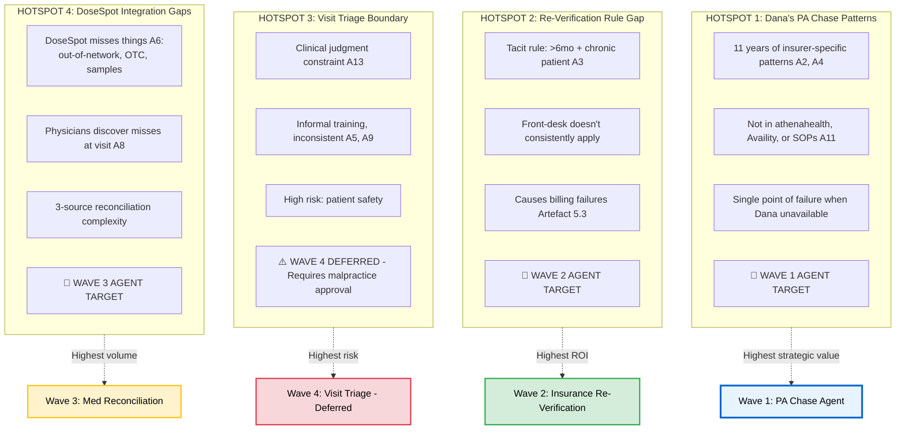
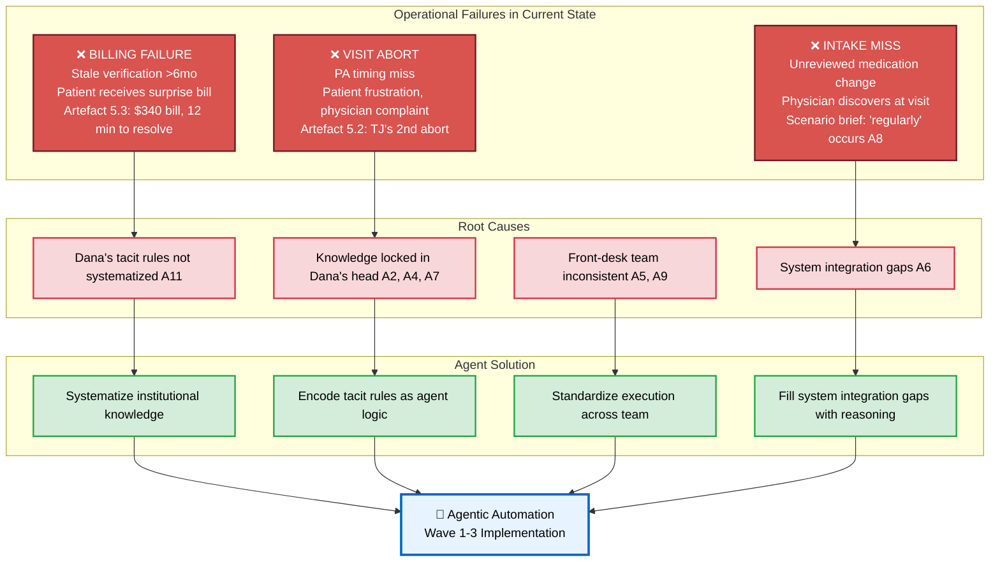

# Cognitive Topology: Zones and Critical Breakpoints

**Visualization of Patient Intake Cognitive Flow**  
**Source**: `scenario5-cognitive-map.md` Section 3  
**Format**: Mermaid Flowchart

---

## Full Cognitive Flow Diagram

```mermaid
flowchart TD
    %% Styling
    classDef lowLoad fill:#d4edda,stroke:#28a745,stroke-width:2px,color:#000
    classDef medLoad fill:#fff3cd,stroke:#ffc107,stroke-width:2px,color:#000
    classDef highLoad fill:#f8d7da,stroke:#dc3545,stroke-width:2px,color:#000
    classDef veryHighLoad fill:#d9534f,stroke:#721c24,stroke-width:3px,color:#fff
    classDef breakpoint fill:#e7f3ff,stroke:#0066cc,stroke-width:2px,stroke-dasharray: 5 5,color:#000
    classDef zone fill:#f0f0f0,stroke:#333,stroke-width:2px,color:#000
    
    %% ZONE 1: PATIENT SCHEDULING
    Z1[ZONE 1: PATIENT SCHEDULING<br/>Trigger: Appointment scheduled in athenahealth<br/>Data: Insurance on file, visit type known]:::zone
    
    %% BREAKPOINT 1
    BP1{BREAKPOINT<br/>1-7 days before visit}:::breakpoint
    Z1 --> BP1
    
    %% ZONE 2: INSURANCE VERIFICATION
    BP1 --> Z2[ZONE 2: INSURANCE VERIFICATION<br/>JtD-1]:::zone
    Z2 --> AutoVerify[Auto-verify via Availity<br/>70% success rate<br/>🟢 LOW COGNITIVE LOAD]:::lowLoad
    Z2 --> VerifyFail{BREAKPOINT<br/>Availity failure 30%<br/>🔴 HIGH COGNITIVE LOAD}:::breakpoint
    
    VerifyFail --> InterpretError[Interpret error code<br/>Pattern recognition required]:::highLoad
    VerifyFail --> CheckReverify[Check last verification date<br/>Tacit rule: >6mo = re-verify A3]:::highLoad
    VerifyFail --> EscalateMedicaid[Escalate to Dana<br/>Medicaid managed care]:::highLoad
    
    CheckReverify --> BP2_1{Re-verification<br/>missed?}:::breakpoint
    BP2_1 -->|Yes| BillingFail[❌ OPERATIONAL FAILURE<br/>Patient gets surprise bill<br/>Artefact 5.3]:::veryHighLoad
    BP2_1 -->|No| Z3Start
    
    InterpretError --> Z3Start[Continue to Zone 3]:::lowLoad
    EscalateMedicaid --> Z3Start
    AutoVerify --> Z3Start
    
    %% ZONE 3: PA MANAGEMENT (Parallel track)
    Z3Start --> Z3[ZONE 3: PA MANAGEMENT<br/>JtD-2<br/>~25 PAs/day - Dana's domain]:::zone
    
    Z3 --> SubmitPA[Submit PA<br/>Structured form<br/>🟢 LOW COGNITIVE LOAD]:::lowLoad
    
    SubmitPA --> BP3{BREAKPOINT<br/>When to chase?<br/>🔴 VERY HIGH COGNITIVE LOAD}:::breakpoint
    
    BP3 --> StatedSLA[Stated SLA: 5 days]:::medLoad
    BP3 --> LivedSLA[Lived SLA varies by insurer A2<br/>Humana: always 6d<br/>UHC: 6-7d<br/>Aetna: unpredictable]:::veryHighLoad
    
    LivedSLA --> DanaSheet[Dana's Google Sheet A7<br/>Institutional knowledge<br/>NOT in athenahealth/Availity A11]:::veryHighLoad
    
    DanaSheet --> ChaseDecision[Decision: Chase timing<br/>Based on insurer-specific pattern]:::veryHighLoad
    
    ChaseDecision --> BP4{PA Status?}:::breakpoint
    
    BP4 -->|Denied| BP5{BREAKPOINT<br/>PA Denial<br/>🔴 VERY HIGH COGNITIVE LOAD}:::breakpoint
    
    BP5 --> InterpretDenial[Interpret denial reason<br/>Pattern-based A4<br/>Example: Wellpath colonoscopy<br/>always needs prior visit note]:::veryHighLoad
    
    InterpretDenial --> Resubmit[Resubmit with workaround docs<br/>Coordinate with physician if needed]:::highLoad
    
    BP4 -->|Pending at visit time| VisitAbort[❌ OPERATIONAL FAILURE<br/>Visit aborted<br/>Patient frustrated<br/>Artefact 5.2]:::veryHighLoad
    
    BP4 -->|Approved| Z4Start[Continue to Zone 4]:::lowLoad
    Resubmit --> Z4Start
    
    %% ZONE 4: VISIT REASON TRIAGE
    Z4Start --> Z4[ZONE 4: VISIT REASON TRIAGE<br/>JtD-3<br/>1-2 days before visit or day-of]:::zone
    
    Z4 --> ParseQuestionnaire[Parse questionnaire<br/>Text + structured fields<br/>🟡 MEDIUM COGNITIVE LOAD]:::medLoad
    
    ParseQuestionnaire --> BP6{BREAKPOINT<br/>Clinical urgency assessment<br/>🔴 VERY HIGH COGNITIVE LOAD}:::breakpoint
    
    BP6 --> ClinicalBoundary[Distinguish routine from urgent<br/>WITHOUT clinical judgment A13<br/>Informal training A5<br/>Inconsistent across 4-person team A9]:::veryHighLoad
    
    ClinicalBoundary --> TriageDecision{Decision}:::breakpoint
    TriageDecision -->|Routine| Z5Start[Continue to Zone 5]:::lowLoad
    TriageDecision -->|Ambiguous| EscalateDana[Escalate to Dana/physician]:::highLoad
    TriageDecision -->|Urgent| ConvertSameDay[Flag physician<br/>Convert to same-day if needed]:::highLoad
    
    EscalateDana --> Z5Start
    ConvertSameDay --> Z5Start
    
    %% ZONE 5: MEDICATION RECONCILIATION
    Z5Start --> Z5[ZONE 5: MEDICATION RECONCILIATION<br/>JtD-4<br/>Day of visit: patient check-in]:::zone
    
    Z5 --> PullDoseSpot[Pull DoseSpot pharmacy history<br/>🟢 LOW COGNITIVE LOAD]:::lowLoad
    
    PullDoseSpot --> BP7{BREAKPOINT<br/>Discrepancy between systems<br/>🟡/🔴 MEDIUM-HIGH COGNITIVE LOAD}:::breakpoint
    
    BP7 --> DoseSpotVsPatient[DoseSpot shows fills<br/>Patient says 'I stopped taking that']:::highLoad
    BP7 --> PatientOTC[Patient reports OTC/supplement<br/>Not in DoseSpot A6]:::highLoad
    BP7 --> OtherProvider[New med from other provider<br/>Not in DoseSpot A6]:::highLoad
    
    DoseSpotVsPatient --> ReconcileDecision{Decision}:::breakpoint
    PatientOTC --> ReconcileDecision
    OtherProvider --> ReconcileDecision
    
    ReconcileDecision --> UpdateAthena[Update athenahealth<br/>Flag physician for review]:::medLoad
    ReconcileDecision --> AskPatient[Ask patient to clarify]:::medLoad
    
    UpdateAthena --> AllergyCheck[Flag allergy conflicts<br/>Rule-based<br/>🟢 LOW COGNITIVE LOAD]:::lowLoad
    AskPatient --> AllergyCheck
    
    AllergyCheck --> BP8{Physician discovers<br/>unreviewed med change?}:::breakpoint
    BP8 -->|Yes| IntakeMiss[❌ OPERATIONAL FAILURE<br/>Intake miss A8<br/>Physician finds at visit]:::veryHighLoad
    BP8 -->|No| VisitOccurs[✅ Visit occurs]:::lowLoad
    
    IntakeMiss --> VisitOccurs
    
    %% ZONE 6: POST-VISIT
    VisitOccurs --> Z6[ZONE 6: POST-VISIT DOCUMENTATION<br/>Physician notes intake misses in chart<br/>Dana investigates and updates tacit rules<br/>NOT systematized A11]:::zone
    
    Z6 --> Feedback[Dana accumulates knowledge<br/>Knowledge stays in her head + Google Sheet<br/>Front-desk learns indirectly<br/>New hires start from scratch]:::highLoad
    
    Feedback --> End[End of Intake Flow]:::lowLoad
```

---

## Zone-Specific Cognitive Load Summary

```mermaid
flowchart LR
    subgraph z1 [ZONE 1: Scheduling]
        z1load[LOW LOAD<br/>Structured data entry]
    end
    
    subgraph z2 [ZONE 2: Insurance Verification]
        z2a[70% cases: LOW LOAD<br/>Auto-verify succeeds]
        z2b[30% cases: HIGH LOAD<br/>Error interpretation + tacit rules]
    end
    
    subgraph z3 [ZONE 3: PA Management]
        z3a[Submit: LOW LOAD<br/>Form filling]
        z3b[Chase timing: VERY HIGH LOAD<br/>Dana's institutional knowledge A2, A4, A7]
        z3c[Denial handling: VERY HIGH LOAD<br/>Insurer-specific workarounds]
    end
    
    subgraph z4 [ZONE 4: Visit Triage]
        z4a[Parse: MEDIUM LOAD<br/>NLP interpretation]
        z4b[Urgency: VERY HIGH LOAD<br/>Clinical boundary constraint A13]
    end
    
    subgraph z5 [ZONE 5: Med Reconciliation]
        z5a[Retrieve: LOW LOAD<br/>API calls]
        z5b[Discrepancy: MEDIUM-HIGH LOAD<br/>DoseSpot gaps A6 + patient verbal]
    end
    
    subgraph z6 [ZONE 6: Post-Visit]
        z6load[Dana learns but doesn't systematize A11<br/>Knowledge concentration risk]
    end
    
    z1 --> z2
    z2 --> z3
    z3 --> z4
    z4 --> z5
    z5 --> z6
    
    classDef lowLoad fill:#d4edda,stroke:#28a745,stroke-width:2px,color:#000
    classDef medLoad fill:#fff3cd,stroke:#ffc107,stroke-width:2px,color:#000
    classDef highLoad fill:#f8d7da,stroke:#dc3545,stroke-width:2px,color:#000
    classDef veryHighLoad fill:#d9534f,stroke:#721c24,stroke-width:3px,color:#fff
    
    class z1load,z2a,z3a,z5a lowLoad
    class z4a,z5b medLoad
    class z2b,z6load highLoad
    class z3b,z3c,z4b veryHighLoad
```

---

## Critical Breakpoints (Agent Value Hotspots)

---

## Operational Failure Modes

---

## Legend

**Cognitive Load Colors:**
- 🟢 **GREEN**: Low cognitive load (structured, deterministic, high automation potential)
- 🟡 **YELLOW**: Medium cognitive load (some interpretation, pattern recognition)
- 🔴 **RED**: High cognitive load (institutional knowledge, tacit rules, judgment)
- ⚫ **DARK RED**: Very high cognitive load (Dana's unique expertise, highest agent value)

**Breakpoints:**
- 🔷 **DASHED BLUE**: Critical decision points where cognitive load spikes
- 🔶 **DIAMOND**: Decision nodes requiring human judgment

**Assumption References:**
- [A#]: Cross-reference to Assumption Register in cognitive map
- Example: [A2] = "Dana's insurer-specific PA patterns are stable"

---

## How to View

**On GitHub**: This diagram will render automatically when viewing this file.

**In VS Code**: Install "Markdown Preview Mermaid Support" extension.

**Export to PNG**: 
1. Copy Mermaid code block
2. Go to https://mermaid.live/
3. Paste code
4. Click "Download PNG"

**In Documentation Sites**: Most modern markdown tools (Notion, GitLab, Confluence) support Mermaid natively.

---

## Source Reference

**Original ASCII diagram**: `scenario5-cognitive-map.md` Section 3 (lines 180-263)

**Key findings documented**:
- 70% of intake work is structured (LOW load)
- 30% is exception handling (HIGH/VERY HIGH load) - where agents add value
- Dana's 11 years of institutional knowledge concentrated in 4 hotspots
- 3 operational failure modes (billing, visit abort, intake miss)

**Agent mapping based on**: This cognitive topology informed delegation qualification (Phase 3) and wave sequencing (Phase 4)

---

**Last Updated**: 2026-04-29  
**Maintained By**: Project documentation (sync with cognitive map if process changes)
