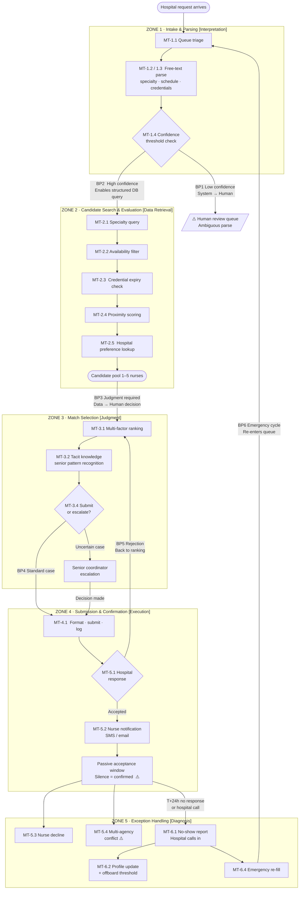

# Cognitive Load Map — MedFlex Shift Matching Workflow

> Deliverable for ATX Phase 2: Cognitive Load Mapping.
> Primary work stream: coordinator shift matching (intake → submission → confirmation).
> Assumption IDs (A1–A15) are defined in `specs/assumptions.md`; new assumptions (A16–A18) are added in this session.

---

## Table of Contents

1. [Executive Summary](#1-executive-summary)
2. [Work Stream Decomposition — Jobs to be Done](#2-work-stream-decomposition--jobs-to-be-done)
3. [Cognitive Load Map](#3-cognitive-load-map)
4. [Process Topology Diagram](#4-process-topology-diagram)
5. [Lived Process Narrative](#5-lived-process-narrative)

---

## 1. Executive Summary

The coordinator shift-matching workflow is a single end-to-end process that converts a free-text hospital request into a confirmed nurse placement. It is the primary source of MedFlex's 4.2-hour average fill time and the primary bottleneck to $200M revenue.

This cognitive map decomposes that workflow into **6 Jobs to be Done (JtDs)** and **20 micro-tasks** scored across 8 delegation dimensions. The analysis surfaces four findings that directly shape the MVP architecture:

**Finding 1 — The bottleneck is Zone 1–2, not Zone 3.** Most of the 4.2-hour elapsed fill time is queue accumulation and search execution, not the judgment step. Automating intake parsing (Zone 1) and candidate retrieval (Zone 2) removes the delay at source and enables the <1-hour target independently of AI judgment quality.

**Finding 2 — Zone 3 contains the highest-value cognitive asset.** Senior coordinators' tacit pattern recognition (MT-3.2) is the single dimension most predictive of fill quality and coordinator speed differential. It is the hardest to automate but the most valuable to replicate in a learned ranking model. The AI Candidate Ranker is a direct attack on this task.

**Finding 3 — Zone 5 is high-risk but low-frequency; it is not an MVP target.** Multi-agency conflict resolution (MT-5.4) and emergency re-fill (MT-6.4) score High on cognitive load, risk, and turn-taking degree simultaneously — the worst delegation profile. These tasks require human-in-the-loop by design; automation accelerates the supporting data retrieval, not the decision.

**Finding 4 — The passive confirmation model (silence = accepted) creates a structural blind spot.** No confirmation step captures nurse intent between submission and shift start. This is the root cause of the addressable no-show segment (A9). Automated hospital response monitoring and initial nurse placement notification (MT-5.1/5.2) close part of this gap in Wave 1. Proactive T-48h/T-24h confirmation (Feature 5, Shift Confirmation Notifier) is deferred to Wave 2 pending resolution of U4 (notification infrastructure: whether the system supports bidirectional response capture). *[Rev. 2026-05-13 — CEO Pushback]*

---

## 2. Work Stream Decomposition — Jobs to be Done

Each JtD is a cognitive contract between an actor and an outcome. Trigger, actor, goal, key decisions, key systems, expected output, and JtD type are listed for all six.

---

### JtD-1 — Shift Intake Parsing

| Field | Value |
|---|---|
| **Trigger** | Hospital request arrives in ServiceNow (email body / portal submission / phone transcription) |
| **Actor** | Coordinator |
| **Goal** | Extract structured shift requirements from free-text input |
| **Key decisions** | Interpret specialty shorthand; map informal credential names to database categories; determine whether request is parseable or requires hospital clarification |
| **Key systems** | ServiceNow (queue view — read only in current state) |
| **Expected output** | Structured requirement object: specialty, date/time, location, credential list, confidence flags |
| **JtD type** | Synthesis / Interpretation |

---

### JtD-2 — Candidate Search & Evaluation

| Field | Value |
|---|---|
| **Trigger** | Structured shift requirement available |
| **Actor** | Coordinator |
| **Goal** | Produce a qualified candidate pool for the requested shift |
| **Key decisions** | Which credential dimensions to filter on first; how to handle borderline availability (A17); whether to accept proximity trade-offs for underqualified pools |
| **Key systems** | ServiceNow nurse database (credentials, availability, nurse profiles) |
| **Expected output** | Evaluated pool of 1–5 nurse candidates with per-candidate qualification status (A2) |
| **JtD type** | Data retrieval / Filtering |

---

### JtD-3 — Match Selection

| Field | Value |
|---|---|
| **Trigger** | Candidate pool evaluated |
| **Actor** | Coordinator (senior: pattern-based; junior: systematic) |
| **Goal** | Select the single best-fit candidate to submit to the hospital |
| **Key decisions** | Multi-factor ranking with implicit hospital preference knowledge; tie-breaking on borderline candidates; whether to submit or escalate to senior coordinator |
| **Key systems** | Nurse profiles, partially structured hospital preference records (A12) |
| **Expected output** | Selected candidate with implicit rationale; submit decision |
| **JtD type** | Judgment (routine pattern-match → novel case, depending on request type) |

---

### JtD-4 — Submission

| Field | Value |
|---|---|
| **Trigger** | Candidate selected and approved |
| **Actor** | Coordinator / System |
| **Goal** | Deliver a formatted candidate submission to the hospital via ServiceNow |
| **Key decisions** | None — pure execution step |
| **Key systems** | ServiceNow (write path) |
| **Expected output** | Submission event with timestamp; hospital receives proposal |
| **JtD type** | Execution |

---

### JtD-5 — Confirmation & Conflict Resolution

| Field | Value |
|---|---|
| **Trigger** | Submission sent; hospital response pending |
| **Actor** | System (notification) + Coordinator (on rejection or conflict) |
| **Goal** | Confirm placement, notify nurse, and handle rejection or multi-agency conflict events |
| **Key decisions** | What to do on hospital rejection (re-submit via JtD-3?); how to handle multi-agency nurse conflicts (same nurse accepted by competitor); whether passive acceptance is sufficient or explicit acknowledgment is required (A14) |
| **Key systems** | ServiceNow, SMS/email notification system |
| **Expected output** | Confirmed placement record or escalated conflict |
| **JtD type** | Execution + Exception handling |

---

### JtD-6 — No-Show Management

| Field | Value |
|---|---|
| **Trigger** | Hospital calls to report nurse no-show |
| **Actor** | Coordinator |
| **Goal** | Log incident, update nurse record, and initiate emergency re-fill if shift window permits |
| **Key decisions** | Whether to initiate re-fill (shift window still open?); cumulative no-show threshold action for nurse offboarding |
| **Key systems** | ServiceNow nurse profile; re-initiates JtD-1 through JtD-4 for emergency case |
| **Expected output** | Updated nurse record; emergency placement initiated or waived; hospital relationship response |
| **JtD type** | Exception handling / Diagnosis |

---

## 3. Cognitive Load Map

**Dimension key:**

| Dimension | H | M | L |
|---|---|---|---|
| **CL** Cognitive Load | High reasoning / tacit knowledge required | Moderate interpretation | Clerical / lookup |
| **IS** Input Structure | Fully structured / machine-readable | Semi-structured | Free text / unstructured |
| **DD** Decision Determinism | Clear rules, predictable output | Mixed | Judgment-dependent |
| **EF** Exception Frequency | Frequent edge cases | Occasional | Rare |
| **TT** Turn-Taking Degree | Significant back-and-forth with humans | Some | Minimal |
| **LC** Latency Constraint | Real-time response required | Minutes acceptable | Batch acceptable |
| **CR** Compliance / Risk Sensitivity | High cost of error; regulated | Moderate | Low consequence |
| **TA** Tool / API Availability | Fully accessible | Partial / requires build | Unavailable or inaccessible |

**Agentic suitability signal**: Low CL + High IS + High DD + Low EF + Low TT + Low CR + High TA = most automatable. High CL + Low IS + Low DD = highest delegation value if achievable.

---

### JtD-1 — Shift Intake Parsing

| MT | Micro-Task | CL | IS | DD | EF | TT | LC | CR | TA | Notes |
|---|---|:---:|:---:|:---:|:---:|:---:|:---:|:---:|:---:|---|
| MT-1.1 | Queue triage & record creation | L | M | H | L | L | H | L | M | ServiceNow queue is semi-structured; triage is FIFO today (no priority scoring) |
| MT-1.2 | Free-text specialty & schedule parse | M | L | M | M | L | H | M | M | Shorthand medical terms; inconsistent hospital formats; LLM-parseable at ≥85% (A10) |
| MT-1.3 | Credential requirement extraction | M | L | M | M | L | H | H | M | Maps informal names (e.g. "BLS/ACLS") to database credential categories; errors propagate to 7% mismatch rate |
| MT-1.4 | Confidence flag & low-confidence routing | M | L | M | M | M | H | M | L | No current system; routing logic is entirely in coordinator's head; no escalation path exists |

---

### JtD-2 — Candidate Search & Evaluation

| MT | Micro-Task | CL | IS | DD | EF | TT | LC | CR | TA | Notes |
|---|---|:---:|:---:|:---:|:---:|:---:|:---:|:---:|:---:|---|
| MT-2.1 | Specialty database query | L | H | H | L | L | H | M | M | Structured credential fields in ServiceNow; primary filter is deterministic |
| MT-2.2 | Availability window filter | L | M | H | M | L | H | M | M | Self-managed by nurses; ~15-20% of records may be stale (A17); false positives require re-work |
| MT-2.3 | Credential expiry verification | L | H | H | L | L | H | H | H | Expiry date is a structured field on nurse card (confirmed in discovery); deterministic pass/fail |
| MT-2.4 | Proximity scoring | L | M | H | L | L | M | L | M | Distance-based; feasible with geocoded addresses and maps API; low cognitive value |
| MT-2.5 | Hospital preference history retrieval | M | M | M | M | L | M | M | M | Partially captured in ServiceNow (A12); gaps in history require judgment to fill |

---

### JtD-3 — Match Selection

| MT | Micro-Task | CL | IS | DD | EF | TT | LC | CR | TA | Notes |
|---|---|:---:|:---:|:---:|:---:|:---:|:---:|:---:|:---:|---|
| MT-3.1 | Multi-factor candidate ranking | H | M | M | M | L | H | M | M | Weighting criteria (credentials vs. proximity vs. preference) is undocumented; varies by coordinator |
| MT-3.2 | Tacit knowledge application | H | L | L | M | L | H | M | L | The 10-year pattern recognition that makes seniors 3–5× faster (A18); entirely unencoded |
| MT-3.4 | Submit vs. escalate decision | M | M | M | M | M | H | M | L | Threshold is informal; competitive pressure biases toward submitting rather than escalating |

---

### JtD-4 — Submission

| MT | Micro-Task | CL | IS | DD | EF | TT | LC | CR | TA | Notes |
|---|---|:---:|:---:|:---:|:---:|:---:|:---:|:---:|:---:|---|
| MT-4.1 | Format, submit & log | L | H | H | L | L | H | M | M | Templated execution; depends on ServiceNow write API (A11); full automation feasible |

---

### JtD-5 — Confirmation & Conflict Resolution

| MT | Micro-Task | CL | IS | DD | EF | TT | LC | CR | TA | Notes |
|---|---|:---:|:---:|:---:|:---:|:---:|:---:|:---:|:---:|---|
| MT-5.1 | Hospital response monitoring | L | H | H | M | M | H | M | M | Binary outcome (accepted/rejected); polling or webhook; rejection triggers return to JtD-3 |
| MT-5.2 | Nurse placement notification | L | H | H | L | L | H | M | M | Notification system exists (A14); no response capture today; automatable |
| MT-5.3 | Nurse decline handling | M | M | M | M | H | H | H | L | Nurse must call in to decline; no inbound API; coordinator must find replacement |
| MT-5.4 | Multi-agency conflict resolution | H | L | L | M | H | H | H | L | Same nurse accepted by competitor; no cross-agency visibility; discovered reactively |

---

### JtD-6 — No-Show Management

| MT | Micro-Task | CL | IS | DD | EF | TT | LC | CR | TA | Notes |
|---|---|:---:|:---:|:---:|:---:|:---:|:---:|:---:|:---:|---|
| MT-6.1 | No-show reactive intake | L | M | H | M | H | H | H | L | Hospital calls in; no inbound system; no proactive detection; shift often irrecoverable by this point |
| MT-6.2 | Profile update & offboard threshold | M | H | M | L | M | M | H | M | Threshold rule for offboarding exists but is informal; cumulative tracking is manual |
| MT-6.4 | Emergency re-fill initiation | H | M | M | M | H | H | H | M | Full JtD-1 through JtD-4 restart under time pressure; highest-stress task in the workflow |

---

## 4. Process Topology Diagram

Zones, breakpoints (BP), and human/system handoff markers.

**Breakpoint legend:**

| BP | Location | Type | Description |
|---|---|---|---|
| BP1 | MT-1.4 → Human review queue | System → Human | Low-confidence parse cannot proceed automatically; coordinator must clarify with hospital |
| BP2 | MT-1.4 → MT-2.1 | Interpretation → Data retrieval | Structured output from parser is the prerequisite for database query; this transition is the primary speed gate |
| BP3 | POOL → MT-3.1 | Data → Judgment | Moving from retrieved candidates to the selection decision is the most cognitively loaded handoff in the workflow |
| BP4 | MT-3.4 → MT-4.1 | Human decision → System execution | Coordinator approval triggers automated submission; this is the natural HITL boundary for MVP |
| BP5 | Hospital rejection → MT-3.1 | System event → Re-judgment | Rejection requires returning to Zone 3 with a modified candidate set; not a re-search, a re-rank |
| BP6 | MT-6.4 → MT-1.1 | Exception → Full re-entry | Emergency re-fill re-initiates the entire matching cycle under time pressure and reduced candidate pool |

---

## 5. Lived Process Narrative

*What a coordinator actually does vs. what the process diagram implies — grounded in the discovery session.*

---

### The documented version

Coordinator receives shift request → searches nurse database by credential type → filters by availability → checks proximity → reviews hospital preferences → selects best match → submits to hospital → nurse is notified.

### What actually happens

**Requests arrive without priority.** All hospital submissions land in the same ServiceNow queue — email bodies, portal form submissions, phone transcriptions. There is no urgency scoring, no preferred-partner flagging, no SLA timer. The coordinator picks up whatever is next. A time-critical request from a high-value hospital partner sits in the same line as a routine fill. Queue depth at peak hours — not task complexity — is the primary driver of the 4.2-hour average fill time.

**Parsing is unguided cognitive labor.** The first minute of every match is reading comprehension under time pressure. "ICU float RN, BLS/ACLS req, St. David's North, 7a–7p Friday" must be mentally mapped to credential codes, the exact hospital identifier in the database, and a calendar date. No two hospitals format their requests identically. New hires make mistakes here — not on purpose, but because there is no structured assist and no feedback loop when a parse is wrong (the mismatch surfaces days later as a hospital rejection, not immediately as a parse error).

**Senior coordinators skip the search entirely.** Coordinators with 10+ years at MedFlex do not iterate through MT-2.1 through MT-2.5 in sequence. They go directly to 2–3 nurses they associate with the requesting hospital's specialty preferences — nurses they know by name, by placement history, by the informal signals Marcus called "feeling." This is not documented anywhere. It exists only in their heads (MT-3.2). A junior coordinator doing the same match makes 5 full candidate evaluations and takes 4× as long. If that senior coordinator leaves, the institutional knowledge leaves with them.

**Availability is trusted but not verified.** Nurses update their own availability in ServiceNow. There is no automated reminder, no enforcement mechanism. Coordinators generally trust the displayed availability but have experienced cases where a nurse's listed "available" window was stale — they'd already accepted a placement via another agency but hadn't updated their profile. The coordinator only discovers this when the nurse doesn't respond or the hospital reports a no-show.

**After submission, the coordinator goes dark.** There is no active tracking dashboard for submitted candidates. Once a submission is sent via ServiceNow, the coordinator moves to the next request. If the hospital rejects the candidate, a notification may appear — but rejected or pending submissions are not a visible work queue. There is no systematic feedback loop that tells coordinators which submissions succeeded and which failed, making it impossible to learn what "a good submission" looks like by outcome.

**Confirmation is structural wishful thinking.** The nurse receives an SMS or email saying they have a shift. Silence is acceptance. The nurse does not need to reply, acknowledge, or confirm. If they forget, double-book, or simply don't see the notification, MedFlex has no signal until the hospital calls — sometimes mid-shift, sometimes hours in. By that point, the window for emergency re-fill is usually closed and the hospital relationship absorbs the damage. The 12% no-show rate is the outcome of this design choice; an estimated 60% of it is attributable to the passive model and competitive poaching (A9) rather than genuine unavailability.

**Multi-agency race conditions are invisible and unmeasured.** The same qualified ICU nurse may be submitted to three different hospitals by MedFlex and a competitor on the same day. There is no industry coordination mechanism, no cross-agency database. MedFlex learns about a conflict only when the hospital confirms the nurse and she was already accepted elsewhere — at which point MedFlex has lost the fill. The frequency of these events is unknown and unmeasured, but the structural conditions that cause them (same nurse pool, same hospitals, simultaneous submissions) are permanent features of the market.

---

*See `specs/assumptions.md` for all assumptions referenced in this document (A1–A18).*
