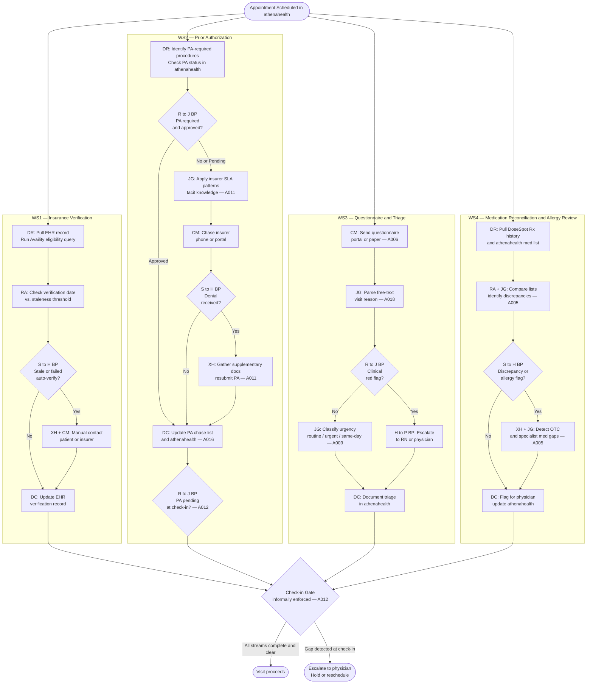

# Cognitive Load Map — Westbridge Family Medicine Patient Intake

## Table of Contents

1. [Executive Summary](#executive-summary)
2. [Workstream Decomposition: Jobs to be Done](#workstream-decomposition-jobs-to-be-done)
   - [WS1 — Insurance Verification](#ws1--insurance-verification)
   - [WS2 — Prior-Authorization Check](#ws2--prior-authorization-check)
   - [WS3 — Pre-visit Questionnaire & Triage](#ws3--pre-visit-questionnaire--triage)
   - [WS4 — Medication Reconciliation & Allergy-Flag Review](#ws4--medication-reconciliation--allergy-flag-review)
3. [Cognitive Load Map: Micro-Task Inventory](#cognitive-load-map-micro-task-inventory)
4. [Process Topology Diagram](#process-topology-diagram)
5. [Lived Process Narrative](#lived-process-narrative)

---

## Executive Summary

Westbridge Family Medicine processes ~180 patient visits per day across two locations using a 4-person front-desk team. Patient intake spans four parallel workstreams: insurance verification, prior-authorization (PA) management, pre-visit questionnaire and triage, and medication reconciliation. Together these workstreams consume an estimated 13–15 minutes of front-desk cognitive time per patient, plus additional overhead for the ~25 PA cases per day [A002].

**Three structural problems drive operational failure:**

1. **Tacit knowledge concentration.** PA management depends on Dana Velazquez's 12-year institutional knowledge of insurer behavior patterns — which insurers reliably deny on first submission, what documentation they quietly require, how their actual SLAs diverge from stated SLAs. This knowledge is uncodified, unshared, and operationally fragile. [A008, A011]

2. **No enforced check-in gate.** The four workstreams converge informally at check-in; there is no hard gate that prevents a patient from entering the exam room with an unresolved intake item. When any stream fails silently — particularly PA status — the failure surfaces to the physician, not front desk. [A012]

3. **Stale insurance verification policy gap.** Chronic patients with nominally stable insurance are not re-verified on a defined schedule. The >6-month staleness window is known to cause billing errors; the policy fix does not yet exist. [A004]

**Automation opportunity summary:**

- WS1 (insurance verification): high API availability, largely deterministic — strong automation candidate for the retrieval and rule-application steps.
- WS2 (PA management): the chase-timing and denial-handling steps are tacit-knowledge-intensive — the priority target for knowledge capture and structured automation support.
- WS3 (triage): visit-reason classification is irreducibly judgment-dependent under hard constraint 2 — automation constrained to collection, routing, and escalation detection.
- WS4 (medication reconciliation): comparison logic is automatable; the gap-detection step (OTC, specialist medications) is a known data-quality problem [A005].

All assumption references are documented in `specs/assumptions.md`.

---

## Workstream Decomposition: Jobs to be Done

### WS1 — Insurance Verification

**JtD:** Confirm that the insurance on file is current, valid, and correctly associated with the patient before the visit occurs, so the visit can be billed correctly.

| Field | Detail |
|-------|--------|
| Trigger | Appointment scheduled in athenahealth |
| Actor | Front-desk staff |
| Goal | Valid, non-stale insurance record in EHR at time of visit |
| Key decisions | Is last verification date within the refresh threshold? [A004] Is this a self-pay or Medicaid managed-care edge case requiring manual handling? |
| Key systems | athenahealth (EHR), Availity (eligibility API) [A013] |
| Expected output | Verified insurance record updated in EHR; flagged exceptions queued for manual follow-up |
| JtD type | Execution + exception-handling |

**Volume:** ~180/day; ~126 auto-resolve (~3 min each), ~54 require manual handling (~5 min each) [A001]

---

### WS2 — Prior-Authorization Check

**JtD:** Confirm that all required prior authorizations are approved and will not block a scheduled procedure or referral; chase any pending or denied authorizations before the visit date using insurer-specific knowledge.

| Field | Detail |
|-------|--------|
| Trigger | Procedure, imaging order, or specialty referral scheduled in athenahealth |
| Actor | Front-desk staff; Dana Velazquez for exception decisions [A003] |
| Goal | PA approved (or confidently-timed pending) for every applicable scheduled visit |
| Key decisions | Which procedures require PA? What is the insurer's actual (not stated) SLA? What document is required for denial resubmission? [A008, A011] Is a pending PA a visit-blocker at check-in? [A012] |
| Key systems | athenahealth (PA workflow), Google Sheets (Dana's PA chase list) [A016], insurer portals / phone [A017] |
| Expected output | Approved PA logged in athenahealth; pending PAs in chase list with expected approval date; pending PAs surfaced at check-in |
| JtD type | Decision-making + exception-handling + synthesis (insurer-pattern knowledge) |

**Volume:** ~25 cases/day [A002]; ~12 min/case; denial resubmission cycle length is variable [A010]

---

### WS3 — Pre-visit Questionnaire & Triage

**JtD:** Collect patient-reported visit context, identify clinical urgency flags, and classify visit type before the physician encounter — while preserving a clear human escalation path for any clinical judgment. [A009]

| Field | Detail |
|-------|--------|
| Trigger | Appointment within 48 hours; questionnaire not yet received |
| Actor | Front-desk staff; Dana / RN on duty for clinical escalations |
| Goal | Triage classification recorded in EHR; clinical red flags surfaced to clinical team before visit |
| Key decisions | Does the visit reason contain a clinical red flag? Is the visit routine, urgent, or same-day? |
| Key systems | athenahealth (portal questionnaire); paper forms for patients without portal accounts [A006] |
| Expected output | Triage note in athenahealth; escalations documented; same-day cases flagged on schedule |
| JtD type | Synthesis + decision-making + communication |

**Volume:** ~180/day; ~4 min/case [A018]

---

### WS4 — Medication Reconciliation & Allergy-Flag Review

**JtD:** Ensure the medication list and allergy record in the EHR accurately reflect the patient's current medications before the physician encounter, flagging discrepancies and gaps for clinical review.

| Field | Detail |
|-------|--------|
| Trigger | Appointment scheduled; prior to physician pre-chart review |
| Actor | Front-desk staff |
| Goal | Reconciled medication list in EHR; allergy record reviewed; discrepancies and gaps flagged for physician |
| Key decisions | Does DoseSpot match the athenahealth medication list? Are there OTC or out-of-network medications not captured in DoseSpot? [A005] |
| Key systems | DoseSpot (pharmacy integration, integrated with athenahealth), athenahealth (EHR med list) |
| Expected output | Reconciled medication list in EHR; physician-flagged discrepancy notes |
| JtD type | Execution + synthesis + exception-handling |

**Volume:** ~180/day; ~6 min/case

---

## Cognitive Load Map: Micro-Task Inventory

**Scoring key — H / M / L:**

| Dimension | H | M | L |
|-----------|---|---|---|
| Cognitive Load | High reasoning, tacit knowledge, disambiguation | Moderate reasoning | Rule-following or lookup |
| Input Structure | Structured / machine-readable | Semi-structured | Unstructured / free-text |
| Decision Determinism | Fully rule-based, predictable | Mostly rules with some judgment | Judgment-dependent |
| Exception Frequency | Frequent edge cases | Occasional | Rare |
| Turn-Taking | Frequent back-and-forth with human or system | Some | Minimal |
| Latency Constraint | Real-time or same-day required | Day-of | Batch / next-day acceptable |
| Compliance / Risk | High-consequence error (billing, clinical, regulatory) | Recoverable | Low stakes |
| Tool / API Availability | Full API coverage available | Partial | Manual only / no API |

---

### WS1 — Insurance Verification

| ID | Micro-Task | Cog Load | Input Struct | Determinism | Exception Freq | Turn-Taking | Latency | Compliance/Risk | Tool/API |
|----|-----------|:-:|:-:|:-:|:-:|:-:|:-:|:-:|:-:|
| 1.1 | Pull patient schedule for next-day visits from athenahealth | L | H | H | L | L | L | M | H |
| 1.2 | Check last verification date; flag records older than refresh threshold [A004] | L | H | H | M | L | M | H | H |
| 1.3 | Run Availity eligibility query for each patient | L | H | H | M | L | M | H | H |
| 1.4 | Interpret eligibility result: active, lapsed, plan type, self-pay flag | M | M | M | M | L | M | H | H |
| 1.5 | Identify self-pay and Medicaid managed-care cases for manual handling [A001] | M | M | M | H | M | M | H | M |
| 1.6 | Contact patient or insurer to resolve failed verification | H | L | L | H | H | H | H | M |
| 1.7 | Update EHR with verification result and staleness flag | L | H | H | L | L | L | H | H |

---

### WS2 — Prior-Authorization Check

| ID | Micro-Task | Cog Load | Input Struct | Determinism | Exception Freq | Turn-Taking | Latency | Compliance/Risk | Tool/API |
|----|-----------|:-:|:-:|:-:|:-:|:-:|:-:|:-:|:-:|
| 2.1 | Identify scheduled procedures and referrals requiring PA | M | H | M | M | L | L | H | H |
| 2.2 | Check PA status in athenahealth for each identified case | L | H | H | L | L | L | H | H |
| 2.3 | Submit PA request to insurer via portal or fax [A017] | M | M | M | M | M | L | H | M |
| 2.4 | Apply insurer-specific SLA patterns to set chase date [A008, A011] | H | L | L | H | L | L | H | L |
| 2.5 | Chase pending PA via insurer phone or portal | H | L | L | H | H | M | H | L |
| 2.6 | Interpret denial reason; identify required supplementary documentation [A011] | H | L | L | H | H | M | H | M |
| 2.7 | Resubmit PA with supplementary documentation | M | M | M | M | M | L | H | M |
| 2.8 | Flag any pending PAs at day-of check-in [A012] | M | H | H | M | M | H | H | H |

---

### WS3 — Pre-visit Questionnaire & Triage

| ID | Micro-Task | Cog Load | Input Struct | Determinism | Exception Freq | Turn-Taking | Latency | Compliance/Risk | Tool/API |
|----|-----------|:-:|:-:|:-:|:-:|:-:|:-:|:-:|:-:|
| 3.1 | Route questionnaire to patient: portal or paper [A006] | L | H | H | M | L | M | M | M |
| 3.2 | Chase incomplete or non-returned questionnaires | L | M | M | M | M | M | L | M |
| 3.3 | Parse visit reason from questionnaire response (free-text) [A018] | M | M | M | M | L | L | H | M |
| 3.4 | Classify visit urgency: routine / urgent / same-day [A009] | H | L | L | H | L | H | H | L |
| 3.5 | Detect and escalate clinical red flags to RN or physician | H | L | L | M | H | H | H | L |
| 3.6 | Document triage classification in athenahealth | L | H | H | L | L | L | H | H |

---

### WS4 — Medication Reconciliation & Allergy-Flag Review

| ID | Micro-Task | Cog Load | Input Struct | Determinism | Exception Freq | Turn-Taking | Latency | Compliance/Risk | Tool/API |
|----|-----------|:-:|:-:|:-:|:-:|:-:|:-:|:-:|:-:|
| 4.1 | Pull pharmacy history from DoseSpot | L | H | H | M | L | L | H | H |
| 4.2 | Pull current medication list from athenahealth | L | H | H | L | L | L | H | H |
| 4.3 | Compare DoseSpot and athenahealth lists; identify deltas | M | M | M | M | L | L | H | H |
| 4.4 | Review allergy record for new or changed flags | M | M | M | M | L | L | H | H |
| 4.5 | Detect medications not captured in DoseSpot: OTC, specialist Rx [A005] | H | L | L | H | H | M | H | L |
| 4.6 | Flag discrepancies and allergy changes for physician pre-chart review | M | M | M | M | M | M | H | H |
| 4.7 | Document reconciliation status and flags in athenahealth | L | H | H | L | L | L | H | H |

---

## Process Topology Diagram

**Zone abbreviations used in node labels:**
- `DR` — Data Retrieval: pulling structured data from systems
- `RA` — Rule Application: applying deterministic rules or thresholds
- `JG` — Judgment: tacit knowledge, pattern recognition, clinical interpretation
- `XH` — Exception Handling: resolving failures, denials, or data gaps
- `CM` — Communication: back-and-forth with patient or insurer
- `DC` — Documentation: recording outcomes in systems

**Breakpoint types labelled at decision nodes:**
- `S→H` System to Human: automated step fails; human must intervene
- `R→J` Rule to Judgment: standard rule doesn't apply; pattern knowledge required
- `H→P` Human to Physician: clinical judgment or escalation required

---

## Lived Process Narrative

### What the SOP says

The intake process is a sequential checklist: verify insurance when scheduling, submit PAs when procedures are booked, send a questionnaire 48 hours before the visit, and complete medication reconciliation the day before. Four clean lanes. Each produces a documented output. The workflow lives in athenahealth.

### What actually happens

**Insurance verification runs on memory, not rules.**
At 90 patients per location per day, staff do not re-verify chronic patients who "obviously" have stable insurance. The Availity eligibility query is triggered by doubt or exception — not by a refresh schedule. A verification dated 14 months ago looks identical in athenahealth to one dated yesterday. The >6-month staleness problem has surfaced three times as billing errors [A004]; each time, it takes 12+ minutes to unwind (Artefact 5.3). A refresh policy would prevent it. The policy does not exist.

**The PA chase list is Dana's second job.**
The athenahealth PA workflow records submission dates and status codes. What it does not capture is Dana's real cognitive work: knowing that Wellpath colonoscopy requests are always denied on first submission without the prior-visit note attached, that UHC Choice approvals take 6–7 days regardless of the stated 5-day SLA, that Humana Medicare Advantage is reliably exactly 6 days — never 5 (Artefact 5.1). This knowledge lives in a Google Sheet annotated in Dana's hand and in Dana's head [A008, A011, A016]. Front-desk staff covering the other location inherit the spreadsheet but not the mental model behind it. The result: a pending PA may be chased on day 5 per the stated protocol — which is a day or two late for the insurer that actually behaves differently. The three missed prior auths discovered in the last quarter are likely the visible ones [A010].

**PA status is not checked at the check-in gate.**
When a patient arrives, front desk confirms the appointment, verifies co-pay, and routes the patient. Checking whether the PA for the scheduled procedure is still pending is not a required step in the check-in flow [A012]. The failure mode documented in Artefact 5.2 is precise: patient TJ arrived for an MRI results review that required an approved PA; the PA was still pending; front desk did not check; the physician discovered it in the exam room. Visit aborted. Patient frustrated — "this is the second time." The miss was not negligence. There simply was no gate.

**Triage classification lives in clinical intuition, not rules.**
Questionnaire responses are typically brief: "follow-up for knee," "annual physical," "feeling worse than usual." Dana's RN background allows her to mentally flag concerning patterns — an "annual physical" with a free-text note about chest discomfort is not a routine visit. For staff without clinical training, the same text may default to routine classification. The hard constraint ("no clinical judgment by the agent") is most operationally significant here: triage is not a lookup, it is an inference under uncertainty on free-text input [A009, A018].

**DoseSpot catches what pharmacies report; it misses the rest.**
For patients with a single primary in-network pharmacy, medication reconciliation is mostly reliable. For patients with specialist prescriptions from a hospital discharge, samples, or commonly-used OTC medications, DoseSpot is silent [A005]. Staff performing reconciliation are comparing two partial records and treating the union as complete. The flag "discrepancy found" is only as good as the underlying data — and the data has known systematic gaps.

**Cross-location rotation compounds every failure mode.**
When a staff member covers the other location, they lose the ambient knowledge that comes from working the same desk every day: which insurers are slow this month, which patients always dispute their co-pay, which edge cases to check even when the system says clear. The four workstreams appear modular in the SOP. In practice they are entangled, and the tacit knowledge that resolves exceptions is location-specific and person-specific [A007, A014].

### The gap that matters most

The single highest-value intervention is not automation — it is making the check-in gate real and enforced. All four workstreams produce outputs. Those outputs are not currently aggregated into a go / no-go signal before the patient enters the exam room. Until that gate is explicit — whether implemented by a human checklist, a system alert, or an agent — the four workstreams are doing their work in isolation, and failures appear in front of physicians rather than in front of front desk.

---

*All assumption references [A001]–[A018] are documented in `specs/assumptions.md`.*
